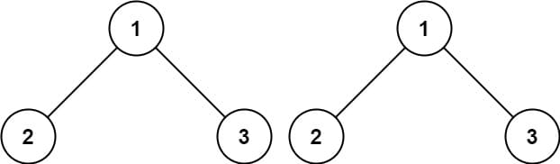
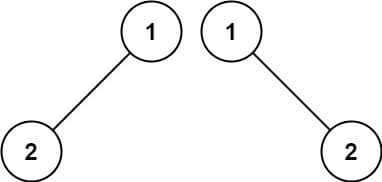
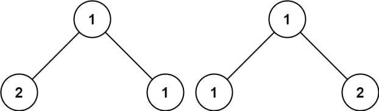

# 100. Same Tree

<p>Given the roots of two binary trees <code>p</code> and <code>q</code>, write a function to check if they are the same or not.</p>

<p>Two binary trees are considered the same if they are structurally identical, and the nodes have the same value.</p>

<p>&nbsp;</p>
<p><strong class="example">Example 1:</strong></p>

<pre><strong>Input:</strong> p = [1,2,3], q = [1,2,3]
<strong>Output:</strong> true
</pre>

<p><strong class="example">Example 2:</strong></p>

<pre><strong>Input:</strong> p = [1,2], q = [1,null,2]
<strong>Output:</strong> false
</pre>

<p><strong class="example">Example 3:</strong></p>

<pre><strong>Input:</strong> p = [1,2,1], q = [1,1,2]
<strong>Output:</strong> false
</pre>

<p>&nbsp;</p>
<p><strong>Constraints:</strong></p>

<ul>
  <li>The number of nodes in both trees is in the range <code>[0, 100]</code>.</li>
  <li><code>-10<sup>4</sup> &lt;= Node.val &lt;= 10<sup>4</sup></code></li>
</ul>

<br>

---

# Solution

- [Recursive Approach](#recursive-approach)
  - **Time Complexity**: `O(n)`
- [Iterative Approach](#iterative-approach)
  - **Time Complexity**: `O(n)`

## Binary Tree Overview

**Key Points**:

- **Root Node**: The topmost node of the tree.
- **Child Nodes**: Each node can have up to two children, referred to as the left and right child.
- **Leaf Nodes**: Nodes with no children.
- **Depth/Height**: The length of the path from the root to the deepest leaf node.
- **Binary Search Tree (BST)**: A special type of binary tree where the left child's value is less than the parent's value, and the right child's value is greater than the parent's value.
- **Traversal Methods**: Methods to visit nodes in a binary tree, including In-order, Pre-order, and Post-order.

### Binary Tree in Array Form

A binary tree can be represented using an array, where the array elements correspond to the nodes of the tree. This representation is particularly useful for complete binary trees.

Representing a binary tree in array form is a simple and efficient method for complete binary trees. It leverages the properties of array indexing to quickly access parent and child nodes, making it suitable for certain applications where the tree structure is predictable and does not change dynamically.

#### Key Points:

1. **Root Node**:
   - The root node of the binary tree is stored at index 0 of the array.

2. **Left Child**:
   - For a node at index `i`, its left child is located at index `2i + 1`.

3. **Right Child**:
   - For a node at index `i`, its right child is located at index `2i + 2`.

4. **Parent Node**:
   - For a node at index `i`, its parent is located at index `(i - 1) / 2`.

#### Example:

Consider the following binary tree:

```code
      1
    /   \
   2     3
  / \   / \
 4   5 6   7
```

This binary tree can be represented in an array as:

```code
[1, 2, 3, 4, 5, 6, 7]
```

#### Detailed Explanation:

1. **Index 0**: The root node `1` is stored at index `0`.
2. **Indices 1 & 2**: The left child `2` and right child `3` of the root node are stored at indices `1` and `2` respectively.
3. **Indices 3 & 4**: The left child `4` and right child `5` of node `2` are stored at indices `3` and `4` respectively.
4. **Indices 5 & 6**: The left child `6` and right child `7` of node `3` are stored at indices `5` and `6` respectively.

#### Benefits:

- **Memory Efficiency**: For complete binary trees, this representation avoids the need for storing pointers to child nodes.
- **Ease of Access**: It allows for direct access to nodes using array indexing, which can simplify algorithms for traversal and manipulation.

#### Limitations:

- **Sparse Trees**: For binary trees that are not complete, this representation may lead to wasted space in the array.
- **Fixed Size**: The size of the array needs to be known in advance, which can be a limitation for dynamically growing trees.

# Recursive Approach

## **Intuition**

The simplest strategy here is to use recursion. The idea is to compare each node of the two trees. 

1. **Base Case**:
    - If both nodes are `null`, return `true`. This means both trees are structurally identical up to this point.
    - If one of the nodes is `null` and the other is not, return `false`. This means the trees are not structurally identical.

2. **Recursive Case**:
    - Check if the values of the current nodes are equal.
    - If equal, recursively check the left subtree and right subtree.
    - If both subtrees are identical, return `true`; otherwise, return `false`.

## **Algorithm**

1. **Base Cases**:
    - If both nodes `p` and `q` are `null`, return `true`.
    - If one of the nodes is `null` and the other is not, return `false`.
2. **Check Values**:
    - If the values of the nodes `p` and `q` are not equal, return `false`.
3. **Recursive Calls**:
    - Recursively check the left children of both nodes.
    - Recursively check the right children of both nodes.
    - Return `true` if both recursive calls return `true`.

### Step-by-Step Algorithm

1. Check if both nodes `p` and `q` are `null`. If they are, return `true`.
2. If one of the nodes is `null` and the other is not, return `false`.
3. If the values of the nodes `p` and `q` are not equal, return `false`.
4. Recursively check the left children of `p` and `q`.
5. Recursively check the right children of `p` and `q`.
6. Return `true` if both recursive checks return `true`, otherwise return `false`.

## **Implementation**

### Java

```java
class Solution {
  public boolean isSameTree(TreeNode p, TreeNode q) {
    // Base case: Both trees are null
    if (p == null && q == null) {
      return true;
    }
    // Base case: One tree is null and the other is not
    if (p == null || q == null) {
      return false;
    }
    // If the values of the nodes are not equal
    if (p.val != q.val) {
      return false;
    }
    // Recursively check the left and right subtrees
    return isSameTree(p.left, q.left) && isSameTree(p.right, q.right);
  }
}
```

### TypeScript

```typescript
/**
 * Definition for a binary tree node.
 */
class TreeNode {
  val: number;
  left: TreeNode | null;
  right: TreeNode | null;

  constructor(val?: number, left?: TreeNode | null, right?: TreeNode | null) {
    this.val = val === undefined ? 0 : val;
    this.left = left === undefined ? null : left;
    this.right = right === undefined ? null : right;
  }
}

function isSameTree(p: TreeNode | null, q: TreeNode | null): boolean {
  // Base case: Both trees are null
  if (p == null && q == null) {
    return true;
  }
  // Base case: One tree is null and the other is not
  if (p == null || q == null) {
    return false;
  }
  // If the values of the nodes are not equal
  if (p.val != q.val) {
    return false;
  }
  // Recursively check the left and right subtrees
  return isSameTree(p.left, q.left) && isSameTree(p.right, q.right);
}
```

## **Complexity Analysis**

Let `n` be the number of nodes in tree `T` with height `h`, rooted at `root`.

### **Time Complexity**: `O(n)`

- The time complexity is `O(n)` because each node in both trees is visited exactly once. We traverse the entire structure of the two trees to compare them, resulting in a linear time complexity.
- **Traversal**: Each node is compared exactly once, meaning that the algorithm performs a constant amount of work for each node, leading to `O(n)` time complexity.

### **Space Complexity**: `O(n)`

- The space complexity is `O(n)` due to the recursive call stack. In the worst case, when the tree is completely unbalanced (like a linked list), the recursion will go as deep as the number of nodes, which is `n`.
- **Best Case**: In the best case, where the tree is completely balanced, the height of the tree will be `log(n)`. However, since the call stack still grows with the height of the tree, it influences the space complexity.
- **Average Case**: In the average case, the tree height varies, but we often assume `O(n)` space complexity for simplicity, considering the nature of recursion and potential unbalanced structures.
- **Memory Usage**: Each recursive call consumes memory on the stack. If `n` is large, the stack can grow significantly, leading to a higher space complexity. Hence, space complexity is generally considered `O(n)`.

# Iterative Approach

## **Intuition**

Instead of using recursion, we can utilize an iterative approach to compare two binary trees. By employing a stack or queue, we can simulate the depth-first traversal that recursion provides. The iterative approach involves:
- Checking if both trees are initially empty.
- Utilizing a data structure to keep track of nodes to visit, starting with the root nodes of both trees.
- Comparing nodes level by level to ensure both trees have the same structure and node values.

## **Algorithm**

1. Initialize a stack (or queue) to store pairs of nodes from both trees.
2. Start by pushing the root nodes of both trees into the stack.
3. While the stack is not empty:
   1. Pop a pair of nodes from the stack.
   2. If both nodes are `null`, continue to the next iteration.
   3. If one node is `null` and the other is not, or if the values of the nodes are not equal, return `false`.
   4. Push the left children of both nodes into the stack.
   5. Push the right children of both nodes into the stack.
4. If all nodes are compared successfully and no mismatches are found, return `true`.

## **Implementation**

### Java

```java
import java.util.ArrayDeque;

class Solution {
  public boolean isEqual(TreeNode p, TreeNode q) {
    // Both nodes are null
    if (p == null && q == null) return true;
    // One of the nodes is null
    if (q == null || p == null) return false;
    // Node values are not equal
    return p.val == q.val;
  }

  public boolean isSameTree(TreeNode p, TreeNode q) {
    // Check if both trees are initially empty
    if (p == null && q == null) return true;
    // Check if the initial nodes are not equal
    if (!isEqual(p, q)) return false;

    // Initialize deques to store nodes for comparison
    ArrayDeque<TreeNode> queueP = new ArrayDeque<>();
    ArrayDeque<TreeNode> queueQ = new ArrayDeque<>();
    queueP.addLast(p);
    queueQ.addLast(q);

    // Iterate while there are nodes to compare
    while (!queueP.isEmpty()) {
      p = queueP.removeFirst();
      q = queueQ.removeFirst();

      // If nodes are not equal
      if (!isEqual(p, q)) return false;

      // Check left children
      if (!isEqual(p.left, q.left)) return false;
      if (p.left != null && q.left != null) {
        queueP.addLast(p.left);
        queueQ.addLast(q.left);
      }

      // Check right children
      if (!isEqual(p.right, q.right)) return false;
      if (p.right != null && q.right != null) {
        queueP.addLast(p.right);
        queueQ.addLast(q.right);
      }
    }
    return true;
  }
}
```

### TypeScript

```typescript
class TreeNode {
  val: number;
  left: TreeNode | null;
  right: TreeNode | null;

  constructor(val?: number, left?: TreeNode | null, right?: TreeNode | null) {
    this.val = val === undefined ? 0 : val;
    this.left = left === undefined ? null : left;
    this.right = right === undefined ? null : right;
  }
}

function isEqual(p: TreeNode | null, q: TreeNode | null): boolean {
  // Both nodes are null
  if (p === null && q === null) return true;
  // One of the nodes is null
  if (p === null || q === null) return false;
  // Node values are not equal
  if (p.val !== q.val) return false;
  return true;
}

function isSameTree(p: TreeNode | null, q: TreeNode | null): boolean {
  // Check if both trees are initially empty
  if (p === null && q === null) return true;
  // Check if the initial nodes are not equal
  if (!isEqual(p, q)) return false;

  // Initialize queues to store nodes for comparison
  const queueP: (TreeNode | null)[] = [];
  const queueQ: (TreeNode | null)[] = [];
  queueP.push(p);
  queueQ.push(q);

  // Iterate while there are nodes to compare
  while (queueP.length > 0) {
    p = queueP.shift()!;
    q = queueQ.shift()!;

    // If nodes are not equal
    if (!isEqual(p, q)) return false;
    // If current nodes are not null, add their children to the queues
    if (p !== null && q !== null) {
      queueP.push(p.left);
      queueQ.push(q.left);
      queueP.push(p.right);
      queueQ.push(q.right);
    }
  }
  return true;
};
```

## **Complexity Analysis**

Let `n` be the number of nodes in the tree.

### **Time Complexity**: `O(n)`

- The time complexity is `O(n)` because each node in both trees is visited exactly once. We traverse the entire structure of the two trees to compare them, resulting in a linear time complexity.
- **Traversal**: Each node is processed (checked for equality) exactly once, meaning that the algorithm performs a constant amount of work for each node, leading to an `O(n)` time complexity.
- **Queue Operations**: Adding and removing nodes from the queue (or stack) also take constant time, `O(1)`, per operation. Since these operations are performed `n` times (once for each node), they do not affect the overall linear time complexity.

### **Space Complexity**: `O(n)`

- The space complexity is `O(n)` due to the use of the queue (or stack) for iterative traversal.
- **Worst Case**: In the worst-case scenario, the tree is completely unbalanced (e.g., a degenerate tree resembling a linked list), the space complexity for the stack/queue will be `O(n)`, as we might need to store up to `n` nodes in the worst case.
- **Best Case**: In the best-case scenario, where the tree is perfectly balanced, the height of the tree will be `log(n)`. However, since we still might need to store nodes up to the height of the tree, the space complexity remains `O(n)` for simplicity.
- **Memory Usage**: Each node added to the queue requires additional memory. Since we might store up to `n` nodes in the queue, the space complexity is `O(n)`.
