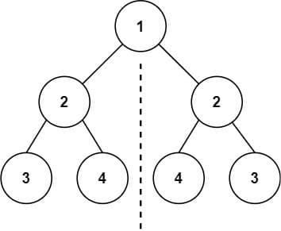
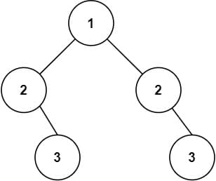

# 101. Symmetric Tree

<p>Given the <code>root</code> of a binary tree, <em>check whether it is a mirror of itself</em> (i.e., symmetric around its center).</p>

<p>&nbsp;</p>
<p><strong class="example">Example 1:</strong></p>

<pre><strong>Input:</strong> root = [1,2,2,3,4,4,3]
<strong>Output:</strong> true
</pre>

<p><strong class="example">Example 2:</strong></p>

<pre><strong>Input:</strong> root = [1,2,2,null,3,null,3]
<strong>Output:</strong> false
</pre>

<p>&nbsp;</p>
<p><strong>Constraints:</strong></p>

<ul>
  <li>The number of nodes in the tree is in the range <code>[1, 1000]</code>.</li>
  <li><code>-100 &lt;= Node.val &lt;= 100</code></li>
</ul>

<p>&nbsp;</p>
<strong>Follow up:</strong> Could you solve it both recursively and iteratively?

---

# Solution

- [Recursive Approach](#recursive-approach)
  - **Time Complexity**: `O(n)`
  - **Space Complexity**: `O(n)`
- [Iterative Approach](#iterative-approach)
  - **Space Complexity**: `O(n)`

### Problem Overview: Symmetric Tree

**Objective:**  
You are tasked with determining whether a binary tree is symmetric, meaning it is a mirror of itself around its center.

#### Key Details:
1. **Input:**  
   The root of a binary tree. For example:
   - `root = [1,2,2,3,4,4,3]` (Example 1)
   - `root = [1,2,2,null,3,null,3]` (Example 2)

2. **Output:**  
   A boolean value indicating whether the tree is symmetric:
   - Example 1 Output: `true`  
   - Example 2 Output: `false`  

3. **Constraints:**  
   - The number of nodes in the binary tree ranges from 1 to 1000.
   - The value of each node lies between -100 and 100.

#### Examples:
- **Example 1:**
  ```
  Input: [1,2,2,3,4,4,3]
  Output: true
  ```
  The left and right subtrees are mirror images of each other.

- **Example 2:**
  ```
  Input: [1,2,2,null,3,null,3]
  Output: false
  ```
  The left and right subtrees are not symmetric.

#### Follow-Up Challenge:  
Solve this problem using **both recursive** and **iterative** methods.  
- **Recursive Approach:** Use a helper function to check symmetry by comparing corresponding nodes in left and right subtrees.
- **Iterative Approach:** Use a queue or stack to simulate breadth-first or depth-first traversal, ensuring symmetry at each level.

# Recursive Approach

The recursive approach leverages this intuition by **simultaneously traversing the left and right subtrees** while checking if they align like a mirror. Recursion is well-suited here because the problem can be broken down into smaller subproblems (i.e., comparing smaller subtrees).

## **Intuition**

Symmetry in a binary tree means that the left and right subtrees are mirror images of each other. Specifically:
- The left subtree of one node should match the right subtree of its counterpart.
- The corresponding nodes must have identical values, and their subtrees must exhibit symmetric structure.

For example:
- A tree is **symmetric** if the left and right children of the root node are reflections of each other.
- If any discrepancy is found while comparing the left and right subtrees (in terms of values or structure), the tree is **not symmetric**.

### Conditions for Mirror Reflection of Two Trees

Two binary trees are considered mirror reflections of each other if they satisfy the following conditions:

1. **Root Node Equality:**  
   - The roots of both trees must have the same value.

2. **Symmetric Subtrees:**  
   - The **right subtree** of one tree must be a mirror reflection of the **left subtree** of the other tree, and vice versa.

## **Algorithm**

1. **Base Cases**:
   - If both the left and right subtrees are `null`, they are symmetric (return `true`).
   - If only one of the subtrees is `null` while the other is not, they are not symmetric (return `false`).

2. **Recursive Check**:
   - Compare the values of the current nodes in the left and right subtrees.
   - Recursively check:
     - Whether the **left child of the left subtree** matches the **right child of the right subtree**.
     - Whether the **right child of the left subtree** matches the **left child of the right subtree**.

3. **Final Decision**:
   - If both recursive calls return `true`, the subtrees are symmetric.
   - Otherwise, return `false`.

### **Pseudocode**

```text
function isSymmetric(root):
    if root is null:
        return true  # An empty tree is symmetric

    return isMirror(root.left, root.right)

function isMirror(left, right):
    if left is null and right is null:
        return true  # Both subtrees are empty

    if left is null or right is null:
        return false  # Only one subtree is empty

    if left.value != right.value:
        return false  # Values of corresponding nodes do not match

    # Recursive checks for mirror symmetry
    return isMirror(left.left, right.right) and isMirror(left.right, right.left)
```

## **Implementation**

### Java

```java
class Solution {
  public boolean isSymmetric(TreeNode root) {
    // An empty tree is symmetric
    if (root == null) {
      return true;
    }

    return isMirror(root.left, root.right);
  }

  private boolean isMirror(TreeNode left, TreeNode right) {
    if (left == null && right == null) {
      return true;
    }
    if (left == null || right == null) {
      return false;
    }
    if (left.val != right.val) {
      return false;
    }

    return isMirror(left.left, right.right) && isMirror(left.right, right.left);
  }
}
```

### TypeScript

```typescript
function isSymmetric(root: TreeNode | null): boolean {
  if (root === null) {
    return true; // An empty tree is symmetric
  }
  return isMirror(root.left, root.right);
}

function isMirror(left: TreeNode | null, right: TreeNode | null): boolean {
  // Base cases
  if (left === null && right === null) {
    return true; // Both subtrees are empty
  }
  if (left === null || right === null) {
    return false; // Only one subtree is empty
  }
  if (left.val !== right.val) {
    return false; // Values of the nodes do not match
  }

  // Recursively check for mirror symmetry
  return isMirror(left.left, right.right) && isMirror(left.right, right.left);
}
```

## **Complexity Analysis**

### **Assumptions**
1. The binary tree has `n` nodes, and we traverse the entire tree to determine if it is symmetric.
2. Recursive calls are used to process the nodes, which may affect both time and space complexity.

### **Time Complexity**: `O(n)`
- **Single Node Visit**: Each node in the tree is processed exactly once during the recursive traversal.
- **Constant-Time Operations**: Comparing node values and checking for `null` are constant-time operations, performed during each recursive call.
- **Overall Traversal**: Since every node is visited exactly once, the total time complexity is proportional to the number of nodes, resulting in `O(n)`.

### **Space Complexity**: `O(n)`
- **Recursive Call Stack**: The recursion stack depth depends on the structure of the tree:
  - **Worst-Case (Unbalanced Tree)**: The tree resembles a linked list, leading to a stack depth of `O(n)`.
  - **Best-Case (Balanced Tree)**: The stack depth corresponds to the height of the tree, which is `O(log n)`.
- **Overall Space**: Considering the worst-case scenario, the space complexity is `O(n)`.

# Iterative Approach

## **Intuition**

Symmetry in a binary tree means that the left and right subtrees are mirror images of each other. To verify symmetry iteratively, we can simulate the comparison of nodes using a queue (or stack). 

Instead of using recursive calls to traverse the tree, this approach explicitly manages the symmetry checks level by level:

  1. Pair up nodes to compare their values and structures.
  2. Each pair should satisfy two conditions:
     - Matching values.
     - Mirrored positions (i.e., left-to-right correspondence).
  3. If all levels of the tree satisfy these conditions, the tree is symmetric. If any discrepancy is found, the tree is not symmetric.

## **Algorithm**

1. **Initialization**:
   - Use a queue (or stack) to store pairs of nodes to be compared.
   - Start with the root's left and right children as the first pair in the queue.

2. **Processing Pairs**:
   - While the queue is not empty, extract a pair of nodes and perform symmetry checks:
     - If both nodes are `null`, continue to the next pair.
     - If one node is `null` and the other is not, return `false`.
     - If the values of the two nodes do not match, return `false`.

3. **Adding Mirror Pairs**:
   - If the pair passes the checks:
     - Add the left child of the first node and the right child of the second node to the queue.
     - Add the right child of the first node and the left child of the second node to the queue.

4. **Final Decision**:
   - If the queue is emptied without finding any asymmetry, return `true`.

### **Pseudocode**

```text
function isSymmetric(root):
    if root is null:
        return true  # An empty tree is symmetric

    # Use a queue to store pairs of nodes
    queue = [ [root.left, root.right] ]

    while queue is not empty:
        # Pop the first pair of nodes
        pair = queue.pop(0)
        left = pair[0]
        right = pair[1]

        # Base cases for symmetry checks
        if left is null and right is null:
            continue  # Both nodes are empty, move to next pair
        if left is null or right is null:
            return false  # One node is empty
        if left.value != right.value:
            return false  # Node values do not match

        # Add mirror pairs to the queue
        queue.append([left.left, right.right])
        queue.append([left.right, right.left])

    return true  # All pairs passed the symmetry checks
```

## **Implementation**

### Java

```java
import java.util.ArrayDeque;
import java.util.Deque;

class Solution {
  public boolean isSymmetric(TreeNode root) {
    // An empty tree is symmetric
    if (root == null) {
      return true;
    }

    // Use a Deque to store pairs of nodes to compare
    Deque<TreeNode[]> deque = new ArrayDeque<>();
    deque.add(new TreeNode[] {root.left, root.right});

    while (!deque.isEmpty()) {
      // Retrieve and remove the first pair of nodes
      TreeNode[] pair = deque.poll();
      TreeNode left = pair[0];
      TreeNode right = pair[1];

      // Base cases for symmetry checks
      if (left == null && right == null) {
        continue; // Both nodes are empty, move to the next pair
      }
      if (left == null || right == null) {
        return false; // One node is null but the other is not
      }
      if (left.val != right.val) {
        return false; // Values of the nodes do not match
      }

      // Add the mirror pairs to the deque
      deque.add(new TreeNode[] {left.left, right.right});
      deque.add(new TreeNode[] {left.right, right.left});
    }

    return true; // All pairs passed the symmetry checks
  }
}
```

#### Implementation Details

1. **Deque Initialization**:
   - A `Deque` is used to efficiently handle node pairs (left and right) for comparison. Each pair of nodes is stored as an array.

2. **Main Loop**:
   - The `while` loop runs until the `Deque` is empty, processing each pair of nodes:
     - If both nodes are `null`, the tree is symmetric at this level, and the loop continues.
     - If one node is `null` while the other is not, or if their values differ, the tree is asymmetric, and the function returns `false`.

3. **Adding Mirror Pairs**:
   - If the nodes pass the checks, their corresponding children are added to the `Deque` for future comparison:
     - `left.left` with `right.right`
     - `left.right` with `right.left`

4. **Final Return**:
   - If all comparisons are symmetric, the function returns `true`.


### **Assumptions**
1. The binary tree has `n` nodes, and we traverse the entire tree to determine if it is symmetric.
2. A **queue or deque** is used to store pairs of nodes for iterative symmetry checks.
3. Each pair of nodes is processed individually, and their children are enqueued for further checks.

### **Space Complexity**: `O(n)`
- **Queue Usage**: The space complexity is dominated by the queue used for storing pairs of nodes:
  - In the **worst-case scenario**, all `n` nodes of the tree might be stored in the queue at the same time, leading to **`O(n)`** space usage. This happens if the tree is perfectly balanced and we enqueue pairs of nodes level by level.
  - In the **best-case scenario**, the queue size corresponds to the number of pairs at the current level, which is at most half the number of nodes in the tree.
- **No Recursion**: Unlike the recursive approach, the iterative method avoids recursion and does not require stack space for recursive calls.

Thus, the space complexity is **`O(n)`**, with the queue size proportional to the number of nodes in the worst case.