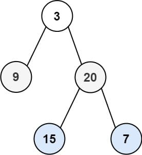
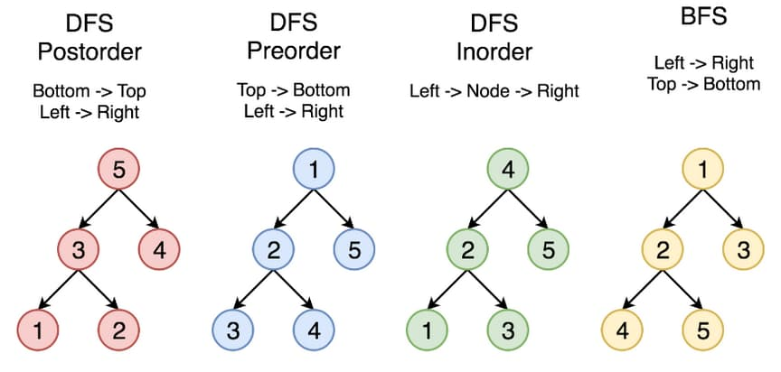

# 102. Binary Tree Level Order Traversal

<p>Given the <code>root</code> of a binary tree, return <em>the level order traversal of its nodes' values</em>. (i.e., from left to right, level by level).</p>

<p>&nbsp;</p>
<p><strong class="example">Example 1:</strong></p>

<pre><strong>Input:</strong> root = [3,9,20,null,null,15,7]
<strong>Output:</strong> [[3],[9,20],[15,7]]
</pre>

<p><strong class="example">Example 2:</strong></p>

<pre><strong>Input:</strong> root = [1]
<strong>Output:</strong> [[1]]
</pre>

<p><strong class="example">Example 3:</strong></p>

<pre><strong>Input:</strong> root = []
<strong>Output:</strong> []
</pre>

<p>&nbsp;</p>
<p><strong>Constraints:</strong></p>

<ul>
  <li>The number of nodes in the tree is in the range <code>[0, 2000]</code>.</li>
  <li><code>-1000 &lt;= Node.val &lt;= 1000</code></li>
</ul>

---

# Solution

- [Recursive Approach](#recursive-approach)
  - **Time Complexity**: `O(n)`
  - **Space Complexity**: `O(n)`
- [Iterative Approach](#iterative-approach)

### Problem Overview: Binary Tree Level Order Traversal

#### **Description**
Given the root of a binary tree, the task is to perform a **level-order traversal** of the tree's nodes. In a level-order traversal, nodes are visited level by level from left to right. The output should be a list of lists, where each list represents the node values at a particular level.

#### **Examples**
- **Example 1:**
  - **Input:** `root = [3,9,20,null,null,15,7]`
  - **Output:** `[[3],[9,20],[15,7]]`
  - **Explanation:** The tree levels are:
    - Level 1: [3]
    - Level 2: [9, 20]
    - Level 3: [15, 7]

- **Example 2:**
  - **Input:** `root = [1]`
  - **Output:** `[[1]]`
  - **Explanation:** The single-node tree only has one level.

- **Example 3:**
  - **Input:** `root = []`
  - **Output:** `[]`
  - **Explanation:** An empty tree has no levels to traverse.

#### **Constraints**
1. The number of nodes in the tree lies within the range: `0 ≤ nodes ≤ 2000`.
2. Node values are integers within the range `-1000 ≤ Node.val ≤ 1000`.

#### **Key Notes**
- A binary tree is structured such that each node may have up to two children (left and right).
- **Level Order Traversal** is also called **Breadth-First Search (BFS)**.

### General Strategies to Traverse a Tree

When solving problems involving tree traversal, it's essential to understand the two main strategies: **Depth First Search (DFS)** and **Breadth First Search (BFS)**. These techniques differ in the order of node exploration and can be chosen based on the specific requirements of a problem.

#### **1. Depth First Search (DFS)**
In DFS, the traversal prioritizes depth, meaning we explore as far as possible along a branch before backtracking. Starting from the root node, we go down to a leaf node, then backtrack to explore other branches.

##### **Variants of DFS**
The DFS approach can be categorized into three distinct strategies based on the order of visiting nodes:
- **Preorder Traversal:** Visit the root node first, followed by the left subtree, and finally the right subtree.
- **Inorder Traversal:** Visit the left subtree first, then the root node, and finally the right subtree.
- **Postorder Traversal:** Visit the left subtree, then the right subtree, and finally the root node.

#### **2. Breadth First Search (BFS)**
In BFS, nodes are explored level by level, starting from the topmost level (root) and proceeding downward. Nodes at a given level are visited from left to right before moving to the next level.

##### **Split-Level BFS Traversal**
The problem at hand requires implementing a BFS traversal with split-level outputs, where each level is represented as a separate list:
Example: `[[1], [2, 3], [4, 5]]`

#### **Comparison of Traversal Strategies**
The following diagram illustrates the four traversal strategies—DFS Preorder, DFS Inorder, DFS Postorder, and BFS. In this example, the nodes are numbered in the order they are visited.



#### **Tree Structure**:
```
        5
       / \
      3   7
     / \
    2   4
```

#### **Traversal Strategies**:
1. **DFS Postorder**:  
   Traverse the left subtree, then the right subtree, and finally the root.  
   **Order:** 2 → 4 → 3 → 7 → 5

2. **DFS Preorder**:  
   Visit the root first, then traverse the left subtree and the right subtree.  
   **Order:** 5 → 3 → 2 → 4 → 7

3. **DFS Inorder**:  
   Traverse the left subtree first, then visit the root, followed by the right subtree.  
   **Order:** 2 → 3 → 4 → 5 → 7

4. **BFS (Level Order)**:  
   Visit nodes level by level, from top to bottom.  
   **Order:** 5 → 3 → 7 → 2 → 4

# Recursive Approach

## **Intuition**

The level order traversal processes the nodes level by level, from the root to the deepest level of the tree. Intuitively, in a recursive approach, we can break this problem down by associating each node with its respective depth (or level) and using that information to group nodes into levels.

At each recursive step:
1. We determine the "current level" of the node being processed.
2. We add the node's value to a corresponding list for its level.
3. We recursively process the left and right children of the node, passing along their respective levels (incrementing by 1 for each recursive call).

## **Algorithm**

### **Preparation**
1. **Initialize the Result List**:
   - Create an empty `result` list to store nodes grouped by levels.
2. **Handle Edge Case**:
   - If the `root` is `null`, return an empty list immediately.

### **Auxiliary Function**
1. **Define the Function**:
   - The auxiliary function takes three parameters: the `current node`, the `current level`, and the shared `result` list.
2. **Base Case**:
   - If the `current node` is `null`, terminate the function call (no further recursion).
3. **Group Nodes by Level**:
   - Check if the `result` list has a sublist for the current `level`. If not, create and append a new sublist.
   - Add the `current node`'s value to the appropriate sublist in the `result` list.
4. **Recursive Calls**:
   - Invoke the auxiliary function for the left and right children of the `current node`, incrementing the `level` by 1 for each recursive call.

### **Execution**
1. **Initial Call**:
   - Invoke the auxiliary function with the `root` node, starting `level 0`, and the shared `result` list.
2. **Final Output**:
   - Once all recursive calls are complete, return the populated `result` list.

### **Pseudocode**

```pseudocode
function level_order_traversal(root):
    if root == null:
        return empty_list

    define result as empty_list

    function traverse(node, level):
        if node == null:
            return

        if result does not have sublist at index level:
            add empty_list to result

        add node.value to result[level]

        traverse(node.left, level + 1)
        traverse(node.right, level + 1)

    call traverse(root, 0)
    return result
```

## **Implementation**

### Java

```java
import java.util.ArrayList;
import java.util.List;

class Solution {
  // List to hold the levels
  List<List<Integer>> levels = new ArrayList<>();

  public List<List<Integer>> levelOrder(TreeNode root) {
    // Edge case: Return empty list if the tree is empty
    if (root == null) {
      return levels;
    }

    // Start the recursive traversal from the root node at level 0
    traverseLevels(root, 0);
    
    return levels;
  }

  private void traverseLevels(TreeNode node, int level) {
    // Base case: if the node is null, return
    if (node == null) {
      return;
    }

    // Ensure the levels list has a sublist for the current level
    if (levels.size() == level) {
      levels.add(new ArrayList<>());
    }

    // Add the current node's value to its corresponding level's list
    levels.get(level).add(node.val);

    // Recursively traverse the left and right subtrees
    traverseLevels(node.left, level + 1);
    traverseLevels(node.right, level + 1);
  }
}
```

### TypeScript

```typescript
function levelOrder(root: TreeNode | null): number[][] {
  // Initialize levels list
  const levels: number[][] = [];

  // Edge case: If the root is null, return an empty list
  if (root === null) {
    return levels;
  }

  const traverseLevels = (node: TreeNode | null, level: number): void => {
    if (node === null) {
      return; // Base case: if the node is null, stop recursion
    }

    // Ensure there's a sublist for the current level
    if (levels.length === level) {
      levels.push([]);
    }

    // Add the current node's value to the appropriate level
    levels[level].push(node.val);

    // Recursively traverse the left and right subtrees
    traverseLevels(node.left, level + 1);
    traverseLevels(node.right, level + 1);
  };

  // Start traversal from the root at level 0
  traverseLevels(root, 0);

  return levels;
};
```

## **Complexity Analysis**

### **Assumptions**
- The binary tree has `n` nodes in total.
- The tree is well-formed, and each node has a `left` and `right` child reference, which may be `null`.

### **Time Complexity**: `O(n)`
- **Traversal of Nodes**: Each node in the binary tree is visited exactly once during the recursion. This includes adding the node's value to the corresponding level's list and making recursive calls for its children.
- **Number of Operations**: Since we perform a constant amount of work (adding to a list and checking conditions) for each of the `n` nodes, the time complexity is linear: **`O(n)`**.

### **Space Complexity**: `O(n)`
- **Auxiliary Data Structure**: 
  - The `levels` list, which holds the values grouped by levels, grows linearly with the number of nodes in the binary tree. In the worst case, it may store up to `n` values.
- **Recursive Call Stack**:
  - In the worst-case scenario, when the binary tree is skewed (like a linked list), the recursion stack can grow up to `n` calls deep. Thus, the stack consumes `O(n)` space.
  - In a balanced binary tree, the maximum depth of the tree is approximately `log(n)` for `n` nodes. However, the worst-case scenario dominates in asymptotic analysis.

Overall, the **space complexity** is linear: **`O(n)`**.

# Iterative Approach

## **Intuition**

1. **Core Concept**:
   - Convert recursive level order traversal into an iterative approach using a queue (FIFO). This avoids recursion stack limitations and ensures orderly level-by-level processing.

2. **Queue Mechanism**:
   - Use a queue to store nodes from each level, processing parents before their children.
   - In Java, a `LinkedList` can be used for the queue implementation.

3. **Step-by-Step Traversal**:
   - Initialize the queue with the root node at level 0.
   - For each level:
     - Add an empty sublist to the result structure.
     - Determine the number of nodes in the current level using the queue's size.
     - Process all nodes at this level by dequeuing them and adding their values to the current sublist.
     - Enqueue their children for the next level.
   - Repeat until the queue is empty.

4. **Edge Cases**:
   - Handle empty trees (`root == null`) by returning an empty result.
   - Account for single-node trees and deeply unbalanced trees for completeness.

## **Algorithm**

1. **Initialization**:
   - Create an empty list `levels` to store nodes grouped by levels.
   - Initialize a queue and add the `root` node to it. Start from level `0`.
   - Handle the edge case where the tree is empty by returning an empty list immediately.

2. **Level Traversal**:
   - While the queue is not empty:
     - Start the current level by adding an empty sublist to `levels`.
     - Compute the number of nodes on the current level using the queue's size.

3. **Processing Nodes**:
   - Process each node in the current level:
     - Remove the node from the front of the queue.
     - Add the node’s value to the current level’s sublist in `levels`.
     - If the node has left or right children, add them to the queue for processing in the next level.
