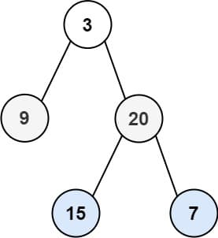

# 103. Binary Tree Zigzag Level Order Traversal

Given the <code>root</code> of a binary tree, return <em>the zigzag level order traversal of its nodes' values</em>. (i.e., from left to right, then right to left for the next level and alternate between).

&nbsp;

<strong class="example">Example 1:</strong>

<pre><strong>Input:</strong> root = [3,9,20,null,null,15,7]
<strong>Output:</strong> [[3],[20,9],[15,7]]
</pre>

<strong class="example">Example 2:</strong>

<pre><strong>Input:</strong> root = [1]
<strong>Output:</strong> [[1]]
</pre>

<strong class="example">Example 3:</strong>

<pre><strong>Input:</strong> root = []
<strong>Output:</strong> []
</pre>

&nbsp;

<strong>Constraints:</strong>

<ul>
	<li>The number of nodes in the tree is in the range <code>[0, 2000]</code>.</li>
	<li><code>-100 &lt;= Node.val &lt;= 100</code></li>
</ul>

---

### Problem Overview: Binary Tree Zigzag Level Order Traversal

#### **Objective**
Given the `root` of a binary tree, the goal is to return its values in a zigzag level order traversal. This traversal alternates between left-to-right and right-to-left directions for each subsequent level in the binary tree.

#### **Key Details**
1. **Traversal Pattern**: 
   - Begin with left-to-right at the first level.
   - Alternate directions for each level, forming a zigzag pattern.
2. **Input Format**: 
   - `root`, representing the binary tree's root node.
3. **Output Format**: 
   - A list of lists, where each sublist contains node values at a specific level in the zigzag order.
4. **Constraints**:
   - The total number of nodes ranges between 0 and 2000.
   - Node values fall within the range `[-100, 100]`.

#### **Examples**
- **Example 1**:
  - **Input**: `root = [3,9,20,null,null,15,7]`
  - **Output**: `[[3],[20,9],[15,7]]`
  - **Explanation**: Level 1 is `[3]` (left-to-right), level 2 is `[20,9]` (right-to-left), and level 3 is `[15,7]` (left-to-right).

- **Example 2**:
  - **Input**: `root = [1]`
  - **Output**: `[[1]]`
  - **Explanation**: With only one level, the traversal is `[1]`.

- **Example 3**:
  - **Input**: `root = []`
  - **Output**: `[]`
  - **Explanation**: No nodes are present, resulting in an empty list.

#### **Constraints**

- The number of nodes in the tree is in the range `[0, 2000]`.
- `-100 <= Node.val <= 100`
  
#### **Challenges**
1. Handling direction alternation efficiently during traversal.
2. Managing edge cases such as:
   - An empty tree (`root = []`).
   - A single-node tree.
3. Ensuring correct grouping of nodes at each level in zigzag order.

When solving problems involving tree traversal, it's essential to understand the two main strategies: **Depth First Search (DFS)** and **Breadth First Search (BFS)**.