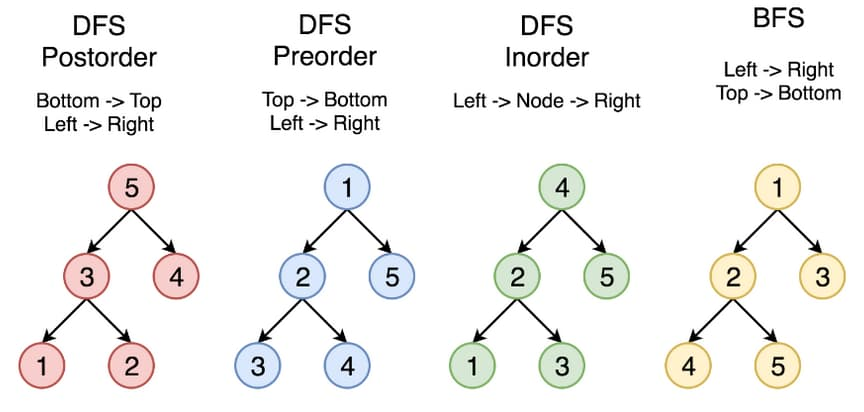

# 103. Binary Tree Zigzag Level Order Traversal

<p>Given the <code>root</code> of a binary tree, return <em>the zigzag level order traversal of its nodes' values</em>. (i.e., from left to right, then right to left for the next level and alternate between).</p>

<p>&nbsp;</p>
<p><strong class="example">Example 1:</strong></p>

<pre><strong>Input:</strong> root = [3,9,20,null,null,15,7]
<strong>Output:</strong> [[3],[20,9],[15,7]]
</pre>

<p><strong class="example">Example 2:</strong></p>

<pre><strong>Input:</strong> root = [1]
<strong>Output:</strong> [[1]]
</pre>

<p><strong class="example">Example 3:</strong></p>

<pre><strong>Input:</strong> root = []
<strong>Output:</strong> []
</pre>

<p>&nbsp;</p>
<p><strong>Constraints:</strong></p>

<ul>
  <li>The number of nodes in the tree is in the range <code>[0, 2000]</code>.</li>
  <li><code>-100 &lt;= Node.val &lt;= 100</code></li>
</ul>

---

# Solution

- [Recursive Approach](#recursive-approach)
  - **Time Complexity**: `O(n)`
  - **Space Complexity**: `O(n)`
- [Iterative Approach](#iterative-approach)

### Problem Overview: Binary Tree Zigzag Level Order Traversal

#### **Objective**
Given the `root` of a binary tree, the goal is to return its values in a zigzag level order traversal. This traversal alternates between left-to-right and right-to-left directions for each subsequent level in the binary tree.

#### **Key Details**
1. **Traversal Pattern**: 
   - Begin with left-to-right at the first level.
   - Alternate directions for each level, forming a zigzag pattern.
2. **Input Format**: 
   - `root`, representing the binary tree's root node.
3. **Output Format**: 
   - A list of lists, where each sublist contains node values at a specific level in the zigzag order.
4. **Constraints**:
   - The total number of nodes ranges between 0 and 2000.
   - Node values fall within the range `[-100, 100]`.

#### **Examples**
- **Example 1**:
  - **Input**: `root = [3,9,20,null,null,15,7]`
  - **Output**: `[[3],[20,9],[15,7]]`
  - **Explanation**: Level 1 is `[3]` (left-to-right), level 2 is `[20,9]` (right-to-left), and level 3 is `[15,7]` (left-to-right).

- **Example 2**:
  - **Input**: `root = [1]`
  - **Output**: `[[1]]`
  - **Explanation**: With only one level, the traversal is `[1]`.

- **Example 3**:
  - **Input**: `root = []`
  - **Output**: `[]`
  - **Explanation**: No nodes are present, resulting in an empty list.

#### **Constraints**

- The number of nodes in the tree is in the range `[0, 2000]`.
- `-100 <= Node.val <= 100`
  
#### **Challenges**
1. Handling direction alternation efficiently during traversal.
2. Managing edge cases such as:
   - An empty tree (`root = []`).
   - A single-node tree.
3. Ensuring correct grouping of nodes at each level in zigzag order.

### General Strategies to Traverse a Tree

When solving problems involving tree traversal, it's essential to understand the two main strategies: **Depth First Search (DFS)** and **Breadth First Search (BFS)**. These techniques differ in the order of node exploration and can be chosen based on the specific requirements of a problem.

#### **1. Depth First Search (DFS)**
In DFS, the traversal prioritizes depth, meaning we explore as far as possible along a branch before backtracking. Starting from the root node, we go down to a leaf node, then backtrack to explore other branches.

##### **Variants of DFS**
The DFS approach can be categorized into three distinct strategies based on the order of visiting nodes:
- **Preorder Traversal:** Visit the root node first, followed by the left subtree, and finally the right subtree.
- **Inorder Traversal:** Visit the left subtree first, then the root node, and finally the right subtree.
- **Postorder Traversal:** Visit the left subtree, then the right subtree, and finally the root node.

#### **2. Breadth First Search (BFS)**
In BFS, nodes are explored level by level, starting from the topmost level (root) and proceeding downward. Nodes at a given level are visited from left to right before moving to the next level.

##### **Split-Level BFS Traversal**
The problem at hand requires implementing a BFS traversal with split-level outputs, where each level is represented as a separate list:
Example: `[[1], [2, 3], [4, 5]]`

#### **Comparison of Traversal Strategies**
The following diagram illustrates the four traversal strategies—DFS Preorder, DFS Inorder, DFS Postorder, and BFS. In this example, the nodes are numbered in the order they are visited.



#### **Tree Structure**:
```
        5
       / \
      3   7
     / \
    2   4
```

#### **Traversal Strategies**:
1. **DFS Postorder**:  
   Traverse the left subtree, then the right subtree, and finally the root.  
   **Order:** 2 → 4 → 3 → 7 → 5

2. **DFS Preorder**:  
   Visit the root first, then traverse the left subtree and the right subtree.  
   **Order:** 5 → 3 → 2 → 4 → 7

3. **DFS Inorder**:  
   Traverse the left subtree first, then visit the root, followed by the right subtree.  
   **Order:** 2 → 3 → 4 → 5 → 7

4. **BFS (Level Order)**:  
   Visit nodes level by level, from top to bottom.  
   **Order:** 5 → 3 → 7 → 2 → 4

# Recursive Approach

## **Intuition**

### Level Order Traversal (Breadth-First Search)

The level order traversal processes the nodes level by level, from the root to the deepest level of the tree. Intuitively, in a recursive approach, we can break this problem down by associating each node with its respective depth (or level) and using that information to group nodes into levels.

At each recursive step:
1. We determine the "current level" of the node being processed.
2. We add the node's value to a corresponding list for its level.
3. We recursively process the left and right children of the node, passing along their respective levels (incrementing by 1 for each recursive call).

### Zigzag Level Order Traversal (Breadth-First Search)

The zigzag level order traversal extends the level-by-level approach by alternating the direction in which node values are added to their respective levels. While the recursive technique still involves associating each node with its depth (or level), the key difference lies in maintaining the direction for each level (left-to-right or right-to-left).

At each recursive step:
1. Determine the "current level" of the node being processed, just like in normal traversal.
2. Add the node's value to the corresponding list for its level. The placement, however, depends on the traversal direction:
   - If the level is processed left-to-right, append the value to the end of the list.
   - If the level is processed right-to-left, prepend the value to the list (or manipulate the list accordingly).
3. Alternate the direction for the next level. You can track this alternation dynamically based on the depth of the node (e.g., using `depth % 2` to decide direction).
4. Recursively process the left and right children of the current node, passing their respective levels along (incrementing by 1 for each recursive call).

### Key Differences from Normal Level Order Traversal:
- The recursion must account for and modify the traversal direction at each level.
- The placement of node values alternates between appending to the list for left-to-right levels and prepending for right-to-left levels.

This additional layer of directionality can be seamlessly incorporated by leveraging the level index or maintaining a separate flag for direction during recursion. The underlying logic for grouping nodes by levels remains unchanged, ensuring familiarity while tackling this variation.

## **Algorithm**

### **Preparation**
1. **Initialize the Result List**:
   - Create an empty `result` list to store nodes grouped by levels.
2. **Handle Edge Case**:
   - If the `root` is `null`, return an empty list immediately.

### **Auxiliary Function**
1. **Define the Function**:
   - The auxiliary function takes three parameters: the `current node`, the `current level`, and the shared `result` list.
2. **Base Case**:
   - If the `current node` is `null`, terminate the function call (no further recursion).
3. **Group Nodes by Level**:
   - Check if the `result` list has a sublist for the current `level`. If not, create and append a new sublist.
   - Determine traversal direction for the current level:
     - If the level is even, append the node's value to the sublist.
     - If the level is odd, prepend the node's value to the sublist.
4. **Recursive Calls**:
   - Invoke the auxiliary function for the left and right children of the `current node`, incrementing the `level` by 1 for each recursive call.

### **Execution**
1. **Initial Call**:
   - Invoke the auxiliary function with the `root` node, starting `level 0`, and the shared `result` list.
2. **Final Output**:
   - Once all recursive calls are complete, return the populated `result` list.

### **Pseudocode**

```pseudocode
function zigzag_level_order_traversal(root):
    if root == null:
        return empty_list

    define result as empty_list

    function traverse(node, level):
        if node == null:
            return

        if result does not have sublist at index level:
            add empty_list to result

        if level is even:
            append node.value to result[level]
        else:
            prepend node.value to result[level]

        traverse(node.left, level + 1)
        traverse(node.right, level + 1)

    call traverse(root, 0)
    return result
```

## **Implementation**

#### Implementation Details

1. **Base Case**: If the current node is `null`, the function returns immediately.
2. **Tracking Levels**: The `level` parameter keeps track of the current depth of traversal.
3. **Result Initialization**: If the `result` list does not have a sublist for the current level, one is created.
4. **Direction Handling**:
   - At even levels, values are appended to the end of the list (`left-to-right`).
   - At odd levels, values are added at the beginning of the list (`right-to-left`).
5. **Recursive Calls**: The function recursively processes the left and right children of the node, increasing the level for each recursive call.

### Java

```java
import java.util.ArrayList;
import java.util.LinkedList;
import java.util.List;

class Solution {
  public List<List<Integer>> zigzagLevelOrder(TreeNode root) {
    // Result list to store the zigzag level order traversal
    List<List<Integer>> result = new ArrayList<>();
    // Start the recursive traversal
    traverse(root, 0, result);
    return result;
  }

  private void traverse(TreeNode node, int level, List<List<Integer>> result) {
    if (node == null) {
      return; // Base case: No node to process
    }

    // If the result list doesn't have a list for the current level, create it
    if (result.size() <= level) {
      result.add(new LinkedList<>());
    }

    // Add the node's value to the correct list based on the zigzag direction
    if (level % 2 == 0) {
      // Even level (left-to-right), add to the end of the list
      result.get(level).add(node.val);
    } else {
      // Odd level (right-to-left), add to the start of the list
      result.get(level).add(0, node.val);
    }

    // Recursive calls for left and right children
    traverse(node.left, level + 1, result);
    traverse(node.right, level + 1, result);
  }
}
```

### TypeScript

```typescript
function zigzagLevelOrder(root: TreeNode | null): number[][] {
  const result: number[][] = [];

  // Auxiliary function for recursive traversal
  function traverse(node: TreeNode | null, level: number): void {
    if (node === null) {
      return; // Base case: no node to process
    }

    // Ensure the result array has a subarray for the current level
    if (result.length === level) {
      result.push([]);
    }

    // Add the node's value to the appropriate subarray based on zigzag direction
    if (level % 2 === 0) {
      // Even level: append value to the subarray
      result[level].push(node.val);
    } else {
      // Odd level: prepend value to the subarray
      result[level].unshift(node.val);
    }

    // Recursively process the left and right children
    traverse(node.left, level + 1);
    traverse(node.right, level + 1);
  }

  // Start the traversal from the root at level 0
  traverse(root, 0);
  
  return result;
}
```

## **Complexity Analysis**

### **Assumptions**
- The binary tree has `n` nodes, where `n` includes all non-null nodes.
- The input is well-formed, meaning the tree structure respects the constraints and values provided in the problem statement.
- A standard depth-first traversal (recursion) is used to process all nodes.

### **Time Complexity**: `O(n)`
- **Single Node Visit**: Each node in the tree is processed exactly once during the recursive traversal. 
- **Constant Work Per Node**: At each visit, operations such as checking the current level, determining the traversal direction, and modifying the list require constant time.
- **Linear Total Work**: With `n` nodes in the tree and each node being visited once, the cumulative work is directly proportional to the number of nodes.
- **Result**: The overall time complexity is **O(n)**.

### **Space Complexity**: `O(h)`  
- **Recursion Stack Usage**: The recursion stack depth depends on the height of the tree (`h`), which is determined by the tree's structure.
- **Balanced Tree Height**: For a completely balanced binary tree, the height is `log(n)` due to its optimal node distribution.
- **Unbalanced Tree Height**: For an unbalanced binary tree (akin to a linked list), the height reaches `n`, equating to the total number of nodes.
- **Output Space**: The `result` list contains all node values and scales linearly with the number of nodes, `O(n)`. However, this is considered output space rather than auxiliary space.  
- **Result**: The auxiliary space complexity tied to recursion is **O(h)**.

# Iterative Approach

## **Intuition**

The zigzag level order traversal requires processing the tree level by level, alternating the order of traversal between left-to-right and right-to-left at each level. Instead of recursion, we use a queue to manage the nodes. At each level:
- We extract all nodes of the current level from the queue.
- We add their children back into the queue for the next level.
- Depending on the level's direction (even or odd), we adjust the order of values collected for that level.

## **Algorithm**

1. Initialize a queue with the root node and a direction flag (`leftToRight`).
2. Loop until the queue is empty:
   - Determine the size of the current level (number of nodes in the queue).
   - Create a temporary array to hold the values of the current level.
   - Process each node in the current level:
     - Add the node’s value to the temporary array based on the direction flag.
     - Enqueue the node’s left and right children (if they exist).
   - Append the temporary array (processed values of the level) to the result array.
   - Toggle the direction flag for the next level.

### **Pseudocode**

```plaintext
function zigzagLevelOrder(root):
  if root is null:
      return []

  Initialize queue with root and direction flag (leftToRight = true)
  Initialize result array as empty

  while queue is not empty:
      Initialize level array
      Get size of queue (number of nodes in current level)
      
      for i from 0 to size of queue:
          Dequeue node
          Add node value to level array (append or prepend based on direction flag)
          Enqueue left and right children of node (if they exist)

      Append level array to result array
      Toggle direction flag

  return result array
```