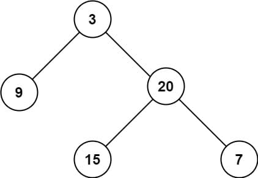

# 104. Maximum Depth of Binary Tree

<p>Given the <code>root</code> of a binary tree, return <em>its maximum depth</em>.</p>

<p>A binary tree's <strong>maximum depth</strong>&nbsp;is the number of nodes along the longest path from the root node down to the farthest leaf node.</p>

<p>&nbsp;</p>
<p><strong class="example">Example 1:</strong></p>

<pre><strong>Input:</strong> root = [3,9,20,null,null,15,7]
<strong>Output:</strong> 3
</pre>

<p><strong class="example">Example 2:</strong></p>

<pre><strong>Input:</strong> root = [1,null,2]
<strong>Output:</strong> 2
</pre>

<p>&nbsp;</p>
<p><strong>Constraints:</strong></p>

<ul>
  <li>The number of nodes in the tree is in the range <code>[0, 10<sup>4</sup>]</code>.</li>
  <li><code>-100 &lt;= Node.val &lt;= 100</code></li>
</ul>

<br>

---

# Solution

- [Recursive Approach](#recursive-approach)
  - **Time Complexity**: `O(n)`
- [Iterative Approach](#iterative-approach)

## Binary Tree Overview

**Key Points**:

- **Root Node**: The topmost node of the tree.
- **Child Nodes**: Each node can have up to two children, referred to as the left and right child.
- **Leaf Nodes**: Nodes with no children.
- **Depth/Height**: The length of the path from the root to the deepest leaf node.
- **Binary Search Tree (BST)**: A special type of binary tree where the left child's value is less than the parent's value, and the right child's value is greater than the parent's value.
- **Traversal Methods**: Methods to visit nodes in a binary tree, including In-order, Pre-order, and Post-order.

### Binary Tree in Array Form

A binary tree can be represented using an array, where the array elements correspond to the nodes of the tree. This representation is particularly useful for complete binary trees.

Representing a binary tree in array form is a simple and efficient method for complete binary trees. It leverages the properties of array indexing to quickly access parent and child nodes, making it suitable for certain applications where the tree structure is predictable and does not change dynamically.

#### Key Points:

1. **Root Node**:
   - The root node of the binary tree is stored at index 0 of the array.

2. **Left Child**:
   - For a node at index `i`, its left child is located at index `2i + 1`.

3. **Right Child**:
   - For a node at index `i`, its right child is located at index `2i + 2`.

4. **Parent Node**:
   - For a node at index `i`, its parent is located at index `(i - 1) / 2`.

#### Example:

Consider the following binary tree:

```code
      1
    /   \
   2     3
  / \   / \
 4   5 6   7
```

This binary tree can be represented in an array as:

```code
[1, 2, 3, 4, 5, 6, 7]
```

#### Detailed Explanation:

1. **Index 0**: The root node `1` is stored at index `0`.
2. **Indices 1 & 2**: The left child `2` and right child `3` of the root node are stored at indices `1` and `2` respectively.
3. **Indices 3 & 4**: The left child `4` and right child `5` of node `2` are stored at indices `3` and `4` respectively.
4. **Indices 5 & 6**: The left child `6` and right child `7` of node `3` are stored at indices `5` and `6` respectively.

#### Benefits:

- **Memory Efficiency**: For complete binary trees, this representation avoids the need for storing pointers to child nodes.
- **Ease of Access**: It allows for direct access to nodes using array indexing, which can simplify algorithms for traversal and manipulation.

#### Limitations:

- **Sparse Trees**: For binary trees that are not complete, this representation may lead to wasted space in the array.
- **Fixed Size**: The size of the array needs to be known in advance, which can be a limitation for dynamically growing trees.

# Recursive Approach

## **Intuition**

By definition, the maximum depth of a binary tree is the maximum number of steps to reach a leaf node from the root node. The idea is to traverse the tree and keep track of the maximum depth encountered.

We can traverse the tree using either Depth-First Search (DFS) or Breadth-First Search (BFS) strategies. Here, we'll use a DFS approach implemented with recursion.

The intuition behind the recursive approach is as follows:
- At each node, compute the depth of its left subtree and its right subtree.
- The maximum depth at the current node is the greater of the two depths plus one (to account for the current node).

## **Algorithm**

1. **Base Case**: If the current node is null, return 0.
2. **Recursive Case**: 
   - Recursively calculate the maximum depth of the left subtree.
   - Recursively calculate the maximum depth of the right subtree.
   - The depth of the current node is the greater of the depths of its left and right subtrees plus one.

## **Implementation**

### Java

```java
public class Solution {
  /**
   * Finds the maximum depth of a binary tree using the recursive approach.
   *
   * @param root The root node of the binary tree.
   * @return The maximum depth of the binary tree.
   */
  public int maxDepth(TreeNode root) {
    // Base case: if the current node is null, the depth is 0
    if (root == null) {
      return 0;
    }

    // Recursively find the maximum depth of the left subtree
    int leftDepth = maxDepth(root.left);

    // Recursively find the maximum depth of the right subtree
    int rightDepth = maxDepth(root.right);

    // The depth of the current node is the greater of the depths of its subtrees plus one
    return Math.max(leftDepth, rightDepth) + 1;
  }
}

/**
 * Definition for a binary tree node.
 */
public class TreeNode {
  int val;
  TreeNode left;
  TreeNode right;

  TreeNode() {
  }

  TreeNode(int val) {
    this.val = val;
  }

  TreeNode(int val, TreeNode left, TreeNode right) {
    this.val = val;
    this.left = left;
    this.right = right;
  }
}
```

### TypeScript

```typescript
/**
 * Definition for a binary tree node.
 */
class TreeNode {
  val: number;
  left: TreeNode | null;
  right: TreeNode | null;

  constructor(val?: number, left?: TreeNode | null, right?: TreeNode | null) {
    this.val = val === undefined ? 0 : val;
    this.left = left === undefined ? null : left;
    this.right = right === undefined ? null : right;
  }
}

/**
 * Finds the maximum depth of a binary tree.
 *
 * @param root The root node of the binary tree.
 * @returns The maximum depth of the binary tree.
 */
function maxDepth(root: TreeNode | null): number {
  if (root === null) {
    return 0;
  }

  const leftDepth = maxDepth(root.left);
  const rightDepth = maxDepth(root.right);

  return Math.max(leftDepth, rightDepth) + 1;
}
```

## **Complexity Analysis**

Let `n` be the number of nodes in the tree.

### **Time Complexity**: `O(n)`

- **Traversal of Nodes**: Each node in the binary tree is visited exactly once during the traversal. 
  - During the recursive traversal, we make a call to each node, process it, and move on to its children.
- **Linear Time**: Therefore, the time complexity is `O(n)`, where `n` is the number of nodes in the tree.

### **Space Complexity**: `O(n)`

- **Function Call Stack**: In the worst case, the maximum depth of the binary tree can be `n` (in the case of a skewed tree where each node only has one child). Thus, the function call stack can grow up to `n` calls deep.
  - For a balanced binary tree, the depth would be closer to `log(n)`, but we consider the worst-case scenario for space complexity.
- **Overall Space Complexity**: Combining these two factors, the overall space complexity is `O(n)`, as we have to account for the space required by the function call stack during recursion.

By visiting each node once and accounting for the space required by the recursive call stack, the algorithm achieves `O(n)` time and `O(n)` space complexity.

# Iterative Approach

## **Intuition**

To convert the recursive solution into an iterative one, we can use a stack data structure. The stack mimics the function call stack used in recursion, following a First-In-Last-Out (FILO) pattern. By maintaining a stack of nodes to visit next, we can achieve a similar traversal order as the recursive approach.

## **Algorithm**

1. **Initialization**:
   - Create an empty stack.
   - Push the root node and its corresponding depth (1) onto the stack.

2. **Iteration**:
   - While the stack is not empty:
     - Pop the top element from the stack. This gives you the current node and its depth.
     - Update the maximum depth if the current depth is greater.
     - Push the left and right children of the current node onto the stack, with their corresponding depths incremented by 1.

3. **Termination**:
   - Once the stack is empty, the maximum depth recorded is the maximum depth of the binary tree.

## **Implementation**

### Implementation Details

In Java, we will use the `Pair` class to store the tree node and its depth. This simplifies the management of node-depth pairs and makes the iterative algorithm more maintainable.

#### Reasons for Using `Pair`

1. **Association of Node and Depth**:
   - By storing the node and its depth in a `Pair`, we can easily manage and access the depth information associated with each node.
   - This helps in keeping the code clean and maintaining the relationship between the node and its depth throughout the traversal.

2. **Stack Management**:
   - When we push elements onto the stack, we can push both the node and its corresponding depth together.
   - This simplifies the stack operations and ensures that we always have access to the depth information when popping elements from the stack.

3. **Code Readability**:
   - Using a `Pair` class makes the code more readable and intuitive.
   - It clearly indicates that we are dealing with both the node and its depth, making the logic easier to understand and maintain.

#### Alternative Approaches

While using a `Pair` class is a common and convenient approach, there are other ways to achieve the same result:

- **Array**: Use an array or tuple to store the node and its depth.
  ```java
  Stack<Object[]> stack = new Stack<>();
  stack.push(new Object[]{root, 1});
  ```
- **Custom Data Structure**: Define a custom class to hold the node and depth information, similar to the `Pair` class.

