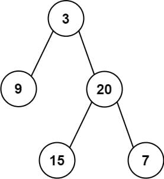

# 105. Construct Binary Tree from Preorder and Inorder Traversal

<p>Given two integer arrays <code>preorder</code> and <code>inorder</code> where <code>preorder</code> is the preorder traversal of a binary tree and <code>inorder</code> is the inorder traversal of the same tree, construct and return <em>the binary tree</em>.</p>

<p>&nbsp;</p>
<p><strong class="example">Example 1:</strong></p>

<pre><strong>Input:</strong> preorder = [3,9,20,15,7], inorder = [9,3,15,20,7]
<strong>Output:</strong> [3,9,20,null,null,15,7]
</pre>

<p><strong class="example">Example 2:</strong></p>

<pre><strong>Input:</strong> preorder = [-1], inorder = [-1]
<strong>Output:</strong> [-1]
</pre>

<p>&nbsp;</p>
<p><strong>Constraints:</strong></p>

<ul>
  <li><code>1 &lt;= preorder.length &lt;= 3000</code></li>
  <li><code>inorder.length == preorder.length</code></li>
  <li><code>-3000 &lt;= preorder[i], inorder[i] &lt;= 3000</code></li>
  <li><code>preorder</code> and <code>inorder</code> consist of <strong>unique</strong> values.</li>
  <li>Each value of <code>inorder</code> also appears in <code>preorder</code>.</li>
  <li><code>preorder</code> is <strong>guaranteed</strong> to be the preorder traversal of the tree.</li>
  <li><code>inorder</code> is <strong>guaranteed</strong> to be the inorder traversal of the tree.</li>
</ul>

---

# Solution

- [Recursive Approach](#binary-search-approach)

## **Problem Overview: Construct Binary Tree from Preorder and Inorder Traversal**

### Objective
You are given two integer arrays:
- `preorder`: the preorder traversal of a binary tree
- `inorder`: the inorder traversal of the same binary tree

Your task is to reconstruct the binary tree and return its root node.

### Key Concepts
- **Preorder traversal** visits nodes in the order: `Root → Left → Right`
- **Inorder traversal** visits nodes in the order: `Left → Root → Right`
- Since all node values are unique, the tree can be reconstructed unambiguously.

### Input
- `preorder`: List of integers representing preorder traversal
- `inorder`: List of integers representing inorder traversal
- Both arrays have the same length and contain unique values

### Output
- The root node of the reconstructed binary tree

### Example 1
**Input:**
```plaintext
preorder = [3,9,20,15,7]
inorder = [9,3,15,20,7]
```

**Output (Tree Structure):**
```
    3
   / \
  9  20
     / \
    15  7
```

### Example 2
**Input:**
```plaintext
preorder = [-1]
inorder = [-1]
```

**Output:**
```
-1
```

### Constraints
- `1 <= preorder.length <= 3000`
- `inorder.length == preorder.length`
- `-3000 <= preorder[i], inorder[i] <= 3000`
- All values are unique and appear in both arrays
- Traversals are guaranteed to be valid for a binary tree

### Approach Summary
1. Use the first element of `preorder` as the root.
2. Find the root’s index in `inorder` to split left and right subtrees.
3. Recursively build the left and right subtrees using the corresponding segments of `preorder` and `inorder`.

This problem tests your understanding of tree traversal and recursive tree construction. Efficient solutions typically use a hash map to index `inorder` values for quick lookup.

# Recursive Approach

## **Intuition**

To reconstruct a binary tree from its preorder and inorder traversals, we rely on the unique properties of each traversal:

- **Preorder traversal** always starts with the root node.
- **Inorder traversal** places the root node between its left and right subtrees.

The recursive insight is this:  
1. **Identify the root** from the first element of the `preorder` array.
2. **Locate the root in the `inorder` array** to determine the boundary between left and right subtrees.
3. **Recursively apply the same logic** to the left and right segments of both arrays.

Each recursive call narrows the problem:
- The left subtree is built from the next elements in `preorder` and the left segment of `inorder`.
- The right subtree is built from the remaining elements in `preorder` and the right segment of `inorder`.

By slicing the arrays appropriately and maintaining an index map for quick lookup, we avoid redundant work and ensure the tree is built efficiently. This divide-and-conquer strategy mirrors how the tree itself is structured—each node recursively defines its own subtrees.

