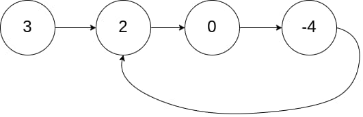
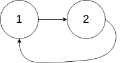
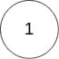

# 141. Linked List Cycle

<p>Given <code>head</code>, the head of a linked list, determine if the linked list has a cycle in it.</p>

<p>There is a cycle in a linked list if there is some node in the list that can be reached again by continuously following the&nbsp;<code>next</code>&nbsp;pointer. Internally, <code>pos</code>&nbsp;is used to denote the index of the node that&nbsp;tail's&nbsp;<code>next</code>&nbsp;pointer is connected to.&nbsp;<strong>Note that&nbsp;<code>pos</code>&nbsp;is not passed as a parameter</strong>.</p>

<p>Return&nbsp;<code>true</code><em> if there is a cycle in the linked list</em>. Otherwise, return <code>false</code>.</p>

<p>&nbsp;</p>
<p><strong class="example">Example 1:</strong></p>

<pre><strong>Input:</strong> head = [3,2,0,-4], pos = 1
<strong>Output:</strong> true
<strong>Explanation:</strong> There is a cycle in the linked list, where the tail connects to the 1st node (0-indexed).
</pre>

<p><strong class="example">Example 2:</strong></p>

<pre><strong>Input:</strong> head = [1,2], pos = 0
<strong>Output:</strong> true
<strong>Explanation:</strong> There is a cycle in the linked list, where the tail connects to the 0th node.
</pre>

<p><strong class="example">Example 3:</strong></p>

<pre><strong>Input:</strong> head = [1], pos = -1
<strong>Output:</strong> false
<strong>Explanation:</strong> There is no cycle in the linked list.
</pre>

<p>&nbsp;</p>
<p><strong>Constraints:</strong></p>

<ul>
	<li>The number of the nodes in the list is in the range <code>[0, 10<sup>4</sup>]</code>.</li>
	<li><code>-10<sup>5</sup> &lt;= Node.val &lt;= 10<sup>5</sup></code></li>
	<li><code>pos</code> is <code>-1</code> or a <strong>valid index</strong> in the linked-list.</li>
</ul>

<p>&nbsp;</p>
<p><strong>Follow up:</strong> Can you solve it using <code>O(1)</code> (i.e. constant) memory?</p>

---

# Solution

- [Hash Set Approach](#hash-set-approach)
  - **Time Complexity**: `O(n)`
  - **Space Complexity**: `O(n)`

## **Problem Overview: Linked List Cycle**

A **linked list cycle** occurs when a node's `next` pointer links back to a previous node in the list, creating a loop. Instead of terminating at `null`, traversal continues indefinitely. The task is to determine whether such a cycle exists given the head of a singly linked list.

### **Key Idea**

A cycle exists **if any node can be revisited** by repeatedly following `next` pointers.  
The input may conceptually include a `pos` value (used internally by LeetCode to indicate where the tail connects), but **`pos` is not provided to your function**—you must detect the cycle purely from pointer structure.

### **Examples**

#### **Example 1**
- **Input:** `head = [3,2,0,-4]`, `pos = 1`  
- **Output:** `true`  
- **Explanation:** Tail connects to the node at index 1, forming a loop.

#### **Example 2**
- **Input:** `head = [1,2]`, `pos = 0`  
- **Output:** `true`  
- **Explanation:** Tail connects back to the head.

#### **Example 3**
- **Input:** `head = [1]`, `pos = -1`  
- **Output:** `false`  
- **Explanation:** No cycle exists.

### **Constraints**
- Number of nodes: **0 to 10⁴**
- Node values: **−10⁵ to 10⁵**
- `pos` is either **−1** or a valid index

### **Follow‑Up**
Can you detect a cycle using **O(1) extra memory**?

# Hash Set Approach

To detect a cyclic list, check whether a node has been visited through the use of a hash table/hash set.

## **Intuition**

The idea is to detect a cycle by remembering every node you have visited.  
A linked list with no cycle will eventually reach a null pointer.  
A linked list with a cycle will eventually revisit a node you have already seen.

Since each node in memory has a unique reference identity, storing visited nodes in a hash table allows constant‑time membership checks.  
If a node appears twice, a cycle exists.

This approach directly mirrors the definition of a cycle: reaching the same node more than once.

## **Algorithm**

1. Initialize an empty hash set to store visited node references.
2. Start from the head of the list.
3. For each node:
   - If the node is already in the set, return true because a cycle exists.
   - Otherwise, insert the node into the set.
   - Move to the next node.
4. If traversal reaches null, return false because the list terminates normally.

### **Pseudocode**

```
function hasCycle(head):
  visited = empty set

  current = head
  while current is not null:
    if current in visited:
      return true
    add current to visited
    current = current.next

  return false
```

## **Implementation**

### Java

```java
import java.util.HashSet;
import java.util.Set;

public class Solution {
  public boolean hasCycle(ListNode head) {
    Set<ListNode> visited = new HashSet<>();
    ListNode current = head;

    while (current != null) {
      if (visited.contains(current)) {
        return true;
      }
      visited.add(current);
      current = current.next;
    }
    return false;
  }
}
```

### TypeScript

```typescript
function hasCycle(head: ListNode | null): boolean {
  const visited = new Set<ListNode>();
  let current = head;

  while (current !== null) {
    if (visited.has(current)) {
      return true;
    }
    visited.add(current);
    current = current.next;
  }

  return false;
};
```

## **Complexity Analysis**

### **Assumptions**

- Let `n` be the total number of nodes in the linked list.

### **Time Complexity**: `O(n)`
- **Linear Traversal**: Each of the `n` nodes is visited at most once before either reaching null or detecting a repeated node.
- **Constant-Time Hash Lookup**: Checking whether a node exists in the hash table and inserting it both take `O(1)` expected time.

### **Space Complexity**: `O(n)`
- **Visited Set Growth**: In the worst case (no cycle), the hash table stores all `n` distinct nodes.
- **No Extra Structures Beyond the Set**: Aside from the visited set and a few pointers, no additional memory is used.