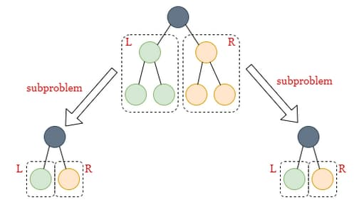

# 144. Binary Tree Preorder Traversal

<p>Given the <code>root</code> of a binary tree, return <em>the preorder traversal of its nodes' values</em>.</p>

<p>&nbsp;</p>
<p><strong class="example">Example 1:</strong></p>

<div class="example-block">
<p><strong>Input:</strong> <span class="example-io">root = [1,null,2,3]</span></p>

<p><strong>Output:</strong> <span class="example-io">[1,2,3]</span></p>

<p><strong>Explanation:</strong></p>

<p></p>
</div>

<p><strong class="example">Example 2:</strong></p>

<div class="example-block">
<p><strong>Input:</strong> <span class="example-io">root = [1,2,3,4,5,null,8,null,null,6,7,9]</span></p>

<p><strong>Output:</strong> <span class="example-io">[1,2,4,5,6,7,3,8,9]</span></p>

<p><strong>Explanation:</strong></p>

<p></p>
</div>

<p><strong class="example">Example 3:</strong></p>

<div class="example-block">
<p><strong>Input:</strong> <span class="example-io">root = []</span></p>

<p><strong>Output:</strong> <span class="example-io">[]</span></p>
</div>

<p><strong class="example">Example 4:</strong></p>

<div class="example-block">
<p><strong>Input:</strong> <span class="example-io">root = [1]</span></p>

<p><strong>Output:</strong> <span class="example-io">[1]</span></p>
</div>

<p>&nbsp;</p>
<p><strong>Constraints:</strong></p>

<ul>
  <li>The number of nodes in the tree is in the range <code>[0, 100]</code>.</li>
  <li><code>-100 &lt;= Node.val &lt;= 100</code></li>
</ul>

<p>&nbsp;</p>
<p><strong>Follow up:</strong> Recursive solution is trivial, could you do it iteratively?</p>

<br>

---

# Solution

- [Iterative Approach](#iterative-approach)
  - **Time Complexity**: `O(n)`
- [Recursive Approach](#recursive-approach)

# Iterative Approach

## **Intuition**

To perform a preorder traversal of a binary tree iteratively, we can use a stack to mimic the behavior of the call stack in the recursive solution. In preorder traversal, we visit the root node first, then the left subtree, and finally the right subtree. By using a stack, we can ensure that we access nodes in this order.

Since stacks follow a last-in-first-out order, we need to push the right child onto the stack first, and then the left child. This ensures that when we pop nodes from the stack, we process the left child before the right child.


## **Algorithm**

1. Initialize an empty array `answer` to store the preorder traversal.
2. Initialize an empty stack `stack`.
3. Add the `root` node to the `stack`.
4. While the `stack` is not empty, do the following:
   - Pop the top node `currNode` from the `stack`.
   - If `currNode` is not `null`:
     - Add `currNode`'s value to the `answer`.
     - Push `currNode`'s right child onto the `stack`.
     - Push `currNode`'s left child onto the `stack`.
5. Repeat step 4 until the `stack` is empty.
6. Return `answer` after the `stack` is empty.

### Example

Let's go through an example with the input `root = [1, null, 2, 3]`.

1. **Initialization**:
   - `answer = []`
   - `stack = [1]`

2. **First iteration**:
   - Pop `1` from the stack: `stack = []`
   - Add `1` to `answer`: `answer = [1]`
   - Push `2` (right child of `1`) onto the stack: `stack = [2]`

3. **Second iteration**:
   - Pop `2` from the stack: `stack = []`
   - Add `2` to `answer`: `answer = [1, 2]`
   - Push `3` (left child of `2`) onto the stack: `stack = [3]`

4. **Third iteration**:
   - Pop `3` from the stack: `stack = []`
   - Add `3` to `answer`: `answer = [1, 2, 3]`

The stack is now empty, so we return `answer = [1, 2, 3]`.

## **Implementation**

### Java

```java
import java.util.ArrayList;
import java.util.List;
import java.util.Stack;

class TreeNode {
  int val;
  TreeNode left;
  TreeNode right;

  TreeNode(int val) {
    this.val = val;
    this.left = null;
    this.right = null;
  }
}

public class BinaryTreePreorderTraversal {
  public List<Integer> preorderTraversal(TreeNode root) {
    List<Integer> answer = new ArrayList<>();
    Stack<TreeNode> stack = new Stack<>();

    if (root != null) {
      stack.push(root);
    }

    while (!stack.isEmpty()) {
      TreeNode currNode = stack.pop();
      if (currNode != null) {
        answer.add(currNode.val);
        if (currNode.right != null) {
          stack.push(currNode.right);
        }
        if (currNode.left != null) {
          stack.push(currNode.left);
        }
      }
    }

    return answer;
  }

}
```

### TypeScript

```typescript
class TreeNode {
  val: number;
  left: TreeNode | null;
  right: TreeNode | null;
  constructor(val?: number, left?: TreeNode | null, right?: TreeNode | null) {
    this.val = val === undefined ? 0 : val;
    this.left = left === undefined ? null : left;
    this.right = right === undefined ? null : right;
  }
}

function preorderTraversal(root: TreeNode | null): number[] {
  const answer: number[] = [];
  const stack: (TreeNode | null)[] = [];

  if (root !== null) {
    stack.push(root);
  }

  while (stack.length > 0) {
    const currNode = stack.pop();
    if (currNode !== null) {
      answer.push(currNode.val);
      if (currNode.right !== null) {
        stack.push(currNode.right);
      }
      if (currNode.left !== null) {
        stack.push(currNode.left);
      }
    }
  }

  return answer;
}
```

## **Complexity Analysis**

Let `n` be the number of nodes in the tree.

### **Time Complexity**: `O(n)`

- **Stack Operations**: We use a stack to store all nodes to be visited. Each of the `n` nodes is added to and popped from the stack once, which takes `O(1)` time.
  - **Key Point**: Adding and removing each node from the stack is done in constant time.

- **Node Processing**: All other work done at each node is `O(1)`, so the overall time complexity is `O(n)`.
  - **Key Point**: Each node is processed once, and the operations performed at each node (like adding its value to the answer list) are constant time operations.

### **Space Complexity**: `O(n)`

- **Stack Usage**: We use a stack to store all the nodes to be visited. Similar to the previous approach, the stack takes up space equivalent to the depth of the tree. The max depth of the tree could be `O(n)` in the worst-case scenario when the tree is skewed.
  - **Key Point**: In the worst case of a skewed tree, the stack could grow to contain all `n` nodes, leading to a linear space complexity.

# Recursive Approach

## **Intuition**

In a preorder traversal, we visit the root node first, then recursively traverse the left subtree, and finally the right subtree. The key idea is to handle the root node and then recursively solve for its left and right subtrees. This method follows a depth-first search (DFS) approach.




## **Algorithm**

1. Initialize an empty list `answer` to store the preorder traversal.
2. Define a recursive helper function `preorder(node)` that:
   - If `node` is `null`, return.
   - Add the value of `node` to `answer`.
   - Recursively call `preorder(node.left)` to traverse the left subtree.
   - Recursively call `preorder(node.right)` to traverse the right subtree.
3. Call the helper function `preorder` starting from the `root` node.
4. Return the `answer` list containing the preorder traversal.

### Pseudocode

```plaintext
function preorderTraversal(root): answer = []

function preorder(node): if node is null: return answer.append(node.val) preorder(node.left) preorder(node.right)

preorder(root) return answer
```

## **Implementation**

### Java

```java
import java.util.ArrayList;
import java.util.List;

public class Solution2 {
  /**
   * Method to perform a recursive preorder traversal of a binary tree.
   * 
   * @param root The root node of the binary tree.
   * @return A list of integers representing the preorder traversal.
   */
  public List<Integer> preorderTraversal(TreeNode root) {
    List<Integer> answer = new ArrayList<>();
    preorder(root, answer);
    return answer;
  }

  /**
   * Helper method to perform the preorder traversal recursively.
   * 
   * @param node   The current node being visited.
   * @param answer The list storing the preorder traversal result.
   */
  private void preorder(TreeNode node, List<Integer> answer) {
    if (node == null) {
      return;
    }
    answer.add(node.val);
    preorder(node.left, answer);
    preorder(node.right, answer);
  }
}
```

### TypeScript

```ts
class TreeNode {
  val: number;
  left: TreeNode | null;
  right: TreeNode | null;
  constructor(val?: number, left?: TreeNode | null, right?: TreeNode | null) {
    this.val = val === undefined ? 0 : val;
    this.left = left === undefined ? null : left;
    this.right = right === undefined ? null : right;
  }
}

/**
 * Performs a recursive preorder traversal of a binary tree.
 * 
 * @param root - The root node of the binary tree.
 * @returns An array of numbers representing the preorder traversal.
 */
function preorderTraversal(root: TreeNode | null): number[] {
  const answer: number[] = [];

  /**
   * Helper function to perform the preorder traversal recursively.
   * 
   * @param node - The current node being visited.
   */
  function preorder(node: TreeNode | null): void {
    if (node === null) {
      return;
    }
    answer.push(node.val);
    preorder(node.left);
    preorder(node.right);
  }

  preorder(root);
  return answer;
}
```
