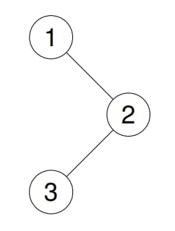
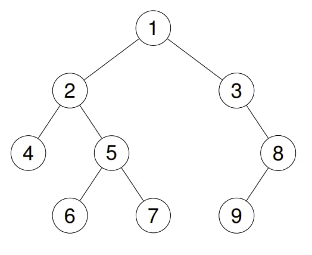

# 145. Binary Tree Postorder Traversal

<p>Given the <code>root</code> of a&nbsp;binary tree, return <em>the postorder traversal of its nodes' values</em>.</p>

<p>&nbsp;</p>
<p><strong class="example">Example 1:</strong></p>

<div class="example-block">
<p><strong>Input:</strong> <span class="example-io">root = [1,null,2,3]</span></p>

<p><strong>Output:</strong> <span class="example-io">[3,2,1]</span></p>

<p><strong>Explanation:</strong></p>

<p></p>
</div>

<p><strong class="example">Example 2:</strong></p>

<div class="example-block">
<p><strong>Input:</strong> <span class="example-io">root = [1,2,3,4,5,null,8,null,null,6,7,9]</span></p>

<p><strong>Output:</strong> <span class="example-io">[4,6,7,5,2,9,8,3,1]</span></p>

<p><strong>Explanation:</strong></p>

<p></p>
</div>

<p><strong class="example">Example 3:</strong></p>

<div class="example-block">
<p><strong>Input:</strong> <span class="example-io">root = []</span></p>

<p><strong>Output:</strong> <span class="example-io">[]</span></p>
</div>

<p><strong class="example">Example 4:</strong></p>

<div class="example-block">
<p><strong>Input:</strong> <span class="example-io">root = [1]</span></p>

<p><strong>Output:</strong> <span class="example-io">[1]</span></p>
</div>

<p>&nbsp;</p>
<p><strong>Constraints:</strong></p>

<ul>
  <li>The number of the nodes in the tree is in the range <code>[0, 100]</code>.</li>
  <li><code>-100 &lt;= Node.val &lt;= 100</code></li>
</ul>

<p>&nbsp;</p>
<strong>Follow up:</strong> Recursive solution is trivial, could you do it iteratively?

<br>

---

# Solution

- [Recursive Approach](#recursive-approach)
  - **Time Complexity**: `O(n)`
- [Iterative Approach](#iterative-approach)
  - **Time Complexity**: `O(n)`

# Recursive Approach

## **Intuition**

In a postorder traversal, we first recursively traverse the left subtree, then the right subtree, and finally visit the root node. The key idea is to process the root node **after** we have solved for its left and right subtrees. This method follows a depth-first search (DFS) approach.

## **Algorithm**

1. **Initialize List**:
   - Initialize an empty list `answer` to store the postorder traversal.

2. **Define Recursive Helper Function**:
   - Define a recursive helper function `postorder(node)`:
     - If `node` is `null`, return.
     - Recursively call `postorder(node.left)` to traverse the left subtree.
     - Recursively call `postorder(node.right)` to traverse the right subtree.
     - Add the value of `node` to `answer`.

3. **Start Traversal**:
   - Call the helper function `postorder` starting from the `root` node.

4. **Return Result**:
   - Return the `answer` list containing the postorder traversal.

### **Pseudocode**

```plaintext
function postorderTraversal(root):
    answer = []
    
    function postorder(node):
        if node is None:
            return
        postorder(node.left)
        postorder(node.right)
        answer.append(node.val)

    postorder(root)
    return answer
```

## **Implementation**

### Java

```java
import java.util.ArrayList;
import java.util.List;

public class Solution {

  public List<Integer> postorderTraversal(TreeNode root) {
    List<Integer> answer = new ArrayList<>();
    postorder(root, answer);
    return answer;
  }

  private void postorder(TreeNode node, List<Integer> answer) {
    if (node == null) {
      return;
    }
    postorder(node.left, answer);
    postorder(node.right, answer);
    answer.add(node.val);
  }
}
```

### TypeScript

```ts
class TreeNode {
  val: number;
  left: TreeNode | null;
  right: TreeNode | null;
  constructor(val?: number, left?: TreeNode | null, right?: TreeNode | null) {
    this.val = val === undefined ? 0 : val;
    this.left = left === undefined ? null : left;
    this.right = right === undefined ? null : right;
  }
}

function postorderTraversal(root: TreeNode | null): number[] {
  const answer: number[] = [];

  function postorder(node: TreeNode | null): void {
    if (node === null) {
      return;
    }
    postorder(node.left);
    postorder(node.right);
    answer.push(node.val);
  }

  postorder(root);
  return answer;
};
```

## **Complexity Analysis**

Let `n` be the number of nodes in the tree.

### **Time Complexity**: `O(n)`

- **Traversal of Nodes**: In the postorder traversal, each node in the tree is visited exactly once. During this traversal, we perform a constant amount of work per node (visiting the node, processing its children, and adding it to the result list).
- **Linear Time**: Therefore, the time complexity is directly proportional to the number of nodes, resulting in `O(n)` time complexity.

### **Space Complexity**: `O(n)`

- **Recursion Stack**: The space complexity is primarily determined by the depth of the recursion stack. In the worst case (for a skewed tree), the depth of the recursion stack can be equal to the height of the tree.
  - **Balanced Tree**: For a balanced binary tree, the height is `O(log n)`, and thus the recursion stack would also be `O(log n)`.
  - **Skewed Tree**: For a skewed binary tree, the height can be `O(n)`, leading to a recursion stack of `O(n)`.
- **Result Storage**: Additionally, we use a list to store the postorder traversal result, which contains all `n` nodes.
- **Overall Space Complexity**: Combining the space used by the recursion stack and the result storage, the overall space complexity is `O(n)`.

By visiting each node once and accounting for the maximum possible depth of the recursion stack, the algorithm achieves `O(n)` time and `O(n)` space complexity.

# Iterative Approach

## **Intuition**

To perform a postorder traversal of a binary tree iteratively, we use a stack to simulate the behavior of the call stack in a recursive solution. In postorder traversal, we first traverse the left subtree, then the right subtree, and finally visit the root node. By using a stack, we can ensure that we access nodes in this correct order.

Given that stacks follow a last-in-first-out order, we should push the left child onto the stack first, and then the right child. This ensures that when we pop nodes from the stack, we process the right child before the left child. However, because we want to visit the root last, we need a way to keep track of nodes we have already visited.

One effective method is to use a stack and a second data structure (like a deque) to store the postorder traversal. After visiting a node, we push it to the front of the deque. This effectively reverses the order, ensuring that nodes are processed in postorder: left, right, root.

## **Algorithm**

1. **Initialize Deque and Stack**:
   - Initialize an empty deque `answer` to store the postorder traversal.
   - Initialize an empty stack `stack`.

2. **Add Root to Stack**:
   - Add the `root` node to the `stack`.

3. **Iterate While Stack is Not Empty**:
   - While the `stack` is not empty, do the following:
     - Pop the top node `currNode` from the `stack`.
     - Add the value of `currNode` to the front of the `answer` deque.
     - Push `currNode`'s left child onto the `stack`.
     - Push `currNode`'s right child onto the `stack`.

4. **Convert Deque to List**:
   - Convert `answer` deque to a list before returning.

5. **Return Result**:
   - Return the `answer` list containing the postorder traversal.

### **Pseudocode**

```plaintext
function postorderTraversal(root):
    answer = deque()
    stack = []

    if root is not null:
        stack.push(root)

    while stack is not empty:
        currNode = stack.pop()
        answer.appendleft(currNode.val)
        if currNode.left is not null:
            stack.push(currNode.left)
        if currNode.right is not null:
            stack.push(currNode.right)

    return list(answer)
```

### Example

Let's go through an example with the input `root = [1, null, 2, 3]`.

The tree structure will be:

```plaintext
1
  \
    2
  /
3
```

1. **Initialization**:
   - Initialize `answer` as an empty deque.
   - Initialize `stack` as an empty stack.
   - Add the `root` node to `stack`: `[1]`.

2. **First Iteration**:
   - Pop `1` from `stack`: `stack` is now `[]`.
   - Add `1` to the front of `answer`: `answer` becomes `[1]`.
   - Push the left child of `1` (which is `null`) onto `stack`: `stack` remains `[]`.
   - Push the right child of `1` (`2`) onto `stack`: `stack` becomes `[2]`.

3. **Second Iteration**:
   - Pop `2` from `stack`: `stack` is now `[]`.
   - Add `2` to the front of `answer`: `answer` becomes `[2, 1]`.
   - Push the left child of `2` (`3`) onto `stack`: `stack` becomes `[3]`.
   - Push the right child of `2` (which is `null`) onto `stack`: `stack` remains `[3]`.

4. **Third Iteration**:
   - Pop `3` from `stack`: `stack` is now `[]`.
   - Add `3` to the front of `answer`: `answer` becomes `[3, 2, 1]`.
   - Push the left child of `3` (which is `null`) onto `stack`: `stack` remains `[]`.
   - Push the right child of `3` (which is `null`) onto `stack`: `stack` remains `[]`.

5. **Final Result**:
   - Convert `answer` to a list: `answer` becomes `[3, 2, 1]`.

### Final Output

The postorder traversal of the tree `[1, null, 2, 3]` is `[3, 2, 1]`.

## **Implementation**

### Java

```java
import java.util.ArrayDeque;
import java.util.ArrayList;
import java.util.Deque;
import java.util.List;

public class Solution {

  public List<Integer> postorderTraversal(TreeNode root) {
    List<Integer> answer = new ArrayList<>();
    if (root == null) {
      return answer;
    }

    Deque<TreeNode> stack = new ArrayDeque<>();
    Deque<TreeNode> output = new ArrayDeque<>();

    stack.push(root);
    while (!stack.isEmpty()) {
      TreeNode currNode = stack.pop();
      output.push(currNode);

      if (currNode.left != null) {
        stack.push(currNode.left);
      }
      if (currNode.right != null) {
        stack.push(currNode.right);
      }
    }

    while (!output.isEmpty()) {
      answer.add(output.pop().val);
    }

    return answer;
  }

  /**
   * Definition for a binary tree node.
   */
  public static class TreeNode {
    int val;
    TreeNode left;
    TreeNode right;

    TreeNode(int x) {
      val = x;
    }
  }
}
```

### TypeScript

```typescript
class TreeNode {
  val: number;
  left: TreeNode | null;
  right: TreeNode | null;
  constructor(val?: number, left?: TreeNode | null, right?: TreeNode | null) {
    this.val = val === undefined ? 0 : val;
    this.left = left === undefined ? null : left;
    this.right = right === undefined ? null : right;
  }
}

function postorderTraversal(root: TreeNode | null): number[] {
  const answer: number[] = [];
  if (!root) {
    return answer;
  }

  const stack: TreeNode[] = [];
  const output: TreeNode[] = [];

  stack.push(root);

  while (stack.length) {
    const currNode = stack.pop()!;
    output.push(currNode);

    if (currNode.left) {
      stack.push(currNode.left);
    }
    if (currNode.right) {
      stack.push(currNode.right);
    }
  }

  while (output.length) {
    answer.push(output.pop()!.val);
  }

  return answer;
}
```
