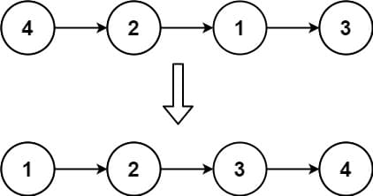
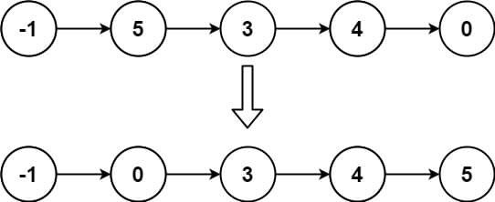
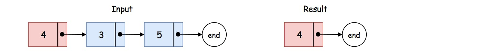
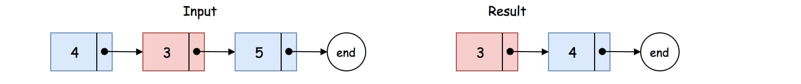
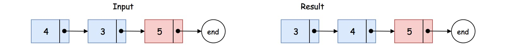

# 147. Insertion Sort List

<p>Given the <code>head</code> of a singly linked list, sort the list using <strong>insertion sort</strong>, and return <em>the sorted list's head</em>.</p>

<p>The steps of the <strong>insertion sort</strong> algorithm:</p>

<ol>
  <li>Insertion sort iterates, consuming one input element each repetition and growing a sorted output list.</li>
  <li>At each iteration, insertion sort removes one element from the input data, finds the location it belongs within the sorted list and inserts it there.</li>
  <li>It repeats until no input elements remain.</li>
</ol>

<p>The following is a graphical example of the insertion sort algorithm. The partially sorted list (black) initially contains only the first element in the list. One element (red) is removed from the input data and inserted in-place into the sorted list with each iteration.</p>

<p>&nbsp;</p>
<p><strong class="example">Example 1:</strong></p>

<pre><strong>Input:</strong> head = [4,2,1,3]
<strong>Output:</strong> [1,2,3,4]
</pre>

<p><strong class="example">Example 2:</strong></p>

<pre><strong>Input:</strong> head = [-1,5,3,4,0]
<strong>Output:</strong> [-1,0,3,4,5]
</pre>

<p>&nbsp;</p>
<p><strong>Constraints:</strong></p>

<ul>
  <li>The number of nodes in the list is in the range <code>[1, 5000]</code>.</li>
  <li><code>-5000 &lt;= Node.val &lt;= 5000</code></li>
</ul>

<br>

---

# Solution
- [Insertion Sort](#insertion-sort)
  - **Time Complexity**: `O(n^2)`

## Insertion Sort List Overview

[**Insertion sort**](https://en.wikipedia.org/wiki/Insertion_sort) is an intuitive, yet less efficient sorting algorithm compared to quicksort or merge sort.

While typically applied to arrays, this problem requires performing insertion sort on a linked list, adding complexity.

This article offers tricks to simplify linked list manipulation for easier implementation.

# Insertion Sort

## **Intuition**

## Intuition

Let's review the idea of the insertion sort algorithm, which can be broken down into the following steps:

1. **Create an empty list** to hold the sorted elements.

2. **Iterate through each element** in the input list:
    - For each element, find the correct position in the sorted list to insert it, maintaining the order.

3. Once the iteration completes, you will have a sorted list.

### Example Walkthrough:

Given the input list `input = [4, 3, 5]`:

1. Start with an empty sorted list: `result = []`.

2. **First element (4)**:
    - Insert 4 into the empty sorted list.
    - `result = [4]`.



3. **Second element (3)**:
    - Find the correct position for 3 in the sorted list.
    - Insert 3 before 4.
    - `result = [3, 4]`.



4. **Third element (5)**:
    - Find the correct position for 5 in the sorted list.
    - Insert 5 at the end.
    - `result = [3, 4, 5]`.



After these steps, the input list is sorted as `result = [3, 4, 5]`.

## **Algorithm**

To translate the above intuition into implementation, we applied two tricks:

1. **Sentinel Node**:
    - Create a sentinel node that serves as a pointer to the resulting list.
    - This node helps us maintain a reference to the resulting list, especially when inserting a new element at the head.
    - It greatly simplifies the logic, as we will see later.

2. **Pointers for Insertion**:
    - In a singly-linked list, each node points only to the next node.
    - To insert a new node (B) before a certain node (A), we need to know the node (C) that is currently before A (i.e., C -> A).
    - With the reference to node C, we can insert the new node: C -> B -> A.

    - The trick is to use a pair of pointers (prev -> next) to guard the position where we would insert a new element (i.e., prev -> new_node -> next).

## **Implementation**

### Java

```java
class Solution {
  public ListNode insertionSortList(ListNode head) {
    // Sentinel node acts as a placeholder for the sorted list's head.
    ListNode sentinel = new ListNode();
    ListNode curr = head; // Current node to be sorted.

    // Iterate through each node in the input list.
    while (curr != null) {
      ListNode prev = sentinel; // Pointer to traverse the sorted part of the list.

      // Find the correct position in the sorted list to insert the current node.
      while (prev.next != null && prev.next.val <= curr.val) {
        prev = prev.next;
      }

      // Save the next node to be processed.
      ListNode next = curr.next;
      // Insert the current node into the sorted part.
      curr.next = prev.next;
      prev.next = curr;

      // Move to the next node in the input list.
      curr = next;
    }

    // Return the head of the sorted list, which is the next node after sentinel.
    return sentinel.next;
  }
}
```

### TypeScript

```typescript
function insertionSortList(head: ListNode | null): ListNode | null {
  // Sentinel node acts as a placeholder for the sorted list's head.
  let sentinel = new ListNode();
  let curr = head; // Current node to be sorted.

  // Iterate through each node in the input list.
  while (curr !== null) {
    let prev = sentinel; // Pointer to traverse the sorted part of the list.

    // Find the correct position in the sorted list to insert the current node.
    while (prev.next !== null && prev.next.val <= curr.val) {
      prev = prev.next;
    }

    // Save the next node to be processed.
    let next = curr.next;
    // Insert the current node into the sorted part.
    curr.next = prev.next;
    prev.next = curr;

    // Move to the next node in the input list.
    curr = next;
  }

  // Return the head of the sorted list, which is the next node after sentinel.
  return sentinel.next;
};
```

## **Complexity Analysis**

### **Time Complexity**: `O(n^2)`
- **Iteration**: We run an iteration over the input list.
- **Insertion**: At each iteration, we insert an element into the resulting list. In the worst case, if the position to insert is at the tail of the list, we have to traverse the entire resulting list.
- **Worst-case steps**: The total steps in the worst case would be the sum of the first `N` natural numbers: 
\[
  \sum_{i=1}^{N} i = \frac{N(N+1)}{2}
\]
- **Overall complexity**: Thus, the overall time complexity of the algorithm is `O(n^2)`.

### **Space Complexity**: `O(1)`
- **Pointers**: We use some pointers within the algorithm, but their memory consumption is constant regardless of the input size.
- **Node reordering**: We do not create new nodes to hold the values of the input list but simply reorder the existing nodes.
