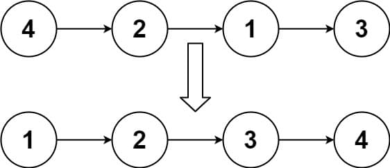
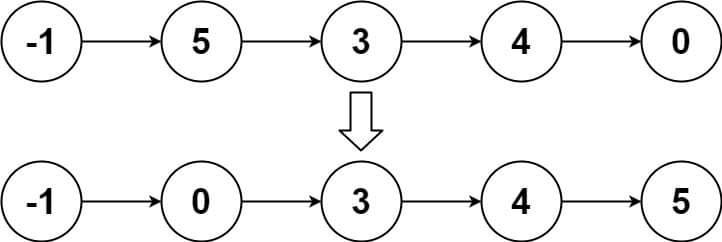
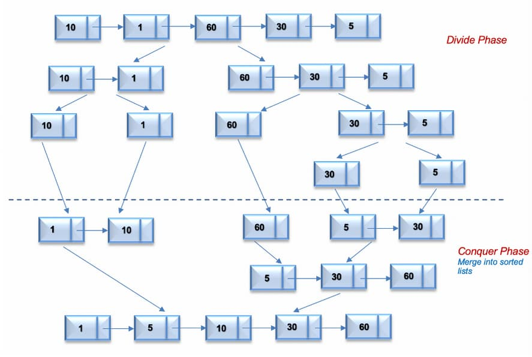
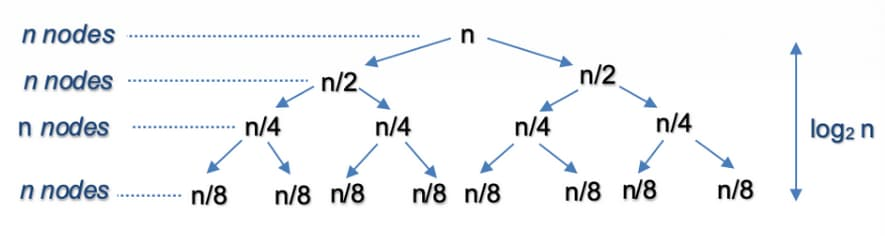
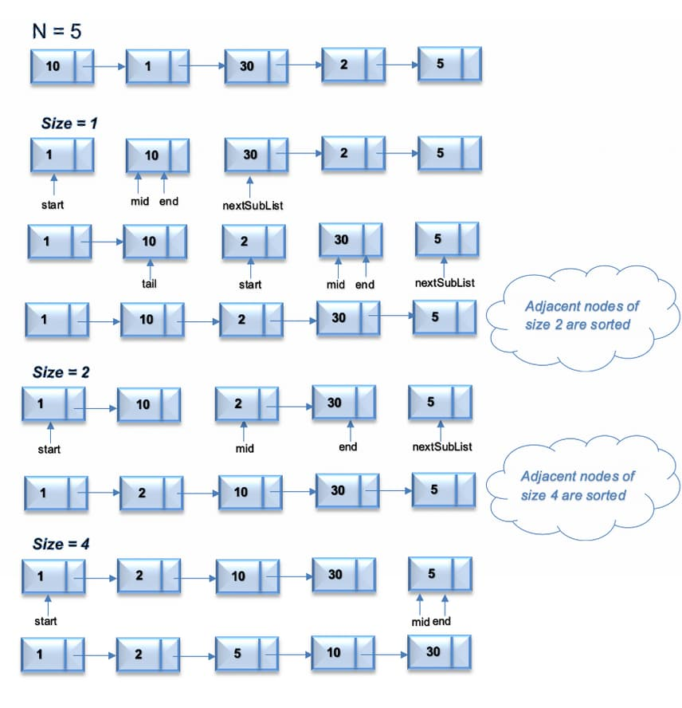

# 148. Sort List

<p>Given the <code>head</code> of a linked list, return <em>the list after sorting it in <strong>ascending order</strong></em>.</p>

<p>&nbsp;</p>
<p><strong class="example">Example 1:</strong></p>

<pre><strong>Input:</strong> head = [4,2,1,3]
<strong>Output:</strong> [1,2,3,4]
</pre>

<p><strong class="example">Example 2:</strong></p>

<pre><strong>Input:</strong> head = [-1,5,3,4,0]
<strong>Output:</strong> [-1,0,3,4,5]
</pre>

<p><strong class="example">Example 3:</strong></p>

<pre><strong>Input:</strong> head = []
<strong>Output:</strong> []
</pre>

<p>&nbsp;</p>
<p><strong>Constraints:</strong></p>

<ul>
  <li>The number of nodes in the list is in the range <code>[0, 5 * 10<sup>4</sup>]</code>.</li>
  <li><code>-10<sup>5</sup> &lt;= Node.val &lt;= 10<sup>5</sup></code></li>
</ul>

<p>&nbsp;</p>
<p><strong>Follow up:</strong> Can you sort the linked list in <code>O(n logn)</code> time and <code>O(1)</code> memory (i.e. constant space)?</p>

<br>

---

# Solution
- [Merge Sort Top-Down Approach](#merge-sort-top-down-approach)
  - **Time Complexity**: `O(n log n)`
- [Merge Sort Bottom-Up Approach](#merge-sort-bottom-up-approach)
  - **Time Complexity**: `O(n log n)`

# Merge Sort Top-Down Approach

## Intuition

Merge sort is a well-known algorithm that follows the Divide and Conquer strategy. This strategy can be split into two main phases:

1. **Divide Phase**: Divide the problem into smaller subproblems.
2. **Conquer Phase**: Repeatedly solve each subproblem independently and combine the results to form the original problem.

In the Top-Down approach for merge sort:
- The original list is recursively split into sublists of equal sizes.
- Each sublist is sorted independently.
- The sorted sublists are eventually merged back together.

Let's look at the algorithm to implement merge sort in the Top-Down fashion.

## **Algorithm**

1. **Recursively Split the List**:
    - Recursively split the original list into two halves. This splitting continues until there is only one node in each linked list (Divide Phase).
    - To split the list into two halves, find the middle of the linked list using the Fast and Slow pointer approach.

2. **Merge Sorted Sublists**:
    - Recursively sort each sublist and combine them into a single sorted list (Merge Phase).
    - This is similar to merging two sorted linked lists.

The process continues until we get the original list in sorted order.

### Detailed Steps:
1. **Base Case**: If the list is empty or has only one node, it's already sorted.
2. **Find the Middle**: Use the Fast and Slow pointer approach to find the middle of the list.
3. **Split the List**: Split the list into two halves from the middle.
4. **Recursively Sort**: Recursively sort each half.
5. **Merge**: Merge the two sorted halves into a single sorted list.

### Example Walkthrough:

For the linked list [10, 1, 60, 30, 5]:

1. **Initial List**: `[10, 1, 60, 30, 5]`
2. **Divide Phase**:
    - Split into `[10, 1, 60]` and `[30, 5]`
    - Further split `[10, 1, 60]` into `[10, 1]` and `[60]`
    - Split `[10, 1]` into `[10]` and `[1]`
3. **Conquer Phase**:
    - Merge `[10]` and `[1]` to form `[1, 10]`
    - Merge `[1, 10]` and `[60]` to form `[1, 10, 60]`
    - Merge `[30]` and `[5]` to form `[5, 30]`
4. **Merge Sorted Sublists**:
    - Merge `[1, 10, 60]` and `[5, 30]` to form `[1, 5, 10, 30, 60]`

The following figure illustrates the merge sort process using a top down approach.



## **Implementation**

### Implementation Details

**Key Points:**

- **Base Case**: The `sortList` function checks if the list is empty or has only one node, in which case it is already sorted.

- **Splitting the List**: The `getMiddle` helper function is used to find the middle of the list, which is then split into two halves.

- **Recursive Sorting**: Each half is recursively sorted by calling `sortList` on the left and right halves.

- **Merging**: The `merge` helper function is used to merge the two sorted halves into a single sorted list.

This implementation ensures the linked list is sorted in `O(n log n)` time using the top-down merge sort approach.

#### ListNode implementation

```java
//  Definition for singly-linked list.
public class ListNode {
  int val;
  ListNode next;
  ListNode() {}
  ListNode(int val) {
    this.val = val;
  }
  ListNode(int val, ListNode next) {
    this.val = val;
    this.next = next;
  }
}
```

### Java

```java
class Solution2 {

  public ListNode sortList(ListNode head) {
    if (head == null || head.next == null) {
      return head; // Base case: if the list is empty or has only one node, it's already sorted.
    }

    // Split the list into two halves
    ListNode middle = getMiddle(head);
    ListNode nextToMiddle = middle.next;
    middle.next = null;

    // Recursively sort each half
    ListNode left = sortList(head);
    ListNode right = sortList(nextToMiddle);

    // Merge the sorted halves
    return merge(left, right);
  }

  // Helper function to find the middle of the linked list using the fast and slow
  // pointer approach
  private ListNode getMiddle(ListNode head) {
    if (head == null) {
      return head;
    }
    ListNode slow = head;
    ListNode fast = head;

    while (fast.next != null && fast.next.next != null) {
      slow = slow.next;
      fast = fast.next.next;
    }
    return slow;
  }

  // Helper function to merge two sorted linked lists
  private ListNode merge(ListNode left, ListNode right) {
    ListNode sentinel = new ListNode(0);
    ListNode current = sentinel;

    while (left != null && right != null) {
      if (left.val <= right.val) {
        current.next = left;
        left = left.next;
      } else {
        current.next = right;
        right = right.next;
      }
      current = current.next;
    }

    // Append any remaining nodes
    if (left != null) {
      current.next = left;
    } else {
      current.next = right;
    }

    return sentinel.next;
  }
}
```

### TypeScript

```typescript
class ListNode {
  val: number;
  next: ListNode | null;
  constructor(val?: number, next?: ListNode | null) {
    this.val = val === undefined ? 0 : val;
    this.next = next === undefined ? null : next;
  }
}

function sortList(head: ListNode | null): ListNode | null {
  if (!head || !head.next) {
    return head; // Base case: if the list is empty or has only one node, it's already sorted.
  }

  // Split the list into two halves
  const middle = getMiddle(head);
  const nextToMiddle = middle.next;
  middle.next = null;

  // Recursively sort each half
  const left = sortList(head);
  const right = sortList(nextToMiddle);

  // Merge the sorted halves
  return merge(left, right);
}

// Helper function to find the middle of the linked list using the fast and slow pointer approach
function getMiddle(head: ListNode): ListNode {
  if (!head) {
    return head;
  }
  let slow: ListNode = head;
  let fast: ListNode = head;

  while (fast.next && fast.next.next) {
    slow = slow.next;
    fast = fast.next.next;
  }
  return slow;
}

// Helper function to merge two sorted linked lists
function merge(left: ListNode | null, right: ListNode | null): ListNode | null {
  const sentinel = new ListNode(0);
  let current = sentinel;

  while (left !== null && right !== null) {
    if (left.val <= right.val) {
      current.next = left;
      left = left.next;
    } else {
      current.next = right;
      right = right.next;
    }
    current = current.next;
  }

  // Append any remaining nodes
  if (left !== null) {
    current.next = left;
  } else {
    current.next = right;
  }

  return sentinel.next;
}
```

## **Complexity Analysis**

### **Time Complexity**: `O(n log n)`
- **Splitting the List**:
  - Each split operation runs in `O(n)` time, as it involves finding the middle of the list using the Fast and Slow pointer approach.
  - The list is split into halves recursively, resulting in `log n` levels of recursion.
- **Merging the Sublists**:
  - Each merge operation runs in `O(n)` time, as it involves merging two sorted lists.
  - With `log n` levels of recursion, merging occurs `log n` times.
- **Overall Time Complexity**:
  - The overall time complexity of the algorithm is `O(n log n)`, as both splitting and merging contribute to this complexity.

### **Space Complexity**: `O(log n)`
- **Recursive Call Stack**:
  - The additional space is used to store the recursive call stack.
  - The maximum depth of the recursion tree is `log n`, leading to `O(log n)` space complexity.
- **In-place Merging**:
  - The merge process does not require additional space beyond the input list, making it space-efficient.

#### Time Complexity Illustration

Let's assume that `n` is a power of 2. For `n = 16`, the split and merge operation in the Top-Down fashion can be visualized as follows:



##### Split
The recursion tree expands in the form of a complete binary tree, splitting the list into two halves recursively.
- The number of levels in a complete binary tree is given by `log₂(n)`.
- For `n = 16`, the number of splits = `log₂(16) = 4`.

##### Merge
At each level, we merge `n` nodes, which takes `O(n)` time.
- For `n = 16`, we perform the merge operation on 16 nodes at each of the 4 levels.

##### Total Time Complexity
The total time complexity for split and merge operations is `O(n log n)`.

# Merge Sort Bottom-Up Approach

## **Intuition**

### Space Efficiency
The Top-Down Approach for merge sort uses `O(log n)` extra space due to the recursive call stack. The Bottom-Up Approach, on the other hand, uses constant extra space, making it more space-efficient.

### Concept
The Bottom-Up approach for merge sort starts by breaking down the problem into the smallest subproblems and then iteratively merging the results to solve the original problem.

### Steps Involved

1. **Initial Splitting**:
   - The list is initially split into sublists of size 1. Each of these sublists is inherently sorted.

2. **Iterative Merging**:
   - The sublists are then iteratively merged in sorted order. After the first iteration, you have sublists of size 2, then size 4, and so on.

3. **Continuation**:
   - This process continues until the entire list is sorted. At each iteration, the size of the sublists being merged doubles.

### Efficiency
This iterative approach can be implemented using constant extra space, unlike the recursive approach, which requires additional space for the call stack. 

### Example
For a list with `n` elements:
- **Iteration 1**: Merge pairs of elements to form sublists of size 2.
- **Iteration 2**: Merge sublists of size 2 to form sublists of size 4.
- **Iteration 3**: Continue this process until you merge sublists of size `n/2` to form the final sorted list.

### Summary
The Bottom-Up approach of merge sort systematically and iteratively splits and merges the list, ensuring that the entire list is sorted efficiently with minimal space overhead.

Let's look at the algorithm to implement merge sort in Bottom-Up fashion.

## **Algorithm**

1. **Initial Splitting**:
   - Start by splitting the list into sublists of size 1. Each adjacent pair of sublists of size 1 is merged in sorted order.
   - After the first iteration, we get sorted lists of size 2. This process is repeated for sublists of size 2, then 4, 8, and so on, until we reach the size of `n`.

2. **Splitting Using Pointers**:
   - To split the list into two sublists of a given size, we use two pointers, `mid` and `end`, that reference the start and end of the second linked list, respectively.
   - The split process finds the middle of the linked lists for the given size.

3. **Merge Sublists**:
   - Merge the sublists in sorted order, similar to the top-down approach.

4. **Track Progress**:
   - Keep track of the previous merged list using pointer `tail` and the next sublist to be sorted using pointer `nextSubList`.

#### Bottom-Up Merge Sort Illustration

For the linked list = `[10,1,30,2,5]`, the following figure illustrates the merge sort process using a Bottom-Up approach.



### Pseudocode

```text
function mergeSortBottomUp(head)
  if head is null or head.next is null
    return head

  sublistSize = 1
  while true
    current = head
    prevTail = new ListNode() // Sentinel node
    listMerged = false

    while current is not null
      left = current
      right = split(left, sublistSize)
      current = split(right, sublistSize)

      prevTail.next = merge(left, right)

      while prevTail.next is not null
        prevTail = prevTail.next
      listMerged = true

    if not listMerged
      break
    sublistSize *= 2

  return sentinel.next

function split(start, size)
  if start is null
    return null
  for i from 1 to size
    if start.next is null
      break
    start = start.next
  nextSubList = start.next
  start.next = null
  return nextSubList

function merge(left, right)
  sentinel = new ListNode()
  current = sentinel

  while left is not null and right is not null
    if left.val <= right.val
      current.next = left
      left = left.next
    else
      current.next = right
      right = right.next
    current = current.next

  if left is not null
    current.next = left
  else
    current.next = right

  return sentinel.next
```

## **Implementation**

### Java

```java
class Solution {

  /**
   * Sorts a singly linked list using the bottom-up merge sort approach.
   * 
   * @param head The head of the singly linked list.
   * @return The head of the sorted singly linked list.
   */
  public ListNode sortList(ListNode head) {
    if (head == null || head.next == null) {
      return head; // Base case: if the list is empty or has only one node, it's already sorted.
    }

    ListNode sentinel = new ListNode(0); // Sentinel node for ease of manipulation
    sentinel.next = head;
    int sublistSize = 1;

    while (true) {
      ListNode current = sentinel.next; // Start of the current sublist to be processed
      ListNode prevTail = sentinel;
      boolean listMerged = false; // Flag to check if any merging happened in this pass

      while (current != null) {
        ListNode left = current; // Left sublist starts from current node
        ListNode right = split(left, sublistSize); // Split the list into two parts of given size
        current = split(right, sublistSize); // Update current to the next sublist to be processed

        prevTail.next = merge(left, right); // Merge the two sublists

        // Update prevTail to the end of the merged list
        while (prevTail.next != null) {
          prevTail = prevTail.next;
        }
        listMerged = true;
      }

      if (!listMerged) {
        break; // If no merging happened, the list is sorted
      }
      sublistSize *= 2; // Double the sublist size for the next iteration
    }

    return sentinel.next; // Return the sorted list, skipping the sentinel node
  }

  /**
   * Splits the list into two parts of the given size.
   * 
   * @param start The start node of the list to be split.
   * @param size  The size of the first part.
   * @return The start node of the second part.
   */
  private ListNode split(ListNode start, int size) {
    if (start == null) {
      return null;
    }
    for (int i = 1; i < size && start.next != null; i++) {
      start = start.next;
    }
    ListNode nextSubList = start.next;
    start.next = null; // Split the list
    return nextSubList;
  }

  /**
   * Merges two sorted linked lists into one sorted list.
   * 
   * @param left  The head of the first sorted linked list.
   * @param right The head of the second sorted linked list.
   * @return The head of the merged sorted linked list.
   */
  private ListNode merge(ListNode left, ListNode right) {
    ListNode sentinel = new ListNode(0); // Sentinel node to simplify merging
    ListNode current = sentinel;

    while (left != null && right != null) {
      if (left.val <= right.val) {
        current.next = left;
        left = left.next;
      } else {
        current.next = right;
        right = right.next;
      }
      current = current.next;
    }

    // Append any remaining nodes
    if (left != null) {
      current.next = left;
    } else {
      current.next = right;
    }

    return sentinel.next; // Return the merged list, skipping the sentinel node
  }
}
```
