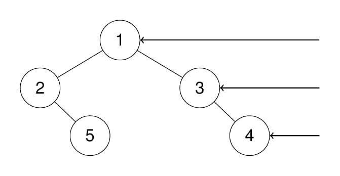
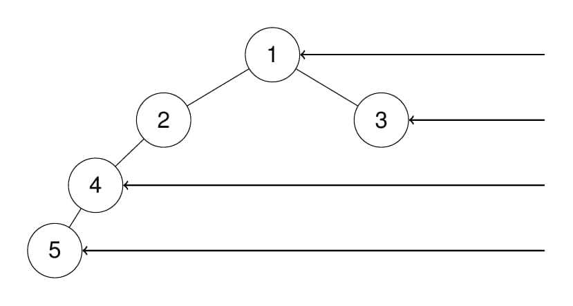

# 199. Binary Tree Right Side View

<p>Given the <code>root</code> of a binary tree, imagine yourself standing on the <strong>right side</strong> of it, return <em>the values of the nodes you can see ordered from top to bottom</em>.</p>

<p>&nbsp;</p>
<p><strong class="example">Example 1:</strong></p>

<div class="example-block">
<p><strong>Input:</strong> <span class="example-io">root = [1,2,3,null,5,null,4]</span></p>

<p><strong>Output:</strong> <span class="example-io">[1,3,4]</span></p>

<p><strong>Explanation:</strong></p>

<p></p>
</div>

<p><strong class="example">Example 2:</strong></p>

<div class="example-block">
<p><strong>Input:</strong> <span class="example-io">root = [1,2,3,4,null,null,null,5]</span></p>

<p><strong>Output:</strong> <span class="example-io">[1,3,4,5]</span></p>

<p><strong>Explanation:</strong></p>

<p></p>
</div>

<p><strong class="example">Example 3:</strong></p>

<div class="example-block">
<p><strong>Input:</strong> <span class="example-io">root = [1,null,3]</span></p>

<p><strong>Output:</strong> <span class="example-io">[1,3]</span></p>
</div>

<p><strong class="example">Example 4:</strong></p>

<div class="example-block">
<p><strong>Input:</strong> <span class="example-io">root = []</span></p>

<p><strong>Output:</strong> <span class="example-io">[]</span></p>
</div>

<p>&nbsp;</p>
<p><strong>Constraints:</strong></p>

<ul>
	<li>The number of nodes in the tree is in the range <code>[0, 100]</code>.</li>
	<li><code>-100 &lt;= Node.val &lt;= 100</code></li>
</ul>

---

# Solution

- [Breadth-First Search Approach: Two Queues](#breadth-first-search-approach-two-queues)


## **Problem Overview: Binary Tree Right Side View**

Given the `root` of a binary tree, imagine standing on the **right side** of the tree. From this perspective, only certain nodes are visible. Your task is to return the **values of the visible nodes**, ordered from **top to bottom**.

This is essentially asking for the **rightmost node at each depth level** of the tree.

## Key Idea

A binary tree can have multiple nodes at each depth, but when viewed from the right side, only the **last node** at each level is visible.

Two common strategies solve this:

### 1. Level-Order Traversal (BFS)
- Traverse the tree level by level.
- At each level, record the **last node** encountered.

### 2. Depth-First Search (DFS)
- Traverse the tree prioritizing the **right child first**.
- The first node visited at each depth is the visible one.

## Examples

### Example 1
**Input:**  
`root = [1,2,3,null,5,null,4]`

**Output:**  
`[1,3,4]`

This corresponds to the rightmost nodes at each level.

### Example 2
**Input:**  
`root = [1,2,3,4,null,null,null,5]`

**Output:**  
`[1,3,4,5]`

### Example 3
**Input:**  
`root = [1,null,3]`

**Output:**  
`[1,3]`

### Example 4
**Input:**  
`root = []`

**Output:**  
`[]`

## Constraints
- Number of nodes: `[0, 100]`
- Node values: `-100 <= Node.val <= 100`

# Breadth-First Search Approach: Two Queues

## **Intuition**

This method uses **two queues** to process the tree level by level.  
One queue holds all nodes of the **current level**, while the other collects nodes for the **next level**.

As we dequeue nodes from the current level, we enqueue their children into the next‑level queue.  
When the current level becomes empty, the **last node we processed** is exactly the node visible from the right side at that depth.

This works because BFS guarantees we process nodes left‑to‑right within each level, so the final node encountered is the rightmost one.

## **Algorithm**

1. Initialize an empty list `rightside` to store the right‑side view.

2. Create two queues:
   - `currLevel` — initially empty  
   - `nextLevel` — initially containing only `root` (if it exists)

3. While `nextLevel` is not empty:
   - Assign `currLevel = nextLevel` and reset `nextLevel` to empty.
   - While `currLevel` is not empty:
     - Dequeue a node `node` from `currLevel`.
     - Enqueue `node.left` and then `node.right` into `nextLevel` (if they exist).
   - After `currLevel` becomes empty, the last processed `node` is the rightmost node of this level. Append its value to `rightside`.

4. Return `rightside`.

### **Pseudocode**

```plaintext
function rightSideView(root):
  if root is null:
    return empty list

  rightside = empty list
  nextLevel = queue containing root

  while nextLevel is not empty:
    currLevel = nextLevel
    nextLevel = empty queue

    while currLevel is not empty:
      node = dequeue(currLevel)

      if node.left is not null:
        enqueue(nextLevel, node.left)

      if node.right is not null:
        enqueue(nextLevel, node.right)

    append node.value to rightside

```
