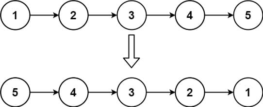
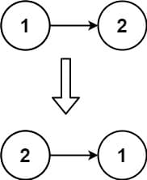

# 206. Reverse Linked List

<p>Given the <code>head</code> of a singly linked list, reverse the list, and return <em>the reversed list</em>.</p>

<p>&nbsp;</p>
<p><strong class="example">Example 1:</strong></p>

<pre><strong>Input:</strong> head = [1,2,3,4,5]
<strong>Output:</strong> [5,4,3,2,1]
</pre>

<p><strong class="example">Example 2:</strong></p>

<pre><strong>Input:</strong> head = [1,2]
<strong>Output:</strong> [2,1]
</pre>

<p><strong class="example">Example 3:</strong></p>

<pre><strong>Input:</strong> head = []
<strong>Output:</strong> []
</pre>

<p>&nbsp;</p>
<p><strong>Constraints:</strong></p>

<ul>
  <li>The number of nodes in the list is the range <code>[0, 5000]</code>.</li>
  <li><code>-5000 &lt;= Node.val &lt;= 5000</code></li>
</ul>

<p>&nbsp;</p>
<p><strong>Follow up:</strong> A linked list can be reversed either iteratively or recursively. Could you implement both?</p>


---

# Solution

- [Recursive Approach](#recursive-approach)
  - **Time Complexity**: `O(n)`
  - **Space Complexity**: `O(n)`
- [Iterative Approach](#iterative-approach)

---

## **Problem Overview: Reverse Linked List**

## Problem Statement
Given the `head` of a singly linked list, reverse the list and return the new head of the reversed list.

This task involves in-place manipulation of the list's pointers to reverse its order.

## Input
- A singly linked list represented by its head node.
- Each node contains:
  - An integer value: `Node.val`
  - A reference to the next node: `Node.next`

## Output
- The head node of the reversed list.

## Examples

| Input List        | Reversed Output |
|------------------|-----------------|
| [1, 2, 3, 4, 5]   | [5, 4, 3, 2, 1] |
| [1, 2]            | [2, 1]          |
| []                | []              |

## Constraints
- Number of nodes: `0 <= n <= 5000`
- Node values: `-5000 <= Node.val <= 5000`

## Follow-up Challenge
Implement two versions:
- Iterative reversal using pointer manipulation
- Recursive reversal using the call stack

## Tip
Redirect each node's `.next` pointer to reverse the chain, being mindful of edge cases like an empty list or a single node.

---

# Recursive Approach

## **Intuition**

The recursive strategy treats the problem as breaking down the list into smaller sublists. We recurse to the end of the list, then rewire the pointers on the way back. Each recursive call returns the reversed head of the sublist that starts at the next node, allowing the current node to link itself to the end of this reversed sublist.  
Think of it as a stack of deferred operations: we only start rewiring when we've hit the base case — an empty list or a single node.

## **Algorithm**

1. Base Case: If `head` is `null` or only one node, return `head` — nothing to reverse.
2. Recurse on `head.next` — get the reversed sublist starting from the next node.
3. After recursion, the `head.next` node is at the tail of the reversed sublist.
4. Set `head.next.next = head` to reverse the link.
5. Set `head.next = null` to break the old forward link.
6. Return the new head of the reversed list.

### **Pseudocode**

```plaintext
function reverseList(node):
 if node is null or node.next is null: return node

 reversedHead = reverseList(node.next)
 node.next.next = node
 node.next = null

return reversedHead
```

## **Implementation**

### Java

```java
class Solution {
  public ListNode reverseList(ListNode head) {
    // Base case: empty list or single node — already reversed
    if (head == null || head.next == null) {
      return head;
    }

    // Recurse on the rest of the list
    ListNode reversedHead = reverseList(head.next);

    // Make the following node point back to current head
    head.next.next = head;

    // Disconnect current head from the rest of the list
    head.next = null;

    // Return new head found at the tail of the original list
    return reversedHead;
  }
}
```

### TypeScript

```typescript
class ListNode {
  val: number;
  next: ListNode | null;

  constructor(val?: number, next?: ListNode | null) {
    this.val = val ?? 0;
    this.next = next ?? null;
  }
}

function reverseList(head: ListNode | null): ListNode | null {
  // Base case: empty list or single node — already reversed
  if (head === null || head.next === null) return head;

  // Recurse on the rest of the list
  const reversedHead = reverseList(head.next);

  // Make the following node point back to current head
  head.next.next = head;

  // Disconnect current head from the rest of the list
  head.next = null;

  // Return new head found at the tail of the original list
  return reversedHead;
};
```

## **Complexity Analysis**

### **Assumptions**
- Let `n` denote the total number of nodes in the linked list.
- Each node contains a single integer and a reference to the next node.
- The list is singly linked and non-cyclic.

### **Time Complexity**: `O(n)`
- **Traversal Cost**: Each node is visited once due to the recursive descent and pointer rewiring.
- **Per-Call Work**: Constant time operations are done during each recursive return phase.

### **Space Complexity**: `O(n)`
- **Call Stack Overhead**: The recursion depth is proportional to the list length, up to `O(n)` in the worst case.
- **Fixed Variable Usage**: A few pointers (e.g. `reversedHead`, `head`) are used per recursive frame and consume constant space.
- **No Extra Data Structures**: The list is modified in-place; no array or auxiliary container is used.
- **Linear-Space Usage**: While variable usage is constant, the **recursive call stack grows linearly** with the size of the list being reversed.

# Iterative Approach

## **Intuition**
The iterative technique reverses a singly linked list in-place by moving through the nodes one by one and adjusting their `next` pointers. Instead of relying on the call stack like recursion, it uses explicit pointer variables to track the current position and build the reversed list step-by-step.  
Think of it as repeatedly "cutting off" the head node and placing it in front of a new reversed chain that grows forward. As we traverse, each node's link direction is flipped to point to the already-processed portion of the list.

### **Edge Cases**
When implementing the iterative reversal, it's important to account for situations that might lead to incorrect pointer handling or unexpected behavior:

- **Empty List (`head == null`)**  
  No nodes to reverse — return `null` immediately. Ensures logic doesn't attempt to access nonexistent pointers.

- **Single Node List (`head.next == null`)**  
  Already reversed — return `head`. Prevents unnecessary processing and confirms pointer safety.

- **Two Nodes**  
  A minimal non-trivial case where reversal logic must properly swap links. Verifies the correctness of pointer transitions.

- **Long List**  
  Tests robustness and performance of pointer updates — especially important for validating linear time and space assumptions.

- **Cyclic Input (invalid case)**  
  If the list is cyclic, standard reversal logic may lead to infinite loops. Detection is outside scope, but worth noting as a misuse edge case.

- **Shared References Post-Reversal**  
  Ensure no nodes retain old `next` pointers to previous structure, avoiding dangling references or memory leaks in environments requiring manual cleanup.
