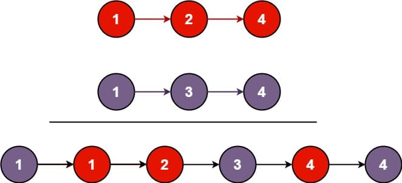

# 21. Merge Two Sorted Lists

<p>You are given the heads of two sorted linked lists <code>list1</code> and <code>list2</code>.</p>

<p>Merge the two lists into one <strong>sorted</strong> list. The list should be made by splicing together the nodes of the first two lists.</p>

<p>Return <em>the head of the merged linked list</em>.</p>

<p>&nbsp;</p>
<p><strong class="example">Example 1:</strong></p>

<pre><strong>Input:</strong> list1 = [1,2,4], list2 = [1,3,4]
<strong>Output:</strong> [1,1,2,3,4,4]
</pre>

<p><strong class="example">Example 2:</strong></p>

<pre><strong>Input:</strong> list1 = [], list2 = []
<strong>Output:</strong> []
</pre>

<p><strong class="example">Example 3:</strong></p>

<pre><strong>Input:</strong> list1 = [], list2 = [0]
<strong>Output:</strong> [0]
</pre>

<p>&nbsp;</p>
<p><strong>Constraints:</strong></p>

<ul>
  <li>The number of nodes in both lists is in the range <code>[0, 50]</code>.</li>
  <li><code>-100 &lt;= Node.val &lt;= 100</code></li>
  <li>Both <code>list1</code> and <code>list2</code> are sorted in <strong>non-decreasing</strong> order.</li>
</ul>

---

# Solution

- [Recursive Approach](#recursive-approach)

## **Problem Overview: Merge Two Sorted Lists**

This problem asks you to merge two **individually sorted** singly linked lists into a **single sorted** linked list. The merge must be done by **reusing the existing nodes**, not by creating new ones for each value. The result should preserve non‑decreasing order.

You are given:
- `list1`: head of the first sorted linked list  
- `list2`: head of the second sorted linked list  

Your task:
- Traverse both lists simultaneously  
- Select the smaller current node at each step  
- Splice nodes together to form one sorted output list  
- Return the head of the merged list  

This is structurally identical to the merge step of merge sort, but applied to linked lists instead of arrays.

### **Key Points**
- Both input lists are already sorted  
- You must merge them by pointer manipulation  
- The output must also be sorted  
- Either list may be empty  
- Values range from −100 to 100  
- Maximum combined length is 100 nodes  

### **Examples**
- Merging `[1,2,4]` and `[1,3,4]` produces `[1,1,2,3,4,4]`  
- Merging two empty lists yields an empty list  
- Merging `[]` and `[0]` yields `[0]`  

### **Why This Problem Matters**
This is one of the most fundamental linked‑list operations. It builds intuition for:
- Pointer manipulation  
- Dummy‑node patterns  
- Iterative vs. recursive list processing  
- Merge‑sort on linked lists  

# Recursive Approach

## **Intuition**

The recursive solution leans on a simple observation:  
At any point, the head of the merged list must be the **smaller** of the two current nodes from `list1` and `list2`.

So the recursion works by repeatedly:
- Comparing the heads of both lists  
- Choosing the smaller node as the head of the merged list  
- Recursively merging the *rest* of that list with the *other* list  

This naturally decomposes the problem into smaller subproblems until one list becomes empty.  
When that happens, the remaining nodes of the other list are already sorted, so we simply return that list.

The recursion mirrors the structure of the final merged list:  
each chosen node points to the result of merging the remaining nodes.

## **Algorithm**

1. **Handle the base cases**
   - If `list1` is empty (`null`), return `list2`  
     (because all remaining nodes in `list2` are already sorted)
   - If `list2` is empty (`null`), return `list1`  
     (same reasoning)

2. **Compare the current node values**
   - If `list1.val <= list2.val`:
     - The head of the merged list must be `list1`
   - Else:
     - The head of the merged list must be `list2`

3. **Recurse on the remainder of the lists**
   - If `list1` was chosen:
     - Set `list1.next = merge(list1.next, list2)`
     - Return `list1` as the head of the merged list
   - If `list2` was chosen:
     - Set `list2.next = merge(list1, list2.next)`
     - Return `list2` as the head of the merged list

4. **Allow recursion to build the final list**
   - Each recursive call returns the correct head for its subproblem
   - As the stack unwinds, each chosen node's `.next` pointer is already set
   - The final returned node from the top-level call is the head of the fully merged list

### **Pseudocode**

```text
function merge(list1, list2):
  if list1 is null:
    return list2

  if list2 is null:
    return list1

  if list1.val <= list2.val:
    list1.next = merge(list1.next, list2)
    return list1
  else:
    list2.next = merge(list1, list2.next)
    return list2
```

**Key behaviors:**
- Base cases handle exhaustion of either list  
- The smaller node becomes the head of the merged list  
- The `.next` pointer is assigned to the result of the recursive call  
- The recursion unwinds to produce the fully merged list  


