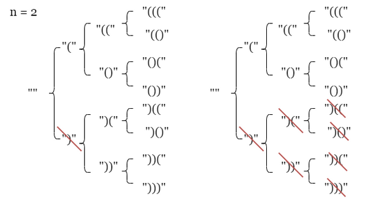
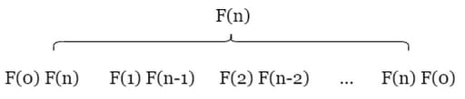
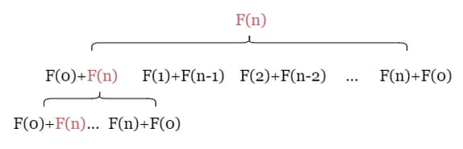
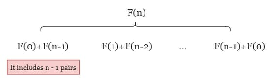
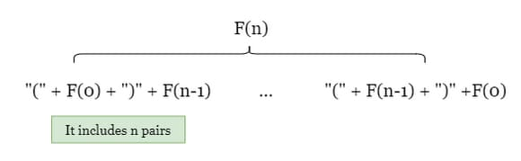
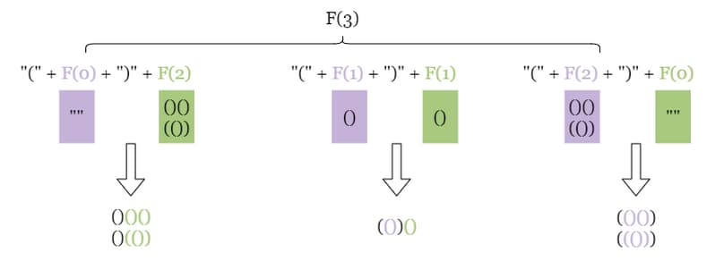

# 22. Generate Parentheses

<p>Given <code>n</code> pairs of parentheses, write a function to <em>generate all combinations of well-formed parentheses</em>.</p>

<p>&nbsp;</p>
<p><strong class="example">Example 1:</strong></p>
<pre><strong>Input:</strong> n = 3
<strong>Output:</strong> ["((()))","(()())","(())()","()(())","()()()"]
</pre><p><strong class="example">Example 2:</strong></p>
<pre><strong>Input:</strong> n = 1
<strong>Output:</strong> ["()"]
</pre>
<p>&nbsp;</p>
<p><strong>Constraints:</strong></p>

<ul>
	<li><code>1 &lt;= n &lt;= 8</code></li>
</ul>

<br>

---

# Solution

- [Backtracking Approach](#backtracking-approach)
  - **Time Complexity**: `O([4^n / sqrt(n)])`
- [Brute Force Naive Approach](#brute-force-naive-approach)
  - **Time Complexity**: `O(2^{2n} * n)`
- [Divide and Conquer Approach](#divide-and-conquer-approach)
  - **Time Complexity**: `O([4^n / sqrt(n)])`

# Backtracking Approach

Backtracking is a powerful algorithmic technique used to solve problems that involve searching through all possible configurations to find a solution.

Backtracking algorithms can often keep the space complexity linear with the input size.

### What is Backtracking?

Backtracking is a method for finding solutions to problems incrementally, one piece at a time, and removing those solutions that fail to satisfy the constraints of the problem at any point in time. It's often used for problems involving permutations, combinations, and other forms of exhaustive search.

### How Does Backtracking Work?

1. **Choose**: Select a starting point or an initial decision.
2. **Explore**: Move forward by making a choice and recursively explore further decisions.
3. **Check**: If the current path leads to a solution, record it. If not, backtrack by undoing the last choice and try another path.

## **Intuition**

### Naive Approach

The naive approach involves generating all possible strings of length `2n` and checking each one for validity. This method is simple but highly inefficient because it produces many invalid strings that need to be checked.

### Optimized Approach: Backtracking

A more efficient approach is to use backtracking to generate only valid strings. This method involves recursively building strings of length `2n` and ensuring their validity as we go. If a string becomes invalid at any point, we stop the recursive process on that path and backtrack to the previous valid state. This way, we focus only on generating valid strings, saving time and computational resources.

### Building the Backtracking Algorithm

As shown in the picture below: `)` is an invalid string, so every string prefixed with it is also invalid, and we can just drop it.



### Backtracking Function

To ensure that the current string is always valid during the backtracking process, we need two variables: `open_count` and `close_count`. These variables record the number of open and close parentheses in the current string, respectively.

We define our backtracking function as `backtracking(curr_string, open_count, close_count)`. This function takes the current string, the number of open parentheses, and the number of close parentheses as arguments. It builds valid combinations of parentheses of length `2n` recursively.

### Conditions for Adding Parentheses

The function adds more parentheses to `curr_string` only when certain conditions are met:

1. **Adding an Open Parenthesis**:
   - **Condition**: If `open_count < n`
   - **Action**: Add an open parenthesis to `curr_string`, creating a new string `new_string = curr_string + "("`, and then call `backtracking(new_string, open_count + 1, close_count)`.

2. **Adding a Close Parenthesis**:
   - **Condition**: If `open_count > close_count`
   - **Action**: Add a close parenthesis to `curr_string`, creating a new string `new_string = curr_string + ")"`, and then call `backtracking(new_string, open_count, close_count + 1)`.

### Ensuring Validity

This function ensures that the generated string of length `2n` is valid and adds it directly to the answer. By only generating valid strings, we can avoid wasting time checking invalid strings.

### Key Points

1. **Recursive Building**: We build the string recursively, adding one parenthesis at a time.
2. **Validity Check**: At each step, we check if the current string is valid.
3. **Backtracking**: If the string is invalid, we backtrack to the previous state and try a different path.
4. **Termination**: The recursion continues until we generate strings of length `2n`.

### Detailed Steps

1. **Base Case**: If the current string has `n` opening and `n` closing parentheses, it is valid and added to the result list.
2. **Add Opening Parenthesis**: If the number of opening parentheses is less than `n`, add an opening parenthesis and recurse.
3. **Add Closing Parenthesis**: If the number of closing parentheses is less than the number of opening parentheses, add a closing parenthesis and recurse.

## **Algorithm**

1. Initialize an empty list `result`

2. Define `backtrack(curr_string, open_count, close_count)` to generate valid strings recursively.

  -  If `len(curr_string) = 2n` , add it to `result` and return.

  - If `open_count < n` , add `(` to `curr_string` and move on to `backtrack(new_string, open_count + 1, close_count)`

  - If `open_count > close_count` , add `)` to curr_string and move on to `backtrack(new_string, open_count, close_count + 1)` .

3. Call `backtrack` on empty string ( `backtrack("", 0, 0)` ) and return `result` once the backtracking process is complete.

### Detailed Steps

1. **Initialize Result List**:
   - Create an empty list `result` to store the valid combinations of parentheses.

2. **Define Backtracking Function**:
   - Define a function `backtrack(result, current, open, close, max)` to generate valid strings recursively.

3. **Base Case**:
   - If the length of `current` is equal to `2 * max`, add `current` to `result` and return.

4. **Add Open Parenthesis**:
   - If `open < max`, add an open parenthesis `(` to `current` and call `backtrack` with updated counts: `backtrack(result, current + "(", open + 1, close, max)`.

5. **Add Close Parenthesis**:
   - If `close < open`, add a close parenthesis `)` to `current` and call `backtrack` with updated counts: `backtrack(result, current + ")", open, close + 1, max)`.

6. **Start Backtracking**:
   - Call `backtrack` with an empty string and initial counts: `backtrack(result, "", 0, 0, n)`.

7. **Return Result**:
   - Return the `result` list containing all valid combinations of parentheses.

## **Implementation**

### Java

```java
import java.util.ArrayList;
import java.util.List;

public class Solution {
  public List<String> generateParenthesis(int n) {
    List<String> result = new ArrayList<>();
    backtrack(result, "", 0, 0, n);
    return result;
  }

  private void backtrack(List<String> result, String current, int open, int close, int max) {
    if (current.length() == max * 2) {
      result.add(current);
      return;
    }

    if (open < max) {
      backtrack(result, current + "(", open + 1, close, max);
    }
    if (close < open) {
      backtrack(result, current + ")", open, close + 1, max);
    }
  }
}
```

**Note:** This implementation achieved a runtime of 1 ms, placing it in the top 32.38% of all solutions. In comparison, 13.44% of solutions had a runtime of 0 ms, and 38.94% of solutions had a runtime of 2 ms.

#### Optimization: Use StringBuilder

Using `StringBuilder` can improve the performance by reducing the number of string concatenations.

##### Explanation of Changes:

- **StringBuilder**: Replaced `String` with `StringBuilder` for the `current` parameter in the `backtrack` method to improve performance.
- **Appending and Deleting**: Used `append` to add parentheses and `deleteCharAt` to backtrack by removing the last character.

This implementation should be more efficient due to the reduced overhead of string concatenation:

```java
import java.util.ArrayList;
import java.util.List;

public class Solution {

  public List<String> generateParenthesis(int n) {
    List<String> result = new ArrayList<>();
    backtrack(result, new StringBuilder(), 0, 0, n);
    return result;
  }

  private void backtrack(List<String> result, StringBuilder current, int open, int close, int max) {
    if (current.length() == max * 2) {
      result.add(current.toString());
      return;
    }

    if (open < max) {
      current.append("(");
      backtrack(result, current, open + 1, close, max);
      current.deleteCharAt(current.length() - 1); // backtrack
    }

    if (close < open) {
      current.append(")");
      backtrack(result, current, open, close + 1, max);
      current.deleteCharAt(current.length() - 1); // backtrack
    }
  }
}
```

**Note:** This implementation achieved a runtime of 0.1 ms, placing it in the top 13.44% of all solutions. In comparison, 32.38% of solutions had a runtime of 1 ms, and 38.94% of solutions had a runtime of 2 ms.

## **Complexity Analysis**

### **Time Complexity**: `O([4^n / sqrt(n)])`

- **Brute Force Procedure**: The naive brute force approach of generating all possible parentheses has a time complexity of `O([4^n / n*sqrt(n)])`. This is because it generates all possible strings and then filters out the invalid ones. However, during the backtracking procedure, we only track valid prefixes, which significantly reduces the number of strings we need to consider.

- **Mutable Instance**: When considering each valid string, it is important to note that we use a mutable instance (e.g., `StringBuilder` in Java, `list` in Python). As a result, to add each instance of a valid string to `result`, we must first convert it to a string. This conversion process adds an additional factor of `n` to the time complexity.

### **Space Complexity**: `O(n)`

- **Recursion Call Stack**: The extra space used relative to the input size is the space occupied by the recursion call stack. The space complexity of a recursive call depends on the maximum depth of the recursive call stack, which is `2n`. Since each recursive call either adds a left parenthesis or a right parenthesis, the total number of parentheses is `2n`. Therefore, at most `O(n)` levels of recursion will be created, and each level consumes a constant amount of space.

# Brute Force (Naive Approach)

We can generate all possible strings of length `2n` and then verify their validity.

## **Intuition**

1. **Generate All Possible Strings**:
   - Use a queue to implement a breadth-first search (BFS) algorithm.
   - Start with an empty string and enqueue it.
   - For each string of length `i`, generate two new strings by appending either `(` or `)`.
   - Continue this process until the string length reaches `2n`.

2. **Validate Each String**:
   - A valid combination must have `n` left parentheses, each matched with a right parenthesis.
   - Track the number of unmatched left parentheses using a variable `open_count`.
   - Iterate through the string:
     - Increment `open_count` for each `(`.
     - Decrement `open_count` for each `)`.
     - Ensure `open_count` never goes negative (indicating an unmatched `)`).

3. **Final Check**:
   - After traversing the string, check if `open_count` is 0.
   - If it is, the string is valid; otherwise, it is not.

### **Example**

For `n = 3`, the valid combinations are:
- `((()))`
- `(()())`
- `(())()`
- `()(())`
- `()()()`

For `n = 1`, the valid combination is:
- `()`

## **Algorithm**

1. **Initialize Data Structures**:
   - Create a queue `queue` and enqueue an empty string `""`.
   - Create an empty array `result` to store all valid strings.

2. **Define Validation Function**:
   - Define a function `isValid(parenthesis)` to check if a given string of parentheses is valid:
     - Initialize `open_count` to 0.
     - Iterate over each character `p` in `parenthesis`:
       - Increment `open_count` by 1 if `p` is `(`.
       - Decrement `open_count` by 1 if `p` is `)`.
       - If `open_count` becomes negative, return `false`.
     - Return `true` if `open_count` is 0 after the iteration, otherwise return `false`.

3. **Generate and Validate Strings**:
   - While the queue is not empty:
     - Dequeue the front string `current`.
     - If the length of `current` is `2n`:
       - Check if `current` is valid using `isValid(current)`.
       - If valid, add `current` to `result`.
     - If the length of `current` is less than `2n`:
       - Enqueue two new strings formed by appending `(` and `)` to `current`.

4. **Return Result**:
   - Return the `result` array containing all valid strings.

## **Implementation**

### Java

```java
import java.util.ArrayList;
import java.util.LinkedList;
import java.util.List;
import java.util.Queue;

public class Solution {
  public List<String> generateParenthesis(int n) {
    List<String> result = new ArrayList<>();
    Queue<String> queue = new LinkedList<>();
    queue.add("");

    while (!queue.isEmpty()) {
      String current = queue.poll();
      if (current.length() == 2 * n) {
        if (isValid(current)) {
          result.add(current);
        }
      } else {
        queue.add(current + "(");
        queue.add(current + ")");
      }
    }

    return result;
  }

  private boolean isValid(String parenthesis) {
    int open_count = 0;
    for (char p : parenthesis.toCharArray()) {
      if (p == '(') {
        open_count++;
      } else {
        open_count--;
      }
      if (open_count < 0) {
        return false;
      }
    }
    return open_count == 0;
  }
}
```

Brute force implementation with comments:

```java
import java.util.ArrayList;
import java.util.LinkedList;
import java.util.List;
import java.util.Queue;

/**
 * Solution class to generate all combinations of well-formed parentheses.
 */
public class Solution {

  /**
   * Generates all combinations of well-formed parentheses for a given number of pairs.
   *
   * @param n the number of pairs of parentheses
   * @return a list of all valid combinations of well-formed parentheses
   */
  public List<String> generateParenthesis(int n) {
    // List to store the valid combinations
    List<String> result = new ArrayList<>();
    // Queue to facilitate BFS
    Queue<String> queue = new LinkedList<>();
    // Start with an empty string
    queue.add("");

    // Process the queue until it's empty
    while (!queue.isEmpty()) {
      // Dequeue the front string
      String current = queue.poll();
      // If the current string has reached the length of 2n
      if (current.length() == 2 * n) {
        // Check if the current string is a valid combination
        if (isValid(current)) {
          // Add the valid combination to the result list
          result.add(current);
        }
      } else {
        // Enqueue new strings by adding '(' and ')'
        queue.add(current + "(");
        queue.add(current + ")");
      }
    }

    // Return the list of valid combinations
    return result;
  }

  /**
   * Checks if a given string of parentheses is valid.
   *
   * @param parenthesis the string of parentheses to check
   * @return true if the string is a valid combination of well-formed parentheses, false otherwise
   */
  private boolean isValid(String parenthesis) {
    int open_count = 0;
    // Iterate through each character in the string
    for (char p : parenthesis.toCharArray()) {
      // Increment open_count for '('
      if (p == '(') {
        open_count++;
      } else {
        // Decrement open_count for ')'
        open_count--;
      }
      // If open_count is negative, the string is invalid
      if (open_count < 0) {
        return false;
      }
    }
    // The string is valid if open_count is zero at the end
    return open_count == 0;
  }
}
```

### TypeScript

```typescript
function generateParenthesis(n: number): string[] {
  const result: string[] = [];
  const queue: string[] = [""];
  
  while (queue.length > 0) {
    const current = queue.shift()!;
    if (current.length === 2 * n) {
      if (isValid(current)) {
        result.push(current);
      }
    } else {
      queue.push(current + "(");
      queue.push(current + ")");
    }
  }
  
  return result;
}

function isValid(parenthesis: string): boolean {
  let open_count = 0;
  for (const p of parenthesis) {
    if (p === '(') {
      open_count++;
    } else {
      open_count--;
    }
    if (open_count < 0) {
      return false;
    }
  }
  return open_count === 0;
}
```

#### Implementation Details

1. **Initialization**:
   - `result` is an array to store the valid combinations.
   - `queue` is an array used to facilitate the BFS, starting with an empty string.

2. **BFS Loop**:
   - While the queue is not empty, dequeue the front string `current`.
   - If `current` has reached the length `2n`, check its validity using `isValid`.
   - If valid, add `current` to `result`.
   - If `current` is shorter than `2n`, enqueue new strings formed by appending `(` and `)`.

3. **Validation Function**:
   - `isValid` checks if a given string of parentheses is valid by maintaining an `open_count`.
   - Increment `open_count` for each `(` and decrement for each `)`.
   - If `open_count` becomes negative, the string is invalid.
   - The string is valid if `open_count` is zero at the end.

## **Complexity Analysis**

### **Time Complexity**: \( O(2^{2n} \cdot n) \)

- **Brute Force Procedure**:
  - Generating all possible strings of length \( 2n \) involves \( 2^{2n} \) unique strings since each character can be either `(` or `)`.
  - For each string of length \( 2n \), we need to check its validity, which takes \( O(n) \) time.
  - Therefore, the total time complexity is \( O(2^{2n} \cdot n) \).

### **Space Complexity**: \( O(2^{2n} \cdot n) \)

- **Queue Storage**:
  - Before dequeuing the first string of length \( 2n \), the queue can store up to \( 2^{2n-1} \) strings of length \( 2n-1 \), each taking \( O(n) \) space.
  - Thus, the space complexity for the queue is \( O(2^{2n} \cdot n) \).

- **Result Storage**:
  - The result list stores all valid combinations, which corresponds to the \( n \)-th Catalan number.
  - The \( n \)-th Catalan number is asymptotically \( O(\frac{4^n}{\sqrt{n}}) \), which is bounded by \( O(\frac{4^n}{n \cdot \sqrt{n}}) \).

# Divide and Conquer Approach

## **Intuition**

The problem of generating all well-formed parentheses strings of length `2n` can be decomposed into smaller subproblems of generating valid strings of smaller lengths.

By leveraging the solutions to these subproblems, we can construct the solutions to the original problem. Let `F(n)` denote the set of all valid strings of length `2n`. We can construct the elements of `F(n)` as follows:

1. Concatenating a valid string of length `0`, generated by `F(0)`, with a valid string of length `2n`, generated by `F(n)`. We can represent this concatenation as `F(0)F(n)` for simplicity.
2. Concatenating a valid string of length `2` from `F(1)` with a valid string of length `2n - 2` from `F(n - 1)`, which is equivalent to `F(1)F(n - 1)`.
3. `F(2)F(n-2)`
4. `F(3)F(n-3)`
5. ...
6. `F(n-1)F(1)`
7. `F(n)F(0)`



However, this approach has a drawback as it involves repetitive calculations of `F(n)` instead of breaking down the original problem into smaller subproblems.



By removing the outermost parentheses from the left string, we can ensure that the maximum number of parentheses pairs in the subproblem is limited to `n - 1`. This strategy addresses the issue of redundant computation of the original problem.



The resulting subproblems, as illustrated, contain `n - 1` pairs of parentheses in total. Including the outermost pair of parentheses from the left string results in `n` pairs of parentheses, which matches the number of pairs required in the original problem.



Take a look at how valid strings of length `2n` are constructed in the following figure:



## **Algorithm**

1. **Base Case**:
    - If `n == 0`, return `[""]`.

2. **Initialize Result List**:
    - Create an empty list `result = new ArrayList<>()`.

3. **Iterate Over Possible Splits**:
    - Iterate over the number of parentheses pairs with a variable `open_count` from `0` to `n - 1`.

4. **Generate Left and Right Subproblems**:
    - For each `open_count`, iterate over each valid string `leftPart` from `generateParenthesis(open_count)`.
    - Iterate over each valid string `rightPart` from `generateParenthesis(n - open_count - 1)`.

5. **Construct Valid Strings**:
    - Construct a valid string of length `2n` by enclosing `leftPart` with a pair of parentheses `( + leftPart + )`, then concatenate it with `rightPart`, and add the resulting string to `result`.

6. **Return Result**:
    - Return `result` when the nested iterations are complete.

## **Implementation**

### Java

```java
import java.util.ArrayList;
import java.util.Arrays;
import java.util.List;

public class Solution2 {

  /**
   * Generates all combinations of well-formed parentheses using the
   * divide-and-conquer approach.
   *
   * @param n the number of pairs of parentheses
   * @return a list of all combinations of well-formed parentheses
   */
  public List<String> generateParenthesis(int n) {
    // Base case
    if (n == 0) {
      return new ArrayList<>(Arrays.asList(""));
    }

    List<String> result = new ArrayList<>();

    // Iterate over possible splits
    for (int open_count = 0; open_count < n; open_count++) {
      // Generate left and right subproblems
      for (String leftPart : generateParenthesis(open_count)) {
        for (String rightPart : generateParenthesis(n - open_count - 1)) {
          // Construct valid strings
          result.add("(" + leftPart + ")" + rightPart);
        }
      }
    }

    // Return result
    return result;
  }
}
```

#### **Explanation**

- **Base Case**: If `n == 0`, return a list containing an empty string using `return new ArrayList<>(Arrays.asList(""));`.
- **Initialize Result List**: Create an empty list to store the results.
- **Iterate Over Possible Splits**: Use a loop to iterate over possible splits of the parentheses pairs.
- **Generate Left and Right Subproblems**: For each split, recursively generate valid strings for the left and right subproblems.
- **Construct Valid Strings**: Combine the left and right strings with an enclosing pair of parentheses and add to the result list.
- **Return Result**: Return the list of valid strings after completing the iterations.

#### Note: Multi-line vs Single-line

Using `return new ArrayList<>(Arrays.asList(""));` is generally more efficient and concise. Here's why:

1. **Conciseness**: The single line `return new ArrayList<>(Arrays.asList(""));` is more concise and easier to read compared to the multi-line approach.

2. **Efficiency**: The `Arrays.asList` method creates a fixed-size list backed by the specified array, and then `new ArrayList<>(...)` creates a new `ArrayList` from this list. This is slightly more efficient than manually creating a list and adding an element to it.

Here's a comparison:

##### Multi-line Approach
```java
if (n == 0) {
    List<String> baseCase = new ArrayList<>();
    baseCase.add("");
    return baseCase;
}
```

##### Single-line Approach
```java
return new ArrayList<>(Arrays.asList(""));
```

- **Multi-line Approach**: 
  - Creates an empty `ArrayList`.
  - Adds an empty string to the list.
  - Returns the list.

- **Single-line Approach**:
  - Uses `Arrays.asList` to create a fixed-size list containing the empty string.
  - Wraps this list in a new `ArrayList` to allow modifications if needed.
  - Returns the list.

## **Complexity Analysis**

### **Time Complexity**: `O([4^n / sqrt(n)])`

- **Procedure**: We begin generating all valid parentheses strings of length `2`, `4`, ..., `2n`. The time complexity for generating all valid parentheses strings of length `2n` is given by the expression `O([4^n / sqrt(n)])`.
- **Dividing into Subproblems**: The divide and conquer approach splits the problem into smaller subproblems, each generating valid combinations for fewer pairs of parentheses. These subproblems are then combined to form the final result.
- **Limiting Redundant Computation**: By removing the outermost parentheses from the left subproblem, we can ensure that the maximum number of parentheses pairs in the subproblem is limited to `n-1`. This solves the issue of redundant computation/calculations of `F(n)`.

### **Space Complexity**: `O(n)`

- **Recursion Call Stack**: The space complexity would be the maximum depth of the recursion stack. At any given time, the recursive function call stack would contain at most `n` function calls.
- **Maximum Depth**: Therefore, at most `O(n)` levels of recursion will be created, and each level consumes a constant amount of space.

