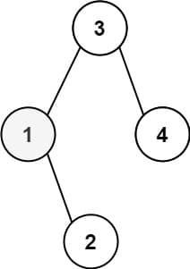
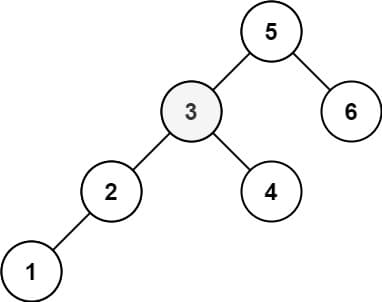

# 230. Kth Smallest Element in a BST

<p>Given the <code>root</code> of a binary search tree, and an integer <code>k</code>, return <em>the</em> <code>k<sup>th</sup></code> <em>smallest value (<strong>1-indexed</strong>) of all the values of the nodes in the tree</em>.</p>

<p>&nbsp;</p>
<p><strong class="example">Example 1:</strong></p>

<pre><strong>Input:</strong> root = [3,1,4,null,2], k = 1
<strong>Output:</strong> 1
</pre>

<p><strong class="example">Example 2:</strong></p>

<pre><strong>Input:</strong> root = [5,3,6,2,4,null,null,1], k = 3
<strong>Output:</strong> 3
</pre>

<p>&nbsp;</p>
<p><strong>Constraints:</strong></p>

<ul>
  <li>The number of nodes in the tree is <code>n</code>.</li>
  <li><code>1 &lt;= k &lt;= n &lt;= 10<sup>4</sup></code></li>
  <li><code>0 &lt;= Node.val &lt;= 10<sup>4</sup></code></li>
</ul>

<p>&nbsp;</p>
<p><strong>Follow up:</strong> If the BST is modified often (i.e., we can do insert and delete operations) and you need to find the kth smallest frequently, how would you optimize?</p>

---

# Solution

- [Recursive Inorder Traversal Approach](#recursive-inorder-traversal-approach)
  - **Time Complexity**: `O(n)`
  - **Space Complexity**: `O(h)`

# Problem Overview: Kth Smallest Element in a BST

## Description

Given the `root` of a Binary Search Tree (BST) and an integer `k`, the task is to return the `k`th smallest value (1-indexed) among all the node values in the tree.

A BST is a binary tree in which for every node:
- The left subtree contains only nodes with values less than the node’s value.
- The right subtree contains only nodes with values greater than the node’s value.

This property allows for efficient in-order traversal to retrieve sorted node values.

## Examples

### Example 1

**Input:**  
`root = [3,1,4,null,2]`, `k = 1`  
**Output:**  
`1`  

### Example 2

**Input:**  
`root = [5,3,6,2,4,null,null,1]`, `k = 3`  
**Output:**  
`3`  

## Constraints

- The number of nodes in the tree is `n`.
- \( 1 \leq k \leq n \leq 10^4 \)
- \( 0 \leq \text{Node.val} \leq 10^4 \)

## Follow-Up

If the BST is frequently modified (insertions and deletions), and you need to find the kth smallest element often, consider optimizing with one of the following strategies:

- **Augmented BST:** Store the size of each subtree at every node to allow O(log n) kth smallest queries.
- **Balanced BST with Order Statistics:** Use data structures like AVL trees or Red-Black trees augmented with subtree sizes.
- **Segment Trees or Binary Indexed Trees (Fenwick Trees):** Useful if values are bounded and frequency-based queries are needed.

# Recursive Inorder Traversal Approach

## **Intuition**

To find the kth smallest element in a Binary Search Tree (BST), we leverage the property that an inorder traversal of a BST yields node values in ascending order.

### Tree Traversal Strategies

There are two primary strategies to traverse a tree:

- **Depth-First Search (DFS)**  
  DFS explores as far as possible along each branch before backtracking. It includes three variants:
  - **Preorder**: Visit root → left → right
  - **Inorder**: Visit left → root → right
  - **Postorder**: Visit left → right → root

- **Breadth-First Search (BFS)**  
  BFS explores the tree level by level, visiting all nodes at the current depth before moving to the next.

### Why Inorder Works for BST

In a BST, an inorder traversal naturally visits nodes in ascending order. This means:

- If we perform a full inorder traversal, we get a sorted list of all node values.
- The kth smallest element is simply the (k - 1)th index of this list (since it's 0-indexed).

### Efficiency

- **Time Complexity**: O(N) in the worst case, where N is the number of nodes.
- **Space Complexity**: O(N) if we store the entire traversal; O(H) if we short-circuit after reaching the kth element, where H is the height of the tree.

This approach is simple, intuitive, and effective for static BSTs where frequent updates are not required.

## **Algorithm**

To find the kth smallest element in a BST using recursive inorder traversal:

1. Perform an inorder traversal of the BST.
2. Keep a counter to track how many nodes have been visited.
3. When the counter reaches `k`, record the current node's value as the result.
4. Use early termination to avoid unnecessary traversal once the kth element is found.

This approach leverages the BST property that inorder traversal yields sorted values.

### **Pseudocode**

```plaintext
function kthSmallest(root, k): 
  count = 0
  result = null

function inorder(node):
 if node is null or result is not null:
  return

 inorder(node.left)

 count += 1
 if count == k:
  result = node.value
  return

 inorder(node.right)

inorder(root)
return result
```

## **Implementation**

### Java

```java
class Solution {
    private int count = 0;
    private int result = -1;

    public int kthSmallest(TreeNode root, int k) {
        inorder(root, k);
        return result;
    }

    private void inorder(TreeNode node, int k) {
        if (node == null || result != -1) {
            return;
        }

        inorder(node.left, k);

        count++;
        if (count == k) {
            result = node.val;
            return;
        }

        inorder(node.right, k);
    }
}
```

### TypeScript

```typescript
function kthSmallest(root: TreeNode | null, k: number): number {
  let count = 0;
  let result = -1;

  function inorder(node: TreeNode | null): void {
    if (!node || result !== -1) return;

    inorder(node.left);

    count++;
    if (count === k) {
      result = node.val;
      return;
    }

    inorder(node.right);
  }

  inorder(root);
  return result;
}
```

## Complexity Analysis

### **Assumptions**

- The input is a valid Binary Search Tree (BST) with `n` nodes.
- The tree is not balanced, so the height can be up to `n` in the worst case.
- We use recursive inorder traversal and stop early once the kth smallest element is found.
- No auxiliary data structures (e.g., arrays or stacks) are used to store the traversal.

### **Time Complexity**: `O(n)`

- **Worst Case**, we may need to traverse all `n` nodes to reach the kth smallest element.
- For balanced trees or small `k`, early termination may reduce traversal time to `O(k)`.

### **Space Complexity**: `O(h)`

- **Call Stack Usage**: The recursion depth depends on the height `h` of the tree.
- **No Additional Structures**: Aside from the call stack, no extra memory is used.
- For a balanced BST, `h = O(log n)`; for a skewed tree, `h = O(n)`.
