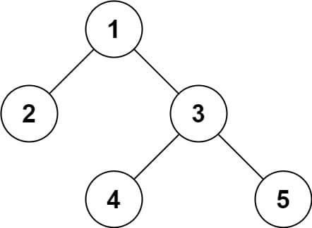

# 297. Serialize and Deserialize Binary Tree

<p>Serialization is the process of converting a data structure or object into a sequence of bits so that it can be stored in a file or memory buffer, or transmitted across a network connection link to be reconstructed later in the same or another computer environment.</p>

<p>Design an algorithm to serialize and deserialize a binary tree. There is no restriction on how your serialization/deserialization algorithm should work. You just need to ensure that a binary tree can be serialized to a string and this string can be deserialized to the original tree structure.</p>

<p><strong>Clarification:</strong> The input/output format is the same as how LeetCode serializes a binary tree (see below example). You do not necessarily need to follow this format, so please be creative and come up with different approaches yourself.</p>

<p>&nbsp;</p>
<p><strong class="example">Example 1:</strong></p>

<pre><strong>Input:</strong> root = [1,2,3,null,null,4,5]
<strong>Output:</strong> [1,2,3,null,null,4,5]
</pre>

<p><strong class="example">Example 2:</strong></p>

<pre><strong>Input:</strong> root = []
<strong>Output:</strong> []
</pre>

<p>&nbsp;</p>
<p><strong>Constraints:</strong></p>

<ul>
  <li>The number of nodes in the tree is in the range <code>[0, 10<sup>4</sup>]</code>.</li>
  <li><code>-1000 &lt;= Node.val &lt;= 1000</code></li>
</ul>

<strong>Serialized Format:</strong>
<ul style="padding-left: 0px; margin-top: 2px;">
<li>
<div>
<code>[1, null, 2, 3]</code> is <strong>not</strong> an array but a way to represent a binary tree in a printable format using <strong>level order traversal</strong>. In level order traversal, the tree is traversed level by level, from top to bottom and left to right.</div>
</li>
<li>
<div>The <code>null</code> value is used to indicate where a node is missing in the tree. It shows that there is no node present in that position, which helps you understand the overall shape of the tree, especially when some branches are incomplete.</div>
</li>
<li>
<div>
<code>[]</code> is not an empty array but represents an empty binary tree, where the root is a reference to <code>NULL</code> (C/C++), <code>null</code> (Java/C#/JavaScript), <code>None</code> (Python), or <code>nil</code> (Ruby).</div>
</li>
</ul>
<p><strong>Note:</strong> Always use the provided <code>TreeNode</code> class/type, and do not define it yourself.</p>

---

# Solution

- [Depth-First Search Approach](#depth-first-search-preorder-approach)
  - **Space Complexity**: `O(h)`

## **Serialization**  

Serialization of a binary tree is the process of encoding both its **values** and its **structure** into a linear representation. A correct serialization must preserve enough information to reconstruct the exact original tree during deserialization. Traversal order determines how this structural information is captured.

Two general traversal strategies exist for encoding a tree:

### Breadth‑First Search (BFS)  
BFS scans the tree level by level, from top to bottom.  
Nodes on higher levels are visited before nodes on lower levels.  
Null children must be explicitly recorded to preserve structure.

### Depth‑First Search (DFS)  
DFS prioritizes depth.  
Starting at the root, traversal proceeds down one branch to a leaf, then backtracks to explore other branches.

DFS can be performed in three classical orders:  
- Preorder (root, left, right)  
- Inorder (left, root, right)  
- Postorder (left, right, root)

For serialization, **preorder DFS** is typically the most suitable.  
Its traversal order naturally encodes parent‑child relationships, making it straightforward to reconstruct the tree during deserialization.

## **Definitions**

A **preorder traversal** visits the root first, then the left subtree, and finally the right subtree.

A **depth‑first search** explores a tree by following one path as deeply as possible before backtracking to explore the next path.

Together, a **DFS preorder traversal** provides a natural way to capture both the values and the structure of a tree, making it well‑suited for tasks such as copying or serializing trees.

**Serialization** is the process of converting a tree into a linear representation that records both its values and its structure.

**Deserialization** is the reverse process: reconstructing the original tree from its serialized representation.

**Tokens** are the individual units produced by splitting the serialized data, typically representing either a nodes value or a null marker.

A **Codec** is an abstraction that bundles the serialization and deserialization logic into a single interface, allowing a tree to be converted to a string and reconstructed from that string using a unified, consistent API.

## **Problem Overview: Serialize and Deserialize Binary Tree**

Serialization is the process of converting a data structure or object into a sequence of bits so that it can be stored in a file or memory buffer, or transmitted across a network connection link to be reconstructed later in the same or another computer environment.

Design an algorithm to serialize and deserialize a binary tree. There is no restriction on how your serialization/deserialization algorithm should work. You just need to ensure that a binary tree can be serialized to a string and this string can be deserialized to the original tree structure.

## Examples

* Example 1:

  ```
  Input: root = [1,2,3,null,null,4,5]
  Output: [1,2,3,null,null,4,5]
  ```

* Example 2:

  ```
  Input: root = []
  Output: []
  ```

## Constraints

Constraints:

  * The number of nodes in the tree is in the range [0, 104].
  * -1000 <= `Node.val` <= 1000

### Problem Essence  
You must design a reversible encoding for a binary tree. The serialized form must contain enough structure information to reconstruct the exact original tree, including null children. There is no required format; any representation is valid as long as serialization and deserialization are inverses.

Two broad strategies dominate:  
1. **Preorder DFS with null markers**  
2. **Level‑order BFS with null markers**

Both approaches rely on the same principle:  
A binary tree cannot be reconstructed from values alone; you must encode structure explicitly. Null placeholders are the simplest way to preserve shape.

### Key Requirements  
- Handle empty trees.  
- Support up to 10⁴ nodes efficiently.  
- Node values range from −1000 to 1000.  
- Output must be a string; input to deserializer is that same string.  
- The reconstructed tree must be structurally identical to the original.

### Why Null Markers Matter  
Consider the tree:

```
    1
   / \
  2   3
     / \
    4   5
```

If you only serialize values, you lose the fact that 2 has no children and 3 has two. Null markers preserve this:

```
1,2,null,null,3,4,null,null,5,null,null
```

This is a preorder DFS representation.

### Common Approaches

#### 1. DFS Preorder (Most Common)
Serialize using preorder traversal and append a sentinel (e.g., "#") for nulls.

Example serialized string:
```
1,2,#,#,3,4,#,#,5,#,#
```

Deserialization uses a pointer that consumes tokens in order and rebuilds the tree recursively.

Pros:  
- Very compact.  
- Easy to implement.  
- Deterministic reconstruction.

Cons:  
- Requires recursion or manual stack management.

# Depth-First Search Preorder Approach

## **Intuition**

Preorder DFS is well‑suited for serialization because it naturally exposes the parent‑child relationships in the exact order needed to reconstruct the tree. When you visit a node in preorder, you immediately know its value before exploring its children. By inserting explicit null markers for missing children, the traversal becomes a complete structural blueprint of the tree.

This works because preorder produces a deterministic sequence:  
1. Visit the root  
2. Serialize the left subtree  
3. Serialize the right subtree  

If a node is absent, the null marker ensures that the deserializer knows precisely where a subtree ends and where the next one begins. The sequence becomes a linearized version of the trees recursive structure. During deserialization, consuming tokens in the same order allows you to rebuild the tree exactly as it was.

The key insight is that preorder traversal, combined with null markers, forms a one‑to‑one mapping between the tree and the serialized string.

## **Algorithm**

#### Serialization

1. Begin at the root.  
2. If the node is non‑null, record its value.  
3. Recursively serialize the left subtree.  
4. Recursively serialize the right subtree.  
5. If the node is null, record a null marker instead.  
6. Join all recorded tokens into a single serialized string.

#### Deserialization

For deserialization:  
1. Split the serialized string into a list of tokens.  
2. Consume tokens from left to right.  
3. If the current token is a null marker, return null.  
4. Otherwise, create a node with that value.  
5. Recursively rebuild the left subtree.  
6. Recursively rebuild the right subtree.  
7. Return the constructed node as the subtree root.

This mirrors the preorder structure exactly, ensuring that serialization and deserialization are perfect inverses.

### **Pseudocode**

```txt
class Codec:
function serialize(node):
  if node is null:
    append NULL_MARKER to output
    return

  append node.value to output
  serialize(node.left)
  serialize(node.right)

function deserialize(tokens):
  if tokens is empty:
    return null

  token = next token from tokens

  if token is NULL_MARKER:
    return null

  node = new TreeNode(token)
  node.left = deserialize(tokens)
  node.right = deserialize(tokens)
  return node
```

#### Detailed Pseudocode

```java
public class Codec {

public function serialize(root) {
  String[] output = []
  serializeAux(root, output)
  return join output with commas
}

private function serializeAux(node, output) {
  if node is null:
    append NULL_MARKER to output
    return

   append node.value to output
   serializeAux(node.left)
   serializeAux(node.right)
}

public function deserialize(data) {
  String[] tokens = split data by commas
  return deserializeAux(tokens)
}

private function deserializeAux(tokens) {
  if tokens is empty:
    return null

  token = next token from tokens

  if token is NULL_MARKER:
    return null

  node = new TreeNode(token)
  node.left = deserializeAux(tokens)
  node.right = deserializeAux(tokens)
  return node
}

  public static void main(args[0]) {
    Codec ser = new Codec();
    Codec deser = new Codec();
    TreeNode ans = deser.deserialize(ser.serialize(root));
  }
}
```

## **Implementation**

### Java

```java
public class Codec {

  private static final String NULL_MARKER = "#";
  private static final String DELIM = ",";

  // Encodes a tree to a single string.
  public String serialize(TreeNode root) {
    StringBuilder sb = new StringBuilder();
    serializeAux(root, sb);
    return sb.toString();
  }

  private void serializeAux(TreeNode node, StringBuilder sb) {
    if (node == null) {
      sb.append(NULL_MARKER).append(DELIM);
      return;
    }

    sb.append(node.val).append(DELIM);
    serializeAux(node.left, sb);
    serializeAux(node.right, sb);
  }

  // Decodes your encoded data to tree.
  public TreeNode deserialize(String data) {
    String[] tokens = data.split(DELIM);
    int[] index = new int[1]; // acts as a mutable pointer
    return deserializeAux(tokens, index);
  }

  private TreeNode deserializeAux(String[] tokens, int[] index) {
    String token = tokens[index[0]];
    index[0]++;

    if (token.equals(NULL_MARKER)) {
      return null;
    }

    TreeNode node = new TreeNode(Integer.parseInt(token));
    node.left = deserializeAux(tokens, index);
    node.right = deserializeAux(tokens, index);
    return node;
  }
}
```

#### Implementation Details

##### 1. StringBuilder for efficient serialization  
Appending tokens directly avoids repeated string creation.

##### 2. Null marker and delimiter  
Using "#" and "," keeps the format simple and unambiguous.

##### 3. Mutable index for deserialization  
Java does not allow passing primitives by reference, so an array of size 1 is used to track the current position in the token list.

##### 4. Preorder structure  
The recursive calls mirror the exact preorder sequence used during serialization, ensuring a perfect inverse mapping.

### TypeScript

```typescript
const NULL_MARKER = "#";
const DELIM = ",";

/*
 * Encodes a tree to a single string.
 */
function serialize(root: TreeNode | null): string {
  const out: string[] = [];
  serializeAux(root, out);
  return out.join(DELIM);
}

function serializeAux(node: TreeNode | null, out: string[]): void {
  if (node === null) {
    out.push(NULL_MARKER);
    return;
  }

  out.push(String(node.val));
  serializeAux(node.left, out);
  serializeAux(node.right, out);
}

/*
 * Decodes your encoded data to tree.
 */
function deserialize(data: string): TreeNode | null {
  if (data.length === 0) return null;

  const tokens = data.split(DELIM);
  let index = 0;

  function build(): TreeNode | null {
    const token = tokens[index];
    index++;

    if (token === NULL_MARKER) {
      return null;
    }

    const node = new TreeNode(Number(token));
    node.left = build();
    node.right = build();
    return node;
  }

  return build();
}
```

#### Implementation Notes

##### 1. Token stream  
`serialize` produces a comma‑separated preorder sequence.  
`deserialize` consumes tokens in the same order.

##### 2. Null markers  
`#` is used to mark missing children. This ensures the structure is preserved.

##### 3. Mutable index  
Java used an array of size 1.  
TypeScript uses a closure over `index`, which is simpler and idiomatic.

##### 4. One‑to‑one mapping  
The preorder sequence with null markers uniquely identifies the tree, so reconstruction is exact.

## **Complexity Analysis**

### **Assumptions**
- The tree contains `n` nodes.  
- Each node has at most two children.  
- Serialization uses preorder DFS with a null marker for missing children.  
- Deserialization consumes the serialized token stream exactly once.  
- String splitting and joining are treated as linear operations in the size of the serialized output.

### **Space Complexity**: `O(n)`
- **Linear Output Size**: The serialized string contains one token per node plus one token per null child. A binary tree with `n` nodes has `n + 1` null children, so the output is `O(n)` in size.  
- **Call Stack Usage**: Preorder DFS recursion can reach a depth of `O(h)`, where `h` is the tree height. In the worst case (a skewed tree), `h = n`, giving `O(n)` stack usage.  
- **Token Array for Deserialization**: Splitting the serialized string produces an array of `O(n)` tokens, which dominates memory usage.  
