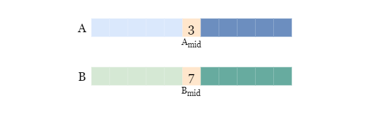

# Median of Two Sorted Arrays

Given two sorted arrays `nums1` and `nums2` of size `m` and `n` respectively, return **the median** of the two sorted arrays.

The overall run time complexity should be `O(log (m+n))`.

#### Example 1:

Input: nums1 = [1,3], nums2 = [2]

Output: 2.00000

Explanation: merged array = [1,2,3] and median is 2.

#### Example 2:

Input: nums1 = [1,2], nums2 = [3,4]

Output: 2.50000

Explanation: merged array = [1,2,3,4] and median is (2 + 3) / 2 = 2.5.

#### Constraints:

    nums1.length == m
    nums2.length == n
    0 <= m <= 1000
    0 <= n <= 1000
    1 <= m + n <= 2000
    -10^6 <= nums1[i], nums2[i] <= 10^6

# Solution

For this problem we will solve it with these approaches:
  - [**Merge Sort**](#merge-sort)
    - Time complexity: `O(m + n)`
  - [**Binary Search**](#binary-search-recursive)
    - Time complexity: `O(log(m * n))`

## Overview

In this problem, we are given two **sorted** arrays, `nums1` and `nums2`. We need to return the median of these two arrays.

We can glean additional information by looking at the expected run time: `O(log (m+n))`. This means our approach must be done by `log(m+n)` time, which strongly suggests that our approach should use a logarithmic algorithm.

 - Notice that merging two sorted arrays together in the worst case is `O(m+n)` which violates the constraint.

1. **What is a Logarithm?**
   - A logarithm is the power to which a base needs to be raised to reach a given number. For example, if a^c = b, then c is the logarithm of b to the base a.
   - Logarithms are commonly used in scientific formulae, such as pH measurements in chemistry and complexity analysis of algorithms.

2. **Logarithmic time complexity** is denoted as O(log n), where n represents the input size. It measures how the runtime of an algorithm scales as the input size increases.

3. **Examples of Logarithmic Algorithms:**
   - **Binary Search**: A classic example of O(log n) complexity. It efficiently finds an element in a sorted array by repeatedly dividing the search space in half.
   - **Merge Sort**: A sorting algorithm with O(n log n) complexity. It divides the array into smaller subarrays, sorts them, and then merges them back together.
   - **Heap Sort**: Another sorting algorithm with O(n log n) complexity. It uses a binary heap data structure to sort elements.

## Merge Sort

Assume we merged and sorted both arrays into array `A`, with a length of `n`, then the median is:
  - `A[n/2]`, if `n` is odd
  - The average of `A[n/2]` and `A[n/(2+1)]`, if `n` is even

However, there is no need to merge and sort the two arrays `nums1` and `nums2`.
  - Both arrays are **already sorted**
  - The smallest element is either the first element of `nums1` OR first element of `nums2`

Therefore, we can set two pointers `p1` and `p2` at the start of each array, then get the smallest element from them by comparing the values `nums[p1]` and `nums[p2]`.

### Algorithm

1. Get the total size of two arrays `m + n`
   - If `m + n` is odd, we are looking for the `(m + n) / 2`-th element.
   - If `m + n` is even, we are looking for the average of the `(m + n) / 2`-th and the `(m + n) / 2 + 1`-th elements.

2. Set two pointers `p1` and `p2` at the beginning of arrays `nums1` and `nums2`.

3. If both `p1` and `p2` are in bounds of the arrays, compare the values at `p1` and `p2`:
      - If `nums1[p1]` is smaller than `nums2[p2]`, we move `p1` one place to the right.
      - Otherwise, we move `p2` one place to the right.

    If `p1` is outside `nums1`, just move `p2` one place to the right.
    If `p2` is outside `nums2`, just move `p1` one place to the right.

4. Get the target elements and calculate the median:
      - If `m + n` is odd, repeat step 3 by `(m + n + 1) / 2` times and return the element from the last step.
      - If `m + n` is even, repeat step 3 by `(m + n) / 2 + 1` times and return the average of the elements from the last two steps.

### Complexity Analysis

Let `m` be the size of array `nums1` and `n` be the size of array `nums2`.

  - Time complexity: `O(m+n)`
    - We get the smallest element by comparing two values at `p1` and `p2`, it takes `O(1)` to compare two elements and move the corresponding pointer to the right.
    - We need to traverse half of the arrays before reaching the median element(s).
    - To sum up, the time complexity is `O(m+n)`.

  - Space complexity: `O(1)`
    - We only need to maintain two pointers `p1` and `p2`.

### Implementation

  - Note: When checking whether we have an even-lengthed array when combining the two sorted number arrays we can use the following conditionals:
    - `if (totalSize % 2 == 0)`
      - Easier to understand at a glance
    - `if (totalSize & 1) == 0)`
      - `&` bitwise AND operator checks the binary representations of `totalSize` and `1`
      - Checks if the least significant bit is `0`
        - If the result is `0`, it means `totalSize` is **even**
        - If the result is `1`, it means `totalSize` is **odd**
      - Performance-wise one of the fastest ways to check for evenness

#### Java

```java
class Solution {
  // Initialize two private pointers set to 0
  private int p1 = 0, p2 = 0;

  /**
   * Retrieves the next smallest value between two sorted number arrays and advances the pointers.
   *
   * @param nums1 First sorted number array.
   * @param nums2 Second sorted number array.
   * @return The smallest value between the two arrays.
   */
  private int getMin(int[] nums1, int[] nums2) {
    // If both arrays have elements remaining, compare and return the smaller value.
    if (p1 < nums1.length && p2 < nums2.length) {
      return nums1[p1] < nums2[p2] ? nums1[p1++] : nums2[p2++];
    } else if (p1 < nums1.length) {
      // If only nums1 has elements remaining, return the value from nums1.
      return nums1[p1++];
    } else if (p2 < nums2.length) {
      // If only nums2 has elements remaining, return the value from nums2.
      return nums2[p2++];
    }
    // If both arrays are exhausted, return -1
    return -1;
  }

  public double findMedianSortedArrays(int[] nums1, int[] nums2) {
    int totalSize = nums1.length + nums2.length;

    if ((totalSize & 1) == 0) {
      // Even-length case: Calculate the average of the two middle elements
      // Using 0-based indexing, the two middle elements are at indices
      // (totalSize / 2) - 1 and totalSize / 2.
      for (int i = 0; i < (totalSize / 2) - 1; i++){
        // Advance pointers by (totalSize / 2) - 1 to reach the two middle elements.
        int tmp = getMin(nums1, nums2);
      }
      // Return the average of the two middle elements
      return (double) (getMin(nums1, nums2) + getMin(nums1, nums2)) /2;
    } else {
      // Odd-length case: Return the exact middle element.
      for (int i = 0; i < totalSize / 2; i++) {
        // Advance pointers until we reach just before the middle element
        int tmp = getMin(nums1, nums2);
      }
      return getMin(nums1, nums2);
    }
  }
}
```

#### TypeScript

```typescript
function findMedianSortedArrays(nums1: number[], nums2: number[]): number {
  // Initialize two pointers set to 0
  let p1 = 0;
  let p2 = 0;

  const m = nums1.length,
        n = nums2.length;

  const totalSize = m + n;

  /**
   * Retrieves the next smallest value between two sorted number arrays and advances the pointers.
   *
   * @param nums1 First sorted number array.
   * @param nums2 Second sorted number array.
   * @returns The smallest value between the two arrays.
   */
  function getMin(nums1: number[], nums2: number[]): number {
    // If both arrays have elements remaining, compare and return the smaller value.
    if (p1 < m && p2 < n) {
      return nums1[p1] < nums2[p2] ? nums1[p1++] : nums2[p2++];
    } else if (p1 < m) {
      // If only nums1 has elements remaining, return the value from nums1.
      return nums1[p1++];
    } else if (p2 < n) {
      // If only nums2 has elements remaining, return the value from nums2.
      return nums2[p2++];
    }
    // If both arrays are exhausted, return -1.
    return -1;
  }

  if ((totalSize & 1) === 0) {
    // Even-length case: Calculate the average of the two middle elements.
    // Using 0-based indexing, the two middle elements are at indices
    // (totalSize / 2) - 1 and totalSize / 2.
    for (let i = 0; i < totalSize / 2 - 1; i++) {
      // Advance pointers by (totalSize / 2) - 1 to reach the two middle elements.
      getMin(nums1, nums2);
    }
    // Return the average of the two middle elements.
    return (getMin(nums1, nums2) + getMin(nums1, nums2)) / 2;
  } else {
    // Odd-length case: Return the exact middle element.
    for (let i = 0; i < Math.floor(totalSize / 2); i++) {
      // Advance pointers until we reach just before the middle element.
      getMin(nums1, nums2);
    }
    return getMin(nums1, nums2);
  }
}
```

## Binary Search, Recursive

<!-- TODO: Link to algorithm and Implementation here -->

### **Intuition**

1. **Problem Context:**
   - We are given two sorted arrays as input.
   - The problem requires finding the median of the combined (merged) array formed by these two arrays.

2. **Logarithmic Time Complexity:**
   - The problem statement emphasizes achieving a logarithmic time complexity.
   - Binary search is a promising approach because it typically operates in logarithmic time.

3. **Binary Search Overview:**
   - Binary search is a divide-and-conquer algorithm.
   - It works by repeatedly dividing the search space in half and narrowing down the search range.
   - It's commonly used for searching in sorted arrays.

4. **Steps of Regular Binary Search:**
   - Initialize pointers for the left and right boundaries of the search range.
   - While the left pointer is less than or equal to the right pointer:
     - Calculate the middle index.
     - Compare the middle element with the target value.
     - Adjust the search range based on the comparison result (move left or right).
   - Repeat until the target value is found or the search range is empty.

5. **Application to Median Problem:**
   - We can adapt binary search to find the correct position for the median in the merged array.
   - The median position depends on whether the total size of the merged array is even or odd.

#### **Binary Search Walkthrough**

Let's walkthrough a regular binary search to get inspiration to solve our problem.

Here we use binary search to find `target` in a sorted array `A`:

  - Locate the middle index (element) of `A`.

  - Compare the value of the middle element with `target`.

  - Reduce the search space by cutting the current array in half and discarding the half which is guaranteed not to contain `target`.

  - Repeat the above process until we either empty the array (move to half a the length of 0) or find `target`.


**Listing 4-1:** A binary search for `target = 26` in sorted array `A`.

- In Listing 4-1, we can see an array that contains `2` in `A[0]` and `50` in `A[15]`.
  - The first step is to look for `target`, `26`
  - Next compare the middle value of `A` with `26`
    - The middle value is `9`
  - Since `9 < 26`, we safely discard the left half of `A` 
    - because the array is sorted and the target `26` will not be found in the left half with **lesser** values.
  - Search for `26` in right half of `A`
  - Compare the middle value of `A*` (right half of A) with `26`
    - Middle value of `A*` is `18`
  - And so forth until target is found 
- `26` is located in `A[13]`

#### **Applying Binary Search to Median of Two Sorted Arrays**

At each step, the search space is cut in half, so we can quickly get the result. 

Now back to this problem where we have two sorted arrays. For the sake of convenience, let's call them `A` and `B`.


**Listing 4-2:** Two sorted arrays `A` and `B` divided into left, mid, and right sections.

Similarly, we can get and compare their middle values `A_mid` and `B_mid`. Without loss of generality in this example we assume `A_mid <= B_mid` initially, as shown in the yellow boxes.



**Listing 4-3:** Array `A` has `A_mid` value set to `3`. Array `B` has `B_mid` value set to 7.`

> For the rest of this article, we will use `≤` to represent the relative magnitude of values in arrays. 
  - e.g., `A_left ​≤ A_right​` means that every element in `A_left` is no larger than any element in `A_right`​.

We also 'compare' elements in an array with a single element similarly.
  - e.g., `A_left ≤ A_mid`​ means that every element in `A_left` is no larger than the element `A_mid​`.

This may not be the most standard way of expressing it, but is easy enough to understand.

##### **What does this comparison imply?**

It implies that we can compare sections of `A` and `B`.

Recall that both arrays are sorted, so we know that:

  - `A_left ≤ A_mid​`
  - `Bmid​ ≤ B_right`

Combine these observations with the comparison we just made:

  - `A_mid ​≤ Bmid​`

We have the following result:

  - `A_left ≤ A_mid​ ≤ Bmid ​≤ B_right`

Thus,

  - `A_left ≤ B_right`

As shown in the picture below:


**Listing 4-4:** `A_left <= A_mid (3) <= B_mid (7) <= B_right`

Since `A` is sorted, we know that `A_left ​≤ A_right​`.


**Listing 4-5:** `A_left <= A_mid (3) <= B_mid (7) <= B_right`. And `A_left <= A_mid (3) <= A_right`

Now we know that `A_left` is smaller than two halves: `A_right` and `B_right`. 

Although we still don't know where exactly these elements are, what we do know is `A_left` doesn't intersect with `A_right` + `B_right`! 

There is an invisible boundary between the `A_left` segment and the mixed segment `A_right` + `B_right`. 

As shown in the picture below, the dashed line divides all sorted elements into two halves.


**Listing 4-6:** The sorted array `A + B` with `A_left` first half, a dashed line in the middle, and `A_right, B_right` second half.

We can apply all the same logic to the mixed segment `A_left​` + `B_left​` and `B_right​`, which also do not intersect. You can try to prove it yourself as an exercise.


**Listing 4-7:** The sorted array `A + B` with `A_left, B_left` first half, a dashed line in the middle, and `B_right` second half.

#### **The following step is the most important one.**

Remember that we are looking for the median of `sorted A + B` which is one or two target values. 

We regard the index of the target value in the `sorted(A + B)` as `k`. For example:

  - If the lengths of `A` and `B` are `6` and `5`, the target index is `k = (6 + 5 + 1) / 2 = 6`, we shall **look for the 6th smallest element**.

  - If the lengths of `A` and `B` are `6` and `6`, the target indexes are `k = (6 + 6) / 2 = 6` and `k + 1 = 7`, we shall **look for the 6th and the 7th smallest elements**.

Depending on whether the **total number of elements is odd or even**, we need the `kth` (and maybe the `(k+1)th`) elements. What matters is that we set an index `k` at the beginning and we want to find the `kth` smallest element using the Binary Search-like algorithm discussed previously (for convenience, we will discuss only the `kth` element for now).

However, during the Binary Search-like algorithm, we keep removing one half of an array, so the index `k` might not stay unchanged. 

Suppose we removed `3` elements that are smaller than the original `kth` smallest element, we shall look for the `(k−3)th` smallest element from the **remaining** arrays.


**Listing 4-8:** Original arrays `A` and `B` go through the binary search-like algorithm to get arrays `modified A` and `B`.

In Listing 4-8, we perform the binary search-like algorithm:

- Two original arrays `A` and `B`
  - Original `A` has length `6`
  - Original `B` has length `5`
- `k = (6 + 5) / 2 = 5`
  - We are looking for the **5th** smallest element
- We remove the smaller half of `A`.
  - This removes first `3` elements of `A`
  - `Modified A` now has `3` elements remaining
- `k = 5 - 3 = 2`
  - Modified `A` has length `3`, array `B` has length `5`
  - We are looking for the **2nd** smallest element from the **remaining** arrays

##### **More specifically:**

If `k` is larger than half the total number of elements in `sorted(A + B)`, it means that the `kth` element is in the second (larger) half of `sorted(A + B)`, thus `A_left​` (or `B_left​`, the smaller of the two smaller sections according to the comparison) is guaranteed not to contain this element, and we can safely cut this half, and reduce `k` by the length of the removed half.

If `k` is not larger than half the total number of elements in `sorted(A + B)`, it means that the `kth` element is in the first (smaller) half of `sorted(A + B)`, thus `B_right​` (or `A_right​`, the larger of the two larger sections according to the comparison) is guaranteed not to contain this element, and we can safely discard it. 
  - **Note** that we don't need to modify `k` this time, since we removed one larger half that doesn't affect the order of the `kth` smallest element.

We can continue our search like above in the **remaining** arrays. The long arrow that starts from the bottom and points to the top-left indicates that we are repeating the process. Once we cut off part of either `A` or `B`, we regard the remaining arrays as modified `A` and `B` and restart this algorithm. 
  - **Note** that the following picture represents one case only: we consider the case that `a_value < b_value`, thus we remove either the smaller half of `A` or the larger half of `B`. If the comparison result is `a_value >= b_value`, we shall remove either the smaller half of `B` or the larger half of `A`.


**Listing 4-9:** Performing the entire binary-search-like algorithm to arrays `A` and `B` in a cycle. Search for `k-th` smallest number while considering two cases, each deciding and removing a certain half depending on the case. Repeat the process on remaining arrays.

In Listing 4-9, we start with original arrays `A` and `B` divided into three sections: left, mid, and right.
  - Then create the sorted `A + B` while dividing it into the same 3 sections

Remember that we are looking for the `kth` smallest number. 

Consider two cases:

  1. `k > len(A+B)/2`
  2. `k <= len(A+B)/2`

If `k > len(A+B)/2`, then

  - `kth` element is somewhere in the **right half.**
  - We can safely discard `A_left`
  - Remaining arrays are `A_right` and `B`

If `k <= len(A+B)/2`, then
  - `kth` element is somewhere in the **left half.**
  - We can safely discard `B_right`
  - Remaining arrays are `A` and `B_left`

Repeat the entire process on the remaining arrays.

That's it. We cut one of the two arrays in half at each step, so this approach has a **logarithmic time complexity** which we will discuss in detail later.

**One more thing!**

In the previous picture, we repeat all processes using the modified arrays, but this is just for the sake of understanding. We won't create copies of two arrays repeatedly, because that would introduce a linear time complexity at least. Instead, we just treat a part of the original array as the modified array for the next step, so that we can repeat the process on the original array without making any duplication. To do this, we need to maintain four pointers, two pointers for each array, e.g., `a_start` and `a_end` represent an inclusive range `[a_start, a_end]` of `A`.

### **Algorithm**

Let's define a function that helps us find the `kth` smallest element from two inclusive ranges `[a_start, a_end]` and `[b_start, b_end]` from arrays `A` and `B`.

1. If the range (for example, a range of `A`) is empty, in other words `a_start > a_end`, it means all elements in `A` are passed, we just return the `(k - a_start)`-th element from the other array `B`. Vice versa if `b_start > b_end`.

2. Otherwise, get the middle indexes of the two ranges: `a_index = (a_start + a_end) / 2`, `b_index = (b_start + b_end) / 2`.

3. Get the middle values of the two ranges: `a_value = A[a_index]`, `b_value = B[b_index]`.

4. Cut one array in half, according to:
  
    - If `a_index + b_index < k`, cut one smaller half.
      - If `a_value < b_value`, cut the smaller half of `A`.
      - Otherwise, cut the smaller half of `B`.
    - Otherwise, cut one larger half.
      - If `b_value < a_value`, cut the larger half of `B`.
      - Otherwise, cut the larger half of `A`.

5. Repeat step 1 using the new starting and ending indexes of `A` and `B`.

Then we move on to find the median elements, and get the length of both arrays `na = len(A)` and `nb = len(B)`.

  - If the total number of elements in `A` and `B` is odd, we just use the above function to find the middle element, that is `k = (na + nb) / 2`.

  - Otherwise, we use the function to find two middle elements: `k = [(na + nb) / 2] - 1` and `k = (na + nb) / 2`, and return their average.
