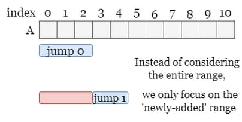
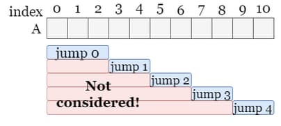

# 45. Jump Game II

You are given a <strong>0-indexed</strong> array of integers <code>nums</code> of length <code>n</code>. You are initially positioned at <code>nums[0]</code>.

Each element <code>nums[i]</code> represents the maximum length of a forward jump from index <code>i</code>. In other words, if you are at <code>nums[i]</code>, you can jump to any <code>nums[i + j]</code> where:

<ul>
  <li><code>0 &lt;= j &lt;= nums[i]</code> and</li>
  <li><code>i + j &lt; n</code></li>
</ul>

Return <em>the minimum number of jumps to reach </em><code>nums[n - 1]</code>. The test cases are generated such that you can reach <code>nums[n - 1]</code>.

&nbsp;

<strong class="example">Example 1:</strong>

<pre><strong>Input:</strong> nums = [2,3,1,1,4]
<strong>Output:</strong> 2
<strong>Explanation:</strong> The minimum number of jumps to reach the last index is 2. Jump 1 step from index 0 to 1, then 3 steps to the last index.
</pre>

<strong class="example">Example 2:</strong>

<pre><strong>Input:</strong> nums = [2,3,0,1,4]
<strong>Output:</strong> 2
</pre>

&nbsp;

<strong>Constraints:</strong>

<ul>
  <li><code>1 &lt;= nums.length &lt;= 104</code></li>
  <li><code>0 &lt;= nums[i] &lt;= 1000</code></li>
  <li>It's guaranteed that you can reach <code>nums[n - 1]</code>.</li>
</ul>

 

---

# Solution

- [Greedy Shrinking Approach](#greedy-approach)

### Problem Overview

You are given a 0-indexed array of integers `nums` of length `n`. You start at the first element `nums[0]`.

Each element `nums[i]` represents the maximum length of a forward jump from that index `i`. In other words, if you are at `nums[i]`, you can jump to any `nums[i + j]` where:
- \(0 \leq j \leq nums[i]\)
- \(i + j < n\)

Your goal is to return the minimum number of jumps required to reach the last element `nums[n - 1]`. The test cases are generated to ensure that it is possible to reach the last element.

#### Examples

**Example 1:**
- **Input:** `nums = [2, 3, 1, 1, 4]`
- **Output:** `2`
- **Explanation:** The minimum number of jumps to reach the last index is `2`. Jump `1` step from index `0` to `1`, then `3` steps to the last index.

**Example 2:**
- **Input:** `nums = [2, 3, 0, 1, 4]`
- **Output:** `2`
- **Explanation:** The minimum number of jumps to reach the last index is `2`.

#### Constraints
- \(1 \leq nums.length \leq 10^4\)
- \(0 \leq nums[i] \leq 1000\)
- It's guaranteed that you can reach `nums[n - 1]`.

### Solution Approach

To solve this problem, you can use a greedy algorithm that keeps track of the furthest point you can reach with a given number of jumps. Here's a step-by-step explanation:

1. Initialize variables to track the current end of the jump, the furthest point you can reach, and the number of jumps.
2. Traverse the array, updating the furthest point you can reach.
3. When you reach the end of the current jump, increment the number of jumps and update the current end to the furthest point.
4. Continue this process until you reach the last element.

# Greedy Approach

## **Intuition**

### **Jump Analysis**

- Consider being at index `i` where `nums[i] = 3`. From here, you can jump to any of the next three indices.
- The values at these destinations might be `3`, `5`, and `2`, covering possible reachable indices.
- All the indices covered by these ranges are the **reachable indices** after this jump

### **Range of Reach**

- For the next jump from `i + 1`, the starting indices are the reachable indices from the current jump `i`.
- This pattern continues, expanding the range of indices you can reach with each successive jump.

### **Time Complexity**

- Since reaching the last index is guaranteed, each jump's range is larger than the previous one.
- In the worst case (where `n` is the length of `nums`), we might have `n` jumps and `O(n^2)` total updates.
- Given the input array's maximum size, an approach with `O(n^2)` complexity might be inefficient.

### **Optimizing with a Greedy Approach**

- We aim to minimize the number of jumps to reach the end by considering only necessary updates.
- From the first jump at index `0`, suppose it covers indices `[0, 2]`.
- For the next jump, instead of considering the entire range `[0, 2]` again, we only consider the furthest reachable indices.
- So the valid range of reachable indices for jump `1` is `[3, 4]` instead of `[0, 4]`.

### **Efficient Range Consideration**

- To minimize jumps, we should only consider the range `[3, 4]` for the next jump.
- If we can reach an index using `j` jumps, we ignore any methods requiring more than `j` jumps.
- This ensures we avoid unnecessary updates.

### **Auxiliary Marks**

We need two auxiliary marks to help delimit ranges and to avoid repeated visits to the same range:

- **end**: The furthest starting index of the current jump.
- **far**: The furthest reachable index of the current jump.

### **Jump Execution**

- Once we finish iterating over the current jump range (reaching `end`), we update the range to `[end + 1, far]`.
- We skip overlapping ranges using the greedy approach.

![Once finished iterating over range of current jump (reach `end`), next step is to continue iterating over reachable indices that are **larger** than `end`, represented by the range `[end + 1, far]`. The overlapped range (marked in red) is skipped using the greedy aproach](img/45-6.jpg)

### **Summary**

- Each jump ends at `end`.
- During the jump, we find the farthest reachable index `far`.
- At the end of each jump, we increment the jump count and set `end = far` for the next jump.

This approach ensures that we reach the last cell using the least number of jumps efficiently.

## **Algorithm**

1. **Initialize Variables**:
   - `curEnd = 0`: The end of the range for the current jump.
   - `curFar = 0`: The farthest index we can reach from the current range.
   - `answer = 0`: The number of jumps needed.

2. **Iterate through the array**:
   - For each index `i` in `nums`, update the farthest reach: `curFar = max(curFar, i + nums[i])`.
   - If `i` reaches `curEnd` (i.e., we've finished the current jump range):
     - Increment the number of jumps: `answer += 1`.
     - Update `curEnd` to the farthest reach: `curEnd = curFar`.

3. **Repeat** the process until you reach the last index of the array.

By following this algorithm, you ensure that you always take the minimum number of jumps necessary to reach the end of the array.
