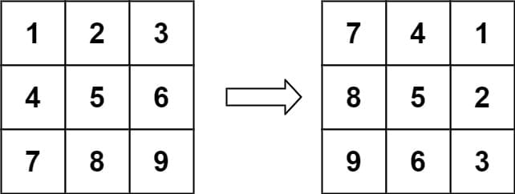
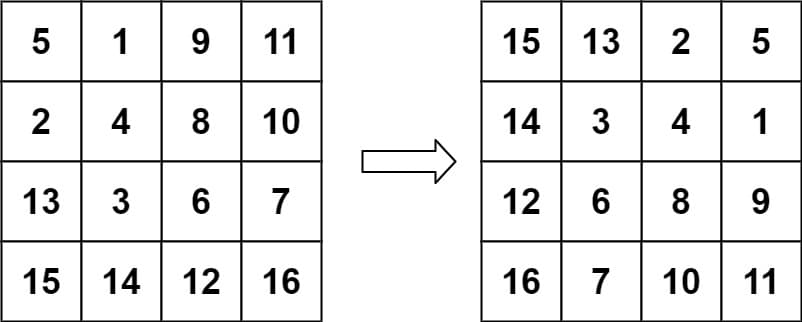

# 48. Rotate Image

<p>You are given an <code>n x n</code> 2D <code>matrix</code> representing an image, rotate the image by <strong>90</strong> degrees (clockwise).</p>

<p>You have to rotate the image <a href="https://en.wikipedia.org/wiki/In-place_algorithm" target="_blank"><strong>in-place</strong></a>, which means you have to modify the input 2D matrix directly. <strong>DO NOT</strong> allocate another 2D matrix and do the rotation.</p>

<p>&nbsp;</p>
<p><strong class="example">Example 1:</strong></p>

<pre><strong>Input:</strong> matrix = [[1,2,3],[4,5,6],[7,8,9]]
<strong>Output:</strong> [[7,4,1],[8,5,2],[9,6,3]]
</pre>

<p><strong class="example">Example 2:</strong></p>

<pre><strong>Input:</strong> matrix = [[5,1,9,11],[2,4,8,10],[13,3,6,7],[15,14,12,16]]
<strong>Output:</strong> [[15,13,2,5],[14,3,4,1],[12,6,8,9],[16,7,10,11]]
</pre>

<p>&nbsp;</p>
<p><strong>Constraints:</strong></p>

<ul>
	<li><code>n == matrix.length == matrix[i].length</code></li>
	<li><code>1 &lt;= n &lt;= 20</code></li>
	<li><code>-1000 &lt;= matrix[i][j] &lt;= 1000</code></li>
</ul>

<br>

---

# Solution
- [Transpose and Reflect Approach](#transpose-and-reflect-approach)
  - **Time Complexity**: `O(N^2)`

# Transpose and Reflect Approach

## **Intuition**

### **Cell Movements**
To rotate an n x n matrix by 90 degrees clockwise, observe how each element's position changes:
- The element in the top left moves to the top right.
- The element in the top right moves to the bottom right.
- The element in the bottom right moves to the bottom left.
- The element in the bottom left moves to the top left.

The key idea is to handle these movements in groups of four cells, so each cell is rotated to its new position in one pass, modifying the matrix in place.

### **Elegant Solution**
The most elegant solution for rotating the matrix is to:
1. **Transpose the Matrix**: Reverse the matrix around the main diagonal.
2. **Reflect the Matrix**: Reverse it from left to right.

These operations are called **transpose** and **reflect** in linear algebra.

### **Advantages**
This approach does twice as many reads and writes compared to the approach of rotating groups of four cells. However, many consider this the better approach because:
- The code is simpler.
- It is built with standard matrix operations that can be found in any matrix library.

## **Algorithm**

1. **Transpose the Matrix**:
   - Convert all rows into columns. For example, the first row becomes the first column, the second row becomes the second column, and so on.

2. **Reverse Each Row**:
   - Reverse the elements in each row of the transposed matrix to achieve the 90-degree rotation.

## **Detailed Steps**

1. **Transpose the Matrix**:
   - Loop through the matrix elements where `i` is the row index and `j` is the column index.
   - Swap the element at `[i][j]` with the element at `[j][i]`.

2. **Reverse Each Row**:
   - Loop through each row and reverse its elements.

### Pseudocode

```plaintext
function rotate(matrix):
    n = matrix.length
    
    // Transpose the matrix
    for i from 0 to n-1:
        for j from i to n-1:
            swap(matrix[i][j], matrix[j][i])
    
    // Reverse each row
    for i from 0 to n-1:
        reverse(matrix[i])
```
