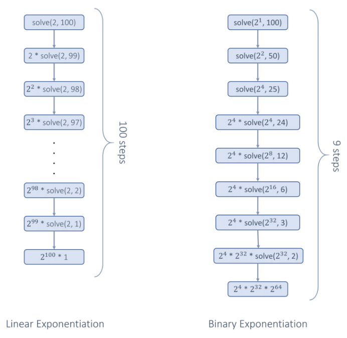

# 50. Pow(x, n)

<p>Implement <a href="http://www.cplusplus.com/reference/valarray/pow/" target="_blank">pow(x, n)</a>, which calculates <code>x</code> raised to the power <code>n</code> (i.e., <code>x<sup>n</sup></code>).</p>

<p>&nbsp;</p>
<p><strong class="example">Example 1:</strong></p>

<pre><strong>Input:</strong> x = 2.00000, n = 10
<strong>Output:</strong> 1024.00000
</pre>

<p><strong class="example">Example 2:</strong></p>

<pre><strong>Input:</strong> x = 2.10000, n = 3
<strong>Output:</strong> 9.26100
</pre>

<p><strong class="example">Example 3:</strong></p>

<pre><strong>Input:</strong> x = 2.00000, n = -2
<strong>Output:</strong> 0.25000
<strong>Explanation:</strong> 2<sup>-2</sup> = 1/2<sup>2</sup> = 1/4 = 0.25
</pre>

<p>&nbsp;</p>
<p><strong>Constraints:</strong></p>

<ul>
	<li><code>-100.0 &lt; x &lt; 100.0</code></li>
	<li><code>-2<sup>31</sup> &lt;= n &lt;= 2<sup>31</sup>-1</code></li>
	<li><code>n</code> is an integer.</li>
	<li>Either <code>x</code> is not zero or <code>n &gt; 0</code>.</li>
	<li><code>-10<sup>4</sup> &lt;= x<sup>n</sup> &lt;= 10<sup>4</sup></code></li>
</ul>

<br>

---

# Solution
- [Recursive Binary Exponentiation](#recursive-binary-exponentiation)
  - **Time Complexity**: `O(log n)`
- [Iterative Binary Exponentiation]()
  - **Time Complexity**: `O(log n)`

# Recursive Binary Exponentiation

## **Intuition**

We know `x^n` means we multiply a with itself n-times. The most naïve way to solve this problem is to simply multiply a `n`-times. This method of multiplying will lead to a linear time complexity and is not efficient, but we will discuss a bit about it as it will be a stepping stone to our optimized approach.

### Brute-force approach

The current problem can be broken into smaller similar subproblems, `x^n = x * x^n-1`. Thus, this gives us our recurrence relation.

We can write a recursive function here that calculates the result of the smaller similar sub-problem and using that calculates the result for the current problem, `pow(x, n) = x * pow(x, n - 1)` . And we know if `n = 0` then `x^n` will always be `1`, this will be our base case to stop the recursive calls.

Also, we need to handle the case if `n` is negative. In that case, the answer will be the reciprocal of the result if `n` were positive: \[ x^n = \frac{1}{x^{-n}}, \text{ where } n < 0 \]

Now that we have an idea of all cases, lets create the pseudocode:

### Pseudo Code for Recursive Function

```Pseudo
func pow(x, n):
  if n == 0: return 1
  if n < 0; return 1 / pow(x, -n)
  return x * pow(x, n-1)
```

### Optimized Approach

Binary exponentiation, also known as exponentiation by squaring, is a technique for efficiently computing the power of a number. By repeatedly squaring `x` and halving `n`, we can quickly compute `x^n` using a logarithmic number of multiplications.

The basic idea here is to use the fact that `x^n` can be expressed as:

 - `(x^2)^(n/2)` if `n` is **even**
 - `x*(x^2)^((n/2)/2)` if `n` is **odd** (we separate out one `x`, then `n-1` will become even)

This method might not seem intuitive, so let's try to understand it with the help of some examples.

### Example of Recursive Binary Exponentiation

Say, we need to find `2^100`

Using the previously discussed recursive approach we will have to multiply `2` in `100` steps.

```text
2^100 = 2 * 2^99
2 * 2^99 = 2 * 2 * 2^98
2 * 2 * 2^98 = 2 * 2 * 2 * 2^97
.
.
.
(100 steps)
.
.
.
2^100 = 2 * 2 * ... * (100 multiplications) * ... * 2^0
2^100 = 1,267,650,600,228,229,401,496,703,205,376
```

But using binary exponentiation, it will be reduced to just about `10` steps.

```text
2^100=(2*2)^50

4^50 = (4* 4)^25

16^25 =16*(16)^24

16^25=16*(16*16)^12

16*256^12=16*(256*256)^6

16*65536^6 =16*(65536 * 65536)^3

16*4294967296^3 = 16 * 4294967296 * (4294967296)^2

16*4294967296^3 = 16 * 4294967296 * (4294967296 * 4294967296)^1

2^100 = 1267650600228229401496703205376
```

Instead of reducing the exponent `n` by `1` at each recursive call like in the brute-force method, we will reduce it by half here. Thus, instead of linear steps, it will take us logarithmic steps to perform all the multiplications.



### Pseudo Code for Optimized Recursive Function

Thus, now our optimized recursive function will be:

```Pseudo
func binaryExp(x, n):
  if n == 0: return 1.0
  if n < 0; return 1.0 / binaryExp(x, -n)

  // Binary Exponentiation steps
  if n is odd: return x * binaryExp(x * x, (n-1) / 2)
  otherwise: return binaryExp(x * x, n / 2)
```

## **Algorithm**

1. **Create a method `binaryExp`**:
   - **If `n` is `0`**: Return `1`.
   - **If `n` is negative**: Calculate the result as if `n` were positive and return the reciprocal. Thus, return `1 / binaryExp(x, -n)`. (Note: `-n` can exceed the integer range, so `n` should be a 64-bit integer.)
   - **Otherwise**: Use binary exponentiation to reduce `n` by half. Compute and return the result after solving the sub-problem recursively.

2. **Call `binaryExp(x, n)`** method and return the result.

## **Implementation**

### Java

```java
public class Solution {
  public double binaryExp(double x, long n) {
    // Base case to stop recursive calls.
    if (n == 0) {
      return 1;
    }

    // Handle case where n < 0.
    if (n < 0) {
      return 1.0 / binaryExp(x, -n);
    }

    // Perform Binary Exponentiation.
    // If 'n' is odd, perform Binary Exponentiation on 'n - 1' and multiply result
    // with 'x'.
    if (n % 2 == 1) {
      return x * binaryExp(x * x, (n - 1) / 2);
    } else {
      // Otherwise calculate result by performing Binary Exponentiation on 'n'.
      return binaryExp(x * x, n / 2);
    }
  }

  public double myPow(double x, int n) {
    return binaryExp(x, (long) n);
  }
}
```

### TypeScript

```typescript
/**
 * Computes x raised to the power n using recursive binary exponentiation.
 *
 * @param {number} x - The base number.
 * @param {number} n - The exponent.
 * @returns {number} - The result of x raised to the power n.
 */
function myPow(x: number, n: number): number {
  /**
   * Helper function for recursive binary exponentiation.
   *
   * @param {number} x - The base number.
   * @param {number} n - The exponent.
   * @returns {number} - The result of x raised to the power n.
   */
  function binaryExp(x: number, n: number): number {
    // Base case to stop recursive calls.
    if (n === 0) {
      return 1;
    }

    // Handle case where n < 0.
    if (n < 0) {
      return 1.0 / binaryExp(x, -n);
    }

    // Perform Binary Exponentiation.
    // If 'n' is odd, perform Binary Exponentiation on 'n - 1' and multiply result with 'x'.
    if (n % 2 === 1) {
      return x * binaryExp(x * x, Math.floor((n - 1) / 2));
    } else {
      // Otherwise calculate result by performing Binary Exponentiation on 'n'.
      return binaryExp(x * x, Math.floor(n / 2));
    }
  }

  return binaryExp(x, n);
}
```

## **Complexity Analysis**

### **Time Complexity**: `O(log n)`

- **Constant Time Operation**: Multiplication of two numbers is considered a constant time operation.
- **Recursion Procedure**: At each recursive call, we reduce `n` by half, so we will make only `log n` number of calls for the `binaryExp` function.
- **Overall Complexity**: Thus, it will take overall `O(log n)` time.

### **Space Complexity**: `O(log n)`

- **Recursion Call Stack**: The recursive stack can use at most `O(log n)` space at any time.

# Iterative Binary Exponentiation

## **Intuition**

We can convert the recursive binary exponentiation approach to an iterative one using loops:

- **While Loop**: We'll use a while loop that continues until `n` reaches `0`.
  - **Odd `n`**: If `n` is odd, we multiply `x` once with the `result`, reducing `n` by `1` to make it even.
  - **Even `n`**: When `n` is even, we square `x` and reduce `n` by half, transforming `x^n` into `(x^2)^{n/2}`.

- **Handling Negative `n`**: If `n < 0`, we need to find `1 / (x^{-n})`. In this case, we multiply `1/x` with itself, not `x`.

This iterative approach mirrors the recursive strategy but uses loops to avoid stack overflow issues and can be more efficient in terms of space complexity.

## **Algorithm**

1. **Create a method `binaryExp`**:
   - **Parameters**: `x` and `n`
   - **Base Case**: If `n` is `0`, return `1`
   - **Negative `n`**: 
     - Change `n` to `-n`
     - Change `x` to `1 / x` 
     - Ensure `n` is a 64-bit integer to handle range overflow
   - **Initialize `result`**: Set `result` to `1` to store the result of multiplications
   - **While Loop**: Continue until `n` becomes `0`:
     - **Odd `n`**: If `n` is odd, multiply `result` by `x` and reduce `n` by `1`
     - **Even `n`**: Square `x` and reduce `n` by half
   - **Return `result`**: Return the final `result`

2. **Call `binaryExp(x, n)`**: Invoke the method and return its result.

## **Implementation**

### Java

```java
public class Solution {
  public double binaryExp(double x, long n) {
    if (n == 0) {
      return 1;
    }

    // Handle case where n < 0.
    if (n < 0) {
      n = -n;
      x = 1.0 / x;
    }

    // Perform Binary Exponentiation.
    double result = 1;
    while (n > 0) {
      // If 'n' is odd we multiply result with 'x' and reduce 'n' by '1'.
      if (n % 2 == 1) {
        result = result * x;
        n -= 1;
      }
      // We square 'x' and reduce 'n' by half, x^n => (x^2)^(n/2).
      x = x * x;
      n = n / 2;
    }

    return result;
  }

  public double myPow(double x, int n) {
    return binaryExp(x, (long) n);
  }
}
```

## **Complexity Analysis**

### **Time Complexity**: `O(log n)`

- **Constant-Time Multiplication**: Multiplication of two numbers is considered a constant-time operation.
- **Iteration Reduction**: At each iteration, `n` is halved, resulting in only `log n` iterations within the while loop.
- **Overall Complexity**: The overall time complexity is `O(log n)`.

### **Space Complexity**: `O(1)`

- **Constant Space Usage**: The algorithm does not use additional space beyond the storage for the `result`.
