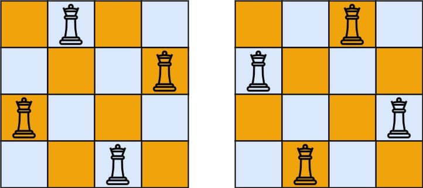
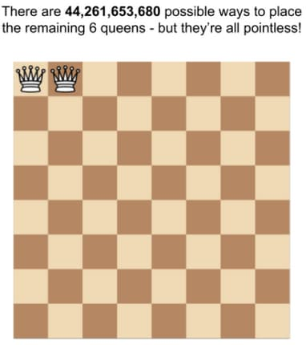
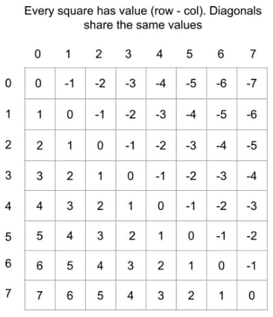
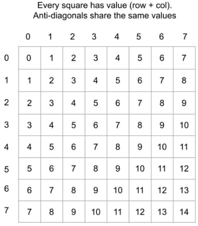

# 51. N-Queens

<p>The <strong>n-queens</strong> puzzle is the problem of placing <code>n</code> queens on an <code>n x n</code> chessboard such that no two queens attack each other.</p>

<p>Given an integer <code>n</code>, return <em>all distinct solutions to the <strong>n-queens puzzle</strong></em>. You may return the answer in <strong>any order</strong>.</p>

<p>Each solution contains a distinct board configuration of the n-queens' placement, where <code>'Q'</code> and <code>'.'</code> both indicate a queen and an empty space, respectively.</p>

<p>&nbsp;</p>
<p><strong class="example">Example 1:</strong></p>

<pre><strong>Input:</strong> n = 4
<strong>Output:</strong> [[".Q..","...Q","Q...","..Q."],["..Q.","Q...","...Q",".Q.."]]
<strong>Explanation:</strong> There exist two distinct solutions to the 4-queens puzzle as shown above
</pre>

<p><strong class="example">Example 2:</strong></p>

<pre><strong>Input:</strong> n = 1
<strong>Output:</strong> [["Q"]]
</pre>

<p>&nbsp;</p>
<p><strong>Constraints:</strong></p>

<ul>
  <li><code>1 &lt;= n &lt;= 9</code></li>
</ul>

<br>

---

# Solution

- [Backtracking Approach](#backtracking-approach)
  - **Time Complexity**: `O(n!)`
  - **Space Complexity**: `O(n^2)`

## Problem Overview: N-Queens

**Problem:**
The N-Queens puzzle involves placing `n` queens on an `n x n` chessboard in such a way that no two queens can attack each other. 

**Objective:**
Given an integer `n`, find and return all possible distinct solutions to the N-Queens puzzle. Each solution should be a unique configuration of the chessboard, where `'Q'` represents a queen and `'.'` represents an empty space. The solutions can be returned in any order.

**Example:**
1. **Input:** n = 4
   - **Output:** 
     ```json
     [
         [".Q..","...Q","Q...","..Q."],
         ["..Q.","Q...","...Q",".Q.."]
     ]
     ```
   - **Explanation:** There are two unique solutions for a 4x4 chessboard.

2. **Input:** n = 1
   - **Output:** 
     ```json
     [["Q"]]
     ```

**Constraints:**
- \(1 \leq n \leq 9\)

### Inefficient Solutions to the N-Queens Puzzle

**1. Brute Force Approach**

A brute force solution involves generating all possible board states with N queens. The steps are as follows:
- Each of the \(N^2\) squares can be a potential position for the first queen.
- For the second queen, there are \(N^2 - 1\) possible positions, and so on.
- This results in a time complexity of \(O(N^2N)\), which is far too slow.

Given that the actual number of solutions is much smaller than the number of possible board states, it is essential to minimize the consideration of invalid board states.

**2. Example with 8 Queens**

Let's consider the example of placing 8 queens on a normal chessboard:
- Suppose the first queen is placed on the top left (index (0, 0), or a8 in chess notation).
- If the second queen is placed to its right (index (0, 1), or b8), there are \(62 \times 61 \times \ldots \times 57 = 44,261,653,680\) possible ways to place the remaining 6 queens.

However, we already know that all these possibilities are invalid because the first two queens can attack each other.



This illustrates why a brute force approach is impractical and emphasizes the need for a more efficient solution.

# Backtracking Approach

### Overview: Backtracking

**Backtracking** is a problem-solving technique that involves incrementally building candidates for solutions and abandoning those that fail to satisfy the problem's constraints. It's often implemented using recursion and is particularly useful for solving puzzles like Sudoku, N-Queens, and crosswords. The key idea is to explore all possible configurations and backtrack whenever a partial solution cannot be completed to a valid solution.

## **Intuition**

The strategy involves generating board states, but we avoid placing a queen on a square that another queen can attack. This problem is perfect for backtracking: place the queens one by one, and when all possibilities are exhausted, backtrack by removing a queen and placing it elsewhere.

Given a board state and a possible placement for a queen, we need a method to determine whether that placement puts the queen under attack. A queen is under attack if another queen is in the same row, column, diagonal, or anti-diagonal.

To implement backtracking, we create a backtrack function that makes changes to the state, calls itself, and then undoes those changes when the call returns (hence the term "backtracking").

## Key Steps

1. **Placing Queens by Row:**
   - Ensure only one queen per **row** by passing an integer argument `row` into the backtrack function. Each call places one queen and moves to the next row by calling backtrack again with `row + 1`.

2. **Placing Queens by Column:**
   - To ensure only one queen per **column**, use a set. Whenever we place a queen, add the column index to this set.

3. **Handling Diagonals:**
   - For each square on a given **diagonal**, the difference between the row and column indices `(row - col)` is constant. For example, on the diagonal that starts from `(0, 0)`, the *i-th* square has coordinates `(i, i)`, so the difference is always 0.

  

4. **Handling Anti-Diagonals:**
   - For each square on a given anti-diagonal, the sum of the row and column indices (row + col) is constant. If you start at the highest square in an anti-diagonal and move downwards, the row index increments by 1 (row + 1), and the column index decrements by 1 (col - 1), cancelling each other out.

  

5. **Tracking Diagonals and Anti-Diagonals:**
   - Every time we place a queen, calculate the diagonal and anti-diagonal value it belongs to. Similar to columns, use sets to track which diagonals and anti-diagonals have been used. Add the values for this queen to the corresponding sets.

By leveraging these properties and using sets to track placements, we can efficiently determine valid board states and systematically explore all possibilities through backtracking.

## **Algorithm**

We'll create a recursive function `backtrack` that takes a few arguments to maintain the board state. The first parameter is the row where we'll place the next queen. We'll use three sets to track which columns, diagonals, and anti-diagonals already have queens. We'll also store the board to include valid solutions in our answer.

### Steps:

1. **Check for Solution:**
   - If the current row equals `n`, we have a solution. Add the current board state to the list of solutions and return. Use a helper function to format the board correctly.

2. **Iterate Through Columns:**
   - For each column in the current row, attempt to place a queen at `(row, col)`.
     - Calculate the diagonal and anti-diagonal for the square.
     - If no queen is in the column, diagonal, or anti-diagonal, place a queen in this column of the current row.
     - If placement is not possible, skip to the next column.

3. **Place Queen and Update Sets:**
   - If a queen is placed, update the board and the sets for columns, diagonals, and anti-diagonals.
   - Call the `backtrack` function with `row + 1`.

4. **Backtrack:**
   - After exploring valid board states with the queen placed, backtrack by removing the queen. Remove the queen from the board and the values from the sets.

### **Pseudocode**

```pseudocode
function solveNQueens(int n) {
  List<List<String>> solutions = new ArrayList<>();
  Set<Integer> cols = new HashSet<>();
  Set<Integer> diagonals = new HashSet<>();
  Set<Integer> antiDiagonals = new HashSet<>();
  char[][] board = createEmptyBoard(n);

  function backtrack(int row) {
    if (row == n) {
      solutions.add(formatBoard(board));
      return;
    }

    for (int col = 0; col < n; col++) {
      int diagonal = row - col;
      int antiDiagonal = row + col;

      if (cols.contains(col) || diagonals.contains(diagonal) || antiDiagonals.contains(antiDiagonal)) {
        continue;
      }

      placeQueen(board, row, col);
      cols.add(col);
      diagonals.add(diagonal);
      antiDiagonals.add(antiDiagonal);

      backtrack(row + 1);

      removeQueen(board, row, col);
      cols.remove(col);
      diagonals.remove(diagonal);
      antiDiagonals.remove(antiDiagonal);
    }
  }

  backtrack(0);
  return solutions;
}

function createEmptyBoard(int n) {
  char[][] board = new char[n][n];
  for (int i = 0; i < n; i++) {
    for (int j = 0; j < n; j++) {
      board[i][j] = '.';
    }
  }
  return board;
}

function placeQueen(char[][] board, int row, int col) {
  board[row][col] = 'Q';
}

function removeQueen(char[][] board, int row, int col) {
  board[row][col] = '.';
}

function formatBoard(char[][] board) {
  List<String> formattedBoard = new ArrayList<>();
  for (int i = 0; i < board.length; i++) {
    formattedBoard.add(new String(board[i]));
  }
  return formattedBoard;
}
```

1. **solveNQueens(int n):**
   - Initializes the list `solutions` to store all valid solutions.
   - Uses `HashSet` for `cols`, `diagonals`, and `antiDiagonals` to track the placement of queens.
   - Creates an empty `board`.

2. **backtrack(int row):**
   - If `row` equals `n`, a valid solution is found and added to `solutions`.
   - Iterates through each column in the current row.
   - Checks if placing a queen at `(row, col)` conflicts with existing queens.
   - If no conflict, places the queen and updates sets.
   - Recursively calls `backtrack` for the next row.
   - After exploring all possibilities, backtracks by removing the queen and updating sets.

3. **Helper Functions:**
   - `createEmptyBoard(int n)`: Creates an empty `n x n` board.
   - `placeQueen(char[][] board, int row, int col)`: Places a queen on the board.
   - `removeQueen(char[][] board, int row, int col)`: Removes a queen from the board.
   - `formatBoard(char[][] board)`: Formats the board into a list of strings for the solution.

## **Implementation**

### **Java**`

```java
import java.util.ArrayList;
import java.util.HashSet;
import java.util.List;
import java.util.Set;

class Solution {

  /**
   * Solves the N-Queens problem and returns all possible solutions.
   */
  public List<List<String>> solveNQueens(int n) {
    List<List<String>> solutions = new ArrayList<>();
    Set<Integer> cols = new HashSet<>();
    Set<Integer> diagonals = new HashSet<>();
    Set<Integer> antiDiagonals = new HashSet<>();
    char[][] board = createEmptyBoard(n);
    backtrack(0, n, board, solutions, cols, diagonals, antiDiagonals);
    return solutions;
  }

  /**
   * Backtracking helper function to find all solutions.
   */
  private void backtrack(int row, int n, char[][] board, List<List<String>> solutions,
      Set<Integer> cols, Set<Integer> diagonals, Set<Integer> antiDiagonals) {
    // If all rows are processed, add the current board configuration to solutions
    if (row == n) {
      solutions.add(formatBoard(board));
      return;
    }

    // Try placing a queen in each column of the current row
    for (int col = 0; col < n; col++) {
      int diagonal = row - col;
      int antiDiagonal = row + col;

      // Skip if the column or diagonals are occupied
      if (cols.contains(col) || diagonals.contains(diagonal)
          || antiDiagonals.contains(antiDiagonal)) {
        continue;
      }

      // Place the queen and mark the column and diagonals as occupied
      placeQueen(board, row, col);
      cols.add(col);
      diagonals.add(diagonal);
      antiDiagonals.add(antiDiagonal);

      // Recur to the next row
      backtrack(row + 1, n, board, solutions, cols, diagonals, antiDiagonals);

      // Remove the queen and unmark the column and diagonals
      removeQueen(board, row, col);
      cols.remove(col);
      diagonals.remove(diagonal);
      antiDiagonals.remove(antiDiagonal);
    }
  }

  /**
   * Creates an empty n x n board.
   *
   * @param n the size of the board
   * @return a 2D array representing the empty board
   */
  private char[][] createEmptyBoard(int n) {
    char[][] board = new char[n][n];
    for (int i = 0; i < n; i++) {
      for (int j = 0; j < n; j++) {
        board[i][j] = '.';
      }
    }
    return board;
  }

  /**
   * Places a queen on the board at the specified position.
   *
   * @param board the current state of the board
   * @param row the row index
   * @param col the column index
   */
  private void placeQueen(char[][] board, int row, int col) {
    board[row][col] = 'Q';
  }

  /**
   * Removes a queen from the board at the specified position.
   *
   * @param board the current state of the board
   * @param row the row index
   * @param col the column index
   */
  private void removeQueen(char[][] board, int row, int col) {
    board[row][col] = '.';
  }

  /**
   * Converts the board into a list of strings for the final solution format.
   */
  private List<String> formatBoard(char[][] board) {
    List<String> formattedBoard = new ArrayList<>();
    for (int i = 0; i < board.length; i++) {
      formattedBoard.add(new String(board[i]));
    }
    return formattedBoard;
  }
}
```

### TypeScript

```typescript
function solveNQueens(n: number): string[][] {
  const solutions: string[][] = [];
  const cols: Set<number> = new Set();
  const diagonals: Set<number> = new Set();
  const antiDiagonals: Set<number> = new Set();
  const board: string[][] = createEmptyBoard(n);
  backtrack(0, n, board, solutions, cols, diagonals, antiDiagonals);
  return solutions;
}

function backtrack(row: number, n: number, board: string[][], solutions: string[][], cols: Set<number>, diagonals: Set<number>, antiDiagonals: Set<number>): void {
  if (row === n) {
    solutions.push(formatBoard(board));
    return;
  }

  for (let col = 0; col < n; col++) {
    const diagonal = row - col;
    const antiDiagonal = row + col;

    if (cols.has(col) || diagonals.has(diagonal) || antiDiagonals.has(antiDiagonal)) {
      continue;
    }

    placeQueen(board, row, col);
    cols.add(col);
    diagonals.add(diagonal);
    antiDiagonals.add(antiDiagonal);

    backtrack(row + 1, n, board, solutions, cols, diagonals, antiDiagonals);

    removeQueen(board, row, col);
    cols.delete(col);
    diagonals.delete(diagonal);
    antiDiagonals.delete(antiDiagonal);
  }
}

function createEmptyBoard(n: number): string[][] {
  const board: string[][] = new Array(n).fill('.').map(() => new Array(n).fill('.'));
  return board;
}

function placeQueen(board: string[][], row: number, col: number): void {
  board[row][col] = 'Q';
}

function removeQueen(board: string[][], row: number, col: number): void {
  board[row][col] = '.';
}

function formatBoard(board: string[][]): string[] {
  return board.map(row => row.join(''));
}
```

#### Key Points:

1. **Main Function (`solveNQueens`):**
   - Initializes the list of solutions and sets to track columns, diagonals, and anti-diagonals with queens.
   - Creates an empty board and calls the `backtrack` function to explore all possible solutions.

2. **Backtracking Function (`backtrack`):**
   - If the row equals `n`, a valid solution is found and added to the list.
   - Iterates through each column in the current row, calculates diagonal and anti-diagonal indices.
   - Checks for conflicts using the sets and places a queen if no conflict is found.
   - Recursively calls `backtrack` for the next row and backtracks by removing the queen and updating the sets.

3. **Helper Functions:**
   - `createEmptyBoard`: Creates an empty `n x n` board.
   - `placeQueen`: Places a queen on the board.
   - `removeQueen`: Removes a queen from the board.
   - `formatBoard`: Formats the board into a list of strings for the solution.

## **Complexity Analysis**

### Assumptions
- **Board Size (n x n)**: The board is an n x n grid.
- **Queens**: We are placing n queens on the board such that no two queens can attack each other.
- **Backtracking Approach**: We use backtracking to explore all possible solutions.

### **Time Complexity**: `O(n!)`
- **Initial Placement**: Unlike the brute force approach, we only place queens on squares that aren't under attack.
  - For the first queen, we have `n` options.
  - For the second queen, we avoid the same column and diagonally attacked squares, leaving at most `n - 2` options.
  - For the third queen, we avoid two columns and diagonally attacked squares, leaving at most `n - 4` options.
  - This pattern continues, resulting in an approximate time complexity of `n!`.

- **Backtracking**: For each placement, we recursively attempt to place the next queen in the next row. We only explore valid placements, leading to an overall time complexity of `O(n!)`.

- **Building Solutions**: While building each valid solution costs `O(n^2)`, the number of valid solutions `S(n)` does not grow as fast as `n!`, so the combined complexity is `O(n! + S(n) * n^2) = O(n!)`.

### **Space Complexity**: `O(n^2)`
- **Board**: We maintain an `n x n` board, which requires `O(n^2)` space.
- **Sets for Tracking**: We use three sets (`cols`, `diagonals`, `antiDiagonals`) to store the board state, each requiring `O(n)` space.
- **Call Stack**: The recursive backtracking calls can go as deep as `n` levels, with the maximum depth of the call stack being `O(n)`.

Combining these factors, the overall space complexity is dominated by the `n x n` board, leading to `O(n^2)` space complexity.

Extra memory used for storing the sets and managing the recursion call stack scales linearly with the number of queens. However, the space used for the output does not count towards space complexity.