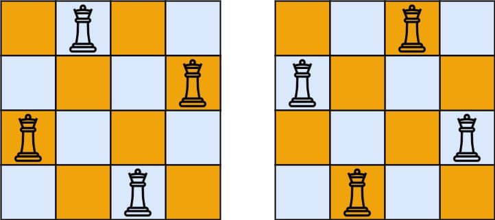
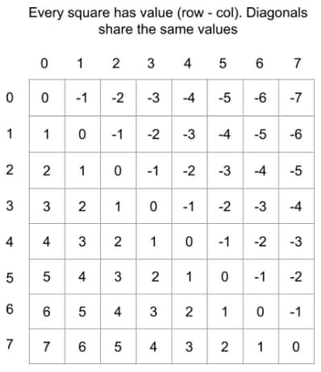
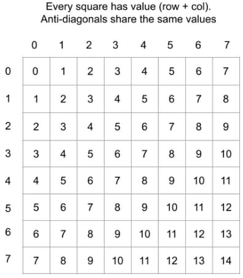

# 52. N-Queens II

<p>The <strong>n-queens</strong> puzzle is the problem of placing <code>n</code> queens on an <code>n x n</code> chessboard such that no two queens attack each other.</p>

<p>Given an integer <code>n</code>, return <em>the number of distinct solutions to the&nbsp;<strong>n-queens puzzle</strong></em>.</p>

<p>&nbsp;</p>
<p><strong class="example">Example 1:</strong></p>

<pre><strong>Input:</strong> n = 4
<strong>Output:</strong> 2
<strong>Explanation:</strong> There are two distinct solutions to the 4-queens puzzle as shown.
</pre>

<p><strong class="example">Example 2:</strong></p>

<pre><strong>Input:</strong> n = 1
<strong>Output:</strong> 1
</pre>

<p>&nbsp;</p>
<p><strong>Constraints:</strong></p>

<ul>
  <li><code>1 &lt;= n &lt;= 9</code></li>
</ul>

---

# Solution

- [Backtracking Approach](#backtracking-approach)

## Problem Overview: N-Queens II

The **N-Queens** puzzle is a classic problem where you need to place `n` queens on an `n x n` chessboard such that no two queens can attack each other. This means:
- No two queens share the same row.
- No two queens share the same column.
- No two queens share the same diagonal.

The task is to find and return the number of distinct solutions for a given integer `n`.

### Examples

**Example 1:**
- **Input:** `n = 4`
- **Output:** `2`
- **Explanation:** There are two distinct solutions to the 4-queens puzzle.

**Example 2:**
- **Input:** `n = 1`
- **Output:** `1`
- **Explanation:** There is only one way to place one queen on a 1x1 board.

### Constraints
- `1 <= n <= 9`

## Differences Between N-Queens and N-Queens II

#### N-Queens:
- **Problem Statement:** Place `n` queens on an `n x n` chessboard such that no two queens attack each other.
- **Goal:** Return all distinct solutions to the **N-Queens puzzle**.
- **Output:** Each solution contains a distinct board configuration of the `n` queens' placement. The solutions can be returned in any order.
- **Format:** Each solution is represented by a list of strings, where each string represents a row of the chessboard and contains characters `'Q'` for a queen and `'.'` for an empty space.
  
  **Example:**
  ```
  Input: n = 4
  Output: [
   [".Q..",
    "...Q",
    "Q...",
    "..Q."],
   
   ["..Q.",
    "Q...",
    "...Q",
    ".Q.."]
  ]
  ```

#### N-Queens II:
- **Problem Statement:** Place `n` queens on an `n x n` chessboard such that no two queens attack each other.
- **Goal:** Return the number of distinct solutions to the **N-Queens puzzle**.
- **Output:** A single integer representing the number of distinct solutions.

  **Example:**
  ```
  Input: n = 4
  Output: 2
  ```

### Summary:
- **N-Queens** requires you to return all distinct board configurations for the given `n`.
- **N-Queens II** focuses on counting the number of distinct solutions, rather than providing the actual configurations.

### Inefficient Solutions to the N-Queens Puzzle

**1. Brute Force Approach**

A brute force solution involves generating all possible board states with `N` queens. The steps are as follows:
- Each of the \(N^2\) squares can be a potential position for the first queen.
- For the second queen, there are \(N^2 - 1\) possible positions, and so on.
- This results in a time complexity of \(O(N^2^N)\), which is far too slow.

Given that the actual number of solutions is much smaller than the number of possible board states, it is essential to minimize the consideration of invalid board states.

**2. Example with 8 Queens**

Let's consider the example of placing 8 queens on a normal chessboard:
- Suppose the first queen is placed on the top left (index (0, 0), or a8 in chess notation).
- If the second queen is placed to its right (index (0, 1), or b8), there are \(62 \times 61 \times \ldots \times 57 = 44,261,653,680\) possible ways to place the remaining 6 queens.

However, we already know that all these possibilities are invalid because the first two queens can attack each other.


This illustrates why a brute force approach is impractical and emphasizes the need for a more efficient solution.

# Backtracking Approach

The backtracking approach counts the number of valid solutions rather than storing all board configurations.

We can use the same backtracking logic from N-Queens problem. The main difference between N-Queens and N-Queens II lies in the output, but the backtracking approach to finding the solutions is the same. 

### Overview: Backtracking

**Backtracking** is a problem-solving technique that involves incrementally building candidates for solutions and abandoning those that fail to satisfy the problem's constraints. It's often implemented using recursion and is particularly useful for solving puzzles like Sudoku, N-Queens, and crosswords. The key idea is to explore all possible configurations and backtrack whenever a partial solution cannot be completed to a valid solution.

## **Intuition**

The strategy involves generating board states, but we avoid placing a queen on a square that another queen can attack. This problem is perfect for backtracking: place the queens one by one, and when all possibilities are exhausted, backtrack by removing a queen and placing it elsewhere.

Given a board state and a possible placement for a queen, we need a method to determine whether that placement puts the queen under attack. A queen is under attack if another queen is in the same row, column, diagonal, or anti-diagonal.

To implement backtracking, we create a backtrack function that makes changes to the state, calls itself, and then undoes those changes when the call returns (hence the term "backtracking").

## Key Steps

### 1. **Placing Queens by Row:**
   - Ensure only one queen per **row** by passing an integer argument `row` into the backtrack function. Each call places one queen and moves to the next row by calling backtrack again with `row + 1`.

### 2. **Placing Queens by Column:**
   - To ensure only one queen per **column**, use a set. Whenever we place a queen, add the column index to this set.

### 3. **Handling Diagonals:**
   - For each square on a given **diagonal**, the difference between the row and column indices `(row - col)` is constant. For example, on the diagonal that starts from `(0, 0)`, the *i-th* square has coordinates `(i, i)`, so the difference is always 0.

  

|    | 0  | 1  | 2  | 3  |
|----|----|----|----|----|
| **0**  |  0  | -1 | -2 | -3 |
| **1**  |  1  |  0 | -1 | -2 |
| **2**  |  2  |  1 |  0 | -1 |
| **3**  |  3  |  2 |  1 |  0 |

Here, the value at each square is calculated as `(row - col)`. For example:
- The square at `(0, 0)` has a value of `0`.
- The square at `(1, 1)` has a value of `0`.
- The square at `(2, 0)` has a value of `-2`.
- The square at `(0, 1)` has a value of `-1`.

As you can see, diagonals share the same values.

### 4. **Handling Anti-Diagonals:**
   - For each square on a given anti-diagonal, the sum of the row and column indices (row + col) is constant. If you start at the highest square in an anti-diagonal and move downwards, the row index increments by 1 (row + 1), and the column index decrements by 1 (col - 1), cancelling each other out.

  

|    | 0  | 1  | 2  | 3  |
|----|----|----|----|----|
| **0**  |  0  |  1  |  2  |  3  |
| **1**  |  1  |  2  |  3  |  4  |
| **2**  |  2  |  3  |  4  |  5  |
| **3**  |  3  |  4  |  5  |  6  |

Here, the value at each square is calculated as `(row + col)`. For example:
- The square at `(0, 0)` has a value of `0`.
- The square at `(1, 1)` has a value of `2`.
- The square at `(2, 0)` has a value of `2`.
- The square at `(0, 1)` has a value of `1`.

As you can see, anti-diagonals share the same values.

### 5. **Tracking Diagonals and Anti-Diagonals:**
   - Every time we place a queen, calculate the diagonal and anti-diagonal value it belongs to. Similar to columns, use sets to track which diagonals and anti-diagonals have been used. Add the values for this queen to the corresponding sets.

By leveraging these properties and using sets to track placements, we can efficiently determine valid board states and systematically explore all possibilities through backtracking.

## **Algorithm**

### Overview
We'll create a recursive function `backtrack` that takes four arguments to maintain the board state. The first parameter is the row we're going to place a queen on next, and the other three are sets that track which columns, diagonals, and anti-diagonals have already had queens placed on them.

1. **Base Case:**
   - If the current row we are considering is greater than or equal to `n`, then we have a solution. Return `1`.

2. **Initialize Solutions Count:**
   - Initiate a local variable `solutions = 0` that represents all the possible solutions that can be obtained from the current board state.

3. **Iterate Through Columns:**
   - Iterate through the columns of the current row. At each column, we will attempt to place a queen at the square `(row, col)`.

4. **Check Valid Placement:**
   - Calculate the diagonal and anti-diagonal that the square belongs to.
   - If there has been no queen placed yet in the column, diagonal, or anti-diagonal, then we can place a queen in this column, in the current row.
   - If we can't place the queen, skip this column (move on to try with the next column).

5. **Place the Queen:**
   - If we were able to place a queen, then update our three sets (`cols`, `diagonals`, and `antiDiagonals`).

6. **Recursive Call:**
   - Call the `backtrack` function again, but with `row + 1`. This explores all valid board states with the queen we placed in the current step.

7. **Backtrack:**
   - After the recursive call returns, backtrack by removing the queen from the square. This means removing the values we added to our sets.

### Key Steps

1. **Placing Queens by Row:**
   - Ensure only one queen per **row** by passing an integer argument `row` into the `backtrack` function. Each call places one queen and moves to the next row by calling `backtrack` again with `row + 1`.

2. **Placing Queens by Column:**
   - To ensure only one queen per **column**, use a set. Whenever we place a queen, add the column index to this set.

3. **Handling Diagonals:**
   - For each square on a given **diagonal**, the difference between the row and column indices `(row - col)` is constant. Track which diagonals have queens using a set.

4. **Handling Anti-Diagonals:**
   - For each square on a given **anti-diagonal**, the sum of the row and column indices `(row + col)` is constant. Track which anti-diagonals have queens using a set.

5. **Tracking Diagonals and Anti-Diagonals:**
   - Every time we place a queen, calculate the diagonal and anti-diagonal value it belongs to. Use sets to track which diagonals and anti-diagonals have been used. Add the values for this queen to the corresponding sets.

### **Pseudocode**

```
function totalNQueens(n):
    solutions = 0
    cols = set()
    diagonals = set()
    antiDiagonals = set()
    
    function backtrack(row):
        if row >= n:
            return 1
        
        solutions = 0
        
        for col in range(0, n):
            diag = row - col
            antiDiag = row + col
            
            if col in cols or diag in diagonals or antiDiag in antiDiagonals:
                continue
            
            cols.add(col)
            diagonals.add(diag)
            antiDiagonals.add(antiDiag)
            
            solutions += backtrack(row + 1)
            
            cols.remove(col)
            diagonals.remove(diag)
            antiDiagonals.remove(antiDiag)
        
        return solutions
    
    return backtrack(0)
```

#### Key Steps

1. **Function totalNQueens:**
   - This is the entry point of the algorithm. It calls the `backtrack` function with initial parameters: row `0` and three empty sets to track columns, diagonals, and anti-diagonals.

2. **Function backtrack:**
   - This recursive function tries to place queens row by row.

3. **Base Case:**
   - If the `row` value is greater than or equal to `n`, it means we have successfully placed all queens. Return `1` to indicate a valid solution.

4. **Initialize Solutions Count:**
   - Initialize `solutions` to `0` to count the number of valid solutions from the current board state.

5. **Iterate Through Columns:**
   - Loop through all columns in the current row to try placing a queen.

6. **Check Valid Placement:**
   - Calculate `diag` and `antiDiag` values for the current cell `(row, col)`.
   - If the column, diagonal, or anti-diagonal is already occupied by another queen, skip this column.

7. **Place the Queen:**
   - Add the column, diagonal, and anti-diagonal to their respective sets.

8. **Recursive Call:**
   - Call `backtrack` with the next row (`row + 1`) and updated sets.

9. **Backtrack:**
   - After exploring the current configuration, remove the queen from the current cell (by removing the values from the sets).

10. **Return Solutions:**
    - Return the total count of valid solutions found.

## **Implementation**

### Java

```java
import java.util.HashSet;
import java.util.Set;

public class Solution {
  public int totalNQueens(int n) {
    // Set to keep track of columns, diagonals, and anti-diagonals.
    Set<Integer> cols = new HashSet<>();
    Set<Integer> diagonals = new HashSet<>();
    Set<Integer> antiDiagonals = new HashSet<>();

    return backtrack(0, n, cols, diagonals, antiDiagonals);
  }

  private int backtrack(int row, int n, Set<Integer> cols, Set<Integer> diagonals,
      Set<Integer> antiDiagonals) {
    // 1. Base Case: If we've placed all queens, we found a solution.
    if (row == n) {
      return 1;
    }

    // 2. Initialize Solutions Count.
    int solutions = 0;

    // 3. Iterate Through Columns.
    for (int col = 0; col < n; col++) {
      int diagonal = row - col;
      int antiDiagonal = row + col;

      // 4. Check Valid Placement.
      if (cols.contains(col) || diagonals.contains(diagonal)
          || antiDiagonals.contains(antiDiagonal)) {
        continue; // Can't place queen here, move to next column.
      }

      // 5. Place the Queen.
      cols.add(col);
      diagonals.add(diagonal);
      antiDiagonals.add(antiDiagonal);

      // 6. Recursive Call: Move to the next row with updated state.
      solutions += backtrack(row + 1, n, cols, diagonals, antiDiagonals);

      // 7. Backtrack: Remove the queen and revert changes.
      cols.remove(col);
      diagonals.remove(diagonal);
      antiDiagonals.remove(antiDiagonal);
    }

    return solutions;
  }
}
```

### TypeScript

```typescript
function totalNQueens(n: number): number {
  // Set to keep track of columns, diagonals, and anti-diagonals.
  const cols = new Set<number>();
  const diagonals = new Set<number>();
  const antiDiagonals = new Set<number>();

  return backtrack(0, n, cols, diagonals, antiDiagonals);

  function backtrack(
    row: number,
    n: number,
    cols: Set<number>,
    diagonals: Set<number>,
    antiDiagonals: Set<number>
  ): number {
    // 1. Base Case: If we've placed all queens, we found a solution.
    if (row === n) {
      return 1;
    }

    // 2. Initialize Solutions Count.
    let solutions = 0;

    return solutions;
  }
}
```
