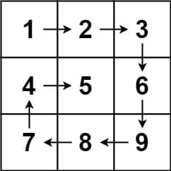
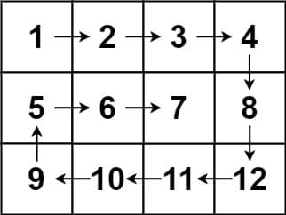

# 54. Spiral Matrix

<p>Given an <code>m x n</code> <code>matrix</code>, return <em>all elements of the</em> <code>matrix</code> <em>in spiral order</em>.</p>

<p>&nbsp;</p>
<p><strong class="example">Example 1:</strong></p>

<pre><strong>Input:</strong> matrix = [[1,2,3],[4,5,6],[7,8,9]]
<strong>Output:</strong> [1,2,3,6,9,8,7,4,5]
</pre>

<p><strong class="example">Example 2:</strong></p>

<pre><strong>Input:</strong> matrix = [[1,2,3,4],[5,6,7,8],[9,10,11,12]]
<strong>Output:</strong> [1,2,3,4,8,12,11,10,9,5,6,7]
</pre>

<p>&nbsp;</p>
<p><strong>Constraints:</strong></p>

<ul>
  <li><code>m == matrix.length</code></li>
  <li><code>n == matrix[i].length</code></li>
  <li><code>1 &lt;= m, n &lt;= 10</code></li>
  <li><code>-100 &lt;= matrix[i][j] &lt;= 100</code></li>
</ul>

<br>

---

# Solution

- [Boundary-Shrinking Approach](#boundary-shrinking-approach)
  - **Time Complexity**: `O(M * N)`
  - **Space Complexity**: `O(1)`

## Problem Overview

### Problem: Spiral Matrix

**Problem Description:**

Given an `m x n` matrix, return all elements of the matrix in spiral order.

**Example 1:**


```markdown
Input: matrix = [[1, 2, 3], [4, 5, 6], [7, 8, 9]]
Output: [1, 2, 3, 6, 9, 8, 7, 4, 5]
```

**Example 2:**


```markdown
Input: matrix = [[1, 2, 3, 4], [5, 6, 7, 8], [9, 10, 11, 12]]
Output: [1, 2, 3, 4, 8, 12, 11, 10, 9, 5, 6, 7]
```

**Constraints:**

- `m == matrix.length`
- `n == matrix[i].length`
- `1 <= m, n <= 10`
- `-100 <= matrix[i][j] <= 100`

### Spiral Order Traversal

The problem statement asks us to return all elements of the matrix in spiral order, which means we will start from the top left corner and move towards the right, then down, then left, and then up. Let's break this into further details:

1. **Direction Movements:**
    - We can achieve moving in different directions by modifying row and column indices. Specifically, given that we are at `(row, col)`, where `row` is the row index, and `col` is the column index:
        - Move right: `(row, col + 1)`
        - Move down: `(row + 1, col)`
        - Move left: `(row, col - 1)`
        - Move up: `(row - 1, col)`

2. **When to Change Direction:**
    - We need to change direction when we either reach the matrix boundaries or visit cells that we have already visited. The matrix boundaries are fixed, but how do we know if we have visited a particular cell or not?
    - We have two strategies to handle this:
        - **Approach 1:** Move the boundaries towards the center of the matrix after traversing a row or a column. When we meet a boundary, we know it's time to change direction and update the boundary.
        - **Approach 2:** Record each location that we have visited while traversing the matrix. When we meet a matrix boundary or a previously visited cell, we know it's time to change direction.

# Boundary-Shrinking Approach

## **Intuition**

Our goal is to update boundaries as we traverse the matrix. When we finish traversing a row or column, we set up a boundary on it so that next time we get there, we know we need to change direction. Below is the first round of updating the top, right, bottom, and left boundaries.

## **Algorithm**

1. Initialize the top, right, bottom, and left boundaries as `up`, `right`, `down`, and `left`.
2. Initialize the output array `result`.
3. Traverse the elements in spiral order and add each element to `result`:
    - Traverse from left boundary to right boundary.
    - Traverse from up boundary to down boundary.
    - Before traversing from right to left, ensure the row hasn't already been traversed. If it hasn't, traverse from right to left.
    - Similarly, before traversing from top to bottom, ensure the column hasn't already been traversed. Then traverse from down to up.
    - Move the boundaries by updating `left`, `right`, `up`, and `down` accordingly.
4. Return `result`.

### Pseudocode

Here's a language-agnostic pseudocode for the algorithm:

```pseudocode
Initialize boundaries:
    top = 0
    bottom = number of rows - 1
    left = 0
    right = number of columns - 1

Initialize result as an empty array

While top <= bottom and left <= right:
    Traverse from left to right along the top boundary and add elements to result
    Move the top boundary down
    
    Traverse from top to bottom along the right boundary and add elements to result
    Move the right boundary left
    
    If top <= bottom:
        Traverse from right to left along the bottom boundary and add elements to result
        Move the bottom boundary up
    
    If left <= right:
        Traverse from bottom to top along the left boundary and add elements to result
        Move the left boundary right

Return result
```

## **Implementation**

### Java

```java
import java.util.ArrayList;
import java.util.List;

class Solution {
  public List<Integer> spiralOrder(int[][] matrix) {
    List<Integer> result = new ArrayList<>();
    int rows = matrix.length;
    int columns = matrix[0].length;
    int up = 0;
    int left = 0;
    int right = columns - 1;
    int down = rows - 1;

    while (result.size() < rows * columns) {
      // Traverse from left to right.
      for (int col = left; col <= right; col++) {
        result.add(matrix[up][col]);
      }
      up++; // Move the top boundary down

      // Traverse downwards.
      for (int row = up; row <= down; row++) {
        result.add(matrix[row][right]);
      }
      right--; // Move the right boundary left

      // Make sure we are now on a different row.
      if (up <= down) {
        // Traverse from right to left.
        for (int col = right; col >= left; col--) {
          result.add(matrix[down][col]);
        }
        down--; // Move the bottom boundary up
      }

      // Make sure we are now on a different column.
      if (left <= right) {
        // Traverse from bottom to top.
        for (int row = down; row >= up; row--) {
          result.add(matrix[row][left]);
        }
        left++; // Move the left boundary right
      }
    }

    return result;
  }
}
```

### TypeScript

```typescript
function spiralOrder(matrix: number[][]): number[] {
    const result: number[] = [];
    const rows = matrix.length;
    const columns = matrix[0].length;
    let up = 0, down = rows - 1;
    let left = 0, right = columns - 1;

    while (result.length < rows * columns) {
        // Traverse from left to right.
        for (let col = left; col <= right; col++) {
            result.push(matrix[up][col]);
        }
        up++; // Move the top boundary down

        // Traverse from top to bottom.
        for (let row = up; row <= down; row++) {
            result.push(matrix[row][right]);
        }
        right--; // Move the right boundary left

        // Make sure we are now on a different row.
        if (up <= down) {
            // Traverse from right to left.
            for (let col = right; col >= left; col--) {
                result.push(matrix[down][col]);
            }
            down--; // Move the bottom boundary up
        }

        // Make sure we are now on a different column.
        if (left <= right) {
            // Traverse from bottom to top.
            for (let row = down; row >= up; row--) {
                result.push(matrix[row][left]);
            }
            left++; // Move the left boundary right
        }
    }

    return result;
}
```

## **Complexity Analysis**

### Assumptions
- Let `M` be the number of rows and `N` be the number of columns.

### **Time Complexity**: `O(M * N)`

- **Linear traversal of the matrix**: We visit every element in the `M x N` matrix exactly once. Thus, the time complexity is proportional to the number of elements in the matrix, which is `M * N`.

### **Space Complexity**: `O(1)`

- **Constant Space Usage**: The algorithm uses a fixed amount of space regardless of the input size. Specifically, it maintains several variables (`up`, `down`, `left`, `right`) to keep track of the boundaries.
- **No Additional Data Structures**: Unlike some other approaches that might use additional data structures, this method only uses a few variables for boundary tracking.
- **Total Space Complexity**: Therefore, the space complexity is `O(1)` since the amount of space used remains constant and does not depend on the size of the input matrix.


