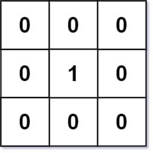
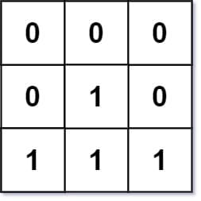

# 542. 01 Matrix

<p>Given an <code>m x n</code> binary matrix <code>mat</code>, return <em>the distance of the nearest </em><code>0</code><em> for each cell</em>.</p>

<p>The distance between two adjacent cells is <code>1</code>.</p>

<p>&nbsp;</p>
<p><strong class="example">Example 1:</strong></p>

<pre><strong>Input:</strong> mat = [[0,0,0],[0,1,0],[0,0,0]]
<strong>Output:</strong> [[0,0,0],[0,1,0],[0,0,0]]
</pre>

<p><strong class="example">Example 2:</strong></p>

<pre><strong>Input:</strong> mat = [[0,0,0],[0,1,0],[1,1,1]]
<strong>Output:</strong> [[0,0,0],[0,1,0],[1,2,1]]
</pre>

<p>&nbsp;</p>
<p><strong>Constraints:</strong></p>

<ul>
  <li><code>m == mat.length</code></li>
  <li><code>n == mat[i].length</code></li>
  <li><code>1 &lt;= m, n &lt;= 10<sup>4</sup></code></li>
  <li><code>1 &lt;= m * n &lt;= 10<sup>4</sup></code></li>
  <li><code>mat[i][j]</code> is either <code>0</code> or <code>1</code>.</li>
  <li>There is at least one <code>0</code> in <code>mat</code>.</li>
</ul>

<br>

---

# Solution
- [Breadth-First Search (BFS) Approach](#breadth-first-search-bfs-approach)
  - **Time Complexity**: `O(m * n)`
- [Brute Force (Naive Approach)](#brute-force-naive-approach)
  - **Time Complexity**: `O((m * n)^2)`

## Problem Overview

**Objective**:
Given an m x n binary matrix (with 0s and 1s), return the distance of the nearest 0 for each cell.

**Key Points**:
- Each cell in the matrix contains either a 0 or a 1.
- The distance between two adjacent cells is 1.
- For each cell in the matrix, you need to determine the distance to the nearest cell containing a 0.

**Examples**:
1. Input: `[[0,0,0],[0,1,0],[0,0,0]]`
   - Output: `[[0,0,0],[0,1,0],[0,0,0]]`
   - Explanation: Each 1 is adjacent to a 0, so the distance is 1.
2. Input: `[[0,0,0],[0,1,0],[1,1,1]]`
   - Output: `[[0,0,0],[0,1,0],[1,2,1]]`
   - Explanation: The distance for the bottom-left and bottom-right 1s are 1 and 2, respectively.

**Constraints**:
- The matrix dimensions (m and n) can be as large as 10,000.
- Each matrix cell is either 0 or 1.
- There is at least one 0 in the matrix.

# Brute Force (Naive Approach)

For the most naive approach: for each cell, we can find the distance of the closest zero.

Note: This brute force approach is simple but inefficient, with a time complexity of `O(m^2 * n^2)`, which is impractical for large matrices. There are more efficient approaches for this problem, but this lays the groundwork for understanding the basic idea.

## **Intuition**

**Approach**:
1. For each cell in the matrix, check all other cells to find the nearest 0.
2. Use nested loops to iterate over all pairs of cells and calculate their distances.

## **Algorithm**

**Steps**:
1. Initialize a new matrix with the same dimensions to store distances.
2. For each cell (i, j) in the matrix:
   - If the cell is 0, the distance is 0.
   - If the cell is 1, initialize its distance to infinity.
   - For each other cell (x, y) in the matrix:
     - If the cell (x, y) is 0, calculate the distance to (i, j) and update if it’s smaller.
3. Return the new matrix with the calculated distances.

### **Pseudocode**:

```plaintext
function updateMatrix(matrix):
    m = matrix.length
    n = matrix[0].length
    distances = new matrix of size m x n with all values set to infinity
    
    for i from 0 to m-1:
        for j from 0 to n-1:
            if matrix[i][j] == 0:
                distances[i][j] = 0
            else:
                for x from 0 to m-1:
                    for y from 0 to n-1:
                        if matrix[x][y] == 0:
                            distance = abs(x - i) + abs(y - j)
                            distances[i][j] = min(distances[i][j], distance)
    
    return distances
```

## **Implementation**

### Java

```java
import java.util.Arrays;

public class Solution {
  /**
   * Uses the brute force (naive approach) to update the matrix with the 
   * distance of the nearest 0 for each cell.
   *
   * @param mat The input binary matrix.
   * @return The matrix with updated distances.
   */
  public int[][] updateMatrix(int[][] mat) {
    int m = mat.length;
    int n = mat[0].length;

    // Initialize the distances matrix with a large value
    int[][] distances = new int[m][n];
    for (int[] row : distances) {
      Arrays.fill(row, Integer.MAX_VALUE);
    }

    // Iterate through each cell in the matrix
    for (int i = 0; i < m; i++) {
      for (int j = 0; j < n; j++) {
        // If the cell is 0, set distance to 0
        if (mat[i][j] == 0) {
          distances[i][j] = 0;
        } else {
          // Check all cells in the matrix to find the nearest 0
          for (int x = 0; x < m; x++) {
            for (int y = 0; y < n; y++) {
              if (mat[x][y] == 0) {
                int distance = Math.abs(x - i) + Math.abs(y - j);
                distances[i][j] = Math.min(distances[i][j], distance);
              }
            }
          }
        }
      }
    }

    return distances;
  }
}
```

### TypeScript

```typescript
/**
 * Updates the matrix with the distance of the nearest 0 for each cell.
 * Uses the brute force approach.
 *
 * @param mat - The input binary matrix.
 * @returns The matrix with updated distances.
 */
function updateMatrix(mat: number[][]): number[][] {
  const m = mat.length;
  const n = mat[0].length;

  // Initialize the distances matrix with a large value
  const distances: number[][] = Array.from({ length: m }, () =>
    Array(n).fill(Infinity)
  );

  // Iterate through each cell in the matrix
  for (let i = 0; i < m; i++) {
    for (let j = 0; j < n; j++) {
      // If the cell is 0, set distance to 0
      if (mat[i][j] === 0) {
        distances[i][j] = 0;
      } else {
        // Check all cells in the matrix to find the nearest 0
        for (let x = 0; x < m; x++) {
          for (let y = 0; y < n; y++) {
            if (mat[x][y] === 0) {
              const distance = Math.abs(x - i) + Math.abs(y - j);
              distances[i][j] = Math.min(distances[i][j], distance);
            }
          }
        }
      }
    }
  }

  return distances;
};
```

## **Complexity Analysis**

Let `m` be the number of rows and `n` be the number of columns in the matrix.

### **Time Complexity**: `O((m * n)^2)`

- **Double Nested Loops**: The brute force approach involves double nested loops to iterate over each cell in the matrix, leading to `O(m * n)` iterations.
- **Distance Calculation**: For each cell, we check the distance to every other cell, resulting in another `O(m * n)` operations.
- **Overall Complexity**: Combining these, the total time complexity is `O((m * n) * (m * n))`, which simplifies to `O((m * n)^2)`.

### **Space Complexity**: `O(1)`

- **Constant Space Usage**: The algorithm uses a constant amount of space for variables like `temp` and loop counters.
- **Output Matrix**: The space used to store the output matrix `distances` does not count towards the space complexity as it is required by the problem statement.
- **No Additional Data Structures**: Apart from the output matrix, no extra space is utilized, leading to a constant space complexity of `O(1)`.

By understanding these complexities, we see why the brute force approach can be impractical for large matrices due to its quadratic time complexity.

# Breadth-First Search (BFS) Approach

## **Intuition**

**Optimized Brute Force**:
Searching the entire matrix is inefficient. Instead, we use Breadth-First Search (BFS) to find the nearest 0 for each 1. As soon as we encounter a 0 during BFS, we know it's the closest, so we can stop searching for that particular 1 and move to the next.

**Refinement**:
Starting BFS from each 1 is inefficient as it only updates one cell per BFS, potentially resulting in high complexity. To optimize, start BFS from all 0s, updating the distances of all 1s along the way.

## **Algorithm**

1. **Initialize Queue**:
   - Use a queue `q` to keep track of cells to examine next.
   - Start by adding all cells containing 0 to `q`.

2. **Initial Distances**:
   - Set the distance for each 0 cell to 0.
   - Set the distance for each 1 cell to infinity (INT_MAX), to be updated during BFS.

3. **BFS Process**:
   - Pop a cell from the queue and examine its neighbors.
   - If a calculated distance for a neighbor (i, j) is smaller, add (i, j) to the queue and update `dist[i][j]`.

### **Pseudocode**

```plaintext
function updateMatrix(matrix):
    m = matrix.length
    n = matrix[0].length
    distances = new matrix of size m x n with all values set to infinity
    queue = empty queue

    for i from 0 to m-1:
        for j from 0 to n-1:
            if matrix[i][j] == 0:
                distances[i][j] = 0
                queue.push((i, j))

    directions = [(0, 1), (1, 0), (0, -1), (-1, 0)]
    while queue is not empty:
        (i, j) = queue.pop()
        for (di, dj) in directions:
            ni, nj = i + di, j + dj
            if ni >= 0 and ni < m and nj >= 0 and nj < n:
                if distances[ni][nj] > distances[i][j] + 1:
                    distances[ni][nj] = distances[i][j] + 1
                    queue.push((ni, nj))

    return distances
```


## **Complexity Analysis**

Let `m` be the number of rows and `n` be the number of columns in the matrix.

### **Time Complexity**: `O(m * n)`

- **Initialization**: We iterate over each cell once to initialize the queue with all 0s, which takes `O(m * n)`.
- **BFS Traversal**: Each cell is added to the queue at most once, and we examine each of its four neighbors (up, down, left, right). Thus, each cell and its neighbors are processed in constant time, resulting in `O(m * n)`.

### **Space Complexity**: `O(m * n)`

- **Queue Space**: The maximum space used by the queue occurs when all the 0s and some 1s are in the queue. This is `O(m * n)`, the space required to maintain the queue.
- **Distances Matrix**: The space used by the output matrix `distances` is `O(m * n)`. Although this is required by the problem, it contributes to space usage.

By starting BFS from all 0s and updating distances for all 1s, the algorithm achieves `O(m * n)` time complexity and `O(m * n)` space complexity.
