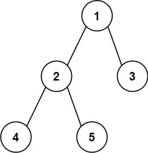
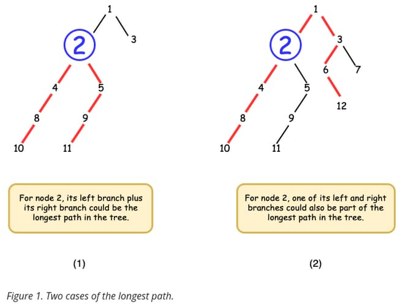

# 543. Diameter of Binary Tree

Given the <code>root</code> of a binary tree, return <em>the length of the <strong>diameter</strong> of the tree</em>.

The <strong>diameter</strong> of a binary tree is the <strong>length</strong> of the longest path between any two nodes in a tree. This path may or may not pass through the <code>root</code>.

The <strong>length</strong> of a path between two nodes is represented by the number of edges between them.

&nbsp;

<strong class="example">Example 1:</strong>

<pre><strong>Input:</strong> root = [1,2,3,4,5]
<strong>Output:</strong> 3
<strong>Explanation:</strong> 3 is the length of the path [4,2,1,3] or [5,2,1,3].
</pre>

<strong class="example">Example 2:</strong>

<pre><strong>Input:</strong> root = [1,2]
<strong>Output:</strong> 1
</pre>

&nbsp;

<strong>Constraints:</strong>

<ul>
	<li>The number of nodes in the tree is in the range <code>[1, 104]</code>.</li>
	<li><code>-100 &lt;= Node.val &lt;= 100</code></li>
</ul>

 

---

# Solution
- [Depth-First Search (DFS) Approach](#depth-first-search-approach)

# Depth-First Search Approach

## **Intuition**

### **Understanding the Longest Path in a Tree**

#### **Leaf Nodes Definition**
- A leaf node is defined as any node with a degree of 1, including the root node if it has a degree of 1 or less.

#### **Key Observation**
- The longest path in a tree must be between two leaf nodes. 

**Proof by Contradiction**:
1. Assume the longest path is not between two leaf nodes.
2. We can extend this path by adding the child node of one of the end nodes (since they aren't both leaves, at least one must have a child).
3. This extension contradicts the assumption that our path is the longest.
4. Therefore, the longest path must be between two leaf nodes.

#### **Longest Path Structure**
- In a tree, each node is connected to its parent and up to two children.
- The longest path consists of a node, its longest left branch, and its longest right branch.
- To find the node where the sum of its longest left and right branches is maximized, we apply Depth-First Search (DFS).

#### **Depth-First Search (DFS) Approach**
- DFS is a common graph traversal algorithm. We use DFS to count each node's branch lengths, starting from the leaves and working upwards.
- If unfamiliar with DFS, refer to resources like Explore Cards to learn preorder, inorder, and postorder traversal.

### **Applying DFS to Find the Longest Path**

1. **Recursive Function `longestPath`**:
   - Input: A TreeNode
   - Output: The longest path from this node to a leaf node.
   - Approach: Recursively visit children nodes, retrieve the longest paths, and return the longer one plus one.

2. **Handling Special Cases in DFS**:
   - The longest path might include both left and right branches of the current node.
   - The longest path might include only one of the current node's left or right branches.

