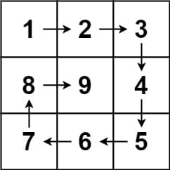
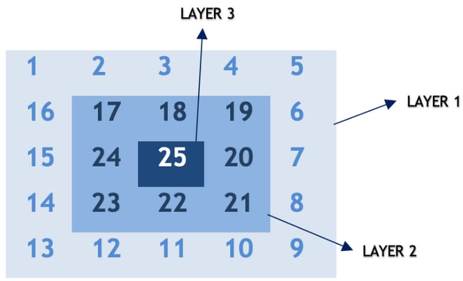

# 59. Spiral Matrix II

<p>Given a positive integer <code>n</code>, generate an <code>n x n</code> <code>matrix</code> filled with elements from <code>1</code> to <code>n<sup>2</sup></code> in spiral order.</p>

<p>&nbsp;</p>
<p><strong class="example">Example 1:</strong></p>

<pre><strong>Input:</strong> n = 3
<strong>Output:</strong> [[1,2,3],[8,9,4],[7,6,5]]
</pre>

<p><strong class="example">Example 2:</strong></p>

<pre><strong>Input:</strong> n = 1
<strong>Output:</strong> [[1]]
</pre>

<p>&nbsp;</p>
<p><strong>Constraints:</strong></p>

<ul>
	<li><code>1 &lt;= n &lt;= 20</code></li>
</ul>

<br>

---

# Solution

- [Spiral Traversal Approach](#spiral-traversal)

## Problem Overview: Spiral Matrix II

**Task**: Given a positive integer `n`, generate an `n x n` matrix filled with elements from `1` to `n^2` in spiral order.

**Examples**:
1. **Example 1**:
    - **Input**: `n = 3`
    - **Output**: `[[1, 2, 3], [8, 9, 4], [7, 6, 5]]`

2. **Example 2**:
    - **Input**: `n = 1`
    - **Output**: `[[1]]`

**Constraints**:
- `1 <= n <= 20`

**Explanation**: 
The matrix should start with the number `1` at the top-left corner and proceed in a clockwise spiral order filling up to `n^2`. For example, with `n = 3`, the matrix is:
```
1 -> 2 -> 3
         |
8 <- 9   4
|       |
7 <- 6 <- 5
```

For `n = 1`, the matrix is simply:
```
1
```

# Spiral Traversal

## **Intuition**

To build a solid intuition for spiral traversal, let's delve deeper into the process. The key idea is to recognize the repeating pattern of moving in a circular or spiral manner from the outermost layer towards the innermost layer. Here's a step-by-step guide to understanding the pattern:

1. **Understanding Layers**:
   - Imagine the matrix is composed of layers or concentric rectangles. The outermost elements form the first layer, the next set of elements forms the second layer, and so on.
   - Each layer can be traversed in four distinct steps: right, down, left, and up.

2. **Traversal Steps**:
   - **Right**: Start from the top-left corner of the current layer and move right until you reach the end of the layer.
   - **Down**: Move down the last column of the current layer.
   - **Left**: Move left along the bottom row of the current layer.
   - **Up**: Move up the first column of the current layer.

3. **Transitioning to the Next Layer**:
   - After completing one full circular traversal (one layer), move inward to the next layer and repeat the process.
   - The boundaries of each layer shrink after each traversal.

4. **Termination Condition**:
   - The process continues until all elements are traversed, which is typically when the current layer's boundaries meet or overlap.

### Diagram of Spiral Traversal by Layer



### Summary of the Process

1. Identify the outermost layer and begin traversal in the order: right, down, left, and up.
2. After completing one full layer, move inward to the next layer and repeat the traversal steps.
3. Continue the process until all elements are filled in a spiral manner.

### Example

Let's break down the example `n = 3` to illustrate the process:

**Matrix Layout**:
```
Layer 1: [1, 2, 3]
         [8,    , 4]
         [7, 6, 5]
Layer 2: [ 9 ]
```

**Steps**:
1. **Start at the top-left corner of Layer 1**:
   - Move right: `[1, 2, 3]`
   - Move down: `[4]`
   - Move left: `[5, 6, 7]`
   - Move up: `[8]`

2. **Move to Layer 2** (inner layer):
   - Move right: `[9]`

Resulting Matrix:
```
[[1, 2, 3],
 [8, 9, 4],
 [7, 6, 5]]
```
