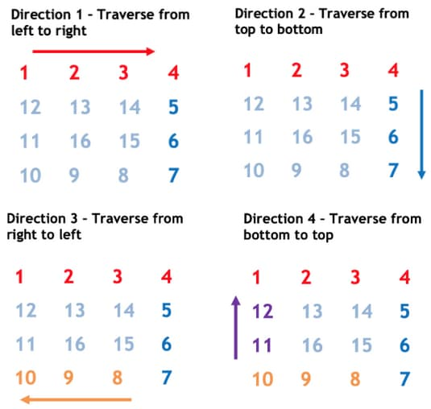

# 59. Spiral Matrix II

<p>Given a positive integer <code>n</code>, generate an <code>n x n</code> <code>matrix</code> filled with elements from <code>1</code> to <code>n<sup>2</sup></code> in spiral order.</p>

<p>&nbsp;</p>
<p><strong class="example">Example 1:</strong></p>

<pre><strong>Input:</strong> n = 3
<strong>Output:</strong> [[1,2,3],[8,9,4],[7,6,5]]
</pre>

<p><strong class="example">Example 2:</strong></p>

<pre><strong>Input:</strong> n = 1
<strong>Output:</strong> [[1]]
</pre>

<p>&nbsp;</p>
<p><strong>Constraints:</strong></p>

<ul>
  <li><code>1 &lt;= n &lt;= 20</code></li>
</ul>

<br>

---

# Solution

- [Spiral Traversal Approach](#spiral-traversal)
  - **Time Complexity**: `O(n^2)`
  - **Space Complexity**: `O(1)`
- [Optimized Spiral Traversal Approach](#optimized-spiral-traversal)
  - **Space Complexity**: `O(1)`

## Problem Overview: Spiral Matrix II

**Task**: Given a positive integer `n`, generate an `n x n` matrix filled with elements from `1` to `n^2` in spiral order.

**Examples**:
1. **Example 1**:
    - **Input**: `n = 3`
    - **Output**: `[[1, 2, 3], [8, 9, 4], [7, 6, 5]]`

2. **Example 2**:
    - **Input**: `n = 1`
    - **Output**: `[[1]]`

**Constraints**:
- `1 <= n <= 20`

**Explanation**: 
The matrix should start with the number `1` at the top-left corner and proceed in a clockwise spiral order filling up to `n^2`. For example, with `n = 3`, the matrix is:
```
1 -> 2 -> 3
         |
8 <- 9   4
|       |
7 <- 6 <- 5
```

For `n = 1`, the matrix is simply:
```
1
```

# Spiral Traversal

To construct a pattern for a given `n`, we notice that the sequence follows a recurring pattern after each complete circular pass around the matrix. Let's refer to each of these circular passes as a "layer." We begin the traversal from the outermost layer and progressively move towards the inner layers with each iteration.

### Diagram of Spiral Traversal by Layer


## **Intuition**

The key idea is to recognize the repeating pattern of moving in a circular or spiral manner from the outermost layer towards the innermost layer. Here's a step-by-step guide to understanding the pattern:

1. **Understanding Layers**:
   - Imagine the matrix is composed of layers or concentric rectangles. The outermost elements form the first layer, the next set of elements forms the second layer, and so on.
   - Each layer can be traversed in four distinct steps: right, down, left, and up.

2. **Traversal Steps**:
   - **Right**: Start from the top-left corner of the current layer and move right until you reach the end of the layer.
   - **Down**: Move down the last column of the current layer.
   - **Left**: Move left along the bottom row of the current layer.
   - **Up**: Move up the first column of the current layer.

3. **Transitioning to the Next Layer**:
   - After completing one full circular traversal (one layer), move inward to the next layer and repeat the process.
   - The boundaries of each layer shrink after each traversal.

4. **Termination Condition**:
   - The process continues until all elements are traversed, which is typically when the current layer's boundaries meet or overlap.

### Summary of the Process

1. Identify the outermost layer and begin traversal in the order: right, down, left, and up.
2. After completing one full layer, move inward to the next layer and repeat the traversal steps.
3. Continue the process until all elements are filled in a spiral manner.

### Example

Let's break down the example `n = 3` to illustrate the process:

**Matrix Layout**:
```
Layer 1: [1, 2, 3]
         [8,    , 4]
         [7, 6, 5]
Layer 2: [ 9 ]
```

**Steps**:
1. **Start at the top-left corner of Layer 1**:
   - Move right: `[1, 2, 3]`
   - Move down: `[4]`
   - Move left: `[5, 6, 7]`
   - Move up: `[8]`

2. **Move to Layer 2** (inner layer):
   - Move right: `[9]`

Resulting Matrix:
```
[[1, 2, 3],
 [8, 9, 4],
 [7, 6, 5]]
```

## **Algorithm**

To perform a spiral traversal and generate the matrix, follow these steps:

### Step-by-Step Process:

1. **Calculate Total Layers**:
   - For any given `n`, the total number of layers is determined by \((n + 1) / 2\).
   - This formula works for both even and odd values of `n`.

   **Example**:
   - For `n = 3`, the total layers = 2
   - For `n = 6`, the total layers = 3

2. **Traverse Each Layer**:
   - For each layer, traverse in four directions: right, down, left, and up.
   - In each direction, either the row or column remains constant while the other parameter changes (increments or decrements).



### Traversal Directions:

1. **Direction 1: From Top Left to Top Right**:
   - **Row** remains constant as `layer`
   - **Column** increments from `layer` to `n - layer - 1`

2. **Direction 2: From Top Right to Bottom Right**:
   - **Column** remains constant as `n - layer - 1`
   - **Row** increments from `layer + 1` to `n - layer`

3. **Direction 3: From Bottom Right to Bottom Left**:
   - **Row** remains constant as `n - layer - 1`
   - **Column** decrements from `n - layer - 2` to `layer`

4. **Direction 4: From Bottom Left to Top Left**:
   - **Column** remains constant as `layer`
   - **Row** decrements from `n - layer - 2` to `layer + 1`

### Repeat Process:
- Repeat the above traversal directions for \((n + 1) / 2\) times until all layers are traversed and the matrix is filled.

#### Diagram of matrix by each layer coordinate


### Example for `n = 3`:
```
1 -> 2 -> 3
         |
8 <- 9   4
|       |
7 <- 6 <- 5
```

### **Pseudocode**

```pseudocode
function generateSpiralMatrix(n):
    create a matrix of size n x n filled with 0
    initialize variables: top = 0, bottom = n - 1, left = 0, right = n - 1, num = 1

    while num <= n * n:
        // Traverse from left to right
        for col from left to right:
            matrix[top][col] = num
            num += 1
        top += 1

        // Traverse from top to bottom
        for row from top to bottom:
            matrix[row][right] = num
            num += 1
        right -= 1

        // Traverse from right to left
        for col from right to left:
            matrix[bottom][col] = num
            num += 1
        bottom -= 1

        // Traverse from bottom to top
        for row from bottom to top:
            matrix[row][left] = num
            num += 1
        left += 1

    return matrix
```

## **Implementation**

### Java

```java
class Solution {
  public int[][] generateMatrix(int n) {
    int[][] matrix = new int[n][n];
    int num = 1;
    int top = 0, bottom = n - 1, left = 0, right = n - 1;

    while (num <= n * n) {
      // Traverse from left to right
      for (int col = left; col <= right; col++) {
        matrix[top][col] = num++;
      }
      top++; // Move the top boundary down

      // Traverse from top to bottom
      for (int row = top; row <= bottom; row++) {
        matrix[row][right] = num++;
      }
      right--; // Move the right boundary left

      // Traverse from right to left
      for (int col = right; col >= left; col--) {
        matrix[bottom][col] = num++;
      }
      bottom--; // Move the bottom boundary up

      // Traverse from bottom to top
      for (int row = bottom; row >= top; row--) {
        matrix[row][left] = num++;
      }
      left++; // Move the left boundary right
    }

    return matrix;
  }
}
```

### TypeScript

```typescript
function generateMatrix(n: number): number[][] {
  const matrix: number[][] = Array.from({ length: n }, () => Array(n).fill(0));
  let num = 1;
  let top = 0,
    bottom = n - 1,
    left = 0,
    right = n - 1;

  while (num <= n * n) {
    // Traverse from left to right
    for (let col = left; col <= right; col++) {
      matrix[top][col] = num++;
    }
    top++; // Move the top boundary down

    // Traverse from top to bottom
    for (let row = top; row <= bottom; row++) {
      matrix[row][right] = num++;
    }
    right--; // Move the right boundary left

    // Traverse from right to left
    for (let col = right; col >= left; col--) {
      matrix[bottom][col] = num++;
    }
    bottom--; // Move the bottom boundary up

    // Traverse from bottom to top
    for (let row = bottom; row >= top; row--) {
      matrix[row][left] = num++;
    }
    left++; // Move the left boundary right
  }

  return matrix;
}
```

## **Complexity Analysis**

### **Assumptions**
- The matrix is an `n x n` square matrix.
- We are filling the matrix in a spiral order from 1 to `n^2`.

### **Time Complexity**: `O(n^2)`
- **Traversal Count**: The time complexity is `O(n^2)` because we need to fill `n^2` elements in the matrix.
- **Element Operations**: Each element is written exactly once, and the traversal of the matrix involves a constant number of operations per element.

### **Space Complexity**: `O(1)`
- **Constant Space Usage**: The space complexity is `O(1)` because the extra space used by the algorithm is constant.
- **Matrix Exclusion**: The matrix itself is considered the input and output, so it does not count as extra space.
- **Variable Storage**: Additional variables such as `top`, `bottom`, `left`, `right`, and `num` take up a constant amount of space regardless of the size of the matrix.

# Optimized Spiral Traversal

## **Intuition**

Our goal is to traverse the matrix in a spiral order and fill it with elements from `1` to `n^2`. To achieve this, we need to move in four directions sequentially: right, down, left, and up. We'll use an array to pre-define the changes in row and column coordinates for each direction.

### Directions

1. **Right (direction 1)**: Row coordinate remains the same, column increments (`row change = 0, column change = 1`).
2. **Down (direction 2)**: Row coordinate increments, column remains the same (`row change = 1, column change = 0`).
3. **Left (direction 3)**: Row coordinate remains the same, column decrements (`row change = 0, column change = -1`).
4. **Up (direction 4)**: Row coordinate decrements, column remains the same (`row change = -1, column change = 0`).

We'll store these changes in an array `dir` that contains pairs of (row change, column change) for each direction.

### Traversal Logic

- **Initialization**: 
  - Create a matrix of size `n x n` filled with zeros.
  - Set the initial position at the top-left corner (row = 0, col = 0).
  - Initialize the current direction index `d` to 0 (indicating "right").
  - Use a variable `num` to fill the matrix, starting from 1 up to `n^2`.

- **Traversal**:
  - Continue filling the matrix while `num` is less than or equal to `n^2`.
  - For each step:
    - Assign `num` to the current position.
    - Calculate the next position based on the current direction.
    - If the next position is out of bounds or already filled, change the direction using `(d + 1) % 4`.
    - Update the row and column coordinates to the next position.

### Special Handling

Use `Math.floorMod()` instead of the regular modulo operator `%` to handle negative indices gracefully.

## **Algorithm**

1. **Initialization**:
    - Create a matrix of size `n x n` filled with zeros.
    - Set the initial position at the top-left corner (`row = 0`, `col = 0`).
    - Initialize the current direction index `d` to 0 (indicating "right").
    - Use a variable `num` to fill the matrix, starting from `1` up to `n^2`.

2. **Define Direction Changes**:
    - Create an array `dir` to store the changes in row and column coordinates for each direction:
        - `Right (direction 1)`: `dir[0] = {0, 1}`
        - `Down (direction 2)`: `dir[1] = {1, 0}`
        - `Left (direction 3)`: `dir[2] = {0, -1}`
        - `Up (direction 4)`: `dir[3] = {-1, 0}`

3. **Spiral Traversal**:
    - Continue filling the matrix while `num` is less than or equal to `n^2`.
    - For each step:
        - Assign `num` to the current position (`matrix[row][col] = num++`).
        - Calculate the next position based on the current direction (`nextRow = row + dir[d][0]`, `nextCol = col + dir[d][1]`).
        - Check if the next position is out of bounds or already filled:
            - If it is, change the direction using `(d + 1) % 4`.
            - Calculate the next position again based on the new direction.
        - Update the current position to the next position (`row = nextRow`, `col = nextCol`).

4. **Return the Matrix**:
    - Once the entire matrix is filled, return the matrix.

### **Pseudocode**

```pseudocode
function generateMatrix(n):
    // Step 1: Initialization
    matrix = create n x n matrix filled with zeros
    num = 1
    row = 0
    col = 0
    dir = [(0, 1), (1, 0), (0, -1), (-1, 0)]  // Direction changes: right, down, left, up
    d = 0  // Current direction index

    // Step 2: Spiral Traversal
    while num <= n * n:
        matrix[row][col] = num
        num = num + 1
        nextRow = row + dir[d][0]
        nextCol = col + dir[d][1]

        // Check if the next position is out of bounds or already filled
        if nextRow < 0 or nextRow >= n or nextCol < 0 or nextCol >= n or matrix[nextRow][nextCol] != 0:
            d = (d + 1) % 4  // Change direction
            nextRow = row + dir[d][0]
            nextCol = col + dir[d][1]

        // Update current position
        row = nextRow
        col = nextCol

    return matrix
```

## **Implementation**

### Java

```java
class Solution {
  public int[][] generateMatrix(int n) {
    int[][] matrix = new int[n][n];
    int num = 1;
    int row = 0, col = 0;
    int[][] dir = { {0, 1}, {1, 0}, {0, -1}, {-1, 0} };
    int d = 0;

    while (num <= n * n) {
      matrix[row][col] = num++;
      int nextRow = row + dir[d][0];
      int nextCol = col + dir[d][1];

      if (nextRow < 0 || nextRow >= n || nextCol < 0 || nextCol >= n || matrix[nextRow][nextCol] != 0) {
        d = (d + 1) % 4;
        nextRow = row + dir[d][0];
        nextCol = col + dir[d][1];
      }

      row = nextRow;
      col = nextCol;
    }

    return matrix;
  }
}
```

### TypeScript

```typescript
function generateMatrix(n: number): number[][] {
  const matrix: number[][] = Array.from({ length: n }, () => Array(n).fill(0));
  let num = 1;
  let row = 0, col = 0;
  const dir = [
    [0, 1],  // Right
    [1, 0],  // Down
    [0, -1], // Left
    [-1, 0]  // Up
  ];
  let d = 0; // Initial direction is 'right'

  while (num <= n * n) {
    matrix[row][col] = num++;
    let nextRow = row + dir[d][0];
    let nextCol = col + dir[d][1];

    if (
      nextRow < 0 || nextRow >= n ||
      nextCol < 0 || nextCol >= n ||
      matrix[nextRow][nextCol] !== 0
    ) {
      d = (d + 1) % 4; // Change direction
      nextRow = row + dir[d][0];
      nextCol = col + dir[d][1];
    }

    row = nextRow;
    col = nextCol;
  }

  return matrix;
}
```

#### Optimized Code Explanation:

1. **Initialize the matrix**: Create an `n x n` matrix filled with zeros.
2. **Direction Array**: Define an array `dir` that stores the changes in row and column coordinates for each direction: right, down, left, and up.
3. **Set Starting Values**: Initialize `num` to 1, `row` to 0, `col` to 0, and the initial direction index `d` to 0 (indicating "right").
4. **Fill the Matrix**: Continue filling the matrix while `num` is less than or equal to `n^2`.
   - Assign `num` to the current position.
   - Calculate the next position based on the current direction.
   - Check if the next position is out of bounds or already filled:
     - If it is, change the direction using `(d + 1) % 4`.
     - Calculate the next position again based on the new direction.
   - Update the current position to the next position.


### **Space Complexity**: `O(1)`
- **Constant Space Usage**: The space complexity is `O(1)` because the extra space used by the algorithm is constant.
- **Matrix Exclusion**: The matrix itself is considered the input and output, so it does not count as extra space.
- **Variable Storage**: Additional variables such as `row`, `col`, `num`, and `d` take up a constant amount of space regardless of the size of the matrix.

