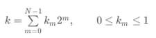
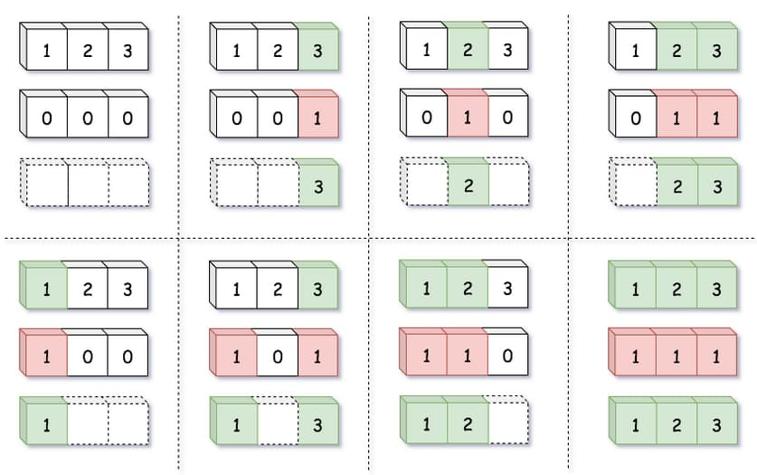
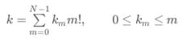
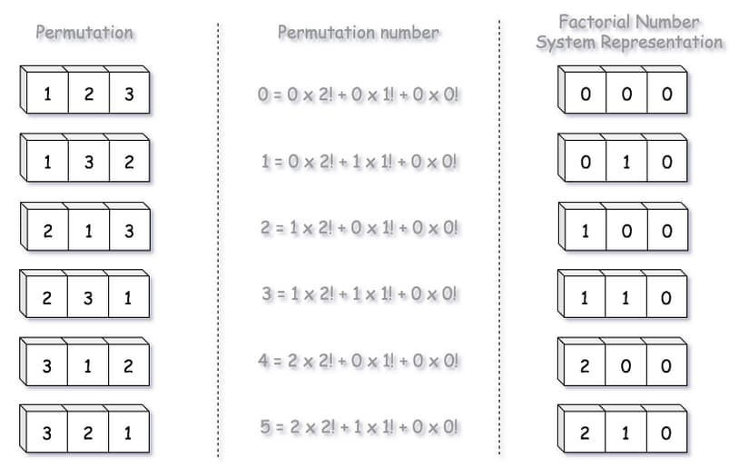
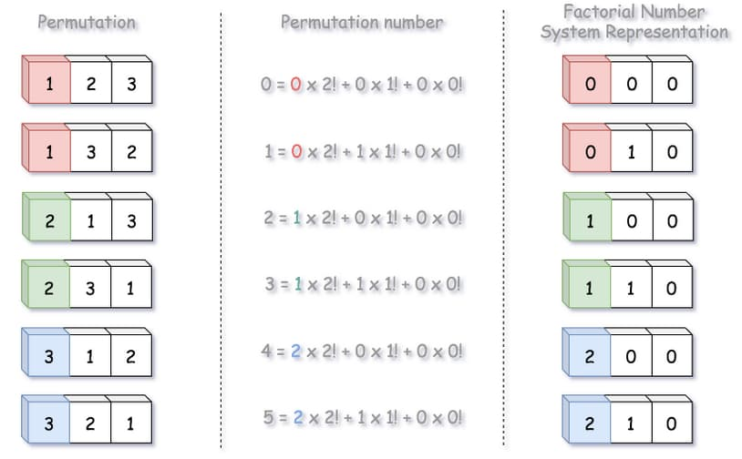
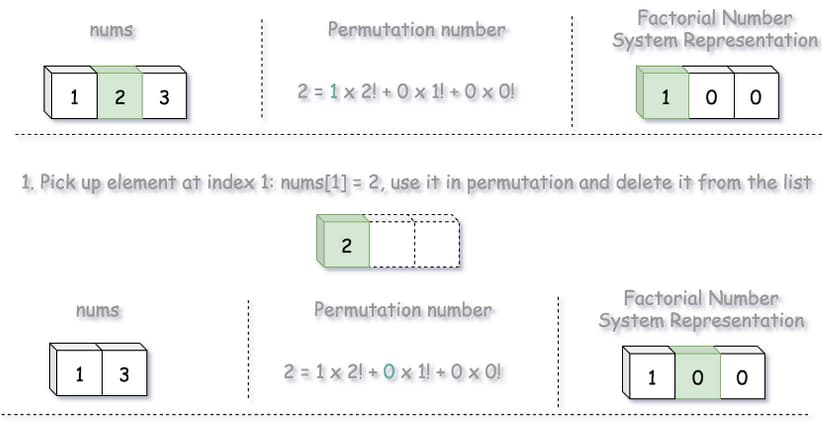
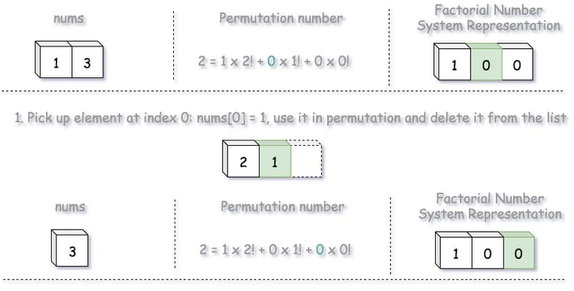
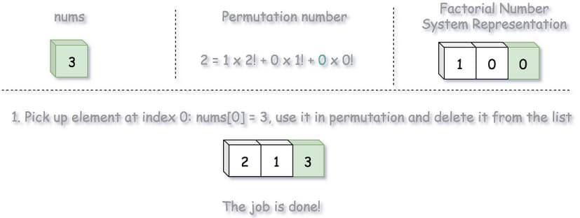

# 60. Permutation Sequence

<p>The set <code>[1, 2, 3, ...,&nbsp;n]</code> contains a total of <code>n!</code> unique permutations.</p>

<p>By listing and labeling all of the permutations in order, we get the following sequence for <code>n = 3</code>:</p>

<ol>
  <li><code>"123"</code></li>
  <li><code>"132"</code></li>
  <li><code>"213"</code></li>
  <li><code>"231"</code></li>
  <li><code>"312"</code></li>
  <li><code>"321"</code></li>
</ol>

<p>Given <code>n</code> and <code>k</code>, return the <code>k<sup>th</sup></code> permutation sequence.</p>

<p>&nbsp;</p>
<p><strong class="example">Example 1:</strong></p>
<pre><strong>Input:</strong> n = 3, k = 3
<strong>Output:</strong> "213"
</pre><p><strong class="example">Example 2:</strong></p>
<pre><strong>Input:</strong> n = 4, k = 9
<strong>Output:</strong> "2314"
</pre><p><strong class="example">Example 3:</strong></p>
<pre><strong>Input:</strong> n = 3, k = 1
<strong>Output:</strong> "123"
</pre>
<p>&nbsp;</p>
<p><strong>Constraints:</strong></p>

<ul>
  <li><code>1 &lt;= n &lt;= 9</code></li>
  <li><code>1 &lt;= k &lt;= n!</code></li>
</ul>

---

# Solution

- [Factorial Number System Approach](#factorial-number-system-approach)
  - **Time Complexity**: `O(n)`
  - **Space Complexity**: `O(n)`

### Problem Overview: Permutation Sequence

**Objective:**  
You are tasked with determining the `k`th lexicographically ordered permutation of the sequence `{1, 2, ..., n}` without generating all permutations explicitly.

#### **Key Details:**
1. **Input:**  
   Two integers, `n` and `k`.  
   - `n = 3, k = 3` (Example 1)  
   - `n = 4, k = 9` (Example 2)  

2. **Output:**  
   A string representing the `k`th permutation of `{1, 2, ..., n}` in lexicographical order.  
   - Example 1 Output: `"213"`  
   - Example 2 Output: `"2314"`  

3. **Constraints:**  
   - `1 ≤ n ≤ 9`  
   - `1 ≤ k ≤ n!`  

#### **Examples:**
- **Example 1:**
  ```  
  Input: n = 3, k = 3  
  Output: "213"  
  ```  
  The third permutation of `{1, 2, 3}` in lexicographical order is `"213"`.

- **Example 2:**
  ```  
  Input: n = 4, k = 9  
  Output: "2314"  
  ```  
  The ninth permutation of `{1, 2, 3, 4}` in lexicographical order is `"2314"`.

#### **Approach Overview:**
- Each number appears `(n-1)!` times in a given position.
- Determine the leading digit by computing `k // (n-1)!` and adjust `k` accordingly.
- Recursively apply the same method to remaining digits.
- **Time Complexity:** `O(n)`, as we determine each position iteratively instead of generating all permutations.

#### **Problem Breakdown:**
1. **Permutations:** The sequence consists of all `n!` possible arrangements of the numbers `{1, 2, ..., n}` in sorted order.
2. **Lexicographical Ordering:** The permutations are arranged in increasing order like a dictionary, meaning "123" comes before "132" and so on.
3. **Efficient Selection:** The challenge is to determine the `k`th permutation directly without generating all permutations (which would be computationally expensive for larger `n`).

#### **Key Observations:**
- Each digit in the permutation fixes the remaining numbers, dividing the total permutations into `n` groups.
- The first digit can be determined by dividing `k` by `(n-1)!`, since each number appears `(n-1)!` times in one segment.
- Once the first digit is chosen, the problem reduces to finding the `(k mod (n-1)!)`th permutation for the remaining numbers.
- This process continues iteratively until all digits are placed.

#### **Example Walkthrough (`n = 4, k = 9`):**
1. The total permutations = `4! = 24`, and each digit in the first position appears `(3!) = 6` times.
2. `k = 9` → The first digit index is `⌊9 / 6⌋ = 1`, so the first digit is **"2"** (after "1").
3. Remaining numbers: `{1, 3, 4}`, and we now need the `k = 9 - (1 * 6) = 3`rd permutation in this reduced set.
4. Since each number appears `(2!) = 2` times, `⌊3 / 2⌋ = 1`, meaning the second digit is **"3"**.
5. Left with `{1, 4}`, and `k = 3 - (1 * 2) = 1` → The third digit is **"1"**.
6. The last remaining number is **"4"**, completing `"2314"`.

#### **Complexity Analysis:**
- The approach uses factorial division and iteration, avoiding brute-force generation of all permutations.
- Time Complexity: **O(n)** (choosing each position step by step).
- Space Complexity: **O(n)** (tracking available digits).

## **Types of Permutation Problems in Interviews**

Permutation-based problems often fall into three primary categories:

1. **Generate All Permutations**  
2. **Generate the Next Permutation**  
3. **Find the `k`th Permutation (Current Problem)**  

Each category has distinct approaches optimized for efficiency.

### **1. Generating All Permutations**
- If the order of generated permutations is irrelevant, a **swap-based backtracking** approach efficiently produces all `N!` permutations in **O(N × N!)** time.
- However, for lexicographically sorted permutations, a better method is **D.E. Knuth's algorithm**, which efficiently transitions from one permutation to the next in **O(N)** time.

### **2. Generating the Next Permutation**
- The **Knuth algorithm** is useful for incrementally obtaining the next permutation from the current one.
- This method efficiently determines the immediate successor permutation while maintaining lexicographical order.

### **3. Finding the `k`th Permutation (Polynomial-Time Solution)**
This problem is particularly interesting because previous approaches do not directly apply:

- **Constraints to Consider**:
  - Backtracking is impractical due to polynomial time complexity requirements.
  - The previous permutation is unknown, making direct application of the Knuth algorithm impossible.

#### **Optimized Approach: Factorial Number System Mapping**
Instead of generating permutations directly, we **map numbers to permutations** using **Factorial Number System representation**—an encoding technique widely used in cryptography and password-cracking algorithms.

**Example Mapping Strategy**:
- A **subset** can be represented using a **binary bitmask** (`0` means absence, `1` means presence).
- A **permutation** can be encoded similarly, using factorial-based indexing.

This allows for direct computation of the desired permutation **without generating all permutations**, leading to an **O(n) solution**.

# Factorial Permutation Indexing Approach

## **Intuition**

### **Standard Decimal/Binary Positional System**

Typically, a standard decimal or binary positional system serves various computational needs.  

For instance, subsets can be efficiently represented using **binary encoding**, where each subset corresponds to a number in its **binary form**.

#### **Binary Representation Formula**:


\[
k = \sum_{m=0}^{N-1} k_m \cdot 2^m, \quad 0 \leq k_m \leq 1
\]

#### **Example Encoding:**


| Set       | Binary Mask | Elements Present |
|-----------|------------|------------------|
| [1 2 3]   | [0 0 0]    | [ _ _ _ ]        |
| [1 2 3]   | [0 0 1]    | [ _ _ 3 ]        |
| [1 2 3]   | [0 1 0]    | [ _ 2 _ ]        |
| [1 2 3]   | [0 1 1]    | [ _ 2 3 ]        |
| [1 2 3]   | [1 0 0]    | [ 1 _ _ ]        |
| [1 2 3]   | [1 0 1]    | [ 1 _ 3 ]        |
| [1 2 3]   | [1 1 0]    | [ 1 2 _ ]        |
| [1 2 3]   | [1 1 1]    | [ 1 2 3 ]        |

However, this approach becomes **problematic for permutations** because the number of permutations grows exponentially—**`N!` increases much faster than `2^N`**.  
As a result, a **constant-base positional system** (like binary or decimal) fails to provide a sufficiently large solution space to accommodate all permutations.

### **Why We Need the Factorial Number System**

The **factorial number system** is a positional system where the base is **not constant** but rather **factorial-based (`m!`)**. This allows us to uniquely encode permutations in an efficient way.

### **Factorial Number System Formula**


\[
k = \sum_{m=0}^{N-1} k_m \cdot m!, \quad 0 \leq k_m \leq m
\]

#### **Key Observations:**
- The weights **increase dynamically** based on the factorial base.
- Unlike standard positional systems (e.g., binary or decimal), the factorial system **adapts to the structure of permutations**.
- Magnitudes of coefficients (`k_m`) depend on their position:
  - \( k_0 = 0 \)
  - \( 0 \leq k_1 \leq 1 \)
  - \( 0 \leq k_2 \leq 2 \), etc.

### **Mapping Permutations to Factorial Number Representation**

Now that we understand the **Factorial Number System**, we can systematically **map all permutations** from **permutation number `0`** to **permutation number `N! - 1`**.

Below is an example of how permutations translate into factorial number system values:



| Permutation | Permutation Number | Factorial Number System Representation |
|------------|--------------------|----------------------------------------|
| 123        | 0 = (0 × 2!) + (0 × 1!) + (0 × 0!) | [0 0 0] |
| 132        | 1 = (0 × 2!) + (1 × 1!) + (0 × 0!) | [0 1 0] |
| 213        | 2 = (1 × 2!) + (0 × 1!) + (0 × 0!) | [1 0 0] |
| 231        | 3 = (1 × 2!) + (1 × 1!) + (0 × 0!) | [1 1 0] |
| 312        | 4 = (2 × 2!) + (0 × 1!) + (0 × 0!) | [2 0 0] |
| 321        | 5 = (2 × 2!) + (1 × 1!) + (0 × 0!) | [2 1 0] |

Each permutation corresponds to a **unique factorial-based representation**, allowing us to efficiently determine the `k`th permutation without generating all permutations explicitly.

#### **Formula for Encoding Permutations:**
- **Permutation number `0`** (first permutation in lexicographic order):
  \[
  k = \sum_{m=0}^{N-1} (0 \times m!)
  \]
- **Permutation number `N! - 1`** (last permutation in lexicographic order):
  \[
  k = \sum_{m=0}^{N-1} (m \times m!)
  \]

This ensures that every **unique permutation** has a corresponding factorial representation.

### **Next Step: Constructing the Permutation from its Factorial Representation**

Now that we can **encode permutations** using factorial representation, the next step is to efficiently **construct the actual permutation** from its encoded form.

### **Example: Generating the `k`th Permutation (`N = 3, k = 3`)**
Consider `N = 3`, which corresponds to the input array `nums = [1, 2, 3]`.  
Since permutations are **indexed from `0` to `N! - 1`** (instead of from `1` to `N!`, as described in the problem statement),  
the given `k = 3` corresponds to **permutation index `2`** in **zero-based indexing**.

#### **Step 1: Compute Factorial Representation**
Using the factorial number system:

\[
k = 2 = (1 \times 2!) + (0 \times 1!) + (0 \times 0!)
\]

Thus, the factorial representation of `k = 2` is `[1, 0, 0]`.

#### **Step 2: Understanding Factorial Representation**
Each coefficient in the factorial number system represents the **index of elements in the input array after removing previously used elements**.  
Since each element **can only be used once**, we progressively select elements based on these indices.

### **Permutation Mapping Example**
Below is the mapping of permutations, their corresponding permutation number,  
and the **factorial number system representation** with **bolded coefficients** indicating the index selections:

| Permutation | Permutation Number | Factorial Number System Representation |
|------------|--------------------|----------------------------------------|
| **1**23        | 0 = (**0** × 2!) + (0 × 1!) + (0 × 0!) | [**0** 0 0] |
| **1**32        | 1 = (**0** × 2!) + (1 × 1!) + (0 × 0!) | [**0** 1 0] |
| **2**13        | 2 = (**1** × 2!) + (0 × 1!) + (0 × 0!) | [**1** 0 0] |
| **2**31        | 3 = (**1** × 2!) + (1 × 1!) + (0 × 0!) | [**1** 1 0] |
| **3**12        | 4 = (**2** × 2!) + (0 × 1!) + (0 × 0!) | [**2** 0 0] |
| **3**21        | 5 = (**2** × 2!) + (1 × 1!) + (0 × 0!) | [**2** 1 0] |



#### **Key Takeaways**
- The **factorial representation indices dynamically update** as elements are removed from the pool.
- **Selecting digits in order** using the factorial-based indices ensures **efficient construction** of the `k`th permutation **without brute-force enumeration**.

### **Step-by-Step Construction of Permutation from Factorial Representation**

Now that we have the **factorial representation** of the permutation number,  
we use it to construct the actual permutation **efficiently**.

For this example, we take:
- **N = 3**, meaning `nums = [1, 2, 3]`
- **Permutation Number `k = 3`**, which translates to **index `2`** in zero-based numbering.

#### **Step 1: Compute Factorial Representation**
Using the factorial number system:

\[
k = 2 = (1 \times 2!) + (0 \times 1!) + (0 \times 0!)
\]

Thus, the factorial representation of `k = 2` is **`[1, 0, 0]`**.

#### **Step 2: Construct the Permutation Using Factorial Representation**
Each coefficient in the factorial representation **indexes the element to be selected**,  
but these indices **update dynamically** as elements are removed.

##### **First Selection (`1st Digit`)**
- **Coefficient: `1`**
- Select the **element at index `1`** from `nums = [1, 2, 3]`
- **Chosen number: `2`**
- Remove `2` from `nums`

| Remaining `nums` | Permutation Number | Factorial Number System Representation |
|------------------|--------------------|----------------------------------------|
| 1 **2** 3       | 2 = (**1** × 2!) + (0 × 1!) + (0 × 0!) | [**1** 0 0] |

Updated permutation:  
**`[2 _ _]`**



##### **Second Selection (`2nd Digit`)**
- **Coefficient: `0`**
- Select the **element at index `0`** from the **updated** `nums = [1, 3]`
- **Chosen number: `1`**
- Remove `1` from `nums`

| Remaining `nums` | Permutation Number | Factorial Number System Representation |
|------------------|--------------------|----------------------------------------|
| 1 3             | 2 = (1 × 2!) + (**0** × 1!) + (0 × 0!) | [1 **0** 0] |

Updated permutation:  
**`[2 1 _]`**



##### **Final Selection (`3rd Digit`)**
- **Coefficient: `0`**
- Select the **element at index `0`** from the **updated** `nums = [3]`
- **Chosen number: `3`**
- Remove `3` from `nums`

| Remaining `nums` | Permutation Number | Factorial Number System Representation |
|------------------|--------------------|----------------------------------------|
| **3**           | 2 = (1 × 2!) + (0 × 1!) + (**0** × 0!) | [1 0 **0**] |

Final permutation:  
**`[2 1 3]`**



#### **Key Takeaways**
- **Factorial coefficients index elements dynamically**, accounting for previous selections.
- **Chosen digits sequentially fill the permutation**, ensuring an efficient `O(n)` computation.
- **This avoids brute-force generation**, directly determining the `k`th permutation.

## **Algorithm**

To generate the `k`th permutation using **factorial-based indexing** instead of brute-force generation. It uses a direct computation approach with factorial representation.

1. **Generate Input Array**  
   Create an array `nums` containing numbers `[1, 2, ..., N]`.

2. **Compute Factorial Bases**  
   Precompute all factorial values from `0!` to `(N-1)!` to help determine element selection efficiently.

3. **Adjust `k` to Zero-Based Indexing**  
   Since permutations are **indexed from `0`** (not `1` as in the problem statement), decrement `k` by **1**.

4. **Compute Factorial Representation of `k`**  
   - Determine the index of each digit using factorial decomposition.
   - Remove selected elements from `nums` to ensure uniqueness.

5. **Construct the Permutation Using Factorial Representation**  
   - Sequentially pick elements indexed by factorial coefficients.
   - Remove each picked element from `nums` to avoid duplication.

6. **Return the Permutation String**  
   - Convert the final ordered list into a string format.

### **Pseudocode**

```plaintext
function getPermutation(n, k):
    # Step 1: Initialize the input array
    nums = [1, 2, ..., n]

    # Step 2: Compute factorials for indexing
    factorials = [1]
    For i from 1 to n:
        factorials[i] = factorials[i - 1] * i

    # Step 3: Convert k to zero-based index
    k = k - 1

    # Step 4: Construct the permutation using factorial representation
    permutation = []
    For i from n down to 1:
        index = k / factorials[i - 1]  # Determine selection index
        Append nums[index] to permutation
        Remove nums[index] from nums  # Ensure unique elements
        k = k % factorials[i - 1]  # Update k for next selection

    # Step 5: Return the final permutation as a string
    Return permutation as a concatenated string
```

## **Implementation**

### Java

```java
import java.util.ArrayList;
import java.util.List;

class Solution {
  public String getPermutation(int n, int k) {
    // Generate input list with numbers [1, 2, ..., n]
    List<Integer> nums = new ArrayList<>();
    for (int i = 1; i <= n; i++) {
      nums.add(i);
    }

    // Compute factorials from 0! to (N-1)!
    int[] factorials = new int[n + 1];
    factorials[0] = 1;
    for (int i = 1; i <= n; i++) {
      factorials[i] = factorials[i - 1] * i;
    }

    // Convert k to zero-based index
    k--;

    // Build the permutation using factorial representation
    StringBuilder permutation = new StringBuilder();

    for (int i = n; i > 0; i--) {
      int index = k / factorials[i - 1]; // Determine which element to pick
      permutation.append(nums.get(index)); // Add selected number
      nums.remove(index); // Remove used element to maintain uniqueness
      k %= factorials[i - 1]; // Update k for next selection
    }

    return permutation.toString();
  }
}
```

## **Complexity Analysis**

### **Assumptions**
- **Permutation Size (`n`)**: The permutation consists of `n` distinct elements.
- **Factorial Representation**: We use the factorial number system to efficiently index and generate permutations.

### **Time Complexity**: `O(n)`

- **Factorial Precomputation**: We calculate factorial values for `0!` to `(n-1)!` in **O(n)** time.
- **Element Selection Using Factorial Indexing**: We iterate through `n` positions, selecting elements dynamically in **O(n)** time.
- **No Brute Force Generation**: Unlike a brute-force approach that generates all `n!` permutations, this method **directly computes** the `k`th permutation in **linear time**.

Thus, the **overall time complexity** is **`O(n)`**, making this approach **significantly faster** than naive solutions.

### **Space Complexity**: `O(n)`

- **Input Array (`nums`)**: We store `n` elements initially, then progressively remove elements as we construct the permutation (**O(n)**).
- **Factorial Array (`factorials`)**: We store factorial values up to `n!`, requiring **O(n)** space.
- **Final Output (`permutation`)**: The constructed permutation string has a length of `n`, contributing **O(n)** space.

Since all storage requirements scale linearly with `n`, the **overall space complexity** is **`O(n)`**.

### **Comparison to Brute Force (`O(n!)`)**
- A brute-force approach that **generates all permutations** and picks the `k`th one requires **O(n!)** time.
- Our optimized factorial number system method **avoids unnecessary computation**, reducing complexity to **O(n)**.

### **Edge Case Considerations**
#### **Minimum `n` Value (`n = 1`)**
- With `n = 1`, there's only **one permutation (`"1"`)** regardless of `k`.
- The function still runs but effectively returns `"1"` immediately.

#### **Maximum `n` Value (`n = 9`)**
- Since `9! = 362880`, larger values of `k` can be computationally expensive.
- However, since the algorithm runs in **O(n)**, it remains efficient even for the largest permissible value.

#### **First and Last Permutations (`k = 1`, `k = n!`)**
- `k = 1`: Returns the **smallest lexicographical permutation** (i.e., `"123...n"`).
- `k = n!`: Returns the **largest lexicographical permutation** (i.e., `"n...321"`).

#### **Invalid `k` Values (`k < 1` or `k > n!`)**
- The algorithm assumes `1 ≤ k ≤ n!`, but handling invalid `k` gracefully is necessary.
- **Solution:** Early validation to prevent out-of-bounds errors.

### **Runtime Performance Comparison**
Let's compare **our optimized approach** to a **naive brute-force method**:

| **Approach**                 | **Time Complexity** | **Space Complexity** | **Performance** |
|------------------------------|---------------------|----------------------|----------------|
| **Brute Force (`O(n!)`)**    | `O(n!)`            | `O(n!)`              | **Slow for `n > 9`** |
| **Optimized Factorial Indexing (`O(n)`)** | `O(n)` | `O(n)` | **Efficient up to `n = 9`** |

#### **Key Observations**
**Brute Force (`O(n!)`) Approach:**  
- Generates **all permutations**, then selects the `k`th one.
- **Extremely inefficient** for larger `n`, impractical beyond `n = 9`.

**Optimized Factorial Indexing (`O(n)`) Approach:**  
- **Directly computes the `k`th permutation** without generating all permutations.
- **Scalable and efficient** for all valid `n` values.
- Uses **factorial division** for selection, eliminating unnecessary computations.

#### **Why Factorial Indexing Wins**
- Instead of iterating through **n! possibilities**, we **precisely compute each element** in **O(n)** time.
- This allows **efficient permutation retrieval**, suitable even for large values of `n`.

#### **Summary**
- **Brute-force enumeration** is impractical for **large `n`** due to exponential time growth.
- **Factorial-based indexing** provides a direct, efficient solution using **mathematical properties**.
- Our **O(n) approach** ensures **quick retrieval** of any `k`th permutation **without excessive memory or computation**.