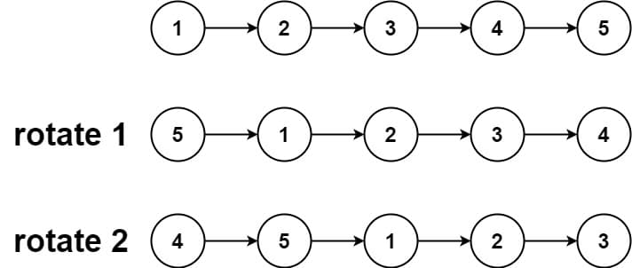
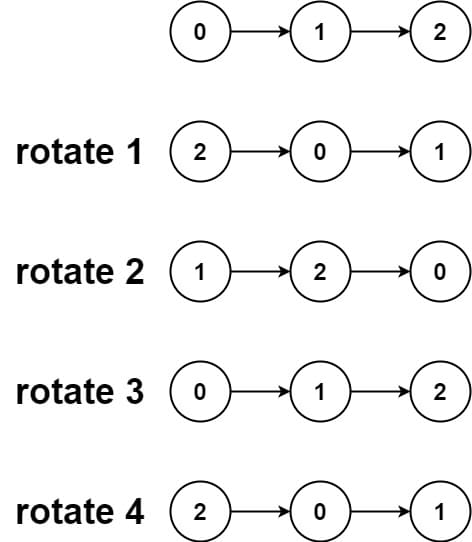

# 61. Rotate List

<p>Given the <code>head</code> of a linked&nbsp;list, rotate the list to the right by <code>k</code> places.</p>

<p>&nbsp;</p>
<p><strong class="example">Example 1:</strong></p>

<pre><strong>Input:</strong> head = [1,2,3,4,5], k = 2
<strong>Output:</strong> [4,5,1,2,3]
</pre>

<p><strong class="example">Example 2:</strong></p>

<pre><strong>Input:</strong> head = [0,1,2], k = 4
<strong>Output:</strong> [2,0,1]
</pre>

<p>&nbsp;</p>
<p><strong>Constraints:</strong></p>

<ul>
  <li>The number of nodes in the list is in the range <code>[0, 500]</code>.</li>
  <li><code>-100 &lt;= Node.val &lt;= 100</code></li>
  <li><code>0 &lt;= k &lt;= 2 * 10<sup>9</sup></code></li>
</ul>

---

# Solution

- [Circular Linked List Approach](#circular-linked-list-approach)
  - **Time Complexity**: `O(n)`
  - **Space Complexity**: `O(1)`

### Problem Overview: Rotate List

This problem involves manipulating a **singly linked list**. You are provided with the head of a linked list, and your task is to **rotate the list to the right by `k` places**. The rotation implies moving elements from the tail of the list to the head, maintaining the relative order of the rest of the elements.

#### Key Points:
1. **Inputs:**
   - `head`: The head node of a singly linked list.
   - `k`: The number of positions to rotate the list.

2. **Outputs:**
   - A singly linked list after being rotated right by `k` positions.

#### Example Walkthrough:
- **Example 1**:  
  **Input**: `head = [1,2,3,4,5], k = 2`  
  **Output**: `[4,5,1,2,3]`  
  Explanation: The last two nodes (`4` and `5`) are moved to the front of the list.

- **Example 2**:  
  **Input**: `head = [0,1,2], k = 4`  
  **Output**: `[2,0,1]`  
  Explanation: The list rotates once entirely (`k = 3` would restore the original list), and one additional rotation shifts `2` to the front.

#### Constraints:
- The number of nodes in the linked list: `0 ≤ n ≤ 500`.
- Node values range from `-100 ≤ Node.val ≤ 100`.
- `0 ≤ k ≤ 2 * 10⁹` (which may necessitate handling large values of `k` efficiently by reducing unnecessary rotations).

#### Challenges in Implementation:
- **Handling Edge Cases**:  
  - Empty list (`head == null` or `n == 0`).  
  - Single-node list (`n == 1` or `k == 0`).  
  - Large values of `k` compared to the size of the list (`k > n`).

- **Optimized Rotation**: To avoid unnecessary computational effort, calculate the effective rotations using the modulo operation: `k = k % n`.

# Circular Linked List Approach

1. **Transforming into a Circular List**: Visualize the linked list as a closed loop, where the tail connects back to the head. This transformation enables seamless rotations by allowing the starting point of the list to shift along the circle.

2. **Optimizing Rotations with Modulo**: Since rotating the list by a number `k` greater than its length (`n`) results in a repetitive configuration, the effective rotations are reduced to `k % n`, eliminating redundant operations.

3. **Identifying the Breaking Point**: The key lies in determining where to break the circular link. This is calculated based on the list's size (`n`) and the adjusted rotation count (`k % n`), ensuring the new head and tail are properly assigned.

## **Overview**

The circular linked list approach transforms the original singly linked list into a closed loop by connecting the tail node back to the head. This visualization and modification simplify the rotation process, as the list now functions like a circular sequence where the starting point can shift seamlessly. After determining the new positions of the head and tail, the loop is broken at the appropriate point to restore the singly linked structure with the desired rotation.

This approach is particularly effective for problems involving rotations, as it eliminates the need for manually rearranging nodes by leveraging the circular structure to adjust the starting point.

### **Modulo-Based Rotation Optimization**
The modulo-based rotation approach optimizes the number of rotations needed by recognizing that rotating the list `n` times (where `n` is the length of the list) returns it to its original configuration. As a result, any number of rotations `k` can be reduced to an equivalent smaller number using `k % n`. This mathematical insight minimizes redundant computations and ensures efficiency when `k` is significantly larger than the size of the list.

## **Intuition**

A linked list is inherently a chain where nodes are already connected. The problem of rotating the list can be visualized as a series of steps:

#### **Core Insight**
- **Rotation Concept**: Rotating a linked list to the right by `k` places essentially means moving the last `k` nodes from the end of the list and placing them at the front, while maintaining the order of all elements.
  
#### **Step-by-Step Understanding**
1. **Close the Linked List into a Ring**:  
   Imagine the entire linked list as a **circular structure** where the last node is connected back to the first node, forming a loop.
   
2. **Locate the New Head and Tail**:  
   The new head of the rotated list will be at position **`n - k`**, where `n` is the total number of nodes in the list.  
   - **New Tail**: Located just before the new head, at position **`n - k - 1`**.

3. **Break the Ring**:  
   To complete the rotation, break the loop by severing the connection between the new tail and the new head, restoring a regular singly linked list.

#### **Key Considerations for `k`**
- **When `k < n`**: Find the new head at position `n - k`.
- **When `k >= n`**: Rotation cycles back. Large values of `k` can be reduced using modulo operation:  
  `k = k % n` 
  - `k` could be rewritten as a sum `k = (k // n) * n + k % n`, where the first term doesn't result in any rotation.
  This ensures we only consider the "net" rotations required.

#### **Example (Step Visualization)**
Let's see how this applies when `head = [1,2,3,4,5]` and `k = 2`:
- **Initial Input**: `[1,2,3,4,5]`
- **Step 1**: Close into a ring: `1 → 2 → 3 → 4 → 5 → 1`.
- **Step 2**: Identify new positions:  
  - New head = position `n - k = 5 - 2 = 3` → `4`.  
  - New tail = position `n - k - 1 = 3 - 1 = 2` → `3`.  
- **Step 3**: Break the ring at new tail → Output: `[4,5,1,2,3]`.

## **Algorithm**

#### **Step 1: Close the List into a Ring**
1. Traverse the linked list to:
   - Identify the **old tail** (the last node in the list).
   - Count the **length of the list (`n`)**.
2. Connect the **old tail** back to the head to form a **circular linked list**.

#### **Step 2: Find the New Head and Tail**
1. Simplify the number of rotations by reducing `k` to an equivalent smaller number of rotations:
   - Use only the remainder when dividing `k` by the length of the list (`k mod n`). This avoids unnecessary full cycles.
2. Determine:
   - **New Tail**: The `(n - k - 1)`-th node from the original head.  
   - **New Head**: The `(n - k)`-th node from the original head.

#### **Step 3: Break the Ring**
1. Sever the connection between the **new tail** and the **new head** to break the circular list.
2. Return the **new head** as the start of the rotated list.

#### **Example Walkthrough**
For a linked list `[1,2,3,4,5]` with `k = 2`:
1. **Step 1**: Form a circular linked list: `1 → 2 → 3 → 4 → 5 → 1`.
2. **Step 2**:
   - Reduce `k` if necessary (e.g., for `k = 7` and `n = 5`, only 2 rotations matter).  
   - Find the new tail at position `n - k - 1 = 5 - 2 - 1 = 2` → node `3`.  
   - Find the new head at position `n - k = 5 - 2 = 3` → node `4`.
3. **Step 3**: Break the circle after node `3`. The resulting list: `[4,5,1,2,3]`.

### **Pseudocode**

```pseudo
function rotateList(head, k):
 If head is NULL OR head.next is NULL OR k == 0:
     Return head

 // Step 1: Close the List into a Ring
 Initialize oldTail = head
 Initialize length = 1
 
 While oldTail.next is not NULL:
     oldTail = oldTail.next
     length = length + 1
 
 // Form a circular linked list
 oldTail.next = head

 // Step 2: Find the New Head and Tail
 k = k MOD length // Reduce k to avoid unnecessary rotations

 // New tail is at position (length - k - 1)
 // New head is at position (length - k)
 Initialize newTail = head
 for i from 1 to (length - k - 1):
     newTail = newTail.next
 
 Initialize newHead = newTail.next

 // Step 3: Break the Ring
 newTail.next = NULL // Sever the circular link

 return newHead
```

## **Implementation**

### Java

```java
class ListNode {
  int val;
  ListNode next;

  ListNode(int val) {
    this.val = val;
    this.next = null;
  }
}

public class Solution {
  public ListNode rotateRight(ListNode head, int k) {
    // Handle edge cases where no rotation is needed:
    // - Empty list (head == null)
    // - Single-node list (head.next == null)
    // - Zero rotations requested (k == 0)
    if (head == null || head.next == null || k == 0) {
      return head;
    }

    // Step 1: Calculate the length of the list and close it into a circular list
    ListNode oldTail = head;
    int length = 1;
    while (oldTail.next != null) {
      oldTail = oldTail.next;
      length++;
    }
    oldTail.next = head; // Form a circular list

    // Step 2: Compute the effective rotations
    k = k % length;

    // Step 3: Find the new tail and head
    int stepsToNewTail = length - k - 1;
    ListNode newTail = head;
    for (int i = 0; i < stepsToNewTail; i++) {
      newTail = newTail.next;
    }
    
    // Assign new head after identifying the tail
    ListNode newHead = newTail.next;

    // Step 4: Break the circular list
    newTail.next = null;

    return newHead;
  }
}
```

### TypeScript

```typescript
function rotateRight(head: ListNode | null, k: number): ListNode | null {
  // Handle edge cases where no rotation is needed:
  // - Empty list
  // - Single-node list
  // - Zero rotations requested
  if (!head || !head.next || k === 0) {
    return head;
  }

  // Step 1: Calculate the length of the list and close it into a circular list
  let oldTail: ListNode = head;
  let length: number = 1;

  while (oldTail.next) {
    oldTail = oldTail.next;
    length++;
  }
  oldTail.next = head; // Form a circular list

  // Step 2: Compute the effective rotations
  k = k % length; // Avoid unnecessary rotations

  // Step 3: Find the new tail and head
  const stepsToNewTail: number = length - k - 1;
  let newTail: ListNode = head;

  for (let i = 0; i < stepsToNewTail; i++) {
    newTail = newTail.next as ListNode;
  }

  const newHead: ListNode | null = newTail.next;

  // Step 4: Break the circular list
  newTail.next = null;

  return newHead;
}
```

## **Complexity Analysis**

### **Assumptions**
- **Size**: The linked list contains `n` nodes.
- **Rotations**: The number of rotations is `k`.

### **Time Complexity**: `O(n)`
- **Traversing the list**: We traverse the entire list once to calculate its length (`n`) and connect the tail to the head, forming a circular list. This takes `O(n)` time.
- **Finding the new tail**: We locate the new tail by traversing `(n - k - 1)` nodes from the head, which also takes `O(n)` in the worst case.
- **Reducing rotations**: Computing `k % n` is a constant-time operation, `O(1)`.
- **Breaking the link**: Severing the circular link is another constant-time operation, `O(1)`.

*Overall*: The dominant factor is the traversal of the list, making the total time complexity **`O(n)`**.

### **Space Complexity**: `O(1)`
- **In-place operations**: The algorithm modifies pointers in the existing nodes without creating new data structures, using only a few variables like `oldTail`, `newTail`, `length`, and `stepsToNewTail`.
- **Pointer updates**: Changing the `next` pointers does not require extra memory.

*Overall*: Since the algorithm operates entirely in place, the space complexity is **`O(1)`**.
