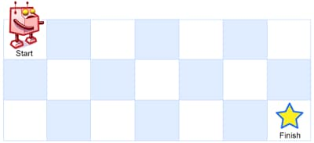

# 62. Unique Paths

<p>There is a robot on an <code>m x n</code> grid. The robot is initially located at the <strong>top-left corner</strong> (i.e., <code>grid[0][0]</code>). The robot tries to move to the <strong>bottom-right corner</strong> (i.e., <code>grid[m - 1][n - 1]</code>). The robot can only move either down or right at any point in time.</p>

<p>Given the two integers <code>m</code> and <code>n</code>, return <em>the number of possible unique paths that the robot can take to reach the bottom-right corner</em>.</p>

<p>The test cases are generated so that the answer will be less than or equal to <code>2 * 10<sup>9</sup></code>.</p>

<p>&nbsp;</p>
<p><strong class="example">Example 1:</strong></p>

<pre><strong>Input:</strong> m = 3, n = 7
<strong>Output:</strong> 28
</pre>

<p><strong class="example">Example 2:</strong></p>

<pre><strong>Input:</strong> m = 3, n = 2
<strong>Output:</strong> 3
<strong>Explanation:</strong> From the top-left corner, there are a total of 3 ways to reach the bottom-right corner:
1. Right -&gt; Down -&gt; Down
2. Down -&gt; Down -&gt; Right
3. Down -&gt; Right -&gt; Down
</pre>

<p>&nbsp;</p>
<p><strong>Constraints:</strong></p>

<ul>
  <li><code>1 &lt;= m, n &lt;= 100</code></li>
</ul>

---

# Solution

- [Dynamic Programming Approach](#dynamic-programming-approach)

### Problem Overview: Unique Paths

**Problem Statement**:
There is a robot on an \( m \times n \) grid. The robot is initially located at the **top-left corner** (i.e., `grid[0][0]`). The robot tries to move to the **bottom-right corner** (i.e., `grid[m - 1][n - 1]`). The robot can only move either down or right at any point in time.

Given the two integers \( m \) and \( n \), return the number of possible unique paths that the robot can take to reach the bottom-right corner.

The test cases are generated so that the answer will be less than or equal to \( 2 \times 10^9 \).

### Examples

**Example 1**:
```plaintext
Input: m = 3, n = 7
Output: 28
```

**Example 2**:
```plaintext
Input: m = 3, n = 2
Output: 3
Explanation: From the top-left corner, there are a total of 3 ways to reach the bottom-right corner:
1. Right -> Down -> Down
2. Down -> Down -> Right
3. Down -> Right -> Down
```

### Constraints

- \( 1 \leq m, n \leq 100 \)

### Approach

1. **Dynamic Programming**:
   - Use a 2D array `dp` where `dp[i][j]` represents the number of unique paths to reach the cell `(i, j)`.
   - Initialize `dp[0][0]` to 1 since there's only one way to be at the starting point.
   - For each cell `(i, j)`, the robot can arrive from the top `(i-1, j)` or from the left `(i, j-1)`. Therefore, `dp[i][j] = dp[i-1][j] + dp[i][j-1]`.
   - Iterate through the grid, updating `dp` values based on the above formula.
   - The final answer is stored in `dp[m-1][n-1]`.

2. **Combinatorial**:
   - The problem can also be solved using combinatorial mathematics. The total number of movements required is \( (m-1) \) down movements and \( (n-1) \) right movements.
   - The number of unique paths is the number of ways to arrange these movements, which can be calculated using binomial coefficients: \( \binom{(m-1) + (n-1)}{m-1} \) or \( \binom{(m-1) + (n-1)}{n-1} \).

# Dynamic Programming Approach

## **Intuition**

Let's start by building up a recursive solution.

1. **First Row**:
   - Since the robot can move either down or right, there is only one path to reach the cells in the first row: right → right → ... → right.

   **For the cells in the first row**:
   ```plaintext
   right → right → ... → right
   ```

2. **First Column**:
   - There is only one path to reach the cells in the first column: down → down → ... → down.

   **For the cells in the first column**:
   ```plaintext
   down → down → ... → down
   ```

3. **Inner Cells**:
   - What about the "inner" cells `(m, n)`? The robot can move either from the cell on the left `(m, n-1)`, or from the cell above `(m-1, n)`. This means that the total number of paths to move into the `(m, n)` cell is:
   ```plaintext
   uniquePaths(m-1, n) + uniquePaths(m, n-1)
   ```

   **Example**:
   ```plaintext
   uniquePaths(1, 1) = uniquePaths(0, 1) + uniquePaths(1, 0)
   ```

Using this recursive intuition, we can write the following code:

```java
class Solution {
public int uniquePaths(int m, int n) {
    if (m == 1 || n == 1) {
        return 1;
    }
    return uniquePaths(m - 1, n) + uniquePaths(m, n - 1);
}
```

However, the recusrive solution is not efficient due to overlapping subproblems. Therefore, we will use it as a stepping stone to develop a dynamic programming solution. 

We can use a DP table to store the number of unique paths to each cell, thus avoiding the redundant calculations.

## **Algorithm**

1. **Initialize the 2D Array**:
   - Create a 2D array `dp[m][n]` to store the number of paths.
   - Initially, set the number of paths to `1` for the first row and the first column, as there is only one way to reach those cells.

2. **Iterate Over the Inner Cells**:
   - For each cell `(i, j)`, calculate the number of paths as the sum of the paths from the cell above and the cell on the left:
     ```plaintext
     dp[i][j] = dp[i-1][j] + dp[i][j-1]
     ```

3. **Return the Result**:
   - The total number of unique paths to the bottom-right corner will be stored in `dp[m-1][n-1]`.

### **Pseudocode**

```pseudocode
function uniquePaths(m, n):
    # Step 1: Initialize a 2D array dp with dimensions m x n
    dp = create 2D array with dimensions m x n

    # Step 2: Set the first row values to 1
    for i from 0 to m-1:
        dp[i][0] = 1

    # Step 3: Set the first column values to 1
    for j from 0 to n-1:
        dp[0][j] = 1

    # Step 4: Iterate over the inner cells
    for i from 1 to m-1:
        for j from 1 to n-1:
            dp[i][j] = dp[i-1][j] + dp[i][j-1]

    # Step 5: Return the value in the bottom-right cell
    return dp[m-1][n-1]
```

## **Implementation**

```java
class Solution {
  public int uniquePaths(int m, int n) {
    // Initialize a 2D array dp with dimensions m x n
    int[][] dp = new int[m][n];

    // Set the number of paths to 1 for the first column
    for (int i = 0; i < m; i++) {
      dp[i][0] = 1;
    }

    // Set the number of paths to 1 for the first row
    for (int j = 0; j < n; j++) {
      dp[0][j] = 1;
    }

    return 0;
  }
}
```