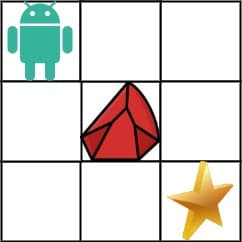

# 63. Unique Paths II

<p>You are given an <code>m x n</code> integer array <code>grid</code>. There is a robot initially located at the <b>top-left corner</b> (i.e., <code>grid[0][0]</code>). The robot tries to move to the <strong>bottom-right corner</strong> (i.e., <code>grid[m - 1][n - 1]</code>). The robot can only move either down or right at any point in time.</p>

<p>An obstacle and space are marked as <code>1</code> or <code>0</code> respectively in <code>grid</code>. A path that the robot takes cannot include <strong>any</strong> square that is an obstacle.</p>

<p>Return <em>the number of possible unique paths that the robot can take to reach the bottom-right corner</em>.</p>

<p>The testcases are generated so that the answer will be less than or equal to <code>2 * 10<sup>9</sup></code>.</p>

<p>&nbsp;</p>
<p><strong class="example">Example 1:</strong></p>

<pre><strong>Input:</strong> obstacleGrid = [[0,0,0],[0,1,0],[0,0,0]]
<strong>Output:</strong> 2
<strong>Explanation:</strong> There is one obstacle in the middle of the 3x3 grid above.
There are two ways to reach the bottom-right corner:
1. Right -&gt; Right -&gt; Down -&gt; Down
2. Down -&gt; Down -&gt; Right -&gt; Right
</pre>

<p><strong class="example">Example 2:</strong></p>

<pre><strong>Input:</strong> obstacleGrid = [[0,1],[0,0]]
<strong>Output:</strong> 1
</pre>

<p>&nbsp;</p>
<p><strong>Constraints:</strong></p>

<ul>
  <li><code>m == obstacleGrid.length</code></li>
  <li><code>n == obstacleGrid[i].length</code></li>
  <li><code>1 &lt;= m, n &lt;= 100</code></li>
  <li><code>obstacleGrid[i][j]</code> is <code>0</code> or <code>1</code>.</li>
</ul>

---

# Solution

- [Dynamic Programming Approach](#dynamic-programming-approach)

### Problem Overview: Unique Paths II

In the problem "Unique Paths II," you are given an `m x n` integer array called `grid`. A robot starts at the **top-left corner** of the grid (`grid[0][0]`) and aims to reach the **bottom-right corner** (`grid[m - 1][n - 1]`). The robot can only move either **down** or **right** at any point in time.

The `grid` contains obstacles and open spaces, where:
- `1` represents an obstacle
- `0` represents an open space

The robot must navigate through the grid without passing through any obstacles. Your task is to **return the number of unique paths** that the robot can take to reach the bottom-right corner.

The test cases are designed so that the number of unique paths will not exceed `2 * 10^9`.

#### Example 1:

```
Input: obstacleGrid = [[0,0,0],[0,1,0],[0,0,0]]
Output: 2
Explanation: There is one obstacle in the middle of the 3x3 grid. The robot has two possible paths:
1. Right -> Right -> Down -> Down
2. Down -> Down -> Right -> Right
```

#### Example 2:

```
Input: obstacleGrid = [[0,1],[0,0]]
Output: 1
```

#### Constraints:
- `m == obstacleGrid.length`
- `n == obstacleGrid[i].length`
- `1 <= m, n <= 100`
- `obstacleGrid[i][j]` is `0` or `1`

# Dynamic Programming Approach

## **Intuition**

- The robot can only move either **down** or **right**.
  - Any cell in the first row can only be reached from the cell to its left.
  - Any cell in the first column can only be reached from the cell above it.
- For any other cell in the grid, it can be reached either from:
  - The cell to its left, or
  - The cell above it.
- If any cell has an obstacle, it won't contribute to any path.

### **Initial Conditions**
- If the starting cell `(grid[0][0])` has an obstacle, there are no valid paths.
- Similarly, if the bottom-right cell `(grid[m-1][n-1])` has an obstacle, the destination is unreachable.

### **Iteration**
- Iterate through the array **left-to-right** and **top-to-bottom**.
  - Before reaching any cell, the number of ways to reach the preceding cells is known.
  - This is what makes it a Dynamic Programming problem.

### **Space Optimization**
- Use the `obstacleGrid` array as the DP array to avoid using additional space.

### **Edge Cases**
- If either `m` or `n` is 1, the robot can only move in a straight line (if there are no obstacles in its path).
- If all cells are obstacles except for the starting and ending cells, there will be no valid paths.

### **Transition Function**
- For each cell `(i, j)`, if `grid[i][j] == 1`, then `dp[i][j] = 0`.
- Otherwise, update `dp[i][j]` as:
  \[
  dp[i][j] = dp[i-1][j] + dp[i][j-1]
  \]
  This formula effectively sums the number of ways to reach the cell `(i, j)` from the cells directly above and to the left.

### **Final Output**
- The final number of unique paths to the bottom-right corner will be stored in `dp[m-1][n-1]`.

## **Algorithm**

#### **Step 1: Check Initial Cell**
1. If the first cell (`obstacleGrid[0,0]`) contains `1`, it means there is an obstacle in the first cell. Hence, the robot won't be able to make any move and we would return the number of ways as `0`.

#### **Step 2: Initialize Starting Cell**
2. Otherwise, if `obstacleGrid[0,0]` has a `0`, originally set it to `1` and move ahead.

#### **Step 3: Iterate the First Row**
3. Iterate the first row:
   - If a cell originally contains a `1`, this means the current cell has an obstacle and shouldn't contribute to any path. Hence, set the value of that cell to `0`.
   - Otherwise, set it to the value of the previous cell, i.e., `obstacleGrid[i,j] = obstacleGrid[i,j-1]`.

#### **Step 4: Iterate the First Column**
4. Iterate the first column:
   - If a cell originally contains a `1`, this means the current cell has an obstacle and shouldn't contribute to any path. Hence, set the value of that cell to `0`.
   - Otherwise, set it to the value of the previous cell, i.e., `obstacleGrid[i,j] = obstacleGrid[i-1,j]`.

#### **Step 5: Iterate Through the Grid**
5. Iterate through the grid starting from cell `obstacleGrid[1,1]`:
   - If a cell originally doesn't contain any obstacle, the number of ways of reaching that cell would be the sum of the number of ways of reaching the cell above it and the number of ways of reaching the cell to the left of it:
     \[
     obstacleGrid[i,j] = obstacleGrid[i-1,j] + obstacleGrid[i,j-1]
     \]
