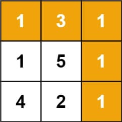

# 64. Minimum Path Sum

Given a <code>m x n</code> <code>grid</code> filled with non-negative numbers, find a path from top left to bottom right, which minimizes the sum of all numbers along its path.

<strong>Note:</strong> You can only move either down or right at any point in time.

&nbsp;

<strong class="example">Example 1:</strong>

<pre><strong>Input:</strong> grid = [[1,3,1],[1,5,1],[4,2,1]]
<strong>Output:</strong> 7
<strong>Explanation:</strong> Because the path 1 → 3 → 1 → 1 → 1 minimizes the sum.
</pre>

<strong class="example">Example 2:</strong>

<pre><strong>Input:</strong> grid = [[1,2,3],[4,5,6]]
<strong>Output:</strong> 12
</pre>

&nbsp;

<strong>Constraints:</strong>

<ul>
  <li><code>m == grid.length</code></li>
  <li><code>n == grid[i].length</code></li>
  <li><code>1 &lt;= m, n &lt;= 200</code></li>
  <li><code>0 &lt;= grid[i][j] &lt;= 200</code></li>
</ul>

---

# Solution

- [Recursive (Brute Force) Approach](#recursive-brute-force-approach)

### Problem Overview: Minimum Path Sum
The task is to find the **minimum sum of numbers** along a path from the **top-left corner** to the **bottom-right corner** of a grid. The grid contains **non-negative numbers** in each cell. You can only move either **right** or **down** at any point in time.

### Key Features
1. **Grid Dimensions**:
   - The grid is `m x n`, where `m` is the number of rows and `n` is the number of columns.
   - Each cell contains a non-negative number (0 or greater).

2. **Allowed Moves**:
   - You can only move:
     - **Down** (to the cell directly below).
     - **Right** (to the cell directly to the right).

3. **Goal**:
   - Compute the **path** from the top-left corner `(0, 0)` to the bottom-right corner `(m-1, n-1)` that has the **minimum sum** of all cell values along the way.

### Examples
#### Example 1:
- **Input**: `grid = [[1,3,1], [1,5,1], [4,2,1]]`
- **Explanation**: 
  - The best path is `1 → 3 → 1 → 1 → 1`, with a total sum of `7`.
  - This is achieved by minimizing the numbers along the path while adhering to the movement restrictions (right/down).
- **Output**: `7`

#### Example 2:
- **Input**: `grid = [[1,2,3], [4,5,6]]`
- **Explanation**: 
  - The best path is `1 → 2 → 3 → 6`, with a total sum of `12`.
- **Output**: `12`

### Constraints
- **Grid Dimensions**:
  - `1 ≤ m, n ≤ 200`
- **Cell Values**:
  - Each cell value is in the range `0 ≤ grid[i][j] ≤ 200`.

### Approach to Solve
1. **Dynamic Programming**:
   - Create a table (`dp`) where each cell stores the minimum path sum to reach that cell.
   - Transition:
     - `dp[i][j] = grid[i][j] + min(dp[i-1][j], dp[i][j-1])` (choose the minimum of coming from the top or left).
   - Base cases:
     - Start at `(0, 0)` with `dp[0][0] = grid[0][0]`.
   - Traverse the grid row by row or column by column to fill the table.

2. **Space Optimization**:
   - You can reduce space usage by modifying the input grid directly or using a single-dimensional array instead of a full table.

# Recursive (Brute Force) Approach

The brute force approach, though simple and naive, serves as a starting point rather than a viable solution.

To do recursion, explore all possible paths from the top-left corner to the bottom-right corner of the grid. For each grid cell `(i, j)`, there are two possible moves: 
1. **Move Right**: Proceed to cell `(i, j+1)`.
2. **Move Down**: Proceed to cell `(i+1, j)`.
