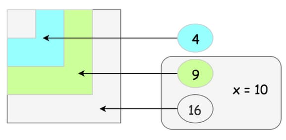
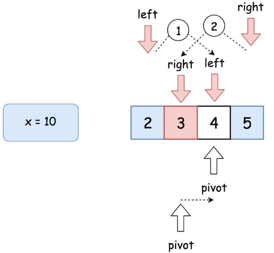

# 69. Sqrt(x)

<p>Given a non-negative integer <code>x</code>, return <em>the square root of </em><code>x</code><em> rounded down to the nearest integer</em>. The returned integer should be <strong>non-negative</strong> as well.</p>

<p>You <strong>must not use</strong> any built-in exponent function or operator.</p>

<ul>
  <li>For example, do not use <code>pow(x, 0.5)</code> in c++ or <code>x ** 0.5</code> in python.</li>
</ul>

<p>&nbsp;</p>
<p><strong class="example">Example 1:</strong></p>

<pre><strong>Input:</strong> x = 4
<strong>Output:</strong> 2
<strong>Explanation:</strong> The square root of 4 is 2, so we return 2.
</pre>

<p><strong class="example">Example 2:</strong></p>

<pre><strong>Input:</strong> x = 8
<strong>Output:</strong> 2
<strong>Explanation:</strong> The square root of 8 is 2.82842..., and since we round it down to the nearest integer, 2 is returned.
</pre>

<p>&nbsp;</p>
<p><strong>Constraints:</strong></p>

<ul>
  <li><code>0 &lt;= x &lt;= 2<sup>31</sup> - 1</code></li>
</ul>

<br>

---

# Solution

- [Pocket Calculator Algorithm Approach](#pocket-calculator-algorithm-approach)
  - **Time Complexity**: `O(1)`
  - **Space Complexity**: `O(1)`
- [Binary Search Approach](#binary-search-approach)
  - **Time Complexity**: `O(log n)`
  - **Space Complexity**: `O(1)`
- [Recursion & Bit Shifts Approach](#recursion--bit-shifts-approach)
  - **Time Complexity**: `O(log n)`
  - **Space Complexity**: `O(log n)`
- [Newton's Method Approach](#newtons-method)

## Problem Overview

### Given Problem
You are given a non-negative integer \( x \). Your task is to return the square root of \( x \) rounded down to the nearest integer. The returned integer should be non-negative. 

### Restrictions
- You must not use any built-in exponent function or operator. For example, do not use `pow(x, 0.5)` in C++ or `x ** 0.5` in Python.

### Examples
- **Example 1**:
    - Input: \( x = 4 \)
    - Output: \( 2 \)
    - Explanation: The square root of \( 4 \) is \( 2 \), so we return \( 2 \).

- **Example 2**:
    - Input: \( x = 8 \)
    - Output: \( 2 \)
    - Explanation: The square root of \( 8 \) is approximately \( 2.82842... \), and since we round it down to the nearest integer, \( 2 \) is returned.

### Additional Context
The value \( a \) we're supposed to compute could be defined as:
\[ a^2 \leq x < (a+1)^2 \]
This value is called the *integer square root*. 

#### Geometrical Interpretation
From a geometrical perspective, it represents the side of the largest integer-sided square with an area less than or equal to \( x \).



Let's explore the relationship between 4, 9, and 16 when looking for the integer square root of \( x = 10 \).

The integer square root of \( x \) is the largest integer \( a \) such that \( a^2 \leq x \). For \( x = 10 \):

1. **4**: \( 2^2 = 4 \). This is less than 10, so \( 2 \) is a possible candidate.
2. **9**: \( 3^2 = 9 \). This is also less than 10, so \( 3 \) is another candidate.
3. **16**: \( 4^2 = 16 \). This is greater than 10, so \( 4 \) is not a candidate.

The largest integer whose square is less than or equal to 10 is \( 3 \). However, we are looking for the integer part of the square root, rounded down. The square root of 10 is approximately \( 3.162 \), and rounding down gives us \( 3 \).

So, the integer square root of \( x = 10 \) is \( 3 \).

Here's the relationship in summary:
- 4: \( 2^2 \)
- 9: \( 3^2 \)
- 16: \( 4^2 \)

Since 10 lies between 9 and 16, the integer square root is the one corresponding to \( 3 \). 

### Algorithm Insight
To solve this problem, you can use a binary search algorithm, which efficiently finds the integer square root by narrowing down the possible values. Here's a brief outline of how it works:
1. Initialize two pointers: `left` and `right`. `left` starts at \( 0 \) and `right` starts at \( x \).
2. Perform a binary search:
    - Calculate the midpoint `mid`.
    - If `mid * mid` is equal to \( x \), return `mid`.
    - If `mid * mid` is less than \( x \), move `left` to `mid + 1`.
    - Otherwise, move `right` to `mid - 1`.
3. The loop continues until `left` is greater than `right`.
4. The integer square root is `right` at the end of the search.

This method ensures that you find the largest integer `a` such that \( a^2 \leq x \).

# Pocket Calculator Algorithm Approach

## **Intuition**

Pocket calculators often compute exponential functions and natural logarithms efficiently by using precomputed logarithm tables or other methods. To find the square root of a number, we can leverage these capabilities by reducing the problem to a combination of exponential and logarithmic functions.

The mathematical relationship we use is:
\[ \sqrt{x} = e^{(\frac{1}{2} \cdot \log x)} \]

Although this method isn't simple or basic, it is very practical and works similarly to how real-world calculators perform these calculations.

## **Algorithm**

1. **Input**: A non-negative integer \( x \).
2. **Special Case**: If \( x \) is 0, return 0 immediately since the square root of 0 is 0.
3. **Compute the Natural Logarithm**: Calculate the natural logarithm (\( \log x \)) of \( x \).
4. **Scale the Logarithm**: Multiply the natural logarithm by 0.5.
5. **Compute the Exponential Function**: Calculate the exponential function \( e \) raised to the power of the scaled logarithm (\( e^{(\frac{1}{2} \cdot \log x)} \)).
6. **Round Down**: Since we need the integer part of the result, round down the computed value to the nearest integer.
7. **Return the Result**: Output the result as the integer square root of \( x \).

### **Pseudocode**

```plaintext
function integerSquareRoot(x):
    if x == 0:
        return 0
    
    // Step 3: Compute the natural logarithm of x
    logX = log(x)
    
    // Step 4: Scale the logarithm by 0.5
    halfLogX = 0.5 * logX
    
    // Step 5: Compute the exponential function
    sqrtX = exp(halfLogX)
    
    // Step 6: Round down to the nearest integer
    result = floor(sqrtX)
    
    return result
```

### Note on Implementation

- The functions `log(x)` and `exp(x)` represent the natural logarithm and exponential functions, respectively.
- The function `floor(x)` rounds down \( x \) to the nearest integer.

By following this approach, you can leverage the efficiency of logarithmic and exponential computations to find the integer square root of \( x \).

## **Implementation**

### Java

```java
class Solution {

  // Returns the integer square root of x, rounded down to the nearest integer.
  public int mySqrt(int x) {
    // Special case: If x is 0 or 1, return x as the square root is the number itself.
    if (x < 2) {
      return x;
    }

    // Compute the approximate square root using the pocket calculator algorithm:
    // sqrt(x) ≈ e^(0.5 * log(x))
    int left = (int) Math.pow(Math.E, 0.5 * Math.log(x));

    // Adjust the result by checking the next integer to ensure proper rounding down
    int right = left + 1;

    // Return the correct integer square root
    return (long) right * right > x ? left : right;
  }
}
```

### TypeScript

```typescript
function mySqrt(x: number): number {
  // Special case: If x is 0 or 1, return x as the square root is the number itself.
  if (x < 2) {
    return x;
  }

  // Compute the approximate square root using the pocket calculator algorithm:
  // sqrt(x) ≈ e^(0.5 * log(x))
  let left: number = Math.floor(Math.exp(0.5 * Math.log(x)));

  // Adjust the result by checking the next integer to ensure proper rounding down
  let right: number = left + 1;

  // Return the correct integer square root
  return (right * right > x) ? left : right;
}
```

## **Complexity Analysis**

### Assumptions
- The value of \( x \) is a non-negative integer.
- The logarithm and exponential functions are computed in constant time, which is reasonable given their efficient implementation in most programming languages.

### **Time Complexity**: `O(1)`
- **Constant Time Operations**: The algorithm consists of a fixed number of operations:
  - Checking if \( x < 2 \)
  - Calculating the natural logarithm of \( x \)
  - Scaling the logarithm by 0.5
  - Computing the exponential function \( e \) raised to the scaled logarithm
  - Rounding down the result to the nearest integer
  These operations are all performed in constant time, meaning they do not depend on the size of the input \( x \). Thus, the overall time complexity is \( O(1) \).

### **Space Complexity**: `O(1)`
- **Fixed Additional Space**: The algorithm uses a small, fixed amount of additional space for variables such as `logX`, `halfLogX`, `sqrtX`, and `result`. These variables require a constant amount of memory, regardless of the input size. Hence, the space complexity remains \( O(1) \).

# Binary Search Approach

## **Intuition**

### **Context**
In an interview setting, it's essential to understand the nature of the problem thoroughly. For any integer \( a \geq 2 \), the square root of a number \( x \) will always be less than \( x/2 \) and greater than 0: \( 0 < a < x/2 \).

### **Binary Search Justification**
Given that \( a \) must be an integer, the problem translates into finding the square root within a sorted set of integer values. This ordered nature of the set makes binary search an ideal method to solve the problem efficiently.

### **Key Insight**
Binary search leverages the sorted property of integers. By iteratively halving the search space, we can quickly converge on the integer square root, ensuring the approach is both time-efficient and straightforward to implement.



## **Algorithm**

1. If \( x < 2 \), return \( x \).
2. Set the left boundary to 2 and the right boundary to \( x / 2 \).
3. While \( \text{left} \leq \text{right} \):
   - Take \( \text{pivot} = \text{left} + (\text{right} - \text{left}) / 2 \) as a guess. Compute \( \text{pivot} \times \text{pivot} \) and compare it with \( x \):
     - If \( \text{pivot} \times \text{pivot} > x \), move the right boundary to \( \text{right} = \text{pivot} - 1 \).
     - Else, if \( \text{pivot} \times \text{pivot} < x \), move the left boundary to \( \text{left} = \text{pivot} + 1 \).
     - Otherwise, if \( \text{pivot} \times \text{pivot} == x \), the integer square root is found; return \( \text{pivot} \).
4. Return \( \text{right} \).

## **Implementation**

### Java

```java
class Solution {
  public int mySqrt(int x) {
    if (x < 2) return x;

    long num;
    int pivot, left = 2, right = x / 2;
    while (left <= right) {
      pivot = left + (right - left) / 2;
      num = (long) pivot * pivot;
      if (num > x) right = pivot - 1;
      else if (num < x) left = pivot + 1;
      else return pivot;
    }

    return right;
  }
}
```

### TypeScript

```typescript
function mySqrt(x: number): number {
  if (x < 2) return x;

  let left = 2, right = Math.floor(x / 2);
  while (left <= right) {
    let pivot = Math.floor(left + (right - left) / 2);
    let num = pivot * pivot;
    if (num > x) {
      right = pivot - 1;
    } else if (num < x) {
      left = pivot + 1;
    } else {
      return pivot;
    }
  }
  return right;
}
```

## **Complexity Analysis**

### Assumptions
- The value of \( n \) is a non-negative integer.
- The logarithm and exponential functions are computed in constant time, which is reasonable given their efficient implementation in most programming languages.

### **Time Complexity**: `O(log n)`

- **Binary Search:** The time complexity is \( O(\log n) \). The binary search algorithm divides the search interval in half each time, which leads to a logarithmic time complexity.
  
- **Master Theorem Analysis:**
  Let's compute the time complexity with the help of the master theorem \( T(n) = aT\left(\frac{n}{b}\right) + f(n) \).
  - Here, \( a = 1 \), \( b = 2 \), and \( f(n) = O(1) \).
  - According to the master theorem, we compare \( f(n) \) to \( n^{\log_b a} \). 
  - In this case, \( \log_b a = \log_2 1 = 0 \), and thus we have \( n^0 = 1 \), which matches \( f(n) = O(1) \).
  - Therefore, this falls under case 2 of the master theorem, which results in \( T(n) = O(\log n) \).

### **Space Complexity**: `O(1)`

- **Constant Space:** The space complexity is \( O(1) \) since we are only using a fixed amount of extra space for variables such as `left`, `right`, `pivot`, and `num`.

# Recursion & Bit Shifts Approach

## **Intuition**

Let's use recursion for this approach. The base case is when \( x < 2 \), in which case the value is \( x \) itself. The idea is to reduce \( x \) recursively at each step until we reach the base case.

How do we reduce \( x \)? 

Notice that \( \sqrt{x} = 2 \times \sqrt{\frac{x}{4}} \). Hence, the square root can be computed recursively as:
\[ \text{mySqrt}(x) = 2 \times \text{mySqrt}\left(\frac{x}{4}\right) \]

To speed up computations, let's use bit shifts. Left and right shifts are fast bit manipulation operations:
- \( x << y \) means \( x \times 2^y \)
- \( x >> y \) means \( x \div 2^y \)

Thus, we can rewrite the recursion above as:
\[ \text{mySqrt}(x) = \text{mySqrt}(x >> 2) << 1 \]

## **Algorithm**

1. Define the base case: If \( x < 2 \), return \( x \).
2. Reduce \( x \) by shifting it right by 2 bits: \( x >> 2 \).
3. Recursively compute the square root of the reduced \( x \): \( \text{mySqrt}(x >> 2) \).
4. Multiply the result by 2 by shifting it left by 1 bit: \( << 1 \).

### Steps

1. Define the function `mySqrt` that takes an integer `x`.
2. Check if `x` is less than 2:
   - If true, return `x`.
3. Reduce `x` by shifting it right by 2 bits.
4. Recursively compute the square root of the reduced `x`.
5. Multiply the result by 2 by shifting it left by 1 bit.
6. Return the final result.

## **Implementation**

### Java

```java
class Solution2 {
  public int mySqrt(int x) {
    if (x < 2)
      return x;

    int left = mySqrt(x >> 2) << 1;
    int right = left + 1;
    return (long) right * right > x ? left : right;
  }
}
```

### TypeScript

```typescript
/**
 * Computes the integer square root of a given number using recursion and bit shifts.
 * 
 * @param x - The number to compute the square root of.
 * @returns The integer square root of the given number.
 */
function mySqrt(x: number): number {
  // Base case: if x is less than 2, return x
  if (x < 2) return x;

  // Recursively compute the square root of x / 4 (x >> 2) and multiply the result by 2 (left << 1)
  const left = mySqrt(x >> 2) << 1;

  // Calculate the next potential square root value
  const right = left + 1;

  // Check if the square of the next potential value exceeds x
  return right * right > x ? left : right;
}
```

## **Complexity Analysis**

### Assumptions
- The value of \( n \) is a non-negative integer.
- The logarithm and exponential functions are computed in constant time, which is reasonable given their efficient implementation in most programming languages.

### **Time Complexity**: `O(log n)`

- **Recursive Approach:** The time complexity is \( O(\log n) \). Each recursive call reduces the problem size by a factor of 4 (through bit shifts), leading to a logarithmic time complexity.
  
- **Master Theorem Analysis:**
  Let's compute the time complexity with the help of the master theorem \( T(n) = aT\left(\frac{n}{b}\right) + f(n) \).
  - Here, \( a = 1 \), \( b = 2 \), and \( f(n) = O(1) \).
  - According to the master theorem, we compare \( f(n) \) to \( n^{\log_b a} \). 
  - In this case, \( \log_b a = \log_2 1 = 0 \), and thus we have \( n^0 = 1 \), which matches \( f(n) = O(1) \).
  - Therefore, this falls under case 2 of the master theorem, which results in \( T(n) = O(\log n) \).

### **Space Complexity**: `O(log n)`

- **Recursion Stack:** The space complexity is \( O(\log n) \) due to the recursive calls. Each call adds a new frame to the stack, and there are \( O(\log n) \) recursive calls.

# Newton's Method

## **Intuition**

One of the most efficient methods to compute the square root is Newton's Method, also known as the Newton-Raphson method.

### Newton-Raphson Method

In calculus, Newton's method is an iterative approach for finding the roots of a differentiable function \( f(x) \), which are solutions to the equation \( f(x) = 0 \). To find the roots of \( f'(x) = 0 \) (the critical points of \( f \)), we can use Newton's method on its derivative \( f'(x) \). These solutions may be minima, maxima, or saddle points, which are relevant in optimization.

### Key Point

We'll implement a simplified version without seed trimming. Using the textbook fact that the sequence:

\[ x_{k+1} = \frac{1}{2} \left( x_k + \frac{x}{x_k} \right) \]

converges to \( \sqrt{x} \) if the initial guess \( x_0 \) is set to \( x \). The process is straightforward: define the error tolerance as less than 1 and proceed iteratively.

## **Algorithm**

1. Define the base case: If \( x < 2 \), return \( x \).
2. Initialize \( x_0 \) with \( x \).
3. Compute the next estimate \( x_1 \) using the formula \( x_1 = \frac{1}{2} (x_0 + \frac{x}{x_0}) \).
4. Iterate until the difference between \( x_0 \) and \( x_1 \) is less than 1:
   - Update \( x_0 \) to \( x_1 \).
   - Recompute \( x_1 \) using the formula.
5. Return the integer part of \( x_1 \).

## **Implementation**

### Java

```java
/**
 * Class Solution provides a method to compute the integer 
 * square root of a given number using Newton's Method.
 */
class Solution {
    /**
     * Computes the integer square root of a given number.
     * 
     * @param x The number to compute the square root of.
     * @return The integer square root of the given number.
     */
    public int mySqrt(int x) {
        // Base case: if x is less than 2, return x
        if (x < 2) return x;

        // Initialize x0 with x
        double x0 = x;
        // Compute the next estimate x1 using the formula
        double x1 = (x0 + x / x0) / 2.0;
        // Iterate until the difference between x0 and x1 is less than 1
        while (Math.abs(x0 - x1) >= 1) {
            x0 = x1;
            x1 = (x0 + x / x0) / 2.0;
        }
        // Return the integer part of x1
        return (int)x1;
    }
}
```

### TypeScript

```typescript
/**
 * Finds the integer part of the square root of a given number using Newton's method.
 *
 * @param x - The number for which to find the square root.
 * @return The integer part of the square root of x.
 */
function mySqrt(x: number): number {
  // Base case: If x is less than 2, return x itself as the square root.
  if (x < 2) return x;

  // Initialize x0 with x.
  let x0 = x;
  // Compute the next estimate x1 using the formula.
  let x1 = 0.5 * (x0 + x / x0);

  // Iterate until the difference between x0 and x1 is less than 1.
  while (Math.abs(x0 - x1) >= 1) {
    x0 = x1;
    x1 = 0.5 * (x0 + x / x0);
  }

  // Return the integer part of x1.
  return Math.floor(x1);
}
```
