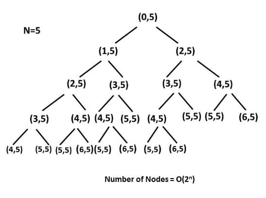

# 70. Climbing Stairs

<p>You are climbing a staircase. It takes <code>n</code> steps to reach the top.</p>

<p>Each time you can either climb <code>1</code> or <code>2</code> steps. In how many distinct ways can you climb to the top?</p>

<p>&nbsp;</p>
<p><strong class="example">Example 1:</strong></p>

<pre><strong>Input:</strong> n = 2
<strong>Output:</strong> 2
<strong>Explanation:</strong> There are two ways to climb to the top.
1. 1 step + 1 step
2. 2 steps
</pre>

<p><strong class="example">Example 2:</strong></p>

<pre><strong>Input:</strong> n = 3
<strong>Output:</strong> 3
<strong>Explanation:</strong> There are three ways to climb to the top.
1. 1 step + 1 step + 1 step
2. 1 step + 2 steps
3. 2 steps + 1 step
</pre>

<p>&nbsp;</p>
<p><strong>Constraints:</strong></p>

<ul>
	<li><code>1 &lt;= n &lt;= 45</code></li>
</ul>

<br>

---

# Solution

- [Brute Force Approach](#brute-force-approach)

# Brute Force Approach

## **Intuition**

In this brute force approach, we take all possible step combinations, i.e., 1 and 2, at every step. At each step, we call the function `climbStairs` for step 1 and step 2, and return the sum of returned values of both functions.

The recurrence relation is:

`climbStairs(i, n) = climbStairs(i + 1, n) + climbStairs(i + 2, n)`

where `i` defines the current step and `n` defines the destination step.

### Visualization of Recursion Tree

The recursion tree for `n = 5`:



## **Algorithm**

1. Define the base cases:
   - If the current step `i` equals `n`, return 1 (one way to reach the top).
   - If `i` exceeds `n`, return 0 (no way to reach the top from this position).
2. Recursively call `climbStairs` with `i+1` and `i+2`.
3. Sum the results of the two recursive calls to get the total number of ways to reach the top from step `i`.
4. Use the base cases to terminate the recursion.

## **Implementation**

### Java

```java
class Solution {
  /**
   * Brute force approach to calculate the number of distinct ways to climb to the top. Each time
   * you can either climb 1 or 2 steps.
   *
   * @param n The total number of steps to reach the top.
   * @returns The number of distinct ways to reach the top.
   */
  public int climbStairs(int n) {
    // Base case: If the steps are 0 or 1, there's only one way to climb
    if (n == 0 || n == 1) {
      return 1;
    }
    // Recursive calls to find the number of ways to reach the n-th step
    return climbStairs(n - 1) + climbStairs(n - 2);
  }
}
```

