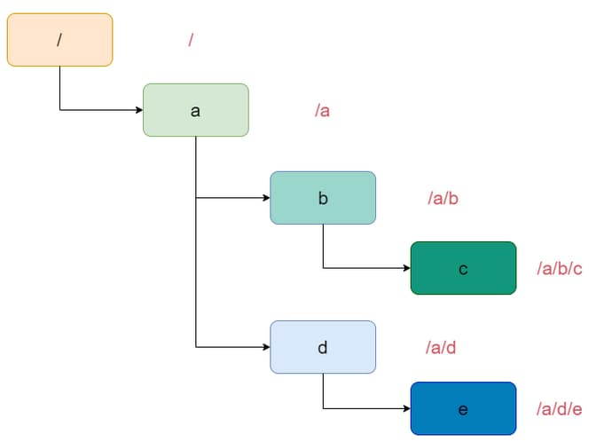

# 71. Simplify Path

You are given an <em>absolute</em> path for a Unix-style file system, which always begins with a slash <code>'/'</code>. Your task is to transform this absolute path into its <strong>simplified canonical path</strong>.

The <em>rules</em> of a Unix-style file system are as follows:

<ul>
  <li>A single period <code>'.'</code> represents the current directory.</li>
  <li>A double period <code>'..'</code> represents the previous/parent directory.</li>
  <li>Multiple consecutive slashes such as <code>'//'</code> and <code>'///'</code> are treated as a single slash <code>'/'</code>.</li>
  <li>Any sequence of periods that does <strong>not match</strong> the rules above should be treated as a <strong>valid directory or</strong> <strong>file </strong><strong>name</strong>. For example, <code>'...' </code>and <code>'....'</code> are valid directory or file names.</li>
</ul>

The simplified canonical path should follow these <em>rules</em>:

<ul>
  <li>The path must start with a single slash <code>'/'</code>.</li>
  <li>Directories within the path must be separated by exactly one slash <code>'/'</code>.</li>
  <li>The path must not end with a slash <code>'/'</code>, unless it is the root directory.</li>
  <li>The path must not have any single or double periods (<code>'.'</code> and <code>'..'</code>) used to denote current or parent directories.</li>
</ul>

Return the <strong>simplified canonical path</strong>.

&nbsp;

<strong class="example">Example 1:</strong>

<strong>Input:</strong> path = "/home/"

<strong>Output:</strong> "/home"

<strong>Explanation:</strong>

The trailing slash should be removed.

<strong class="example">Example 2:</strong>

<strong>Input:</strong> path = "/home//foo/"

<strong>Output:</strong> "/home/foo"

<strong>Explanation:</strong>

Multiple consecutive slashes are replaced by a single one.

<strong class="example">Example 3:</strong>

<strong>Input:</strong> path = "/home/user/Documents/../Pictures"

<strong>Output:</strong> "/home/user/Pictures"

<strong>Explanation:</strong>

A double period <code>".."</code> refers to the directory up a level (the parent directory).

<strong class="example">Example 4:</strong>

<strong>Input:</strong> path = "/../"

<strong>Output:</strong> "/"

<strong>Explanation:</strong>

Going one level up from the root directory is not possible.

<strong class="example">Example 5:</strong>

<strong>Input:</strong> path = "/.../a/../b/c/../d/./"

<strong>Output:</strong> "/.../b/d"

<strong>Explanation:</strong>

<code>"..."</code> is a valid name for a directory in this problem.

&nbsp;

<strong>Constraints:</strong>

<ul>
  <li><code>1 &lt;= path.length &lt;= 3000</code></li>
  <li><code>path</code> consists of English letters, digits, period <code>'.'</code>, slash <code>'/'</code> or <code>'_'</code>.</li>
  <li><code>path</code> is a valid absolute Unix path.</li>
</ul>

 

---

# Solution

- [Stack Approach](#stack-approach)

## Problem Overview

You are given an absolute path for a Unix-style file system, which always begins with a slash '/'. Your task is to transform this absolute path into its simplified canonical path.

**Rules of a Unix-style file system:**

1. A single period `.` represents the current directory.
2. A double period `..` represents the previous/parent directory.
3. Multiple consecutive slashes such as `//` and `///` are treated as a single slash `/`.
4. Any sequence of periods that does not match the rules above should be treated as a valid directory or file name. For example, `...` and `....` are valid directory or file names.

**Simplified canonical path should follow these rules:**

1. The path must start with a single slash `/`.
2. Directories within the path must be separated by exactly one slash `/`.
3. The path must not end with a slash `/`, unless it is the root directory.
4. The path must not have any single or double periods (`.` and `..`) used to denote current or parent directories.

Return the simplified canonical path.

# Stack Approach

## **Intuition**

This problem mimics the functionality of the `cd` command in Unix-like operating systems, which helps users navigate directories. While the `cd` command allows for various combinations of directory navigation, our implementation needs to correctly handle all special characters and scenarios. For example, when navigating from `/a/b/c` to `/a/b/c/..`, the `..` signifies moving up one directory level to `/a/b`. The core idea is to utilize a stack to handle these movements effectively. Here's a more structured representation of the problem and the approach to solve it.

### Example

Consider the input path `/a//b/c/../././//d`:
- Split into components: `['', 'a', '', 'b', 'c', '..', '.', '.', '', '', 'd']`
- Process each component:
  - `''` -> skip
  - `a` -> push `a`
  - `''` -> skip
  - `b` -> push `b`
  - `c` -> push `c`
  - `..` -> pop `c`
  - `.` -> skip
  - `.` -> skip
  - `''` -> skip
  - `''` -> skip
  - `d` -> push `d`
- Final stack: `['a', 'b', 'd']`
- Simplified path: `/a/b/d`

## **Algorithm**

1. **Initialize the Stack**:
   - Create an empty stack `s` to store the valid directory names.
   
2. **Split the Input Path**:
   - Split the input string by the delimiter `/`. This step converts the path into components, where each component is either a directory name or a special character.
   
3. **Process Each Component**:
   - Iterate through the split components:
     - If the component is `.` or an empty string, continue to the next component as they signify the current directory or multiple slashes.
     - If the component is `..`, pop the top element from the stack if it's not empty. This signifies moving up one directory level.
     - Otherwise, push the component onto the stack as it represents a valid directory name.

4. **Construct the Simplified Path**:
   - After processing all components, join the elements in the stack with `/` to form the simplified canonical path.
   - Ensure the path starts with `/`.

