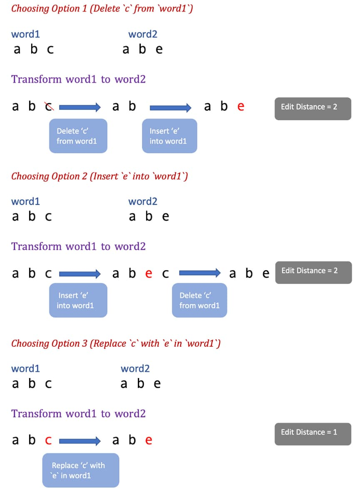

# 72. Edit Distance

<p>Given two strings <code>word1</code> and <code>word2</code>, return <em>the minimum number of operations required to convert <code>word1</code> to <code>word2</code></em>.</p>

<p>You have the following three operations permitted on a word:</p>

<ul>
  <li>Insert a character</li>
  <li>Delete a character</li>
  <li>Replace a character</li>
</ul>

<p>&nbsp;</p>
<p><strong class="example">Example 1:</strong></p>

<pre><strong>Input:</strong> word1 = "horse", word2 = "ros"
<strong>Output:</strong> 3
<strong>Explanation:</strong> 
horse -&gt; rorse (replace 'h' with 'r')
rorse -&gt; rose (remove 'r')
rose -&gt; ros (remove 'e')
</pre>

<p><strong class="example">Example 2:</strong></p>

<pre><strong>Input:</strong> word1 = "intention", word2 = "execution"
<strong>Output:</strong> 5
<strong>Explanation:</strong> 
intention -&gt; inention (remove 't')
inention -&gt; enention (replace 'i' with 'e')
enention -&gt; exention (replace 'n' with 'x')
exention -&gt; exection (replace 'n' with 'c')
exection -&gt; execution (insert 'u')
</pre>

<p>&nbsp;</p>
<p><strong>Constraints:</strong></p>

<ul>
  <li><code>0 &lt;= word1.length, word2.length &lt;= 500</code></li>
  <li><code>word1</code> and <code>word2</code> consist of lowercase English letters.</li>
</ul>

<br>

---

# Solution

- [Recursive Approach](#recursive-approach)

## Problem Overview

### Introduction to Edit Distance
[Edit distance](https://en.wikipedia.org/wiki/Edit_distance) is a string metric used in computer science to quantify how dissimilar two strings are. It measures the minimum number of operations required to transform one string into another. 

### Types of Edit Distance
There are various types of "edit distance," each allowing different operations to transform one string into another. In this problem, we refer specifically to **Levenshtein distance**.

### Levenshtein Distance
The Levenshtein distance allows three types of operations:
- **Insertion**: Adding a character
- **Deletion**: Removing a character
- **Replacement**: Replacing a character

### Real-World Applications
Solving this problem has several real-world applications. For example, it can help find the similarity score between two strings. A lower edit distance indicates higher similarity.

One prominent application is the auto-correct feature in text editors. When a spelling mistake is made, advanced text editors like Microsoft Word suggest the nearest matching words. These suggestions are based on words with the least edit distance from the dictionary.

Additionally, edit distance has applications in fields such as computational biology and natural language processing.

### Goal
The goal is to find the edit distance between two given strings, `word1` and `word2`.

Levenshtein distance finds edit distances by allowing three types of transformation operations: **addition**, **deletions**, and **replacements**


Let us now discuss the approaches to solving this problem.

# Recursive Approach

## **Intuition**

Let's start by identifying the key principles of this approach:

1. **Identical Strings**: If the two strings are the same, the edit distance is zero.
   ```plaintext
   Example: word1 = "abcd", word2 = "abcd"
   Edit Distance = 0
   ```
   Since `word1` is equal to `word2`, there is no need to add, remove, or replace any characters.

2. **Different Characters**: Operations (add, delete, replace) are performed only if a character at a certain position in `word1` is different from the corresponding character in `word2`.
   ```plaintext
   Example: word1 = "abc", word2 = "abe"
   ```
   The character at the 3rd position in `word1` ('c') is different from the character in `word2` ('e'). In this case, we have three options to transform `word1` into `word2`:
   - **Option 1**: Delete 'c' from `word1`.
   - **Option 2**: Insert 'e' into `word1`.
   - **Option 3**: Replace 'c' with 'e' in `word1`.

### Choosing the Optimal Operation
To find the minimum number of operations to transform `word1` into `word2`, we must evaluate each operation:

1. **Delete 'c' from `word1`**:
   - Transforms "abc" to "ab" (Edit Distance = 2)
2. **Insert 'e' into `word1`**:
   - Transforms "abc" to "abec" (Edit Distance = 2)
3. **Replace 'c' with 'e' in `word1`**:
   - Transforms "abc" to "abe" (Edit Distance = 1)

From this example, we see that Option 3 is the optimal choice, resulting in an edit distance of 1.



### Conclusion
The edit distance to transform `word1` to `word2` can be calculated as:
```plaintext
Edit distance = Minimum (
    Number of operations after deleting character from "word1",
    Number of operations after inserting character in "word1",
    Number of operations after replacing character in "word1"
) + 1
```
The `+1` accounts for the current operation.

### Recursive Implementation
When it comes to trying all possible solutions and finding the most optimal one, recursion is a natural approach.

Whenever there is a mismatch between two characters in the strings, we need to try all possible operations and choose the best among them.

## **Algorithm**

### Overview
The goal is to transform `word1` into `word2` using the minimum number of operations (insert, delete, replace). We achieve this by comparing each character in `word1` and `word2` while tracking their respective indices.

### Steps

1. **Initial Setup**
   - Compare every character in `word1` and `word2`.
   - Track the current character index as `word1Index` and `word2Index`.

2. **Character Comparison**
   - **Match**: If `word1[word1Index] == word2[word2Index]`, move to the next index. No operation is needed.
   - **Mismatch**: If `word1[word1Index] != word2[word2Index]`, perform one of the three operations: delete, insert, or replace.

### Recursive Function Definition

Define the recursive function `computeEditDistance`, which finds the edit distance for `word1` ending at `word1Index` and `word2` ending at `word2Index`.

```plaintext
computeEditDistance(word1, word2, word1Index, word2Index)
```

### Recurrence Relations

Let's derive the recurrence relation for each possible operation:

1. **Replace Character**
   - Recurrence Relation: `computeEditDistance(word1, word2, word1Index - 1, word2Index - 1) + 1`
   - Example: Transform `"abc"` to `"abe"` by replacing 'c' with 'e'.

2. **Insert Character**
   - Recurrence Relation: `computeEditDistance(word1, word2, word1Index, word2Index - 1) + 1`
   - Example: Transform `"abc"` to `"abec"` by inserting 'e'.

3. **Delete Character**
   - Recurrence Relation: `computeEditDistance(word1, word2, word1Index - 1, word2Index) + 1`
   - Example: Transform `"abc"` to `"ab"` by deleting 'c'.

### Overall Recurrence Relation

If `word1[word1Index] != word2[word2Index]`, we have:
```plaintext
computeEditDistance(word1, word2, word1Index, word2Index) = minimum (
    computeEditDistance(word1, word2, word1Index - 1, word2Index - 1),
    computeEditDistance(word1, word2, word1Index, word2Index - 1),
    computeEditDistance(word1, word2, word1Index - 1, word2Index)
) + 1
```

If `word1[word1Index] == word2[word2Index]`, move to the next index without performing any operation.

### Base Cases

The base case is the terminating condition for the recursive function:

1. **word1 is empty**
   - If `word1` is an empty string, the only operation needed is to add the characters of `word2` to `word1`.
   - Edit Distance: Number of characters in `word2`.

2. **word2 is empty**
   - If `word2` is an empty string, the only operation needed is to delete all remaining characters in `word1`.
   - Edit Distance: Number of characters in `word1`.

### **Pseudocode**

```plaintext
function minDistance(word1, word2):
    return computeEditDistance(word1, word2, len(word1) - 1, len(word2) - 1)

function computeEditDistance(word1, word2, word1Index, word2Index):
    # Base Case 1: If word1 is empty, return the number of characters left in word2
    if word1Index < 0:
        return word2Index + 1

    # Base Case 2: If word2 is empty, return the number of characters left in word1
    if word2Index < 0:
        return word1Index + 1

    # If characters at current position match, move to the next position
    if word1[word1Index] == word2[word2Index]:
        return computeEditDistance(word1, word2, word1Index - 1, word2Index - 1)

    # If characters at current position do not match, consider all three operations
    insertOp = computeEditDistance(word1, word2, word1Index, word2Index - 1) + 1
    deleteOp = computeEditDistance(word1, word2, word1Index - 1, word2Index) + 1
    replaceOp = computeEditDistance(word1, word2, word1Index - 1, word2Index - 1) + 1

    # Return the minimum of the three operations
    return min(insertOp, deleteOp, replaceOp)
```

### Explanation:
1. **Base Cases**:
   - If `word1` is empty (i.e., `word1Index < 0`), return the number of characters left in `word2`.
   - If `word2` is empty (i.e., `word2Index < 0`), return the number of characters left in `word1`.

2. **Matching Characters**:
   - If the characters at the current positions in `word1` and `word2` match, recursively move to the next position.

3. **Non-Matching Characters**:
   - Consider all three operations (insert, delete, replace) and recursively calculate the minimum number of operations needed for each.

4. **Minimum Operations**:
   - Return the minimum value among the three operations.

## **Implementation**

#### Implementation Details:

1. **Function Definitions**:
   - `minDistance`: Public method to start the recursion.
   - `computeEditDistance`: Private recursive method to calculate the edit distance.

2. **Base Cases**:
   - If `word1Index` is `0`, return `word2Index` (remaining characters in `word2`).
   - If `word2Index` is `0`, return `word1Index` (remaining characters in `word1`).

3. **Character Matching**:
   - If characters at `word1Index - 1` and `word2Index - 1` match, move to the next position without any operation.

4. **Character Mismatch**:
   - Compute the minimum edit distance for insert, delete, and replace operations.

5. **Return Minimum Operation**:
   - Return the minimum value among the three operations (insert, delete, replace).

### Java

```java
class Solution {
  
  public int minDistance(String word1, String word2) {
    return computeEditDistance(word1, word2, word1.length(), word2.length());
  }

  private int computeEditDistance(String word1, String word2, int word1Index, int word2Index) {
    // Base Case 1: If word1 is empty, return the number of characters left in word2
    if (word1Index == 0) {
      return word2Index;
    }

    // Base Case 2: If word2 is empty, return the number of characters left in word1
    if (word2Index == 0) {
      return word1Index;
    }

    // If characters at the current position match, move to the next position
    if (word1.charAt(word1Index - 1) == word2.charAt(word2Index - 1)) {
      return computeEditDistance(word1, word2, word1Index - 1, word2Index - 1);
    } else {
      // If characters do not match, consider all three operations
      int insertOperation = computeEditDistance(word1, word2, word1Index, word2Index - 1) + 1;
      int deleteOperation = computeEditDistance(word1, word2, word1Index - 1, word2Index) + 1;
      int replaceOperation = computeEditDistance(word1, word2, word1Index - 1, word2Index - 1) + 1;

      // Return the minimum of the three operations
      return Math.min(insertOperation, Math.min(deleteOperation, replaceOperation));
    }
  }
}
```
