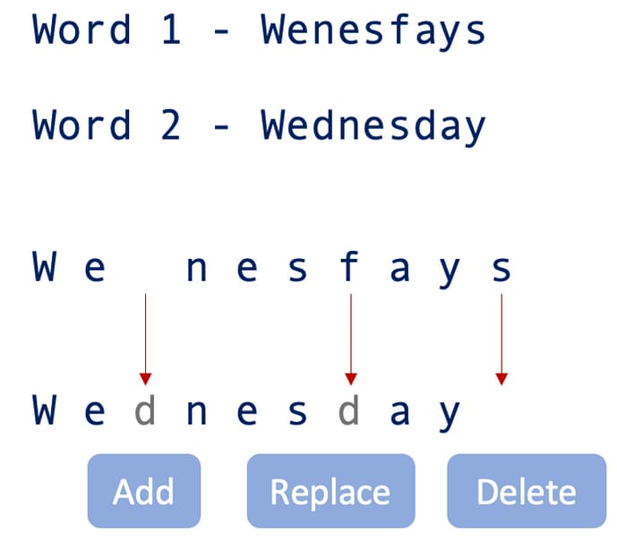

# 72. Edit Distance

Given two strings <code>word1</code> and <code>word2</code>, return <em>the minimum number of operations required to convert <code>word1</code> to <code>word2</code></em>.

You have the following three operations permitted on a word:

<ul>
	<li>Insert a character</li>
	<li>Delete a character</li>
	<li>Replace a character</li>
</ul>

&nbsp;

<strong class="example">Example 1:</strong>

<pre><strong>Input:</strong> word1 = "horse", word2 = "ros"
<strong>Output:</strong> 3
<strong>Explanation:</strong> 
horse -&gt; rorse (replace 'h' with 'r')
rorse -&gt; rose (remove 'r')
rose -&gt; ros (remove 'e')
</pre>

<strong class="example">Example 2:</strong>

<pre><strong>Input:</strong> word1 = "intention", word2 = "execution"
<strong>Output:</strong> 5
<strong>Explanation:</strong> 
intention -&gt; inention (remove 't')
inention -&gt; enention (replace 'i' with 'e')
enention -&gt; exention (replace 'n' with 'x')
exention -&gt; exection (replace 'n' with 'c')
exection -&gt; execution (insert 'u')
</pre>

&nbsp;

<strong>Constraints:</strong>

<ul>
	<li><code>0 &lt;= word1.length, word2.length &lt;= 500</code></li>
	<li><code>word1</code> and <code>word2</code> consist of lowercase English letters.</li>
</ul>

## Problem Overview

### Introduction to Edit Distance
[Edit distance](https://en.wikipedia.org/wiki/Edit_distance) is a string metric used in computer science to quantify how dissimilar two strings are. It measures the minimum number of operations required to transform one string into another. 

### Types of Edit Distance
There are various types of "edit distance," each allowing different operations to transform one string into another. In this problem, we refer specifically to **Levenshtein distance**.

### Levenshtein Distance
The Levenshtein distance allows three types of operations:
- **Insertion**: Adding a character
- **Deletion**: Removing a character
- **Replacement**: Replacing a character

### Real-World Applications
Solving this problem has several real-world applications. For example, it can help find the similarity score between two strings. A lower edit distance indicates higher similarity.

One prominent application is the auto-correct feature in text editors. When a spelling mistake is made, advanced text editors like Microsoft Word suggest the nearest matching words. These suggestions are based on words with the least edit distance from the dictionary.

Additionally, edit distance has applications in fields such as computational biology and natural language processing.

### Goal
The goal is to find the edit distance between two given strings, `word1` and `word2`.

Levenshtein distance finds edit distances by allowing three types of transformation operations: **addition**, **deletions**, and **replacements**

Let us now discuss the approaches to solving this problem.

