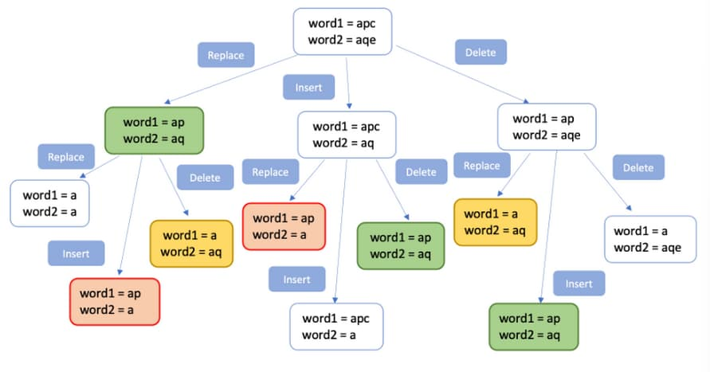

# 72. Edit Distance

<p>Given two strings <code>word1</code> and <code>word2</code>, return <em>the minimum number of operations required to convert <code>word1</code> to <code>word2</code></em>.</p>

<p>You have the following three operations permitted on a word:</p>

<ul>
  <li>Insert a character</li>
  <li>Delete a character</li>
  <li>Replace a character</li>
</ul>

<p>&nbsp;</p>
<p><strong class="example">Example 1:</strong></p>

<pre><strong>Input:</strong> word1 = "horse", word2 = "ros"
<strong>Output:</strong> 3
<strong>Explanation:</strong> 
horse -&gt; rorse (replace 'h' with 'r')
rorse -&gt; rose (remove 'r')
rose -&gt; ros (remove 'e')
</pre>

<p><strong class="example">Example 2:</strong></p>

<pre><strong>Input:</strong> word1 = "intention", word2 = "execution"
<strong>Output:</strong> 5
<strong>Explanation:</strong> 
intention -&gt; inention (remove 't')
inention -&gt; enention (replace 'i' with 'e')
enention -&gt; exention (replace 'n' with 'x')
exention -&gt; exection (replace 'n' with 'c')
exection -&gt; execution (insert 'u')
</pre>

<p>&nbsp;</p>
<p><strong>Constraints:</strong></p>

<ul>
  <li><code>0 &lt;= word1.length, word2.length &lt;= 500</code></li>
  <li><code>word1</code> and <code>word2</code> consist of lowercase English letters.</li>
</ul>

<br>

---

# Solution

- [Recursive Approach](#recursive-approach)
  - **Time Complexity**: `O(3^L)`
    - `L = max(len(word1), len(word2)).`
  - **Space Complexity**: `O(M + N)`
- [Memoization: Top-Down Dynamic Programming Approach](#memoization-top-down-dynamic-programming-approach)
  - **Time Complexity**: `O(M * N)`
  - **Space Complexity**: `O(M * N)`

## Problem Overview

### Introduction to Edit Distance
[Edit distance](https://en.wikipedia.org/wiki/Edit_distance) is a string metric used in computer science to quantify how dissimilar two strings are. It measures the minimum number of operations required to transform one string into another. 

### Types of Edit Distance
There are various types of "edit distance," each allowing different operations to transform one string into another. In this problem, we refer specifically to **Levenshtein distance**.

### Levenshtein Distance
The Levenshtein distance allows three types of operations:
- **Insertion**: Adding a character
- **Deletion**: Removing a character
- **Replacement**: Replacing a character

### Real-World Applications
Solving this problem has several real-world applications. For example, it can help find the similarity score between two strings. A lower edit distance indicates higher similarity.

One prominent application is the auto-correct feature in text editors. When a spelling mistake is made, advanced text editors like Microsoft Word suggest the nearest matching words. These suggestions are based on words with the least edit distance from the dictionary.

Additionally, edit distance has applications in fields such as computational biology and natural language processing.

### Goal
The goal is to find the edit distance between two given strings, `word1` and `word2`.

Levenshtein distance finds edit distances by allowing three types of transformation operations: **addition**, **deletions**, and **replacements**


Let us now discuss the approaches to solving this problem.

# Recursive Approach

## **Intuition**

Let's start by identifying the key principles of this approach:

1. **Identical Strings**: If the two strings are the same, the edit distance is zero.
   ```plaintext
   Example: word1 = "abcd", word2 = "abcd"
   Edit Distance = 0
   ```
   Since `word1` is equal to `word2`, there is no need to add, remove, or replace any characters.

2. **Different Characters**: Operations (add, delete, replace) are performed only if a character at a certain position in `word1` is different from the corresponding character in `word2`.
   ```plaintext
   Example: word1 = "abc", word2 = "abe"
   ```
   The character at the 3rd position in `word1` ('c') is different from the character in `word2` ('e'). In this case, we have three options to transform `word1` into `word2`:
   - **Option 1**: Delete 'c' from `word1`.
   - **Option 2**: Insert 'e' into `word1`.
   - **Option 3**: Replace 'c' with 'e' in `word1`.

### Choosing the Optimal Operation
To find the minimum number of operations to transform `word1` into `word2`, we must evaluate each operation:

1. **Delete 'c' from `word1`**:
   - Transforms "abc" to "ab" (Edit Distance = 2)
2. **Insert 'e' into `word1`**:
   - Transforms "abc" to "abec" (Edit Distance = 2)
3. **Replace 'c' with 'e' in `word1`**:
   - Transforms "abc" to "abe" (Edit Distance = 1)

From this example, we see that Option 3 is the optimal choice, resulting in an edit distance of 1.


### Conclusion
The edit distance to transform `word1` to `word2` can be calculated as:
```plaintext
Edit distance = Minimum (
    Number of operations after deleting character from "word1",
    Number of operations after inserting character in "word1",
    Number of operations after replacing character in "word1"
) + 1
```
The `+1` accounts for the current operation.

### Recursive Implementation
When it comes to trying all possible solutions and finding the most optimal one, recursion is a natural approach.

Whenever there is a mismatch between two characters in the strings, we need to try all possible operations and choose the best among them.

## **Algorithm**

### Overview
The goal is to transform `word1` into `word2` using the minimum number of operations (insert, delete, replace). We achieve this by comparing each character in `word1` and `word2` while tracking their respective indices.

### Steps

1. **Initial Setup**
   - Compare every character in `word1` and `word2`.
   - Track the current character index as `word1Index` and `word2Index`.

2. **Character Comparison**
   - **Match**: If `word1[word1Index] == word2[word2Index]`, move to the next index. No operation is needed.
   - **Mismatch**: If `word1[word1Index] != word2[word2Index]`, perform one of the three operations: delete, insert, or replace.

### Recursive Function Definition

Define the recursive function `computeEditDistance`, which finds the edit distance for `word1` ending at `word1Index` and `word2` ending at `word2Index`.

```plaintext
computeEditDistance(word1, word2, word1Index, word2Index)
```

### Recurrence Relations

Let's derive the recurrence relation for each possible operation:

1. **Replace Character**
   - Recurrence Relation: `computeEditDistance(word1, word2, word1Index - 1, word2Index - 1) + 1`
   - Example: Transform `"abc"` to `"abe"` by replacing 'c' with 'e'.

2. **Insert Character**
   - Recurrence Relation: `computeEditDistance(word1, word2, word1Index, word2Index - 1) + 1`
   - Example: Transform `"abc"` to `"abec"` by inserting 'e'.

3. **Delete Character**
   - Recurrence Relation: `computeEditDistance(word1, word2, word1Index - 1, word2Index) + 1`
   - Example: Transform `"abc"` to `"ab"` by deleting 'c'.

### Overall Recurrence Relation

If `word1[word1Index] != word2[word2Index]`, we have:
```plaintext
computeEditDistance(word1, word2, word1Index, word2Index) = minimum (
    computeEditDistance(word1, word2, word1Index - 1, word2Index - 1),
    computeEditDistance(word1, word2, word1Index, word2Index - 1),
    computeEditDistance(word1, word2, word1Index - 1, word2Index)
) + 1
```

If `word1[word1Index] == word2[word2Index]`, move to the next index without performing any operation.

### Base Cases

The base case is the terminating condition for the recursive function:

1. **word1 is empty**
   - If `word1` is an empty string, the only operation needed is to add the characters of `word2` to `word1`.
   - Edit Distance: Number of characters in `word2`.

2. **word2 is empty**
   - If `word2` is an empty string, the only operation needed is to delete all remaining characters in `word1`.
   - Edit Distance: Number of characters in `word1`.

### **Pseudocode**

```plaintext
function minDistance(word1, word2):
    return computeEditDistance(word1, word2, len(word1) - 1, len(word2) - 1)

function computeEditDistance(word1, word2, word1Index, word2Index):
    # Base Case 1: If word1 is empty, return the number of characters left in word2
    if word1Index < 0:
        return word2Index + 1

    # Base Case 2: If word2 is empty, return the number of characters left in word1
    if word2Index < 0:
        return word1Index + 1

    # If characters at current position match, move to the next position
    if word1[word1Index] == word2[word2Index]:
        return computeEditDistance(word1, word2, word1Index - 1, word2Index - 1)

    # If characters at current position do not match, consider all three operations
    insertOp = computeEditDistance(word1, word2, word1Index, word2Index - 1) + 1
    deleteOp = computeEditDistance(word1, word2, word1Index - 1, word2Index) + 1
    replaceOp = computeEditDistance(word1, word2, word1Index - 1, word2Index - 1) + 1

    # Return the minimum of the three operations
    return min(insertOp, deleteOp, replaceOp)
```

### Explanation:
1. **Base Cases**:
   - If `word1` is empty (i.e., `word1Index < 0`), return the number of characters left in `word2`.
   - If `word2` is empty (i.e., `word2Index < 0`), return the number of characters left in `word1`.

2. **Matching Characters**:
   - If the characters at the current positions in `word1` and `word2` match, recursively move to the next position.

3. **Non-Matching Characters**:
   - Consider all three operations (insert, delete, replace) and recursively calculate the minimum number of operations needed for each.

4. **Minimum Operations**:
   - Return the minimum value among the three operations.

## **Implementation**

#### Implementation Details:

1. **Function Definitions**:
   - `minDistance`: Public method to start the recursion.
   - `computeEditDistance`: Private recursive method to calculate the edit distance.

2. **Base Cases**:
   - If `word1Index` is `0`, return `word2Index` (remaining characters in `word2`).
   - If `word2Index` is `0`, return `word1Index` (remaining characters in `word1`).

3. **Character Matching**:
   - If characters at `word1Index - 1` and `word2Index - 1` match, move to the next position without any operation.

4. **Character Mismatch**:
   - Compute the minimum edit distance for insert, delete, and replace operations.

5. **Return Minimum Operation**:
   - Return the minimum value among the three operations (insert, delete, replace).

### Java

```java
class Solution {
  
  public int minDistance(String word1, String word2) {
    return computeEditDistance(word1, word2, word1.length(), word2.length());
  }

  private int computeEditDistance(String word1, String word2, int word1Index, int word2Index) {
    // Base Case 1: If word1 is empty, return the number of characters left in word2
    if (word1Index == 0) {
      return word2Index;
    }

    // Base Case 2: If word2 is empty, return the number of characters left in word1
    if (word2Index == 0) {
      return word1Index;
    }

    // If characters at the current position match, move to the next position
    if (word1.charAt(word1Index - 1) == word2.charAt(word2Index - 1)) {
      return computeEditDistance(word1, word2, word1Index - 1, word2Index - 1);
    } else {
      // If characters do not match, consider all three operations
      int insertOperation = computeEditDistance(word1, word2, word1Index, word2Index - 1) + 1;
      int deleteOperation = computeEditDistance(word1, word2, word1Index - 1, word2Index) + 1;
      int replaceOperation = computeEditDistance(word1, word2, word1Index - 1, word2Index - 1) + 1;

      // Return the minimum of the three operations
      return Math.min(insertOperation, Math.min(deleteOperation, replaceOperation));
    }
  }
}
```

### TypeScript

This TypeScript implementation follows the recursive algorithm for finding the minimum edit distance between two strings.

```typescript
function minDistance(word1: string, word2: string): number {
  return computeEditDistance(word1, word2, word1.length, word2.length);
}

function computeEditDistance(
  word1: string,
  word2: string,
  word1Index: number,
  word2Index: number
): number {
  // Base Case 1: If word1 is empty, return the number of characters left in word2
  if (word1Index === 0) {
    return word2Index;
  }

  // Base Case 2: If word2 is empty, return the number of characters left in word1
  if (word2Index === 0) {
    return word1Index;
  }

  // If characters at the current position match, move to the next position
  if (word1[word1Index - 1] === word2[word2Index - 1]) {
    return computeEditDistance(word1, word2, word1Index - 1, word2Index - 1);
  } else {
    // If characters do not match, consider all three operations
    const insertOperation =
      computeEditDistance(word1, word2, word1Index, word2Index - 1) + 1;
    const deleteOperation =
      computeEditDistance(word1, word2, word1Index - 1, word2Index) + 1;
    const replaceOperation =
      computeEditDistance(word1, word2, word1Index - 1, word2Index - 1) + 1;

    // Return the minimum of the three operations
    return Math.min(
      insertOperation,
      Math.min(deleteOperation, replaceOperation)
    );
  }
}
```

### Explanation:
1. **Function Definitions**:
   - `minDistance`: Public method to start the recursion.
   - `computeEditDistance`: Private recursive method to calculate the edit distance.

2. **Base Cases**:
   - If `word1Index` is `0`, return `word2Index` (remaining characters in `word2`).
   - If `word2Index` is `0`, return `word1Index` (remaining characters in `word1`).

3. **Character Matching**:
   - If characters at `word1Index - 1` and `word2Index - 1` match, move to the next position without any operation.

4. **Character Mismatch**:
   - Compute the minimum edit distance for insert, delete, and replace operations.

5. **Return Minimum Operation**:
   - Return the minimum value among the three operations (insert, delete, replace).

## **Complexity Analysis**

### Assumptions
- Let `M` be the length of string `word1`.
- Let `N` be the length of string `word2`.
- Let `L` be `max(M, N)`. In another way `L = max(len(word1), len(word2)).`

### **Time Complexity**: `O(3^L)`

- **Exponential Time Complexity**: For every pair of `word1` and `word2`, if the characters do not match, we recursively explore three possibilities (insert, delete, replace). 
- **Worst Case Scenario**: In the worst case, where none of the characters match, we will explore `3^L` possibilities. This is because each character mismatch triggers three recursive calls, leading to an exponential growth in the number of operations.

### **Space Complexity**: `O(M + N)`

- **Depth of Recursion Call Stack**: The space complexity is determined by the depth of the recursion tree. In the worst case, the depth of the recursion tree is `M + N` because the recursive process continues until either `word1` or `word2` is empty. Therefore, the maximum depth of the call stack will be `M + N`.

# Memoization: Top-Down Dynamic Programming Approach

## **Intuition**

Although the recursive solution works well, it is exhaustive. To see how many repetitive calculations occur, refer to the illustration below:



In the illustration, you can see that the same substring combination of `word1` and `word2` is evaluated multiple times (highlighted in the same color). There is no need for this repeated computation.

#### Optimizing Recursive Calls

We can optimize these recursive calls by storing the results of every computed sub-problem and reusing them whenever needed. This eliminates unnecessary repetitive calculations.

By caching or memorizing the result of every operation, the algorithm can check if the result for a problem is already present in the cache before computing it again. This optimization technique is known as **memoization**.

### Memoization Overview

Memoization is a top-down dynamic programming approach that involves breaking down a problem into smaller sub-problems, solving each sub-problem only once, and storing their results for future use. This approach ensures that each sub-problem is solved just once, avoiding the exponential time complexity of pure recursive solutions.

### Steps Involved in Memoization

1. **Define a Recursive Function**: The function should solve the problem by recursively calling itself for smaller sub-problems.
2. **Use a Cache**: Implement a cache (e.g., a dictionary or an array) to store the results of solved sub-problems.
3. **Check Cache Before Computation**: Before solving a sub-problem, check if its result is already in the cache. If it is, use the cached result instead of recomputing it.
4. **Store Results in Cache**: After computing the result for a sub-problem, store it in the cache for future use.

### Top-Down Dynamic Programming (Memoization) Process

1. **Initialization**: Start solving the problem from the top (the original problem) and break it down into smaller sub-problems.
2. **Recursion with Memoization**: Use recursion to solve each sub-problem and store the results in the cache.
3. **Reuse Cached Results**: For each sub-problem, check if its result is already in the cache. If it is, use the cached result; otherwise, compute and store the result.

### Advantages of Memoization

- **Efficiency**: Reduces the time complexity by avoiding repeated calculations of the same sub-problems.
- **Simplicity**: Maintains the simplicity and elegance of the recursive approach while optimizing performance.

## **Algorithm**

The top-down dynamic programming approach, also known as memoization, improves the efficiency of the recursive solution by caching the results of sub-problems. This prevents repeated calculations of the same sub-problems.

By adding memoization to the recursive function, the top-down dynamic programming approach effectively reduces the number of redundant calculations, leading to a more efficient solution.

### Key Concepts

1. **Caching Sub-Problems**: Store the results of sub-problems in a cache (2-dimensional array) to reuse them and avoid redundant computations.
2. **Recursive Function**: Use a recursive function to solve the problem, enhanced with memoization to store and retrieve precomputed results.

### Steps

1. **Define Parameters**:
   - `word1`: The source string.
   - `word2`: The target string.
   - `word1Index`: Current index in `word1` (0-indexed).
   - `word2Index`: Current index in `word2` (0-indexed).

2. **Use a 2-Dimensional Array (Cache)**:
   - Create a 2-dimensional array `memo` where `memo[word1Index][word2Index]` stores the result of transforming `word1` ending at `word1Index` to `word2` ending at `word2Index`.

3. **Check Cache Before Computation**:
   - Before computing the result of a sub-problem, check if it is already present in `memo[word1Index][word2Index]`. If yes, return the stored result.

4. **Store Results in Cache**:
   - After computing the result of a sub-problem, store it in `memo[word1Index][word2Index]` for future reference.

### Example

Consider a recursive call with the following parameters:
- `word1 = "abc"`
- `word2 = "ad"`
- `word1Index = 2` (0-indexed)
- `word2Index = 1` (0-indexed)

The algorithm processes as follows:

1. **Base Case Checks**:
   - If `word1Index` is `0`, return `word2Index`.
   - If `word2Index` is `0`, return `word1Index`.

2. **Character Match**:
   - If `word1[word1Index - 1] == word2[word2Index - 1]`, move to the next indices without any operation.

3. **Character Mismatch**:
   - If characters do not match, compute the minimum edit distance by considering the three operations (insert, delete, replace) and update the cache.

### **Pseudocode**

```plaintext
function minDistance(word1, word2):
    initialize memo as a 2-dimensional array with -1
    return minDistanceMemo(word1, word2, word1.length, word2.length, memo)

function minDistanceMemo(word1, word2, word1Index, word2Index, memo):
    if word1Index == 0:
        return word2Index
    if word2Index == 0:
        return word1Index
    if memo[word1Index][word2Index] != -1:
        return memo[word1Index][word2Index]
    if word1[word1Index - 1] == word2[word2Index - 1]:
        memo[word1Index][word2Index] = minDistanceMemo(word1, word2, word1Index - 1, word2Index - 1, memo)
    else:
        insertOp = minDistanceMemo(word1, word2, word1Index, word2Index - 1, memo) + 1
        deleteOp = minDistanceMemo(word1, word2, word1Index - 1, word2Index, memo) + 1
        replaceOp = minDistanceMemo(word1, word2, word1Index - 1, word2Index - 1, memo) + 1
        memo[word1Index][word2Index] = min(insertOp, deleteOp, replaceOp)
    return memo[word1Index][word2Index]
```

## **Implementation**

Using memoization to optimize the recursive approach reduces redundant calculations and improves performance.

#### Implementation Details:

- **Initialization**:
  - `minDistance`: Initializes the memoization table (`memo`) with `-1` and starts the recursive process with `computeEditDistance`.

- **Recursive Function**:
  - **Base Cases**: 
    - If `word1Index` is `0`, return `word2Index` (remaining characters in `word2`).
    - If `word2Index` is `0`, return `word1Index` (remaining characters in `word1`).
  - **Memoization Check**: 
    - Before computing the result for a sub-problem, check if it's already cached in `memo`.
  - **Character Match**: 
    - If characters match, move to the next indices without any operation.
  - **Character Mismatch**: 
    - If characters do not match, compute the edit distance by considering the three operations (insert, delete, replace) and update the cache with the minimum result.


## **Complexity Analysis**

### Assumptions
- Let `M` be the length of string `word1`.
- Let `N` be the length of string `word2`.

### **Time Complexity**: `O(M * N)`

- **Memoization Uses Cache**: For every combination of `word1` and `word2`, the result is computed only once and then stored in the `memo` cache. This avoids redundant calculations.
- **Recursive Calls**: Without memoization, the recursive calls would result in exponential time complexity. However, memoization ensures that each sub-problem is solved only once, leading to a linear number of computations.
- **Worst Case Scenario**: In the worst case, where none of the characters match, every cell in the `memo` table will be filled, resulting in `M * N` operations.

### **Space Complexity**: `O(M * N)`

- **Memoization Table (`memo`)**: The space complexity is determined by the size of the `memo` table, which stores the results of sub-problems. The `memo` table is a 2-dimensional array of size `M * N`.
- **Depth of Recursion Call Stack**: The maximum depth of the recursion tree is `M + N`, but since the space required for the `memo` table (`M * N`) dominates, the overall space complexity is `O(M * N)`.
