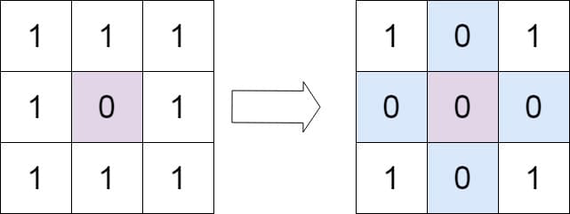
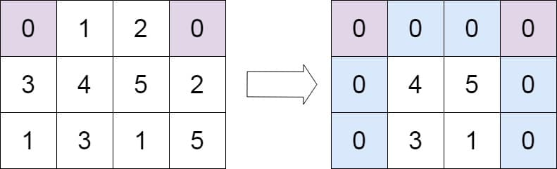

# 73. Set Matrix Zeroes

<p>Given an <code>m x n</code> integer matrix <code>matrix</code>, if an element is <code>0</code>, set its entire row and column to <code>0</code>'s.</p>

<p>You must do it <a href="https://en.wikipedia.org/wiki/In-place_algorithm" target="_blank">in place</a>.</p>

<p>&nbsp;</p>
<p><strong class="example">Example 1:</strong></p>

<pre><strong>Input:</strong> matrix = [[1,1,1],[1,0,1],[1,1,1]]
<strong>Output:</strong> [[1,0,1],[0,0,0],[1,0,1]]
</pre>

<p><strong class="example">Example 2:</strong></p>

<pre><strong>Input:</strong> matrix = [[0,1,2,0],[3,4,5,2],[1,3,1,5]]
<strong>Output:</strong> [[0,0,0,0],[0,4,5,0],[0,3,1,0]]
</pre>

<p>&nbsp;</p>
<p><strong>Constraints:</strong></p>

<ul>
  <li><code>m == matrix.length</code></li>
  <li><code>n == matrix[0].length</code></li>
  <li><code>1 &lt;= m, n &lt;= 200</code></li>
  <li><code>-2<sup>31</sup> &lt;= matrix[i][j] &lt;= 2<sup>31</sup> - 1</code></li>
</ul>

<p>&nbsp;</p>
<p><strong>Follow up:</strong></p>

<ul>
  <li>A straightforward solution using <code>O(mn)</code> space is probably a bad idea.</li>
  <li>A simple improvement uses <code>O(m + n)</code> space, but still not the best solution.</li>
  <li>Could you devise a constant space solution?</li>
</ul>

<br>

---

# Solution

- [Two Pass Matrix Zeroing (Naive Approach)](#two-pass-naive-approach)
  - **Time Complexity**: `O(R*C)`
- [Mark and Sweep (Optimized Approach)](#mark-and-sweep-optimized-approach)

### Two-Pass Matrix Zeroing (Naive Approach)

This approach uses extra memory to record rows and columns with zeroes, completed in two passes.

## **Intuition**

If any cell in the matrix contains a zero, the entire row and column of that cell should be set to zero. All of the cells of this recorded row and column can be marked zero in the next iteration.

## **Algorithm**

1. **Initialize Sets**: Use two sets to record the rows and columns that contain zeros.
2. **First Pass**: Iterate over the matrix to find cells with zeros and record their row and column indices in the sets.
3. **Second Pass**: Iterate over the matrix again and set cells to zero if their row or column is in the recorded sets.

## **Implementation**

### Java

```java
import java.util.HashSet;
import java.util.Set;

/**
 * Sets matrix zeroes in an R x C matrix.
 * If an element is 0, sets its entire row and column to 0's.
 * 
 * This function uses a two-pass matrix zeroing approach,
 * but it requires additional memory of O(R + C).
 * 
 * @param matrix the matrix to be modified
 */
class Solution {
  public void setZeroes(int[][] matrix) {
    int R = matrix.length;
    int C = matrix[0].length;
    Set<Integer> rows = new HashSet<>();
    Set<Integer> cols = new HashSet<>();

    // First pass to find all rows and columns that contain zero
    for (int i = 0; i < R; i++) {
      for (int j = 0; j < C; j++) {
        if (matrix[i][j] == 0) {
          rows.add(i);
          cols.add(j);
        }
      }
    }

    // Second pass to set the cells to zero
    for (int i = 0; i < R; i++) {
      for (int j = 0; j < C; j++) {
        if (rows.contains(i) || cols.contains(j)) {
          matrix[i][j] = 0;
        }
      }
    }
  }
}
```

### TypeScript

```typescript
/**
 * Sets matrix zeroes in an R x C matrix.
 * If an element is 0, sets its entire row and column to 0's.
 * 
 * This function uses a two-pass matrix zeroing approach,
 * but it requires additional memory of O(R + C).
 * 
 * @param {number[][]} matrix - The matrix to modify.
 */
function setZeroes(matrix: number[][]): void {
  const rows = new Set<number>();
  const cols = new Set<number>();
  const R = matrix.length;
  const C = matrix[0].length;

  // First pass to find zeros and mark rows and columns
  for (let i = 0; i < R; i++) {
    for (let j = 0; j < C; j++) {
      if (matrix[i][j] === 0) {
        rows.add(i);
        cols.add(j);
      }
    }
  }

  // Second pass to set matrix cells to zero
  for (let i = 0; i < R; i++) {
    for (let j = 0; j < C; j++) {
      if (rows.has(i) || cols.has(j)) {
        matrix[i][j] = 0;
      }
    }
  }
}
```

## **Complexity Analysis**

Given `R` and `C` are the number of rows and columns respectively in the matrix.

### **Time Complexity**: `O(R * C)`

- The algorithm makes two passes over the entire matrix. The first pass to find zeros and the second pass to set the required cells to zero. Hence, the time complexity is linear with respect to the number of cells in the matrix.

### **Space Complexity**: `O(R + C)`

- The space complexity is determined by the additional space used to store the indices of rows and columns that contain zeros. In the worst case, all rows and columns may contain zeros, resulting in the space complexity being proportional to the sum of the number of rows and columns.

# Mark and Sweep (Optimized Approach)

This approach uses `O(1)` space by utilizing the matrix itself as indicators to achieve space efficiency.

## **Intuition**

Instead of using additional memory to track rows and columns to be reset, we can use the matrix itself as indicators. The idea is to use the first cell of each row and column as a flag to determine whether that row or column should be set to zero. This way, for every zero found, we mark the corresponding row and column by setting the first cell of the row and the first cell of the column to zero.

For example, if `matrix[i][j] == 0`:

```java
matrix[i][0] = 0;
matrix[0][j] = 0;
```
These flags are later used to update the matrix. If the first cell of a row is set to zero, it means the entire row should be marked zero, and similarly for columns.

## **Algorithm**

1. **Mark the Rows and Columns:**
   - Iterate over the matrix to find zeros.
   - If `matrix[i][j] == 0`, set `matrix[i][0]` and `matrix[0][j]` to zero.

2. **Use Additional Variable:**
   - Use an additional variable to mark whether the first column should be zeroed, because the first cell of the first row and first column overlap at `matrix[0][0]`.

3. **Update the Matrix:**
   - Iterate over the matrix starting from the second row and second column (`matrix[1][1]` onwards).
   - If `matrix[i][0] == 0` or `matrix[0][j] == 0`, set `matrix[i][j]` to zero.

4. **Update the First Row and Column:**
   - If `matrix[0][0] == 0`, set the entire first row to zero.
   - If the first column was marked, set the entire first column to zero.

