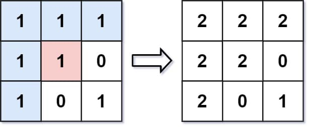

# 733. Flood Fill

You are given an image represented by an <code>m x n</code> grid of integers <code>image</code>, where <code>image[i][j]</code> represents the pixel value of the image. You are also given three integers <code>sr</code>, <code>sc</code>, and <code>color</code>. Your task is to perform a <strong>flood fill</strong> on the image starting from the pixel <code>image[sr][sc]</code>.

To perform a <strong>flood fill</strong>:

<ol>
	<li>Begin with the starting pixel and change its color to <code>color</code>.</li>
	<li>Perform the same process for each pixel that is <strong>directly adjacent</strong> (pixels that share a side with the original pixel, either horizontally or vertically) and shares the <strong>same color</strong> as the starting pixel.</li>
	<li>Keep <strong>repeating</strong> this process by checking neighboring pixels of the <em>updated</em> pixels&nbsp;and modifying their color if it matches the original color of the starting pixel.</li>
	<li>The process <strong>stops</strong> when there are <strong>no more</strong> adjacent pixels of the original color to update.</li>
</ol>

Return the <strong>modified</strong> image after performing the flood fill.

&nbsp;

<strong class="example">Example 1:</strong>

<strong>Input:</strong> image = [[1,1,1],[1,1,0],[1,0,1]], sr = 1, sc = 1, color = 2

<strong>Output:</strong> [[2,2,2],[2,2,0],[2,0,1]]

<strong>Explanation:</strong>

From the center of the image with position <code>(sr, sc) = (1, 1)</code> (i.e., the red pixel), all pixels connected by a path of the same color as the starting pixel (i.e., the blue pixels) are colored with the new color.

Note the bottom corner is <strong>not</strong> colored 2, because it is not horizontally or vertically connected to the starting pixel.

<strong class="example">Example 2:</strong>

<strong>Input:</strong> image = [[0,0,0],[0,0,0]], sr = 0, sc = 0, color = 0

<strong>Output:</strong> [[0,0,0],[0,0,0]]

<strong>Explanation:</strong>

The starting pixel is already colored with 0, which is the same as the target color. Therefore, no changes are made to the image.

&nbsp;

<strong>Constraints:</strong>

<ul>
	<li><code>m == image.length</code></li>
	<li><code>n == image[i].length</code></li>
	<li><code>1 &lt;= m, n &lt;= 50</code></li>
	<li><code>0 &lt;= image[i][j], color &lt; 216</code></li>
	<li><code>0 &lt;= sr &lt; m</code></li>
	<li><code>0 &lt;= sc &lt; n</code></li>
</ul>

---

## **Problem Overview: Flood Fill**

Flood fill is a region‑expansion procedure. Starting from a given pixel, you recolor that pixel and every pixel reachable from it through 4‑directional adjacency, but only if those pixels share the same original color as the starting pixel.

This is a classic graph traversal problem on a grid. The grid cells are nodes, and edges exist between up, down, left, and right neighbors.

## Example 1 Breakdown
Image:
  [[1,1,1],
   [1,1,0],
   [1,0,1]]

Start at (1,1) with original color 1. All 1‑valued pixels connected through 4‑directional adjacency form a region. That region is recolored to 2. The bottom‑right pixel is not recolored because it is diagonally connected, not side‑connected.

## Example 2 Breakdown
If the starting pixel already has the target color, no traversal is needed. The image is returned unchanged.
