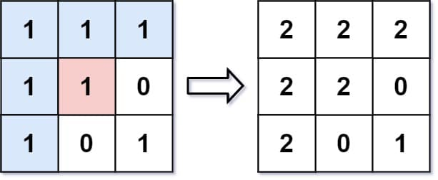

# 733. Flood Fill

<p>You are given an image represented by an <code>m x n</code> grid of integers <code>image</code>, where <code>image[i][j]</code> represents the pixel value of the image. You are also given three integers <code>sr</code>, <code>sc</code>, and <code>color</code>. Your task is to perform a <strong>flood fill</strong> on the image starting from the pixel <code>image[sr][sc]</code>.</p>

<p>To perform a <strong>flood fill</strong>:</p>

<ol>
	<li>Begin with the starting pixel and change its color to <code>color</code>.</li>
	<li>Perform the same process for each pixel that is <strong>directly adjacent</strong> (pixels that share a side with the original pixel, either horizontally or vertically) and shares the <strong>same color</strong> as the starting pixel.</li>
	<li>Keep <strong>repeating</strong> this process by checking neighboring pixels of the <em>updated</em> pixels&nbsp;and modifying their color if it matches the original color of the starting pixel.</li>
	<li>The process <strong>stops</strong> when there are <strong>no more</strong> adjacent pixels of the original color to update.</li>
</ol>

<p>Return the <strong>modified</strong> image after performing the flood fill.</p>

<p>&nbsp;</p>
<p><strong class="example">Example 1:</strong></p>

<div class="example-block">
<p><strong>Input:</strong> <span class="example-io">image = [[1,1,1],[1,1,0],[1,0,1]], sr = 1, sc = 1, color = 2</span></p>

<p><strong>Output:</strong> <span class="example-io">[[2,2,2],[2,2,0],[2,0,1]]</span></p>

<p><strong>Explanation:</strong></p>

<p></p>

<p>From the center of the image with position <code>(sr, sc) = (1, 1)</code> (i.e., the red pixel), all pixels connected by a path of the same color as the starting pixel (i.e., the blue pixels) are colored with the new color.</p>

<p>Note the bottom corner is <strong>not</strong> colored 2, because it is not horizontally or vertically connected to the starting pixel.</p>
</div>

<p><strong class="example">Example 2:</strong></p>

<div class="example-block">
<p><strong>Input:</strong> <span class="example-io">image = [[0,0,0],[0,0,0]], sr = 0, sc = 0, color = 0</span></p>

<p><strong>Output:</strong> <span class="example-io">[[0,0,0],[0,0,0]]</span></p>

<p><strong>Explanation:</strong></p>

<p>The starting pixel is already colored with 0, which is the same as the target color. Therefore, no changes are made to the image.</p>
</div>

<p>&nbsp;</p>
<p><strong>Constraints:</strong></p>

<ul>
	<li><code>m == image.length</code></li>
	<li><code>n == image[i].length</code></li>
	<li><code>1 &lt;= m, n &lt;= 50</code></li>
	<li><code>0 &lt;= image[i][j], color &lt; 2<sup>16</sup></code></li>
	<li><code>0 &lt;= sr &lt; m</code></li>
	<li><code>0 &lt;= sc &lt; n</code></li>
</ul>

---

# Solution

- [Depth First Search Approach](#depth-first-search-approach)
  - **Time Complexity**: `O(m * n)`
  - **Space Complexity**: `O(m * n)`
- [Breadth First Search Approach](#breadth-first-search-approach)

## **Problem Overview: Flood Fill**

Flood fill is a region‑expansion procedure. Starting from a given pixel, you recolor that pixel and every pixel reachable from it through 4‑directional adjacency, but only if those pixels share the same original color as the starting pixel.

This is a classic graph traversal problem on a grid. The grid cells are nodes, and edges exist between up, down, left, and right neighbors.

## Example 1 Breakdown
Image:
  [[1,1,1],
   [1,1,0],
   [1,0,1]]

Start at (1,1) with original color 1. All 1‑valued pixels connected through 4‑directional adjacency form a region. That region is recolored to 2. The bottom‑right pixel is not recolored because it is diagonally connected, not side‑connected.

## Example 2 Breakdown
If the starting pixel already has the target color, no traversal is needed. The image is returned unchanged.

### **Constraints**
- `m == image.length`
- `n == image[i].length`
- `1 <= m, n <= 50`
- `0 <= image[i][j], color < 216`
- `0 <= sr < m`
- `0 <= sc < n`

## Key Observations
- The starting pixel defines the **source color**. Only pixels with this color are eligible for recoloring.
- If the **source color equals the target color**, the image is unchanged. This is an important early‑exit condition.
- The traversal can be done with either DFS or BFS. Both explore all reachable same‑colored neighbors.
- The grid is small (max 50x50), so recursion depth or queue size is safe.

## What This Problem Teaches
- Grid traversal fundamentals.
- Region detection using adjacency.
- DFS vs BFS tradeoffs.
- Early‑exit optimization.
- Boundary and color‑matching checks.

## Conceptual Workflow
1. Read the starting pixel's color.
2. If it already equals the new color, return the image.
3. Begin traversal from (sr, sc).
4. For each pixel visited:
   - Recolor it.
   - Explore its four neighbors.
   - If a neighbor is in bounds and matches the original color, continue traversal.
5. Stop when no more valid neighbors remain.

## DFS Intuition
DFS dives deep along one path before backtracking. It is natural for recursive implementations:
- Recolor current pixel.
- Recursively process neighbors.

## BFS Intuition
BFS expands outward level by level:
- Use a queue.
- Recolor the starting pixel.
- Push neighbors that match the original color.
- Pop from queue, recolor, push their neighbors, and repeat.

# Depth First Search Approach

## **Intuition**

Flood fill using DFS is about expanding a connected region one branch at a time. You start at the initial pixel, note its original color, and then recursively explore outward. Each recursive call handles a single pixel: if it matches the original color, recolor it and continue exploring its four neighbors. DFS naturally models the idea of following one path deeply before returning to explore the remaining directions.

The key insight is that the grid behaves like a graph. DFS ensures every reachable pixel of the original color is visited exactly once. The recursion stack keeps track of the exploration path, and boundary checks prevent out‑of‑bounds or mismatched‑color pixels from being processed.

## **Algorithm**

1. Read the original color at (sr, sc).  
2. If the original color equals the new color, return the image immediately.  
3. Define a recursive function `dfs(r, c)`:
   - If `(r, c)` is out of bounds, return.
   - If `image[r][c]` does not match the original color, return.
   - Recolor `image[r][c]` to the new color.
   - Recursively call `dfs` on the four neighbors:
     - `(r + 1, c)`
     - `(r - 1, c)`
     - `(r, c + 1)`
     - `(r, c - 1)`
4. Invoke `dfs(sr, sc)` to begin the flood fill.
5. Return the modified image.

### **Pseudocode**

```java
function floodFill(image, sr, sc, newColor):
  originalColor = image[sr][sc]

  if originalColor == newColor:
    return image

  function dfs(r, c):
    if r < 0 or r >= number_of_rows(image):
      return
    if c < 0 or c >= number_of_columns(image):
      return
    if image[r][c] != originalColor:
      return

    image[r][c] = newColor

    dfs(r + 1, c)
    dfs(r - 1, c)
    dfs(r, c + 1)
    dfs(r, c - 1)

  dfs(sr, sc)
  return image
```

## **Implementation**

### Java

```java
class Solution {
  public int[][] floodFill(int[][] image, int sr, int sc, int color) {
    int original = image[sr][sc];
    if (original == color) {
      return image;
    }

    dfs(image, sr, sc, original, color);
    return image;
  }

  private void dfs(int[][] image, int r, int c, int original, int color) {
    int m = image.length;
    int n = image[0].length;

    if (r < 0 || r >= m) {
      return;
    }
    if (c < 0 || c >= n) {
      return;
    }
    if (image[r][c] != original) {
      return;
    }

    image[r][c] = color;

    dfs(image, r + 1, c, original, color);
    dfs(image, r - 1, c, original, color);
    dfs(image, r, c + 1, original, color);
    dfs(image, r, c - 1, original, color);
  }
}
```

### TypeScript

```typescript
function floodFill(image: number[][], sr: number, sc: number, color: number): number[][] {
  const original = image[sr][sc];
  if (original === color) {
    return image;
  }

  function dfs(r: number, c: number): void {
    const m = image.length;
    const n = image[0].length;

    if (r < 0 || r >= m) {
      return;
    }
    if (c < 0 || c >= n) {
      return;
    }
    if (image[r][c] !== original) {
      return;
    }

    image[r][c] = color;

    dfs(r + 1, c);
    dfs(r - 1, c);
    dfs(r, c + 1);
    dfs(r, c - 1);
  }

  dfs(sr, sc);
  return image;
}
```

## **Complexity Analysis**

### **Assumptions**
- Let `m` be the number of rows in the image.
- Let `n` be the number of columns in the image.
- Let `m * n` be the total number of pixels.
- Flood fill only visits pixels that share the original starting color and are 4‑directionally connected.

### **Time Complexity**: `O(m * n)`
- **Linear-Time**: Each pixel is visited at most once. Even though DFS explores recursively, no pixel is recolored or processed more than a single time. Therefore, the total work is proportional to the number of pixels in the connected region, which in the worst case is the entire grid of size `m * n`.

### **Space Complexity**: `O(m * n)`
- **Recursion-Stack Usage**: DFS uses the call stack to explore neighbors. In the worst case (e.g., the entire grid is one connected region), the recursion depth can grow to `m * n`, producing linear auxiliary space.
- **No Additional Structures**: Aside from the recursion stack, the algorithm does not allocate extra data structures. The image is modified in place, and only a constant number of local variables are used.

# Breadth First Search Approach

## **Intuition**

BFS flood fill expands the region outward in layers. Instead of diving deep along one path, BFS processes pixels in the order they are discovered, using a queue to track the frontier. You begin at the starting pixel, recolor it, then push its valid neighbors into the queue. Each time you dequeue a pixel, you recolor it and enqueue its own valid neighbors. This continues until no more pixels of the original color remain reachable.

The key idea is level‑order expansion: BFS ensures that all pixels at distance 1 from the start are processed before distance 2, and so on. This makes the traversal predictable and avoids recursion depth concerns. Every pixel is visited at most once, and adjacency checks ensure only valid same‑colored pixels are added to the queue.

### Pseudocode

```Java
function floodFill(image, sr, sc, newColor):
  originalColor = image[sr][sc]

  if originalColor == newColor:
    return image

  queue = empty_queue()
  enqueue(queue, (sr, sc))
  image[sr][sc] = newColor

  while queue is not empty:
    (r, c) = dequeue(queue)

    for each (nr, nc) in [(r+1, c), (r-1, c), (r, c+1), (r, c-1)]:
      if nr < 0 or nr >= number_of_rows(image):
        continue
      if nc < 0 or nc >= number_of_columns(image):
        continue
      if image[nr][nc] != originalColor:
        continue

      image[nr][nc] = newColor
      enqueue(queue, (nr, nc))
```
