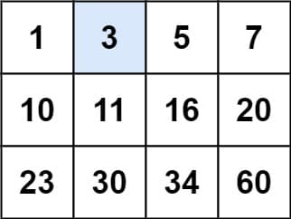

# 74. Search a 2D Matrix

<p>You are given an <code>m x n</code> integer matrix <code>matrix</code> with the following two properties:</p>

<ul>
	<li>Each row is sorted in non-decreasing order.</li>
	<li>The first integer of each row is greater than the last integer of the previous row.</li>
</ul>

<p>Given an integer <code>target</code>, return <code>true</code> <em>if</em> <code>target</code> <em>is in</em> <code>matrix</code> <em>or</em> <code>false</code> <em>otherwise</em>.</p>

<p>You must write a solution in <code>O(log(m * n))</code> time complexity.</p>

<p>&nbsp;</p>
<p><strong class="example">Example 1:</strong></p>

<pre><strong>Input:</strong> matrix = [[1,3,5,7],[10,11,16,20],[23,30,34,60]], target = 3
<strong>Output:</strong> true
</pre>

<p><strong class="example">Example 2:</strong></p>

<pre><strong>Input:</strong> matrix = [[1,3,5,7],[10,11,16,20],[23,30,34,60]], target = 13
<strong>Output:</strong> false
</pre>

<p>&nbsp;</p>
<p><strong>Constraints:</strong></p>

<ul>
	<li><code>m == matrix.length</code></li>
	<li><code>n == matrix[i].length</code></li>
	<li><code>1 &lt;= m, n &lt;= 100</code></li>
	<li><code>-10<sup>4</sup> &lt;= matrix[i][j], target &lt;= 10<sup>4</sup></code></li>
</ul>

<br>

---

# Solution

- [Binary Search Approach](#binary-search-approach)
  - (**Time Complexity**: `O(log(mn))`)

# Binary Search Approach

## **Intuition**

When dealing with a sorted 2D matrix, it can be conceptually flattened into a sorted 1D array of length `m * n` where `m` is the number of rows and `n` is the number of columns. This flattened array retains the sorted order and allows us to perform binary search, an efficient search algorithm.

The crucial insight is that the index in this virtual 1D array can be easily mapped to the corresponding row and column in the original 2D matrix using simple arithmetic operations:

- **Row**: `row = index // n`
- **Column**: `col = index % n`

This transformation allows us to leverage binary search to efficiently find the target value within the 2D matrix.

## **Algorithm**

The algorithm is a standard binary search adapted for a 2D matrix:

1. **Initialization**:
   - Initialize two pointers: `left` at the start of the virtual array (`0`) and `right` at the end of the virtual array (`m * n - 1`).

2. **Binary Search**:
   - While `left` is less than or equal to `right`:
     - Calculate the middle index of the virtual array: `pivot_idx = (left + right) // 2`.
     - Convert the `pivot_idx` to the corresponding row and column in the 2D matrix:
       - `row = pivot_idx // n`
       - `col = pivot_idx % n`
     - Retrieve the element at the calculated row and column: `pivot_element = matrix[row][col]`.
     - Compare the `pivot_element` with the target:
       - If `pivot_element` equals the target, return `true` (target found).
       - If `pivot_element` is less than the target, move the `left` pointer to `pivot_idx + 1` (search in the right half).
       - If `pivot_element` is greater than the target, move the `right` pointer to `pivot_idx - 1` (search in the left half).

3. **End of Search**:
   - If the search completes without finding the target, return `false`.

## **Implementation**

### Java

```java
public class Solution {
    
    /**
     * Searches for a target value in a sorted 2D matrix using binary search.
     *
     * @param matrix The 2D matrix of integers.
     * @param target The target value to search for.
     * @return true if the target is found, otherwise false.
     */
    public boolean searchMatrix(int[][] matrix, int target) {
        if (matrix == null || matrix.length == 0 || matrix[0].length == 0) {
            return false;
        }
        
        int m = matrix.length;
        int n = matrix[0].length;
        int left = 0;
        int right = m * n - 1;
        
        while (left <= right) {
            int pivot_idx = (left + right) / 2;
            int row = pivot_idx / n;
            int col = pivot_idx % n;
            int pivot_element = matrix[row][col];
            
            if (pivot_element == target) {
                return true;
            } else if (pivot_element < target) {
                left = pivot_idx + 1;
            } else {
                right = pivot_idx - 1;
            }
        }
        
        return false;
    }
}
```

### TypeScript

```typescript
function searchMatrix(matrix: number[][], target: number): boolean {
  if (matrix === null || matrix.length === 0 || matrix[0].length === 0) {
    return false;
  }

  let m = matrix.length;
  let n = matrix[0].length;
  let left = 0;
  let right = m * n - 1;

  while (left <= right) {
    let pivotIdx = Math.floor((left + right) / 2);
    let row = Math.floor(pivotIdx / n);
    let col = pivotIdx % n;
    let pivotElement = matrix[row][col];

    if (pivotElement === target) {
      return true;
    } else if (pivotElement < target) {
      left = pivotIdx + 1;
    } else {
      right = pivotIdx - 1;
    }
  }

  return false;
};
```

## **Complexity Analysis**

### **Time Complexity**: `O(log(mn))`

- **Binary Search**: The algorithm performs binary search on a conceptual flattened version of the `m x n` matrix. 
  - In each iteration of the binary search, the search space is halved, which gives us the logarithmic time complexity.
  - Since we are dealing with a virtual array of length `m * n`, the time complexity is `O(log(mn))`.

### **Space Complexity**: `O(1)`

- **Constant Space**: The algorithm uses a constant amount of extra space.
  - The space required is for a few variables: pointers (`left`, `right`, `pivot_idx`), and the temporary variables for the row, column, and pivot element.
  - No additional data structures are used that grow with the input size.
  - Therefore, the space complexity is `O(1)`, indicating constant space usage.

### Detailed Explanation

1. **Initialization**: Setting up the pointers (`left`, `right`) takes constant time and space.
2. **Binary Search Loop**:
   - Each iteration of the loop involves a constant number of operations: calculating the middle index (`pivot_idx`), transforming the index to row and column, comparing the `pivot_element` with the target, and adjusting the pointers.
   - The number of iterations of the loop is proportional to the logarithm of the number of elements in the matrix, resulting in a time complexity of `O(log(mn))`.
3. **Memory Usage**:
   - The algorithm maintains a few variables to manage the binary search process, all of which use constant space.
   - No additional arrays, lists, or other data structures are utilized that would scale with the size of the input matrix.

### Summary

- The algorithm efficiently searches for a target value in a sorted 2D matrix by leveraging binary search on a virtual 1D array representation.
- The time complexity is `O(log(mn))` due to the binary search mechanism.
- The space complexity is `O(1)` because only a constant amount of extra space is used.
