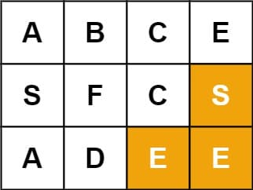

# 79. Word Search

<p>Given an <code>m x n</code> grid of characters <code>board</code> and a string <code>word</code>, return <code>true</code> <em>if</em> <code>word</code> <em>exists in the grid</em>.</p>

<p>The word can be constructed from letters of sequentially adjacent cells, where adjacent cells are horizontally or vertically neighboring. The same letter cell may not be used more than once.</p>

<p>&nbsp;</p>
<p><strong class="example">Example 1:</strong></p>

<pre><strong>Input:</strong> board = [["A","B","C","E"],["S","F","C","S"],["A","D","E","E"]], word = "ABCCED"
<strong>Output:</strong> true
</pre>

<p><strong class="example">Example 2:</strong></p>

<pre><strong>Input:</strong> board = [["A","B","C","E"],["S","F","C","S"],["A","D","E","E"]], word = "SEE"
<strong>Output:</strong> true
</pre>

<p><strong class="example">Example 3:</strong></p>

<pre><strong>Input:</strong> board = [["A","B","C","E"],["S","F","C","S"],["A","D","E","E"]], word = "ABCB"
<strong>Output:</strong> false
</pre>

<p>&nbsp;</p>
<p><strong>Constraints:</strong></p>

<ul>
  <li><code>m == board.length</code></li>
  <li><code>n = board[i].length</code></li>
  <li><code>1 &lt;= m, n &lt;= 6</code></li>
  <li><code>1 &lt;= word.length &lt;= 15</code></li>
  <li><code>board</code> and <code>word</code> consists of only lowercase and uppercase English letters.</li>
</ul>

<p>&nbsp;</p>
<p><strong>Follow up:</strong> Could you use search pruning to make your solution faster with a larger <code>board</code>?</p>

<br>

---

# Solution

- [Backtracking Approach](#backtracking-approach)

# Backtracking Approach

## **Intuition**

This problem is a 2D grid traversal problem.

While it is true that we explore the 2D grid with a Depth-First Search (DFS) strategy, this alone does not capture the entire nature of the solution.

A more accurate term to summarize the solution is backtracking. Backtracking is a methodology where we mark the current path of exploration. If the path does not lead to a solution, we then revert the change (i.e., backtrack) and try another path.

In the general approach to the solution, we traverse the 2D grid. At each step, we mark our choice before moving to the next step. At the end of each step, we revert our mark so that we have a clean slate to try another direction. The exploration is done using the DFS strategy, where we go as far as possible before trying the next direction.

### What is Backtracking?

Backtracking is an algorithmic technique for solving problems incrementally, by trying to build a solution piece by piece and removing those solutions that fail to satisfy the constraints of the problem at any point. It's akin to a trial-and-error method for finding solutions, where you attempt a possibility, and if it doesn’t lead to a solution, you backtrack to the previous step and try the next alternative.

### Steps Involved in Backtracking

1. **Choose**: Select a choice that can be made.
2. **Explore**: Proceed with this choice by moving forward in the problem space and attempting to solve the problem under this choice.
3. **Check**: Determine if the current state is a solution. If it is, we are done; if not:
4. **Backtrack**: Revert the last choice (undo the last step) and try another possibility.

### When to Use Backtracking?

Backtracking is particularly useful for problems where:
- The solution space is large but can be pruned through constraints.
- We need to find all solutions or just one valid solution.
- The problem can be divided into smaller sub-problems that can be tackled incrementally.

### Example Applications

- Solving puzzles like Sudoku or crossword puzzles.
- Finding all permutations or combinations of a set.
- Traversing a maze or 2D grid to find paths.

### Key Points to Remember

- **Recursive Approach**: Backtracking solutions are often implemented using recursion, which allows us to systematically explore and revert choices.
- **Pruning**: Effective backtracking involves pruning unnecessary paths early by checking constraints, thus reducing the overall search space.
- **Stack-Like Nature**: The exploration of possible choices can be visualized as a depth-first traversal of a decision tree.

## **Algorithm**

The skeleton of the algorithm is a loop that iterates through each cell in the grid. For each cell, we invoke the backtracking function `backtrack()` to check if we would obtain a solution, starting from this very cell.

For the backtracking function `backtrack(row, col, suffix)`, as a DFS algorithm, it is often implemented as a recursive function. The function can be broken down into the following four steps:

1. **Step 1:** At the beginning, first, we check if we reach the bottom case of the recursion, where the word to be matched is empty, i.e., we have already found the match for each prefix of the word.

2. **Step 2:** We then check if the current state is invalid, either the position of the cell is out of the boundary of the board, or the letter in the current cell does not match the first letter of the word.

3. **Step 3:** If the current step is valid, we then start the exploration of backtracking with the strategy of DFS. First, we mark the current cell as visited, e.g., any non-alphabetic letter will do. Then we iterate through the four possible directions, namely up, right, down, and left. The order of the directions can be altered, to one's preference.

4. **Step 4:** At the end of the exploration, we revert the cell back to its original state. Finally, we return the result of the exploration.

### Pseudocode

```pseudo
function exist(board, word):
    for each row in board:
        for each col in row:
            if backtrack(board, row, col, word):
                return true
    return false

function backtrack(board, row, col, suffix):
    if suffix is empty:
        return true
    
    if row is out of boundary or col is out of boundary or board[row][col] != first letter of suffix:
        return false
    
    # Mark the current cell as visited
    temp = board[row][col]
    board[row][col] = '#'
    
    # Explore the four possible directions
    result = backtrack(board, row + 1, col, suffix[1:]) or
             backtrack(board, row - 1, col, suffix[1:]) or
             backtrack(board, row, col + 1, suffix[1:]) or
             backtrack(board, row, col - 1, suffix[1:])
    
    # Revert the current cell to its original state
    board[row][col] = temp
    
    return result
```

## **Implementation**

### Java

```java
class Solution {
  private char[][] board;
  private int ROWS;
  private int COLS;

  /**
   * Determines if the word exists in the given board.
   */
  public boolean exist(char[][] board, String word) {
    this.board = board;
    this.ROWS = board.length;
    this.COLS = board[0].length;

    // Iterate through each cell in the grid
    for (int row = 0; row < this.ROWS; ++row) {
      for (int col = 0; col < this.COLS; ++col) {
        // Invoke backtracking function to check if the word can be found starting from this cell
        if (this.backtrack(row, col, word, 0)) {
          return true;
        }
      }
    }
    return false;
  }

  /**
   * Recursive backtracking function to search for the word in the grid.
   */
  protected boolean backtrack(int row, int col, String word, int index) {
    // Step 1: Check the bottom case. If we have found the match for each prefix of the word
    if (index >= word.length()) {
      return true;
    }

    // Step 2: Check the boundaries and character match
    if (row < 0 || row == this.ROWS || col < 0 || col == this.COLS
        || this.board[row][col] != word.charAt(index)) {
      return false;
    }

    // Step 3: Explore the backtracking with the DFS strategy
    // Mark the current cell as visited
    char temp = this.board[row][col];
    this.board[row][col] = '#';

    // Explore the four possible directions: up, down, left, right
    int[] rowOffsets = {1, -1, 0, 0};
    int[] colOffsets = {0, 0, 1, -1};
    boolean result = false;
    for (int d = 0; d < 4; ++d) {
      result = this.backtrack(row + rowOffsets[d], col + colOffsets[d], word, index + 1);
      if (result) {
        break;
      }
    }

    // Step 4: Revert the cell back to its original state
    this.board[row][col] = temp;

    return result;
  }
}
```

#### Implementation Details

- Instead of returning directly once we find a match, we simply break out of the loop and do the cleanup before returning.

