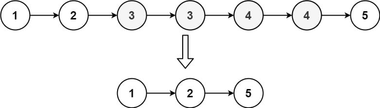
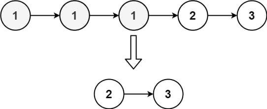

# 82. Remove Duplicates from Sorted List II

Given the <code>head</code> of a sorted linked list, <em>delete all nodes that have duplicate numbers, leaving only distinct numbers from the original list</em>. Return <em>the linked list <strong>sorted</strong> as well</em>.

&nbsp;

<strong class="example">Example 1:</strong>

<pre><strong>Input:</strong> head = [1,2,3,3,4,4,5]
<strong>Output:</strong> [1,2,5]
</pre>

<strong class="example">Example 2:</strong>

<pre><strong>Input:</strong> head = [1,1,1,2,3]
<strong>Output:</strong> [2,3]
</pre>

&nbsp;

<strong>Constraints:</strong>

<ul>
	<li>The number of nodes in the list is in the range <code>[0, 300]</code>.</li>
	<li><code>-100 &lt;= Node.val &lt;= 100</code></li>
	<li>The list is guaranteed to be <strong>sorted</strong> in ascending order.</li>
</ul>

---

## **Problem Overview: Remove Duplicates from Sorted List II**

#### **Problem Statement**
Given the `head` of a sorted linked list, the goal is to remove all nodes that appear more than once in the list, leaving only distinct values. The resulting linked list should remain sorted.

#### **Key Observations**
1. The linked list is **sorted in ascending order**, which simplifies duplicate detection.
2. The objective is to **completely remove duplicated values**—meaning any number that appears more than once should be eliminated entirely.
3. The function must return the **new head of the filtered list** after removing duplicates.

#### **Example Walkthrough**
**Example 1:**
- **Input:** `[1,2,3,3,4,4,5]`
- **Process:** `3` and `4` are duplicates, so they are removed entirely.
- **Output:** `[1,2,5]`

**Example 2:**
- **Input:** `[1,1,1,2,3]`
- **Process:** `1` appears multiple times, so it is eliminated.
- **Output:** `[2,3]`

#### **Constraints**
- `0 <= Number of nodes <= 300`
- `-100 <= Node.val <= 100`
- The list is guaranteed to be **sorted**.

#### **Approach and Complexity**
- **Iterate through the list**, tracking duplicate elements using a pointer.
- **Skip over duplicate elements** entirely rather than just linking past them.
- **Time Complexity:** `O(n)`, where `n` is the number of nodes (since each node is visited once).
- **Space Complexity:** `O(1)`, as we modify the list in place without using extra data structures.
