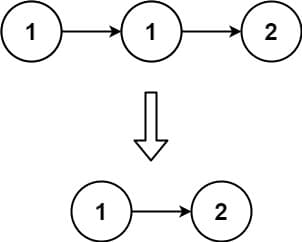
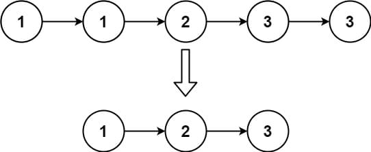

# 83. Remove Duplicates from Sorted List

<p>Given the <code>head</code> of a sorted linked list, <em>delete all duplicates such that each element appears only once</em>. Return <em>the linked list <strong>sorted</strong> as well</em>.</p>

<p>&nbsp;</p>
<p><strong class="example">Example 1:</strong></p>

<pre><strong>Input:</strong> head = [1,1,2]
<strong>Output:</strong> [1,2]
</pre>

<p><strong class="example">Example 2:</strong></p>

<pre><strong>Input:</strong> head = [1,1,2,3,3]
<strong>Output:</strong> [1,2,3]
</pre>

<p>&nbsp;</p>
<p><strong>Constraints:</strong></p>

<ul>
	<li>The number of nodes in the list is in the range <code>[0, 300]</code>.</li>
	<li><code>-100 &lt;= Node.val &lt;= 100</code></li>
	<li>The list is guaranteed to be <strong>sorted</strong> in ascending order.</li>
</ul>

---

# Solution

- [In-Place Duplicate Removal Approach](#in-place-duplicate-removal-approach)

### Problem Overview: Remove Duplicates from Sorted List

This problem requires modifying a **sorted linked list** by removing duplicate nodes to ensure each value appears only once, while maintaining the list's sorting order.

#### **Input & Output**
- **Input:** The `head` of a sorted linked list.
- **Output:** A modified linked list with all duplicates removed.

#### **Examples**
- **Example 1:**
  Input: `[1, 1, 2]`  
  Output: `[1, 2]`
- **Example 2:**  
  Input: `[1, 1, 2, 3, 3]`  
  Output: `[1, 2, 3]`

#### **Constraints**
- The number of nodes ranges from `0` to `300`.
- Node values range from `-100` to `100`.
- The list is sorted in ascending order.

#### **Approach**
Traverse the linked list once, comparing each node with its `next` node. If duplicate values are detected (`current.val === current.next.val`), adjust the `next` pointer to skip the duplicate node. This approach ensures a single pass and retains sorting.

# In-Place Duplicate Removal Approach

## **Intuition**

Since the input linked list is sorted, duplicates are always adjacent, enabling easy identification and removal during a single traversal of the list. By checking each node's value against the next node's value, we can skip over duplicates while maintaining the structure and order of the list.

## **Algorithm**

1. Start with the head of the linked list as the current node.
2. Traverse the list while the current node and its next node are not null.
   - Compare the value of the current node with the value of the next node.
   - If the values are equal (indicating a duplicate), update the current node's `next` pointer to skip the duplicate node.
   - If the values are not equal, move to the next node.
3. Stop when all nodes have been processed.
4. Return the head of the modified linked list.

### **Pseudocode**

```plaintext
FUNCTION remove_duplicates(head):
    IF head IS null:
        RETURN null

    current_node = head
    WHILE current_node AND current_node.next IS NOT null:
        IF current_node.value == current_node.next.value:
            current_node.next = current_node.next.next  // Skip duplicate
        ELSE:
            current_node = current_node.next           // Move to next node
    
    RETURN head
```