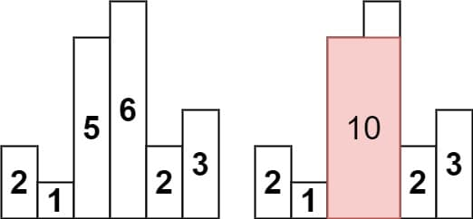
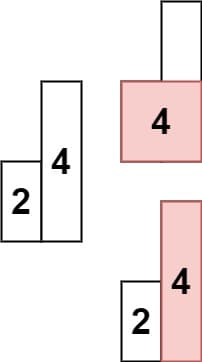
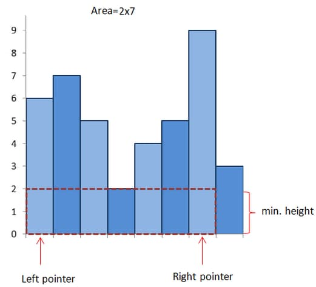

# 84. Largest Rectangle in Histogram

<p>Given an array of integers <code>heights</code> representing the histogram's bar height where the width of each bar is <code>1</code>, return <em>the area of the largest rectangle in the histogram</em>.</p>

<p>&nbsp;</p>
<p><strong class="example">Example 1:</strong></p>

<pre><strong>Input:</strong> heights = [2,1,5,6,2,3]
<strong>Output:</strong> 10
<strong>Explanation:</strong> The above is a histogram where width of each bar is 1.
The largest rectangle is shown in the red area, which has an area = 10 units.
</pre>

<p><strong class="example">Example 2:</strong></p>

<pre><strong>Input:</strong> heights = [2,4]
<strong>Output:</strong> 4
</pre>

<p>&nbsp;</p>
<p><strong>Constraints:</strong></p>

<ul>
  <li><code>1 &lt;= heights.length &lt;= 10<sup>5</sup></code></li>
  <li><code>0 &lt;= heights[i] &lt;= 10<sup>4</sup></code></li>
</ul>

---

# Solution

- [Brute Force (Naive) Approach](#brute-force-naive-approach)
  - **Time Complexity**: `O(n^2)`
  - **Space Complexity**: `O(1)`
- [Stack (Optimized) Approach](#stack-optimized-approach)

### **Problem Overview: Largest Rectangle in Histogram**  

#### **Description**  
Given an array of integers `heights` representing the **heights of histogram bars**, where each bar has a **fixed width of 1**, determine the **largest rectangular area** that can be formed within the histogram.  

#### **Examples**  
**Example 1:**  
- **Input:** `heights = [2,1,5,6,2,3]`  
- **Output:** `10`  
- **Explanation:** The largest rectangle is formed by bars at indices `[2,3]` (heights `5,6`), covering `width = 2` and `height = 5`, giving an **area = 10 units**.  

**Example 2:**  
- **Input:** `heights = [2,4]`  
- **Output:** `4`  
- **Explanation:** The rectangle spans **one bar** with a height of `4`, yielding an **area = 4 units**.  

#### **Constraints**  
- `1 <= heights.length <= 100,000`  
- `0 <= heights[i] <= 10,000`  

### **Goal**  
The problem requires finding the **largest rectangular area** that can be formed in a histogram where:
- Each **bar's width** is **1 unit**.
- The heights are given as an **array of integers**.

### **Key Insights:**  
1. **Brute Force Approach:**  
   - Consider every possible rectangle.
   - Compute the area for each.
   - Results in **O(n^2) time complexity** (inefficient for large inputs).  

2. **Stack-Based Optimization:**  
   - **Monotonic Stack** can help efficiently track left and right boundaries.
   - Allows **constant-time height retrieval** while maintaining **sorted order**.
   - Achieves **O(N) time complexity**, improving performance significantly.

### **Algorithm Strategy:**  
1. **Iterate over the bars** while maintaining a **monotonic stack**.  
2. **When a decreasing bar is encountered**, pop from the stack to determine the largest rectangle that can be formed with the removed bar.  
3. **Calculate areas dynamically** based on the popped height and its left-right boundaries.  
4. **Continue until all bars have been processed**, ensuring the largest possible area is captured.

# Brute Force (Naive) Approach

Starting with the **brute force approach** helps in understanding the problem thoroughly and serves as a foundation for optimized solutions. While simple, becomes inefficient for larger histograms due to its **quadratic time complexity**.

## **Intuition**

A key observation is that the **height of a rectangle**—formed between any two bars—will always be **limited by the shortest bar** lying between them.



Thus, to determine the **maximum rectangular area**, we:
1. **Consider every possible pair of bars** in the histogram.
2. **Identify the shortest bar** between them (as it constrains the height).
3. **Compute the area of the rectangle** formed by using:
   - **Height** = Minimum bar height within the range.
   - **Width** = Distance between the two bars.
4. Track the **maximum area** encountered during the iterations.

### Initial Implementation: Brute Force

```java
class Solution {
  public int largestRectangleArea(int[] heights) {
    int maxArea = 0;
    int n = heights.length;

    // Iterate over all possible starting bars
    for (int i = 0; i < n; i++) {
      for (int j = i; j < n; j++) {
        int minHeight = Integer.MAX_VALUE; // Start with maximum possible value

        // Find the minimum height within the range [i, j]
        for (int k = i; k <= j; k++) {
          minHeight = Math.min(minHeight, heights[k]);
        }

        // Compute the rectangle's area and update maxArea
        int width = j - i + 1;
        maxArea = Math.max(maxArea, minHeight * width);
      }
    }

    return maxArea;
  }
}
```

However this leads to the a quadratic time complexity of `O(n^3)` as it uses **three nested for loops** to find the minimum height bar `O(n)` lying between every pair `O(n^2)`.

### **Optimizing the Brute Force Solution**  

We can improve the brute force approach by reducing redundant computations. Instead of evaluating every possible pair and recalculating the **minimum height** for each range from scratch, we can **track the minimum height dynamically** as we expand the rectangle.  

Rather than recomputing the smallest bar within each new range, we **reuse the previous minimum height** and update it using the current bar’s height: `minheight = min(minheight, heights(j))`

\[
\text{minHeight} = \min(\text{minHeight}, \text{heights}[j])
\]

where `heights[j]` represents the height of the `jth` bar in the expansion.  

This eliminates redundant calculations and makes the brute force approach more efficient while maintaining its `O(n^2)` complexity.  

## **Algorithm**

1. **Initialize `maxArea = 0`** to store the largest rectangle found.  
2. **Loop through each bar index `i`** as the potential **starting point**:  
   - Set `minHeight = heights[i]` (initial height for the range).  
   - Expand the rectangle to **each ending index `j ≥ i`**:  
     - **Update `minHeight = Math.min(minHeight, heights[j])`**.  
     - **Calculate area using:**  
       \[
       \text{Area} = \text{minHeight} \times (\text{j} - \text{i} + 1)
       \]
     - **Update `maxArea`** if this area is larger.  
3. **Return `maxArea`** after all iterations.  

## **Implementation**

### Java

```java
public class Solution {
  public int largestRectangleArea(int[] heights) {
    int maxArea = 0;
    int n = heights.length;

    // Iterate over all possible starting bars
    for (int i = 0; i < n; i++) {
      int minHeight = heights[i];

      // Expand the rectangle by iterating over possible ending bars
      for (int j = i; j < n; j++) {
        minHeight = Math.min(minHeight, heights[j]); // Maintain minimum height in range
        int width = j - i + 1; // Calculate width
        maxArea = Math.max(maxArea, minHeight * width); // Compute and track maximum area
      }
    }

    return maxArea;
  }
}
```

### TypeScript

```typescript
function largestRectangleArea(heights: number[]): number {
  let maxArea = 0;
  let n = heights.length;

  // Iterate over all possible starting bars
  for (let i = 0; i < n; i++) {
    let minHeight = heights[i];

    // Expand the rectangle by iterating over possible ending bars
    for (let j = i; j < n; j++) {
      // Maintain minimum height in range
      minHeight = Math.min(minHeight, heights[j]); 

      let width = j - i + 1; // Calculate width

      // Compute and track maximum area
      maxArea = Math.max(maxArea, minHeight * width); 
    }
  }
  
  return maxArea;
};
```

## **Complexity Analysis**

### **Assumptions**
- The brute force approach considers **every possible rectangle** in the histogram.
- The algorithm maintains a **tracking variable** for the minimum height across a given range.

### **Time Complexity: `O(n^2)`**  
The complexity **is quadratic (`O(n^2)`)**, because:
1. **Outer loop (`i` runs from `0` to `n-1`)** → `O(n)`
2. **Inner loop (`j` runs from `i` to `n-1`)** → `O(n)`
3. **Finding the minimum height** within `i → j` occurs in `O(1)`, since it updates dynamically.

Thus, the total operations roughly follow **nested loops**, leading to **O(n^2) time complexity**.

### **Space Complexity: `O(1)`**  
- **Constant-space usage**:  
  - The algorithm **only uses a few scalar variables** (`maxArea`, `minHeight`, `width`).
  - No additional data structures (arrays, lists, or stacks) are allocated.
- **No extra memory is needed** beyond the input array.

# **Stack (Optimized) Approach**  

#### **Overview**  
This approach leverages a **monotonic increasing stack** to efficiently determine the boundaries where each histogram bar **begins and ends** in forming the largest rectangle. By **tracking indices** instead of recalculating heights redundantly, we significantly improve performance.

## **Intuition**

The brute force is inefficient because of redundant computations for minimum heights on overlapping rectangles. Instead if we maintain a stack we can track the boundaries of where each bar can extend, therefore we can push a -1 or neutral value to signal the end.

Each bar removed from the stack represents the height of a rectangle, whereas the difference comes from the next smaller bar on the left and current index.

If we reach the end of the array we can pop all elements of the stack and at every pop we can find the area, computing the area of the largest rectangle dynamically.