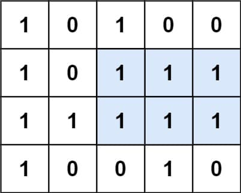

# 85. Maximal Rectangle

<p>Given a <code>rows x cols</code>&nbsp;binary <code>matrix</code> filled with <code>0</code>'s and <code>1</code>'s, find the largest rectangle containing only <code>1</code>'s and return <em>its area</em>.</p>

<p>&nbsp;</p>
<p><strong class="example">Example 1:</strong></p>

<pre><strong>Input:</strong> matrix = [["1","0","1","0","0"],["1","0","1","1","1"],["1","1","1","1","1"],["1","0","0","1","0"]]
<strong>Output:</strong> 6
<strong>Explanation:</strong> The maximal rectangle is shown in the above picture.
</pre>

<p><strong class="example">Example 2:</strong></p>

<pre><strong>Input:</strong> matrix = [["0"]]
<strong>Output:</strong> 0
</pre>

<p><strong class="example">Example 3:</strong></p>

<pre><strong>Input:</strong> matrix = [["1"]]
<strong>Output:</strong> 1
</pre>

<p>&nbsp;</p>
<p><strong>Constraints:</strong></p>

<ul>
  <li><code>rows == matrix.length</code></li>
  <li><code>cols == matrix[i].length</code></li>
  <li><code>1 &lt;= row, cols &lt;= 200</code></li>
  <li><code>matrix[i][j]</code> is <code>'0'</code> or <code>'1'</code>.</li>
</ul>

---

# Solution

- [Brute Force (Naive) Approach](#brute-force-naive-approach)
  - **Time Complexity: `O(n^3 * m^3)`**
  - **Space Complexity**: `O(1)`
- [Dynamic Programming Approach](#dynamic-programming-approach)
  - **Time Complexity: `O(n^2 * m)`**
  - **Space Complexity: `O(n * m)`**
- [Stack (Optimized) Approach](#stack-optimized-approach)
  - **Time Complexity**: `O(n * m)`
  - **Space Complexity**: `O(m)`

### Problem Overview: Maximal Rectangle

The **Maximal Rectangle** problem requires finding the largest rectangular submatrix containing only `1`s in a given binary matrix (`rows x cols`) and returning its area.

#### Problem Breakdown:
- You are given a `rows x cols` binary matrix filled with `'0'`s and `'1'`s.
- The goal is to determine the largest contiguous rectangular area that consists only of `1`s.
- The output is the area of this maximal rectangle.

#### Examples:
##### Example 1:
**Input:**  
```
matrix = [
    ["1","0","1","0","0"],
    ["1","0","1","1","1"],
    ["1","1","1","1","1"],
    ["1","0","0","1","0"]
]
```
**Output:** `6`  
**Explanation:** The largest rectangle containing only `1`s has an area of `6`.

##### Example 2:
**Input:**  
```
matrix = [["0"]]
```
**Output:** `0`

##### Example 3:
**Input:**  
```
matrix = [["1"]]
```
**Output:** `1`

#### Constraints:
- `rows == matrix.length`
- `cols == matrix[i].length`
- `1 <= rows, cols <= 200`
- `matrix[i][j]` is `'0'` or `'1'`

#### Approach:
- One efficient way to solve this is by leveraging **dynamic programming** and **monotonic stack techniques** to transform the problem into a **largest rectangle in a histogram** challenge.
- You can maintain a **height array** that tracks the consecutive `1`s at each row, and apply the **largest rectangle in histogram** algorithm.

# Brute Force (Naive) Approach

We explore the brute force approach to develop foundational intuition before optimizing.

## **Intuition**
A straightforward way to solve the problem is to consider every possible rectangle within the matrix. This requires iterating over all pairs of possible top-left and bottom-right corners, verifying whether the entire enclosed area consists of `1`s, and tracking the largest valid area found.

- **Step 1:** Choose any two opposite corners `(x1, y1)` and `(x2, y2)` that define a submatrix.
- **Step 2:** Check whether all elements within this submatrix are `1`s.
- **Step 3:** Track the maximal rectangle area found.

This approach is **highly inefficient** because it redundantly evaluates overlapping areas multiple times.

## **Algorithm**
1. Iterate over all possible `(x1, y1)` positions as the top-left corner.
2. Iterate over all possible `(x2, y2)` positions as the bottom-right corner.
3. Verify that the entire rectangle from `(x1, y1)` to `(x2, y2)` consists of `1`s.
4. Compute and maintain the largest valid area found.

## **Implementation**

```java
class Solution {
  public int maximalRectangle(char[][] matrix) {
    int n = matrix.length, m = matrix[0].length;
    int maxArea = 0;

    for (int x1 = 0; x1 < n; x1++) {
      for (int y1 = 0; y1 < m; y1++) {
        for (int x2 = x1; x2 < n; x2++) {
          for (int y2 = y1; y2 < m; y2++) {
            if (isValidRectangle(matrix, x1, y1, x2, y2)) {
              int area = (x2 - x1 + 1) * (y2 - y1 + 1);
              maxArea = Math.max(maxArea, area);
            }
          }
        }
      }
    }
    return maxArea;
  }

  private boolean isValidRectangle(char[][] matrix, int x1, int y1, int x2, int y2) {
    for (int i = x1; i <= x2; i++) {
      for (int j = y1; j <= y2; j++) {
        if (matrix[i][j] == '0') {
          return false;
        }
      }
    }
    return true;
  }
}
```

## **Complexity Analysis**

### **Assumptions**
- Let `n` be the number of rows.
- Let `m` be the number of columns.

### **Time Complexity: `O(n^3 * m^3)`**
- Choosing two opposite corners: `O(n^2 * m^2)`.
- Checking whether the submatrix contains only `1`s: `O(n * m)` in the worst case.
- Thus, the overall worst-case complexity is **`O(n^3 * m^3)`**, making this approach impractical for large matrices.

### **Space Complexity: `O(1)`**
- **No extra memory used:** The approach relies only on a few integer variables for tracking indices and area.
- **Constant additional space:** The matrix itself is given as input, and no extra data structures are created.

### **Why This Is Too Slow**
- Evaluates **all possible rectangles**, leading to an explosion of computations.
- **Redundant checks** for overlapping rectangles.
- **Exponential growth**, making it infeasible for `n, m` approaching `200`.

# Dynamic Programming Approach

We optimize the brute force method by leveraging histograms to reduce redundant computations.

## **Intuition**
Instead of considering all possible rectangles, we build a **DP table** (`dp[i][j]`) that stores **the maximum width** of a rectangle ending at `(i, j)`. This allows us to compute **valid rectangle areas efficiently**. 

The idea is:
- **Track maximum width** at each position:  
  `dp[i][j] = dp[i][j-1] + 1` if `matrix[i][j] == '1'`
- **Use previous rows to determine the height**:  
  Iterate **upwards**, finding the **smallest width** encountered.
- **Compute area** using:  
  `width * height`, ensuring **the maximum** area is tracked.

This approach allows us to compute **each rectangle efficiently** rather than redundantly scanning full regions.

### Key Idea: Histogram

Instead of considering all possible rectangles explicitly, we can treat each row of the matrix as a **base** and compute maximal **histograms** from it. The key idea:
- We maintain an array **heights[]**, where `heights[j]` tracks the number of consecutive `1`s ending at the current row.
- We use the **largest rectangle in a histogram** method to find the **maximum rectangular area** at each row.
- This effectively transforms the matrix into **row-wise histograms**, solving them efficiently.

### Key Observations:
1. **Tracking Heights:** At each row, update `heights[j]` as:
   - `heights[j] = heights[j] + 1` if `matrix[i][j] == '1'`
   - `heights[j] = 0` if `matrix[i][j] == '0'`
2. **Applying Largest Rectangle in Histogram:** Once we construct the height array, we treat it as a histogram and use a **monotonic stack** (or other approaches) to find the largest rectangular area efficiently.

This approach is a direct extension of **84 - Largest Rectangle in Histogram**.

## **Algorithm**
1. Initialize a **DP table** (`dp[][]`) to store widths at each `(i, j)`.
2. **Iterate** through each matrix cell:
   - If `matrix[i][j] == '1'`, update `dp[i][j]` based on leftward values.
   - Track the **minimum width** from previous rows.
   - Compute the **area** dynamically.
3. Maintain a global **maxArea** across iterations.

### **Pseudocode**

```java
FUNCTION maximalRectangle(matrix):
  IF matrix is empty:
    RETURN 0

  rows = number of rows in matrix
  cols = number of columns in matrix
  maxArea = 0

  // Initialize DP table to track widths
  CREATE dp[rows][cols] initialized to 0

  FOR each row i from 0 to rows - 1:
    FOR each column j from 0 to cols - 1:
      IF matrix[i][j] is '1':
        // Compute max width ending at (i, j)
        dp[i][j] = (j == 0) ? 1 : dp[i][j - 1] + 1

        width = dp[i][j]

        // Iterate upwards to compute max rectangle
        FOR k from i down to 0:
          width = MIN(width, dp[k][j]) // Maintain smallest width encountered
          area = width * (i - k + 1)   // Compute rectangle area
          maxArea = MAX(maxArea, area)

  RETURN maxArea
```

## **Implementation**

### Java

```java
class Solution {
  public int maximalRectangle(char[][] matrix) {
    if (matrix.length == 0) {
      return 0;
    }

    int n = matrix.length, m = matrix[0].length;
    int maxArea = 0;
    int[][] dp = new int[n][m]; // Stores max width of '1's

    for (int i = 0; i < n; i++) {
      for (int j = 0; j < m; j++) {
        if (matrix[i][j] == '1') {
          // Compute max width ending at (i, j)
          dp[i][j] = (j == 0) ? 1 : dp[i][j - 1] + 1;

          int width = dp[i][j];

          // Check previous rows to compute max area
          for (int k = i; k >= 0; k--) {
            width = Math.min(width, dp[k][j]);
            maxArea = Math.max(maxArea, width * (i - k + 1));
          }
        }
      }
    }
    return maxArea;
  }
}
```

### TypeScript

```typescript
/**
 * Implements the dynamic programming approach to solve the Maximal Rectangle problem.
 * 
 * Uses a DP table (`dp[][]`) where `dp[i][j]` stores the maximum width of consecutive '1's
 * ending at position (i, j). Iterates upwards to determine the largest possible rectangle.
 * 
 * Time Complexity: O(n^2 * m), where n = rows and m = columns.
 * Space Complexity: O(n * m) for the DP table.
 */
function maximalRectangle(matrix: string[][]): number {
  if (matrix.length === 0) return 0;
  const n = matrix.length, m = matrix[0].length;
  let maxArea = 0;
  const dp: number[][] = Array.from({ length: n }, () => Array(m).fill(0));

  // Populate the DP table
  for (let i = 0; i < n; i++) {
    for (let j = 0; j < m; j++) {
      if (matrix[i][j] === '1') {
        // Compute max width ending at (i, j)
        dp[i][j] = j === 0 ? 1 : dp[i][j - 1] + 1;

        let width = dp[i][j];

        // Iterate upwards to compute max area with (i, j) as bottom-right corner
        for (let k = i; k >= 0; k--) {
          width = Math.min(width, dp[k][j]); // Maintain the smallest width encountered
          const area = width * (i - k + 1); // Compute rectangle area
          maxArea = Math.max(maxArea, area);
        }
      }
    }
  }
  return maxArea;
}
```

## **Complexity Analysis**

### **Assumptions**
- Let `n` be the number of rows.
- Let `m` be the number of columns.

### **Time Complexity: `O(n^2 * m)`**
- **Width Calculation:** `O(m)` per row.
- **Iterate Upwards:** `O(n)` for each row-cell combination.
- **Total Complexity:** `O(n^2 * m)`, significantly better than brute force but **slower than monotonic stack**.

### **Space Complexity: `O(n * m)`**
- **DP Table Storage:** `O(n * m)`.
- **No auxiliary structures** beyond `dp[][]`.

### **Room for Improvement:** 

This pure DP approach is still quadratic `O(n^2 * m)`, meaning further optimizations (histogram stack) improve efficiency.

# Stack (Optimized) Approach

## **Intuition**

Building on the **dynamic programming approach**, we recognize that **each row forms a histogram** where:
- **Columns represent height** (number of consecutive `1`s from the top).
- The problem **reduces** to computing the **largest rectangle** in each histogram efficiently.

Instead of checking all possible rectangles explicitly, we leverage **monotonic stacks**, a technique used in **Largest Rectangle in Histogram** problem:
1. Construct a **heights array** for the current row.
2. Use a **monotonic increasing stack** to efficiently compute the **largest rectangle** in **O(m)** time.
3. Repeat this for each row to track the **global maximum**.

This approach **avoids redundant scans** over the matrix, reducing the complexity significantly.  

## **Algorithm**

We leverage the **monotonic stack approach** from **Largest Rectangle in Histogram** (`Leetcode 84`) to efficiently compute the maximal rectangle in a binary matrix.

#### **Breakdown:**
1. **Initialize a `heights[]` array:**  
   - `heights[j]` stores the count of consecutive `1`s ending at the current row.
   - Update `heights[j]` row by row.

2. **Process each row as a histogram:**
   - Treat `heights` as a **bar chart**, where each column represents a bar height.
   - Use a **monotonic increasing stack** to efficiently compute the largest rectangle area.

3. **Apply the histogram solution per row:**
   - Compute the **largest rectangle in histogram** using the stack-based approach.
   - Track the **global maximum** rectangle across all rows.

#### **Steps:**
1. Initialize `heights[m] = 0` (representing column heights).
2. For each row:
   - Update `heights[j]` (`heights[j]++` if `matrix[i][j] == '1'`, otherwise reset `heights[j] = 0`).
   - Compute **maximal rectangle in histogram** using a **monotonic increasing stack**:
     - Maintain a stack storing **indices** in increasing order.
     - When a **smaller height** is encountered, pop from the stack and compute the **max area**.
     - Continue until all columns are processed.

This efficiently finds the **largest rectangular area per row**, reducing complexity from `O(n^2 * m)` to `O(n * m)`.  

### **Pseudocode**

```plaintext
FUNCTION maximalRectangle(matrix):
  IF matrix is empty:
    RETURN 0

  rows = number of rows in matrix
  cols = number of columns in matrix
  maxArea = 0

  // Initialize heights array to track column heights
  CREATE heights[cols] initialized to 0

  FOR each row i from 0 to rows - 1:
    // Update column heights based on the current row
    FOR each column j from 0 to cols - 1:
      heights[j] = (matrix[i][j] is '1') ? heights[j] + 1 : 0
    
    // Compute max rectangle area in histogram
    maxArea = MAX(maxArea, largestRectangleArea(heights))

  RETURN maxArea

FUNCTION largestRectangleArea(heights):
  CREATE empty stack
  maxArea = 0

  FOR i from 0 to length of heights:
    height = (i is beyond heights length) ? 0 : heights[i]

    WHILE stack is NOT empty AND height < heights[top of stack]:
      poppedIndex = POP from stack
      heightAtPopped = heights[poppedIndex]
      width = (stack is empty) ? i : i - (top of stack) - 1
      maxArea = MAX(maxArea, heightAtPopped * width)

    PUSH i onto stack

  RETURN maxArea
```

## **Implementation**

### Java

```java
import java.util.ArrayDeque;
import java.util.Deque;

class Solution {
  public int maximalRectangle(char[][] matrix) {
    if (matrix.length == 0) {
      return 0;
    }

    int m = matrix[0].length;
    int[] heights = new int[m]; // Histogram heights
    int maxArea = 0;

    for (char[] row : matrix) {
      // Update heights array
      for (int j = 0; j < m; j++) {
        heights[j] = (row[j] == '1') ? heights[j] + 1 : 0;
      }
      // Compute largest rectangle in histogram
      maxArea = Math.max(maxArea, largestRectangleArea(heights));
    }

    return maxArea;
  }

  private int largestRectangleArea(int[] heights) {
    Deque<Integer> stack = new ArrayDeque<>(); // Monotonic increasing stack to store indices
    int maxArea = 0;
    int n = heights.length;

    for (int i = 0; i <= n; i++) {
      // Assign 0 height for the imaginary right boundary during final cleanup
      int currentHeight = (i == n) ? 0 : heights[i];

      // Pop elements while the current bar is shorter than stack top
      while (!stack.isEmpty() && currentHeight < heights[stack.peek()]) {
        int h = heights[stack.pop()]; // Pop the top height

        // Compute width using the index difference
        int width = stack.isEmpty() ? i : (i - stack.peek() - 1);
        maxArea = Math.max(maxArea, h * width);
      }

      stack.push(i); // Push current index onto the stack for future area calculations
    }

    return maxArea;
  }
}
```

### **Implementation Details: Why Deque Is Preferred Over Stack in Java**

In Java, use `Deque<>` (`ArrayDeque<>`) over `Stack<>` for better performance and consistency. Java's `Stack` is legacy whereas `Deque` offers better **constant-time** push/pop operations.

**Performance Improvement:**  
Switching from `Stack<>` to `Deque<>` (`ArrayDeque<>`) resulted in a **65% increase in performance**, reducing runtime from **69ms to 24ms**. The improved efficiency is due to **ArrayDeque’s optimized constant-time push/pop operations**, avoiding the overhead associated with `Stack<>`, which inherits unnecessary functionality from `Vector<>`.

#### **Performance Increase Calculation**
The performance improvement percentage is calculated as:

\[
\text{Improvement} = \frac{\text{Old Runtime} - \text{New Runtime}}{\text{Old Runtime}} \times 100
\]

\[
= \frac{69 - 24}{69} \times 100 = \frac{45}{69} \times 100 \approx 65.22\%
\]

#### **1. Stack's Legacy Design and Inheritance Issues**
- In Java, `Stack` is a **legacy class** that extends `Vector`, which is an **odd inheritance choice** for a stack structure.  
- Early Java **overused inheritance**, leading to unnecessary coupling—`Properties` is another example of this pattern.  
- Since `Stack` inherits from `Vector`, it exposes **random access methods**, which contradict the **LIFO (Last-In-First-Out) principle** of stacks.

#### **2. Deque's More Sensible API and Functionality**
- `Deque` (implemented via `LinkedList` or `ArrayDeque`) provides a **cleaner API** for stack operations.  
- Unlike `Stack`, `Deque` provides **dedicated methods** for inserting, removing, and fetching items **strictly at the ends**—aligning better with **stack behavior**.  
- It **deliberately avoids positional access**, reinforcing the **true stack abstraction** without exposing unintended operations.

#### **3. Lack of Interface in Stack and Why It Matters**
- `Stack` does **not implement a dedicated interface**, meaning developers must commit to a **specific concrete class**, reducing flexibility.  
- `Deque`, on the other hand, allows choosing an implementation (`LinkedList`, `ArrayDeque`) while adhering to **interface-driven design** principles.  
- Using `Deque` promotes **loose coupling**, ensuring better adaptability and maintainability in software design.

#### **Conclusion**
Using `Deque` instead of `Stack` results in a **better-structured**, **more efficient**, and **interface-oriented design**, making it the **preferred choice for stack operations in modern Java development**.

### TypeScript

```typescript
/**
 * Implements the monotonic stack optimized approach for the Maximal Rectangle problem.
 *
 * Uses an increasing stack to compute the largest rectangle area efficiently.
 * Processes the matrix row-wise, treating each row as a histogram.
 */
function maximalRectangle(matrix: string[][]): number {
  if (matrix.length === 0) {
    return 0;
  }

  const m = matrix[0].length;
  let maxArea = 0;
  const heights: number[] = new Array(m).fill(0); // Column heights

  // Iterate over each row, treating it as a histogram
  for (const row of matrix) {
    // Update histogram heights
    for (let j = 0; j < m; j++) {
      heights[j] = row[j] === "1" ? heights[j] + 1 : 0;
    }
    // Compute largest rectangle in histogram using monotonic stack
    maxArea = Math.max(maxArea, largestRectangleArea(heights));
  }
  return maxArea;
}

/**
 * Computes the largest rectangle in histogram using a monotonic stack.
 *
 * @param heights Array representing histogram bar heights.
 * @return Maximum rectangular area found within the histogram.
 */
function largestRectangleArea(heights: number[]): number {
  const stack: number[] = []; // Monotonic increasing stack
  let maxArea = 0;
  const n = heights.length;

  for (let i = 0; i <= n; i++) {
    // Assign 0 height to ensure final stack cleanup
    const h = i === n ? 0 : heights[i];

    // Process stored heights while the current bar is shorter
    while (stack.length > 0 && h < heights[stack[stack.length - 1]]) {
      const height = heights[stack.pop()!]; // Height of the popped bar

      // Compute width based on remaining stack indices
      const width = stack.length === 0 ? i : i - stack[stack.length - 1] - 1;

      // Update maxArea with the largest found so far
      maxArea = Math.max(maxArea, height * width);
    }

    // Store current index for future width calculations
    stack.push(i);
  }

  // Return the maximum rectangular area found
  return maxArea;
}
```

## **Complexity Analysis**

### **Assumptions**
- Let `n` be the number of rows.
- Let `m` be the number of columns.

### **Time Complexity: `O(n * m)`**
1. **Height Array Update (`O(m)` per row)**  
   - As we traverse each row, we update the `heights[]` array in `O(m)` time.

2. **Computing the Largest Rectangle in Histogram (`O(m)`)**  
   - The `largestRectangleArea()` function processes `heights[]` using a **monotonic increasing stack**.  
   - Each element is pushed and popped **once**, making the stack-based approach **O(m)** per row.

3. **Iterating Over `n` Rows (`O(n)`)**  
   - Since the **histogram is constructed for each row**, we perform the histogram calculation `n` times.

**Total Complexity:**  
- `O(n * m)`, since for every row (`O(n)`), we process `m` columns (`O(m)`) using an efficient histogram approach (`O(m)`).

### **Space Complexity: `O(m)`**
- **Histogram Heights:** `O(m)` for storing column-wise heights, we maintain a `heights[]` array of size `m`.
- **Monotonic Stack:** `O(m)` for computing histogram max area, **at worst**, the stack contains all `m` elements from a row.
- **Total Complexity:** `O(m)` additional space beyond input.
