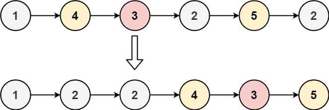

# 86. Partition List

Given the <code>head</code> of a linked list and a value <code>x</code>, partition it such that all nodes <strong>less than</strong> <code>x</code> come before nodes <strong>greater than or equal</strong> to <code>x</code>.

You should <strong>preserve</strong> the original relative order of the nodes in each of the two partitions.

&nbsp;

<strong class="example">Example 1:</strong>

<pre><strong>Input:</strong> head = [1,4,3,2,5,2], x = 3
<strong>Output:</strong> [1,2,2,4,3,5]
</pre>

<strong class="example">Example 2:</strong>

<pre><strong>Input:</strong> head = [2,1], x = 2
<strong>Output:</strong> [1,2]
</pre>

&nbsp;

<strong>Constraints:</strong>

<ul>
  <li>The number of nodes in the list is in the range <code>[0, 200]</code>.</li>
  <li><code>-100 &lt;= Node.val &lt;= 100</code></li>
  <li><code>-200 &lt;= x &lt;= 200</code></li>
</ul>

 

---

# Solution
- [Two Pointer Approach](#two-pointer-approach)

### Problem Overview

The goal is to partition a linked list such that all nodes with values less than `x` come before nodes with values greater than or equal to `x`, while preserving the original relative order of the nodes in each partition. 

We refer to the partition point as the `partitionPoint` or **"split point"**, where elements before this point are smaller than `x` and elements after this point are greater than or equal to `x`.

To achieve this, we split the list into two smaller lists: one containing elements less than `x` and the other containing elements greater than or equal to `x`, then join these lists.

### Example
- **Input**: head = [1, 4, 3, 2, 5, 2], x = 3
- **Output**: [1, 2, 2, 4, 3, 5]
  
- **Input**: head = [2, 1], x = 2
- **Output**: [1, 2]

# Two Pointer Approach

## **Intuition**
We can use two pointers, `lessThanX` and `greaterOrEqualX`, to keep track of two separate linked lists for nodes less than `x` and nodes greater than or equal to `x`, respectively. These lists are then combined to form the desired partitioned list.

